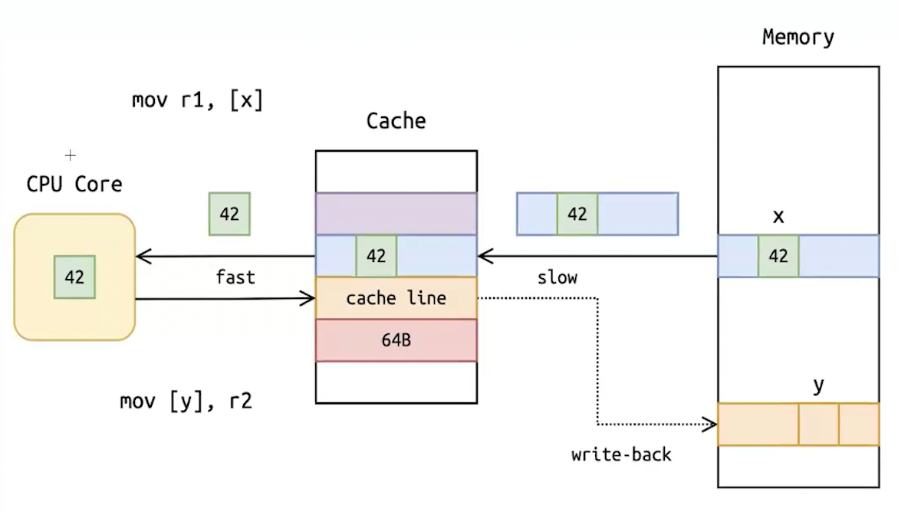
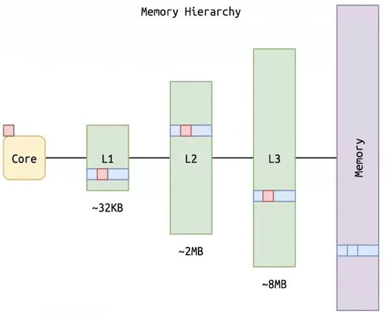
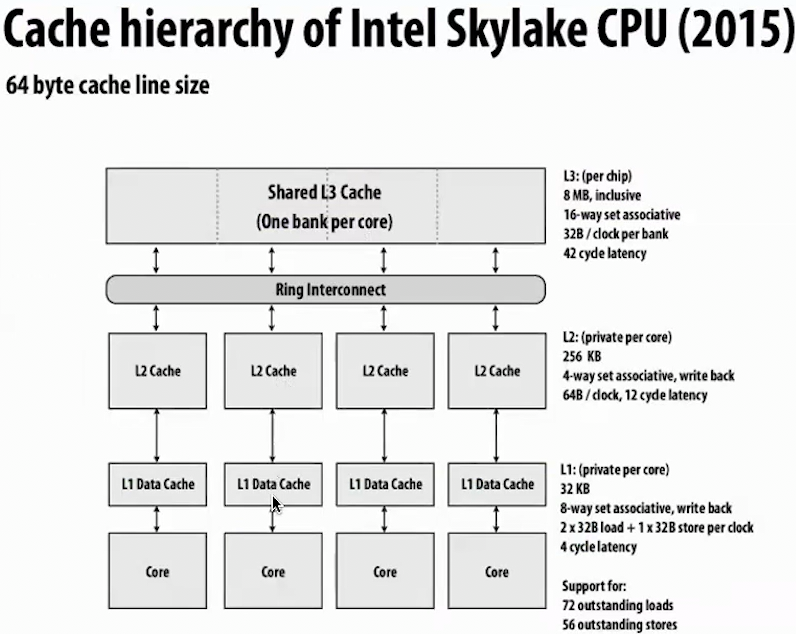

<!-- markdownlint-disable MD025 MD029 MD033 MD045 -->
# Tasks

## pull

```bash
git pull --rebase

git rebase --continue
```

## run

```bash
cd shad-os/sem/rsh
```

to run program itself (in debug mode - target/debug):

```bash
cargo run
```

to run program itself (in release mode - target/release)

```bash
cargo run --release
```

## test

```bash
cargo test

cargo test dir_of_test

cargo build && sh test.sh

cargo test --test 1-time-1-rtc   // check out tests/ in project to specify name (like 1-time-1-rtc.rs)

(cd kernel; cargo test --test 2-mm-1-block --test 2-mm-1-boot-frame-allocator)
```

## linter

to run linter (in directory of project):

```bash
make
```

if you have no Makefile, just

```bash
cp ../../Makefile .
```

## miri

Miri finds errors in memory model usage.

Installation (being in shad-os):

```bash
rustup component add miri
cargo miri setup
```

Testing (being in shad-os):

```bash
(cd ku; MIRIFLAGS="-Zmiri-disable-isolation" cargo miri test --test 1-time-4-correlation-point)
```

## push

to push:

```bash
git add src/.
git commit -m "solve _task_"
git push student HEAD:submit/TASK_NAME
```

If it writes:

```bash
To gitlab.manytask.org:os/students-fall-2024/vbalab.git
 ! [rejected]        HEAD -> submit/rtc (non-fast-forward)
error: failed to push some refs to 'gitlab.manytask.org:os/students-fall-2024/vbalab.git'
hint: Updates were rejected because a pushed branch tip is behind its remote
hint: counterpart. If you want to integrate the remote changes, use 'git pull'
hint: before pushing again.
hint: See the 'Note about fast-forwards' in 'git push --help' for details.
```

do:

```bash
git pull student submit/rtc --rebase
git push student HEAD:submit/rtc
```

# Lab 1 - RealTimeClock

## Bitflag

Bitflag - (unsigned) integer like u8 that represents multiple binary options (flags).  
Each bit in the bitflag represents a distinct option that can be turned on (1) or off (0).

```rs
bitflags! {
    #[derive(Clone, Copy, Debug, Eq, PartialEq)]
    pub struct RTCRegister: u8 {
        const DAYLIGHT_SAVING = 1 << 0;         // OR: = 0b00000001;
        const USE_24_HOUR_FORMAT = 1 << 1;
        const UPDATE_ENDED_INTERRUPT = 1 << 7;  // from 0 to 7
    }
}
```

## Memory of devices

Mostly, devices (microschemes too) have some _memory on their own_ that has nothing to do with the main memory of the computer.

## Primitives

A **primitive** - low-level constructs that are usually provided directly by the language or runtime and typically map closely to machine-level operations or native types in hardware.

Types of primitives:

- data: i32, u8, bool, ...

- synchronization: mutexes, atomic operations, ...

- control flow: if-else, loops, function calls

---

### 1. Mutex

**Mutex** guarantees that only one thread can lock the mutex and access the protected resource at a time. This prevents multiple threads from modifying shared data concurrently, which could lead to inconsistent or corrupted states.

```rs
let counter = std::sync::Arc::new(std::sync::Mutex::new(0));
```

**Deadlock** is a situation where two processes are each waiting for the other to finish.

### 2. OnceLock

In Rust, `std::sync::Once` is a synchronization primitive that ensures that a certain piece of code is executed only once, even in a concurrent or multi-threaded environment. It is used, for example, to initialize static constants that cannot be calculated at the compilation stage.

### 3. SpinLock

Spinlocks are used in the critical section (protected resource) is small and will be held for a very short time. It is used when the overhead of context switching (which happens with mutexes) is higher than the cost of busy-waiting for a short duration.

---

### Atomics

An operation acting on shared memory is **atomic** if it completes in a single step relative to other threads. When an atomic store is performed on a shared variable, no other thread can observe the modification half-complete.

In Rust, atomics are primitives that allow operations on shared memory in a thread-safe way without needing locks like mutexes.

Key Atomic Operations:

- `load`: reads the value
- `store`: writes a value
- `swap`: swaps the current value with a new value
- `fetch-add`: increments a value and returns the previous value
- `fetch-sub`: decrements a value and returns the previous value
- `compare-and-swap`: compares the current value to an expected value, and if they are equal, sets the value to a new one atomically

They are **lock-free**, therefore **deadlock-free**.

Atomics work well for _simple scenarios_ (like counters or flags), but for more complex shared data structures, locks (like mutexes) may be required.

---

### Ordering: Release & Acquire

- `Ordering::Release`:

  - can only be set on operations that perform _writing_
  - ensures that all prior writes in the same thread are visible to other threads that subsequently perform an acquire operation on the same variable;

- `Ordering::Acquire`:

  - can only be set on operations that perform _reading_
  - ensures that all subsequent reads and writes in the same thread will see all the changes made by the thread that performed the corresponding release operation;

You can also set `Ordering::AcqRel` on operations that perform both reading and writing, which will mean that Ordering::Acquire applies to the reading part, and Ordering::Release applies to the writing part.

`Ordering::SeqCst` is not recommended.

## [Double-checked locking](https://en.wikipedia.org/wiki/Double-checked_locking)

Problem:

> In a concurrent environment, if multiple threads try to set the value at the same time, they might all pass the `is_initialized` check before any of them actually set the value, leading to multiple threads attempting to initialize data.

So, we need to synchronize the threads before doing `is_initialized`. But, since synchronizing a method could in some extreme cases decrease performance by a factor of 100 or higher.  
The overhead of acquiring and releasing a lock every time this method is called seems unnecessary: once the initialization has been completed, acquiring and releasing the locks would appear unnecessary.

Solution - **Double-checked locking**:

1. Check that the variable is initialized (without obtaining the lock). If it is initialized, return it immediately.

2. Obtain the lock.

3. Double-check whether the variable has already been initialized: if another thread acquired the lock first, it may have already done the initialization. If so, return the initialized variable.

4. Otherwise, initialize and return the variable.

## Panic

A **panic** in Rust is an unrecoverable error that forces the program to stop execution.

Main `ku::sync::panic::PanicStrategy`:

- **Unwind** (default): When a panic occurs, the stack unwinds, cleaning up resources like local variables and calling destructors (drop()).
  - if a thread panics and panic is isolated to that thread, it does not necessarily crash the entire program, and other threads can continue running.

- **Abort**: When a panic occurs, the program immediately terminates without unwinding the stack.
  - the whole program crashes, and no threads can continue.
  - resources that need to be cleaned up may be leaked

# HW 2 - assembly

## 1. gdb

Be sure PEDA is installed.

```bash
gdb ./binary
```

```gdb
b gdb::check_key
b *0x404dcd

run
ni
si

x/45i $pc
context
lay

x/16bx $rsp + 0xf
x/2cs $rsp + 0xf
```

## 2. asm

```bash
cargo build
cargo test --no-run                 # this will also print where the binary was created

gdb found/path/of/binary
```

```gdb
info functions test_sum_struct      // to find needed breakpoint, because there could be many test_sum_struct.
b asm::test_sum_struct::dressed_sum
b *0x2c9ae8
run
si

info registers rdi
info registers
print $rdi
x/3gx $rdi
```

## 3. rop

**Return-Oriented Programming** (ROP) is a sophisticated security exploitation technique used to execute arbitrary code by hijacking the control flow of a program.  
It is often employed in attacks to bypass protections like **Data Execution Prevention** (DEP), which prevents code from being executed in regions of memory such as the stack.  

Begins with an attacker exploiting a vulnerability like a **buffer overflow** to overwrite a function’s return address.  
This allows the attacker to gain control of the instruction pointer.

 **Gadgets** are short sequences of assembly that are found in existing code and that end with a control transfer instruction, such as `ret`, `jmp`, or `call`, which allows the attacker to chain multiple gadgets together to perform complex operations.

## 4. asm_syscall

This will print a detailed trace of all system calls made by \<command>:

```bash
strace <command>
strace ls

strace -p <pid>                     # attach to an already running process

strace -e trace=file <command>      # to trace only file-related system calls (`open`, `read`, `write`, etc.)
strace -e open <command>            # to trace only `open` system calls

strace -c <command>                 # summary of how many times each system call was called
```

# Lab 3 - Allocation

## Allocate-Copy-Free

This is traditional method:

- Allocate a new memory block of the desired size.
- Copy data from the old block to the new block.
- Free the old block.

## Remapping Physical Frames

Instead of allocating a new memory block and copying the data, OS remaps existing physical frames to new virtual pages, maintaining the continuity of the virtual memory address space.

Typical Use Cases:

- Copy-on-Write (COW)
- Memory-Mapped Files: Both Linux (mmap) and Windows (MapViewOfFile) can map files directly into memory, remapping virtual addresses without copying data.
- NUMA Systems

Remapping Physical Frames is supported mainly only for low-level work & OS work, making it unsuitable in environments without low-level memory access.

## Layout

**Layout** - particular layout of memory that is built up as an input to give to an allocator.  
All layouts have an associated size and a **power-of-two alignment**.

# Lecture 1 - System calls

Interface - system calls: user code to core execution  
Backward interface - signals  
Kernel <-> syscall/signals <-> Processes  
Realisation of interfaces - drivers

Timesharing: every moment on each processor core _or_ process is executed

> All **I/O** in Unix/Linux is modeled as **file descriptors** — "everything is a file" philosophy

**File descriptor** - is a low-level integer handle used to access a file or other input/output resources like pipes, sockets, or devices.  
Standard FD: 0, 1, 2 are reserved for `stdin`, `stdout`, `stderr`.

syscall: ... fd, const ... _buf, size_t count _-[how many bites]-\*

> echo hi | ... | ... |

each outtup goes to following | ... |

---

Every program:

- **fails** with return code -1 and sets **errno** to indicate the error
- **finishes** with syscall exit with some code of return.

## typical syscalls

### pid_t pid = fork()

creates additional process with PID=0; they are not sharing anything (like memory), creating exact copy. It is unsafe, for example if we have parallel processes that depend on each other and we're doing fork of only one of them.

### int execvp(const char \*file, char \*const argv[])

replaces the current process image with the new process

### pid_t waitpid(pid_t pid, int \*status, int options)

waits for state changes in a child process, such as its termination.

### let (read_fd, write_fd) = pipe().unwrap()

creates a unidirectional data channel that can be used for **inter-process communication** (IPC): one for reading and one for writing.

Data written to the write end of the pipe (fd[1]) is temporarily stored in a buffer (typically 64 KB) by the kernel, that's why _they don't share memory directly_. The buffer is an in-memory circular queue. When the read end (`fd[0]`) reads the data, it is removed from the buffer.

- if the buffer is full, then the writer is blocked, until reader reads
- if the buffer is empty, a read operation will block until data is available

### other common syscalls

> open  
> dup2  
> close

# Lecture 2 - Processor

## Rings

hardware <-> kernel <-> computer drivers <-> applications

Only kernel \& drivers are working with hardware directly. Kernel make abstractions of hardware for applications through interfaces.

Ring = Privilege Level = PL  
PL 0 = kernel  
PL 1,2 = drivers [not user in practice, only 0\&3; drivers are in 0]  
PL 3 = user

---

## Processor

### 1. Port-mapped I/O

0. Instruction Set:  
   Requires the use of special instructions (IN, OUT in x86).

1. Addressing Mechanism:  
   Small _separated (from memory) address space_ of reserved 64KiB numbers: 0x0000 to 0xFFFF  
   They are not in memory, they are located in computer's components (mainly microschemes). They tell their reserved numbers to kernel and it tries to merge their work (now BIOS assigns numbers itself).  
   If some reserved number of different components intersect - there will be a problem.

2. Complexity and Performance:  
   PMIO is less efficient in systems where many devices require frequent and fast access.

3. Supported Architectures:  
   x86 systems, it is less common in newer architectures

**CMOS**: small memory chip on computer components (was like that, now it is mainly 1 on motherboard) powered by a very-very small battery, which stores system settings like date, time, and hardware configurations. It retains these settings when the computer is off.

In short, CMOS holds system configuration data, while **BIOS** reads that data during system startup to properly initialize and configure the hardware.

A **serial port** is a physical interface on a computer that allows for the transmission of data one bit at a time, in a sequential (or serial) manner. Unlike **parallel communication**, which sends multiple bits at once, a **serial communication** transmits data bit-by-bit, which is simpler and requires fewer wires. Common baud rates include 9600, 19200, or 115200 bits per second (bps).  
Serial ports can be either **full duplex** (able to send and receive data simultaneously) or **half duplex**.

### 2. Memory mapped I/O (not a memory)

0. Instruction Set:  
   Uses standard memory instructions (LOAD and STORE).

1. Addressing Mechanism:  
   In memory-mapped I/O, both the RAM and I/O devices share _the same address space_ (and the same instructions), but specific addresses in the memory space are designated for I/O devices.  
   Instead of accessing regular memory (**RAM**), when the CPU reads from or writes to these addresses, it interacts with the connected I/O devices.  
   Physical addresses are used, not **Memory Management Unit (MMU)** that does translation of virtual memory addresses to physical memory addresses.

2. Complexity and Performance:  
   MMIO can also leverage **caching** and other memory access optimizations, leading to better performance in many cases.

3. Supported Architectures:  
   ARM, PowerPC, and newer x86-64 systems

Common Use Cases:

- Graphics and Display Controllers:

- Network and Disk Controllers

- Ebedded Systems

### 3. interraptions

How Interrupts Work:

- **Interrupt Request (IRQ)**: When a device or software generates an interrupt, it sends an IRQ signal to the CPU.

- Interrupt Handler: The CPU stops its current task and runs a special piece of code called an interrupt handler (or interrupt service routine, ISR), which deals with the interrupt.

- Context Switching: The CPU saves its current state (context), processes the interrupt, and then resumes its previous task. This allows the CPU to respond to events without permanently halting its main tasks.

Types of Interrupts:

- Hardware Interrupts: Triggered by external hardware devices, such as keyboards, mice, disk drives, or network interfaces, to signal the CPU when they need attention.

- Software Interrupts: Triggered by software when certain conditions are met, such as errors or specific system calls.

- **Non-Maskable Interrupts (NMI)**: A special type of hardware interrupt that cannot be ignored by the CPU, used for urgent tasks like detecting hardware failures.

Use Cases of Interrupts:

- Input/Output Operations
- Clock & Timers
- Error Handling

In order not to make separate lanes (lines, шины) from computer's components to CPU, nowadays we use **Interrupt Controller** like PIC, APIC, IRQs.  
PIC acts as a controller to prioritize and route interrupts to the CPU.

CPU has only 1 bit for interruptions.  
When multiple interrupts occur at the same time, the interrupt controller assigns _priorities_ to determine which interrupt the CPU should handle first.

When CPU has handled an interrapt from device, it sends end of interrupt (**EOI**).  
You can configure device to not send another interrupt until it gets EOI of previous interrupt.

### PCI

**Peripheral Component Interconnect (PCI)** is a hardware bus standard used for connecting peripheral devices to a computer's **motherboard**. _Scope_: PCI handles the physical and data-level communication between the CPU and peripheral devices.

It allows various components like network cards, sound cards, graphics cards, and storage controllers to communicate with the CPU and other system components.  
It uses **master-slave configuration**, with the CPU usually acting as the bus master.

As technology advanced, **PCI Express (PCIe)** replaced PCI in most applications due to its higher bandwidth, scalability, and more efficient architecture.

To list PCI devices:

```bash
lspci
lspci -t
lspci -v
```

### PCI & PIC

When an interrupt occurs (e.g., from a network card that has received data), the PIC informs the CPU. The CPU might then handle the interrupt by reading the data from the network card, which happens over the PCI bus.

# Lecture 3 - Assembly

Assembly basically is used as an abstraction model of computer.

## Registers

Registers of CPU are located on CPU itself.

Each core of processor has it's own registers.

There are:

- General-Purpose Registers (64-bit):

  1. **RAX (Accumulator)** - Holds return values and used in arithmetic operations.
  2. **RBX (Base)** - General-purpose register (callee-saved).
  3. **RCX (Counter)** - Used in loop counters and shifts.
  4. **RDX (Data)** - General-purpose, used in multiplication/division.
  5. **RSI (Source Index)** - Pointer for source in memory operations.
  6. **RDI (Destination Index)** - Pointer for destination in memory operations (1st argument in function calls).
  7. **RBP (Base Pointer)** - Points to the base of the current stack frame.
  8. **RSP (Stack Pointer)** - Points to the top of the stack.
  9. **R8 - R15 (Extended Registers)** - Additional general-purpose registers.
  - In the x86_64 calling convention, the first six arguments are passed in specific registers:  
  RDI: 1st argument  
  RSI: 2nd argument  
  RDX: 3rd argument  
  RCX: 4th argument  
  R8: 5th argument  
  R9: 6th argument  

- Special-Purpose Registers

- Segment Registers

- Floating-Point and SIMD Registers

## Instruction Set Architecture (ISA)

### Syntax

- **Intel**:

```asm
mov rax, rbx      // rax = rbx
mov rax, 42       // rax = 42
```

- **AT&T**:

```asm
movq %rbx, %rax   // rax = rbx
movq $42, %rax    // rax = 42
```

### Tacts (Clock Cycles)

A CPU operates in synchronization with a clock that ticks at a fixed frequency (in Hertz). Each tick or clock cycle is one **tact**.

Each assembly instruction requires a specific number of tacts to execute.  
Some instructions are faster than others. For example: MOV (1–2 cycles), DIV (10–40 cycles).

### Arithmetic Instructions

`add`, `sub`, `inc` (increment), `dec`, `neg` (negative), ...

`mul rbx` is unsigned,  
Basically: [rdx:rax] = rax \* rdx // 128bit = 64bit \* 64bit  
Multiplied by rax by default, and stored in `rax`.

`imul rbx` // signed

### Logic Instructions

1. **AND**: Bitwise AND operation.

   - `and rax, rbx`

2. **OR**: Bitwise OR operation.

   - `or rax, rbx`

3. **XOR**: Bitwise XOR operation.

   - `xor rax, rbx`

4. **NOT**: Bitwise NOT (one's complement).

   - `not rax` – Flip all bits in `rax`.

5. **SHL**: Shift left (logical).

   - `shl rax, 2` – Shift the bits in `rax` left by 2 places, filling with 0s.

6. **SHR**: Shift right (logical).

   - `shr rax, 3` – Shift the bits in `rax` right by 3 places, filling with 0s.

7. **SAR**: Shift right (arithmetic).
   - `sar rax, 1` – Shift the bits in `rax` right by 1 place, preserving the sign bit.

### Stack instructions

`rsp` is a stack pointer

1. **PUSH**: Pushes a value onto the stack.

   - `push rax` – decrements `rsp` (stack pointer) and stores the value.

2. **POP**: Pops a value off the stack.
   - `pop rbx` – into `rbx` (increments `rsp`).

### Working with memory

1. **Memory-Direct Access**: Data is accessed directly from a specific memory address.

   - Example: `mov rax, [0x1000]` (moves the value stored at memory address `0x1000` into `rax`).

2. **Register-Indirect Access**: Memory is accessed using an address stored in a register.

   - Example: `mov rax, [rbx]` (moves the value from the memory address contained in `rbx` into `rax`).

3. **Register-Indexed Access**: Memory is accessed using a base register with an index (useful for arrays).
   - Example: `mov rax, [rbx + rcx * 4 + 5]` (moves the value from the address `rbx + rcx * 4 + 5` into `rax`, where `rcx` is treated as an index multiplied by 4 and ).

# Lecture 4 - Memory

Each memory segment is defined by:

- **Base**: Starting address of a segment.
- **Size**: Determines the size of the memory region.
- **Flags**: Control access rights (read/write/execute) and privileges (user vs. kernel mode).

---

## How it was

- **GDT** (Global Descriptor Table): A global structure that defines the base, limit, and flags for different memory segments (e.g., kernel code, data).
- **LDT** (Local Descriptor Table): Optional, and used when processes need their own segment layout.

Segmentation mainly protects different parts of memory, though most modern OSes (like Linux) use paging rather than segmentation for memory protection.  
Setting Virtual Memory Segments at System Startup:

Registers like DS (Data Segment), ES (Extra Segment), FS, and GS store segment selectors, referring to entries in the GDT. Each of these corresponds to different kinds of data access.  
For example, FS and GS are sometimes used for thread-local storage or system-specific optimizations in OS kernels (e.g., for accessing CPU-specific data structures).

---

## Modern use of memory

In modern x86-64 systems, memory segmentation is less commonly used because of the reliance on flat memory models and paging, though segmentation still plays a role in certain modes.

Memory is divided into **pages** (virtual units, typically 4 KiB in size) and **frames** (physical units, typically 4 KiB as well).

The mapping from virtual memory to physical memory is handled by the OS and the **Memory Management Unit (MMU)** using page tables.

## Address space && Page Table

When a process accesses a virtual address, the OS checks the **page table** to map the virtual page to a physical frame.  
This representation (page table) itself is stored in physical memory.

Each process has _it's own page table_ that maps virtual addresses to physical addresses, most of the cells in this table are _empty_, so they don't waste physical memory.  
This ensures the process only sees its own memory, while the physical memory may be shared or mapped differently by the kernel.  

Although x86-64 CPUs operate in 64-bit mode, the actual addressable virtual space is limited to **48 bits**.  
The remaining bits are reserved for potential future expansion (by adding new levels).

This page table hierarchy typically involves multiple levels to reduce memory overhead.  
In x86-64 systems, there are typically 4 levels, with each level containing 512 (2^9) entries.  
The last additional level - page_table_entry_point, that does allocation of a page (2^12).

The breakdown of the virtual address is as follows:

1. **Offset**: The last 12 bits (for 4 KiB pages) denote the offset within the page.

2. Level 1 - Level 4: Each of the next 4 sets of _9_ bits (they are signed) identifies an entry in the page table hierarchy.

Therefore, each process has _it's own_ $ 2^{9 + 9 + 9 + 9 + 12} = 2^{48} $ bits or $256$ Tib of virtual memory.

The address space is divided into two main parts:

- **User Space**:  
  The lower half of the virtual address space is allocated to user-space applications.  
  This part typically ranges from virtual address 0x0000000000000000 to around 0x00007FFFFFFFFFFF ($128$ TiB).
- **Kernel Space**:  
  The upper half of the virtual address space is reserved for the operating system (kernel).  
  This typically ranges from 0xFFFF800000000000 to 0xFFFFFFFFFFFFFFFF ($128$ TiB).

## Swap Space

Virtual memory allows the operating system to use the **disk storage** as an extension of RAM, called **swap space**.  

When the physical RAM is full, the OS can move some pages from RAM to the swap space (known as **swapping**), making room for other active pages in RAM.  
Although this allows the system to handle more data, accessing data from the disk is much slower than from RAM.  

## Page Faults

A page fault occurs when a process accesses a page that is not currently in physical memory. This triggers the operating system to:

- Pause the execution of the process.
- Load the missing page from the disk (swap space) into a free frame in RAM.
- Update the page table with the new mapping of the virtual page to the physical frame.

Frequent page faults can lead to **thrashing**, where the system spends more time swapping pages in and out of memory than executing processes.

## Demand Paging

Essentially it is: _lazy paging_ at stage _program -> Page_.

When a program is loaded, pages of the program (from disk - swap space or executable files) are loaded into RAM only when they are accessed.

## Lazy Virtual Memory Allocation

Essentially it is: _lazy framing_ at stage _Page -> Frame_.

Lazy Allocation ensures that processes do not consume physical memory until they actually use the virtual memory they've requested.

Stages of lazy virtual memory allocation:

1. Virtual Allocation: mark the virtual pages in the mapping as allocated, but not mapped to physical frames.
2. On Access:
   1. page fault occurs
   2. kernel allocates a physical frames and maps it to the corresponding virtual pages.

## Disk space virtual

When a computer reboots, the virtual-to-physical memory mappings in RAM are reset because RAM _loses_ its contents.

However, for storage devices such as HDD & SSD, **persistent mappings** must be maintained.  
This is achieved using data structures and metadata of mapping stored persistently on the disk.
  
Processes (having distinct RAM virtual space) share a common mapping for disk-backed memory managed by the OS.

## Why I see less memory than I have?

Because you see only user space memory, and the rest of memory goes to kernel space and memory-mapped I/O.

# Lecture 5 - Interraptions

_Check Lecture 2.3._

**Interruption** is typically electronic pulse or voltage change (from low to high) on a specific hardware lane.

Hardware doesn't know signals & syscalls, only about interruptions.

Processor knows about interruptions & exceptions.  

## Exceptions

processor exception != software exception

Categories of processor exceptions:

- Faults - allows the program to repeat instruction
- Traps - allows the program to continue next instruction
- Aborts - no continuation

## Interrupt Descriptor Table (IDT)

IDT - table of descriptors defining an **interrupt service routine (ISR)** or **exception handler**.

IDT consists of instructions for:

- exceptions (e.g., division by zero, page fault)
- hardware interrupts (e.g., keyboard, mouse)
- software interrupts (e.g., system calls)

### (double, triple) (minor/major) Page fault

**Page fault** - attempts to access a part of virtual memory that is not currently mapped to physical memory (RAM).

**Double fault** - page fault while the CPU is already handling another exception.  
When a double fault occurs, the CPU attempts to call a special **double fault handler**.

**Triple fault** - page fault while CPU handles double fault leading to a **system reset** (or even **hardware reset** for x86 architecture).

- **Minor PF** is in memory but not mapped in the page table - fast.
- **Major PF** is not in memory; must be loaded from disk - slow.

## The Task State Segment (TSS)

TSS stores the state of a task (or process) information. Used for managing task switching and handling interrupts and exceptions.

In the old days it did all job by itself, now it's used for managing the IST.

The TSS and IDT work together.

## Interrupt Stack Table (IST)

IST allows the CPU to switch to a different stack when certain interrupts or exceptions occur.

IST is often used for critical exceptions like double faults or non-maskable interrupts (NMI).

## iterrupt/exception handling

1. Interrupt (or exception) Occurrence
2. CPU Acknowledgment and Interrupt Vector
   - [A]PIC sends an interrupt signal to the CPU
   - sti (set the Interrupt Flag bit)
3. IDT Lookup
4. Switching Context and Saving State
   - CPU saves the current context: RIP, RSP, stack segment (SS)
   - TSS
5. ISR
   - During this, the interrupt flag is cleared, preventing other interrupts
6. End of Interrupt (EOI) Signal
7. Restoring State
8. Resuming Normal Execution

## Polling

**Polling** - alternative to interruptions - CPU repeatedly checks the status of a peripheral device to see if it requires attention.  

Applied only when constant attention is needed so CPU don't get wasted.

Could be used, for example, for network interface card.

---

## Processors

A modern computer typically contains a main **CPU** with multiple cores.  

It also contains specialized processors such as:

- GPUs
- DSPs
- network processors
- audio processors
- TPMs
- I/O controllers
- PMUs

While these processors have distinct roles, they work together to offload specific tasks from the CPU, improving efficiency and performance.

During the boot process in a multi-core system, the **Bootstrap Processor** (BSP) is the first core to initialize and configure the LAPIC system.

## LAPIC

The **Local Advanced Programmable Interrupt Controller** (LAPIC) is an interrupt controller built into _each_ core of a multi-core processor.  

LAPICs manage core-specific interrupts and enable inter-core communication using IPIs.

## Shared memory

**Shared Memory** allows multiple processes to access the same physical memory region through their virtual address spaces, providing a fast and efficient means of communication.  
It contrasts with pipes, which are suitable for sequential, stream-based communication.

# Lecture 6 - Cache Layers


CPU operates with virtual addresses.

The **memory controller** on a CPU is responsible for managing the flow of data between the CPU and the main memory (RAM).

**GHz** = 10^9 cycles (тактов) per second  
If CPU has 4GHz, then 1 cycle (like `add` asm) = 0.25 nanosecond.

## Comparison of CPU & RAM speed

**Latency** (Network, Disk, Memory, CPU) is the delay between a request and a response in a system.

`mov reg, reg`: 1 CPU cycle.

`mov reg, [mem]`:

- L1 Cache: about 4-5 cycles
- L2 Cache: 10-20 cycles
- L3 Cache: 30-50 cycles
- L4 Cache (Optional): 50-100 cycles
- Main Memory [RAM]: 100-200 cycles

Location:

- L1, L2 are located within CPU's core  
- L3 is located within CPU  
- L4 is located near CPU on separate chip

## Cache levels





### L1 (16-64 KB)

Each core has its own L1 cache, split into L1D (data) and L1I (instruction) caches.

Typically stores virtual addresses as they are accessed directly by the CPU before address translation ( virtual -> physical) occurs through the **Translation Lookaside Buffer (TLB)** (conversion is done by **MMU**).

If there's a **cache miss** in L1, the CPU goes through TLB before accessing the L2 cache.

### L2 (256 KB - 1 MB)

Typically each core has its own L2 cache.

Typically stores physical addresses.

### L3 (2 MB - 64 MB, <1GiB)

The L3 cache is typically shared among all cores in a CPU.

Stores physical addresses.

## Cache line

**Cache line** - smallest unit of data of CPU cache.

**Spatial locality**: when a CPU looks for a specific memory address, it doesn't fetch just that one value (even 1bit) but instead loads the _entire_ cache line containing it.

Typical Size: 32, 64, 128 bytes (depending on the CPU architecture).  
Each L1, L2, L3 has a fixed cache line size.

Components of cache line:

- Tag: memory address of the data
- Index: where the line is stored within the cache set
- Data: data values stored

When loading new line the cache is full **cache controller** decides which existing line to replace.  
Common policies: **Least Recently Used (LRU)**, **Random Replacement**, and **FIFO** (First-In, First-Out).

## Cache mapping techniques

### Full-Associative Cache - (isn't used)

Any block of memory can be placed in any cache line.

Pros: Maximizes cache utilization, avoiding mapping conflicts.  
Cons: Lookup speed make this approach impractical for larger caches.

### K-Way Set-Associative Cache - (is used)

Cache is divided into sets, with each set containing k lines. Memory blocks can be placed in any of the k lines within a single set.

A cache with k-way set associativity and n total lines will have n/k sets.

Pros: Balances flexibility and simplicity.
Cons: Some cache lines may go unused.

## MESI (Modified, Exclusive, Shared, Invalid)

**Cache coherence** - multiple cached copies of the same memory location remain consistent, such that all processors observe writes to that location in a consistent order.

[Great visualization of MESI in dynamic](https://www.scss.tcd.ie/jeremy.jones/vivio/caches/ALL%20protocols.htm)

**MESI** protocol is a cache coherence protocol used in multi-core CPUs to maintain consistency across caches.

- Modified (M): Cache line is valid and modified (dirty). This copy is the only valid one.

- Exclusive (E): The cache line is clean, held only in this cache, and matches main memory.

    1. If this CPU writes to it → transitions to Modified without notifying others.

    2. If another CPU reads → becomes Shared in both.

- Shared (S): Cache line is clean and possibly present in other caches.

- Invalid (I): Cache line is not valid.

### Why invalidate at all? (and not just update)

1. Traffic Efficiency:

    - Invalidate: Only one **broadcast** ("I'm writing, invalidate this line").

    - Update: You must send the entire data value to every cache holding the line.

2. Writes are often followed by more writes and with Invalidate we broadcast only once first time.

### Read-Modify-Write (RMW)

**RMW** operations use specific instructions and the `lock` prefix to ensure _atomicity_ in x86 assembly.

## Hyper-Threading (HT)

HT is Intel's proprietary implementation of **Simultaneous Multithreading (SMT)**, allowing each physical CPU core to run two separate threads concurrently.

HT enables the core to switch between threads: while one thread waits for data, the other thread maxes computation. At each time core can manage only one thread.

So when task is CPU-intensive (and not depend as much on memory) HT actually makes core slower, because there no point for threads in waiting, but only one of it can be managed at a time.

## NUMA

**Non-Uniform Memory Access (NUMA)** is a memory architecture used in multi-CPU systems, where each processor has its own local memory that it can access faster than memory attached to other processors.

Key Points:

- each CPU has a region of "local" memory with lower latency. Accessing "remote" memory (attached to other CPUs) takes longer.
- can improve performance by optimizing data placement to keep it close to the CPU that uses it, reducing memory access time.

# Lecture 7 - Synchronization Primitives

**Process** - instance of a program in execution with it's own execution context, they are isolated from each other by OS.

Processes' states:

- New: The process is being created.
- Ready: The process is prepared to execute and waiting for CPU time.
- Running: The process is being executed by the CPU.
- Waiting: The process is waiting for some event, like I/O operations.
- Terminated: The process has completed execution.

Execution **flow** (or control flow) refers to the specific sequence of instructions that are executed by the CPU in a process.

In a multi-threaded process, multiple threads of execution flow can run concurrently within the same process.  

Each process has it's _own_ virtual address space, all flows _within_ a process are in the same virtual address space.

## Compare-and-Swap

**CAS** is an atomic operation with logic following this code:

```cpp
bool cas(int& a, int& desire, int new_value) {
    if (a == desire) {
        a = new_value;
        return true;
    } else {
        desire = a;
        return false;
    }
}
```

Other atomics can be view as usage of CAS:

```cpp
// load
int atomic_load(std::atomic<int>& var) {
    int value = 0;
    var.compare_exchange_strong(value, value);
    return value;
}

// store
void atomic_store(std::atomic<int>& var, int new_value) {
    int desire = var.load();
    while (!var.compare_exchange_strong(desire, new_value)) {}
}

// exchange
int atomic_exchange(std::atomic<int>& var, int new_value) {
    int desire = var.load();
    while (!var.compare_exchange_strong(desire, new_value)) {}
    return desire;
}

// fetch_add
int atomic_fetch_add(std::atomic<int>& var, int value) {
    int desire = var.load();
    while (!var.compare_exchange_strong(desire, desire + value)) {}
    return desire;
}
```

## Futex

**Futex** (fast user-space mutex) - low-level kernel mechanism for efficient synchronization primitives for user-space programs.

Futexes are specific to Linux and (not on other OS).

Futexes are "fast" because they only call into the kernel when necessary, minimizing the cost of synchronization in low-contention scenarios.

1. Fast **Uncontended Locking**: In the absence of contention, threads acquire and release futexes entirely in user space using atomic operations, no syscall needed.
2. When contention does occur, the kernel steps in to manage sleeping and waking threads. This avoids the inefficiencies of "busy-waiting" in user space, which would waste CPU time.

```cpp
// If the value of the atomic variable equals `expected`, the thread sleeps
int futex_wait(std::atomic<int>* atomic, int expected);

// Wakes up `count_for_wake` number of threads waiting on this atomic variable
int futex_wake(std::atomic<int> atomic, int count_for_wake);
```

```cpp
#include <atomic>
#include <iostream>
#include <thread>

int main() {
    std::atomic<int> a = 0;

    std::thread t1([&a]{
        a.store(5);
        futex_wake(a, 1);
    });

    std::thread t2([&a]{
        futex_wait(&a, 0);
        std::cout << a << std::endl;
    });

    t1.join();
    t2.join();

    return 0;
}
```

Futexes are not mutexes themselves but rather a tool that can be used to build mutexes and other synchronization primitives.  
Implementation consists of a shared integer with atomic operations and futex() syscall in Linux when needed.

### Mutex

**Mutex** is a h
Using a mutex instead of directly using a futex has a lot to do with abstraction, portability, and ease of use.
igher-level concept, widely available in standard libraries (like `std::mutex`), and it abstracts away the complexity of locking mechanisms.  
Implementation relies on OS-level mechanisms (e.g., semaphores or spinlocks) and is more generic.  

Using futexes directly would require developers to handle atomic checks, wait conditions, and kernel calls manually, which is complex and error-prone.

## Condvar

```cpp
class condvar {
public:
    template <typename F>
    void wait(std::mutex& m, F condition) {
        int current = sequence_.load();
        if (condition()) {
            return;
        }
        m.unlock();
        sequence_.wait(current);
        m.lock();
    }

    void wake() {
        sequence_.fetch_add(1);
        sequence_.notify_one();
    }

    void wake_all() {
        sequence_.fetch_add(1);
        sequence_.notify_all();
    }

private:
    std::atomic<int> sequence_;
};
```

## Memory model

**Happens-before relationship**: If an operation A happens-before operation B, then B is guaranteed to observe the effects of A.

**Sequential Consistency**: all operations appear to execute in the same order across all threads, preserving a single global order.  
However, sequential consistency can be too strict for performance; hence, the memory model provides relaxed ordering to optimize performance while still ensuring correctness.

**Modification Order**: for each atomic variable, there is a single, coherent modification order that defines the sequence of modifications visible to all threads.

## Locks

### RWlock

| Operation      | Read Lock   | Write Lock |
|----------------|-------------|------------|
| **Read Lock**  | No Conflict | Conflict   |
| **Write Lock** | Conflict    | Conflict   |

### MCS

MCS (Mellor-Crummey and Scott) lock is a type of spinlock based on a _linked list_ structure, where each waiting thread has its own node in the queue.

```rust
struct MCSNode {
    locked: std::sync::atomic::AtomicBool,
    next: AtomicPtr<MCSNode>,
}

impl MCSNode {
    fn new() -> Self {
        MCSNode {
            locked: std::sync::atomic::AtomicBool::new(true),
            next: AtomicPtr::new(ptr::null_mut()),
        }
    }
}

pub struct MCSLock {
    tail: AtomicPtr<MCSNode>,
}

impl MCSLock {
    pub fn new() -> Self {
        MCSLock {
            tail: AtomicPtr::new(ptr::null_mut()),
        }
    }

    pub fn lock(&self, node: &MCSNode) {
        node.next.store(ptr::null_mut(), Ordering::Relaxed);
        node.locked.store(true, Ordering::Relaxed);

        // Atomically swap the tail with the current node and get the previous tail
        let predecessor = self.tail.swap(node as *const _ as *mut _, Ordering::AcqRel);

        if !predecessor.is_null() {
            // If there was a predecessor, update its next pointer to this node
            unsafe {
                (*predecessor).next.store(node as *const _ as *mut _, Ordering::Release);
            }
            // Spin until predecessor releases the lock
            while node.locked.load(Ordering::Acquire) {}
        }
    }

    pub fn unlock(&self, node: &MCSNode) {
        if node.next.load(Ordering::Acquire).is_null() {
            // If no successor, try to reset the tail to null
            if self.tail.compare_exchange(node as *const _ as *mut _, ptr::null_mut(), Ordering::AcqRel, Ordering::Relaxed).is_ok() {
                return; // Lock released successfully
            }

            // Wait for successor to appear
            while node.next.load(Ordering::Acquire).is_null() {}
        }
        // Notify the next node in line
        unsafe {
            (*node.next.load(Ordering::Relaxed)).locked.store(false, Ordering::Release);
        }
    }
}
```

### RCU

RCU (Read-Copy-Update) lock is a synchronization mechanism optimized for read-heavy workloads where readers can access data concurrently without being blocked by writers.

Writers create a new copy of the data and make modifications on this copy, instead of locking data while writing.

Old version of data it’s retained until all active readers that may be referencing the old version have completed their operations.  
**Synchronization** in RCU is required to ensure that old versions of data are only reclaimed after all readers referencing those versions have completed.

`write`, `read` and `lock`, `unlock`, `sync`.

# Lecture 8 - Process Scheduler

## Context Switching

Process scheduler runs very often, so it has to be very optimized.

The state of a process includes: registers, caches, TLB, and branch prediction states.

If context switching occurs too frequently, caches may need constant reloading, leading to decreased system performance.

Choosing the time quantum size is an art.

## Cooperative & Preemptive Scheduling

- **Cooperative**: A process or thread voluntarily yields the processor. If one process hangs, neither it nor any other process will be able to work.

- **Preemptive** (most used): The scheduler takes the processor away from a process or thread in response to an external event and gives it to another. For example, this can occur due to a timer interrupt or when data arrives from the disk or over the network.  
In OSs with preemptive scheduling, calls such as `sched_yield()`, `pthread_yield()`, and `sleep(0)` are available.

## Scheduling Policies

- **First In, First Out (FIFO)**. Also known as First-Come, First-Served (FCFS). Non-preemptive

- **Shortest Job Next** (shortest job first). Non-preemptive
  - **Preemptive Shortest Job First**. Preemption occurs when a new job arrives
  - **Shortest Remaining Time**. Preemption occurs with time-sharing

- **Round-Robin** (important one). Similar to FIFO, but with preemption in time-sharing

- Earliest Deadline First

- Priority Scheduling

- Fair Scheduling

- Distributed Fair Scheduling

These are not real-time schedulers, because this field is very specific.  
These are schedulers of general purpose.

## 1. Round-Robin

It allocates a **quantum** (fixed time slice ) to each process in the ready queue, in a cyclic order.  
Once a process's time slice is up, it moves to the back of the queue, allowing the next process to run.

### How it was hacked in Linux

A process could voluntarily yield the CPU just before its time slice expires, effectively resetting its position in the queue without losing much time

#### How it was fixed

It started to do **Fair Time Accounting** - tracking how much CPU time each process has accumulated over time, rather than just resetting after each time slice.

## 2. Multilevel Queue

For each level of priority there's it's own Round-Robin.

Processor chooses to do non-empty queue of highest priority.  
The lower priority the bigger quantum in size.

### Multilevel Feedback Queue

This one combines interactive & batch scheduling.

- A new process initially starts at the highest priority level.

- Processes are automatically moved to another level.
  - Process uses his quantum  fully $\rightarrow$ gets lower priority.
  - Process yields the CPU before the quantum expires $\rightarrow$ the same.
  - Process is blocked on I/O or spends a long time waiting for the CPU $\rightarrow$ gets higher priority.

## 3. Fair Scheduler: Stride

Each process is assigned a **stride** - flexible quant (priority $\rightarrow$ weights $\rightarrow$ stride).

Each process has **step** - next time of processing to start.

The scheduler selects the process with the smallest step to run next.

### Completely Fair Scheduler

Uses virtual runtime (`vruntime`) to measure the time each process has received relative to its weight (priority).

During rescheduling, selects the process with the minimum `vruntime` by red-black tree sorting.

**Difference**:

- Stride Scheduler provides deterministic, proportional CPU allocation
- CFS continuously adjusts to achieve fair distribution, emulating an ideal multitasking environment

# Lecture 9 - ELF

**Executable & Linkable Format**.

## 1. Loading the ELF File

**ELF Header** (at the very beginning of the file) contains metadata about the ELF file, including:

- Identifies the file as ELF and specifies architecture, endianness, and entry point (e_entry).
- Provides offsets to the **Program Header Table** (for runtime information) and **Section Header Table** (for linking/debugging purposes).

## 2. Mapping Segments into Memory

Program Header Table is the part of the ELF file that actually contains information about the loadable segments:

- `p_offset` - the offset in the ELF file where a segment begins
- `p_vaddr` - virtual memory address where a segment should be loaded when the program is executed
- `p_filesz` - size of data to be loaded into memory from the ELF file: executable code (`.text` section) or initialized data (`.data` section)
- `p_memsz` = `p_filesz` + any additional uninitialized (`.bss` section of ELF) space that must be allocated in memory

The loader uses `p_offset` to read the segment data from the file and maps it to the memory at the address `p_vaddr`.

## 3. Setting Up Auxiliary Data

**Stack Setup**: Allocates and initializes the stack, which contains:

- command-line arguments (`argv`)
- environment variables (`envp`)

**Dynamic Linking** (if needed):  
If the ELF uses shared libraries, the loader resolves dependencies and maps the required shared libraries into memory.

## 4. Jump to the Entry Point

Once the ELF is fully loaded and memory is set up:

- loader transfers control to the entry point address (`e_entry` in the ELF Header)
- program begins execution, starting at the entry point (usually the `_start` function)

## 5. Program Execution

Program runs as a regular process:

- entry point typically performs initialization (e.g., calling library constructors and setting up standard I/O)
- it transfers control to the `main()` function
- when the program finishes, it invokes `exit()` or `_exit()`, signaling the OS to clean up resources

# Lecture 10.1 - Virtual Memory Allocation

## 1. Static Memory

**Static memory** - region of memory where variables are allocated at compile time and exist for the entire duration of a program’s execution.  
These variables are stored in the data segment or `.bss` segment of a program's memory layout.

Static variables are initialized only once.

### Static Global Variable

- Exists throughout the program
- Always retains its value

### Static Local Variable

- Retains its value between function calls (is not constant and can be changed, just remembers the value)

## 2. Stack Memory

It is algorithmic stack.

**Stack memory** - region of memory used for automatic, short-lived storage (like local variables and function calls).  

Stack memory stores:

- Function call information (return address, parameters).

- Local variables (declared within a function's scope):  
    All local variables are stored as offsets from the frame/base pointer — usually the `%rbp` register on x86_64.

    First few local variables could be stored directly in registers of a function's stack frame.

- Control flow information (e.g., stack frames for function calls).

**LIFO**:

- Memory for a function is "pushed" onto the stack when it is called.
- When the function exits, its memory is "popped" from the stack.

Fast Allocation/Deallocation: Memory operations on the stack are highly efficient.

### Stack Overflow

The stack is typically much smaller than the heap. Large allocations could exhaust stack space and cause a **stack overflow**.

Most systems have a stack size limit per thread:

- Linux: 8 MB
- macOS: 8 MB
- Windows: 1 MB

This would lead to stack overlow:

1. a lot of function calls:

    ```cpp
    int foo(i) {
        if (i == 4'000'000) {
            return i;
        }

        return foo(i + 1)
    }

    foo(0)
    ```

    $\to$ use loops instead of recursion

2. a lot of local variables:

    ```cpp
    void foo() {
        int big_array[4'000'000]; // 16 MB
    }
    ```

    $\to$ use heap memory instead of stack memory

## 3. Heap Memory

Has nothing to do with algorithmic heap.

The term "heap" can refer to a loosely organized collection of things, much like a pile of objects.  
**Heap memory** - large pool of available memory that isn't organized in a strict, hierarchical structure (like the stack).

Heap offers more flexibility and can handle variable-sized data and longer lifetimes for objects.

```cpp
// Static memory: Global static variable
static int staticGlobalVar = 42;

void example() {
    // Static memory: Local static variable
    static int staticLocalVar = 10;
    // Retains its value between function calls (is not constant and can be changed, just remembers the value)
    staticLocalVar++;

    // Stack memory: Local variable
    int stackVar = 20;

    // Heap memory: Dynamically allocated variable
    int* heapVar = new int(30);
    // Clean up heap memory
    delete heapVar;
}
```

## 4-8. Other memory

While static, stack, and heap memory cover most use cases in typical programming, they are not the only memory regions in a program:

4. Code Segment
5. Data Segment (Initialized and Uninitialized)
6. Register Memory
7. Memory-Mapped I/O
8. Shared Memory

## Fragmentation Inefficiencies

### (Phys/Virt) Internal Fragmentation

Happens for allocations < frame size (4 KiB).

**Internal fragmentation** - when allocated memory blocks are larger than the actual data being stored, leading to wasted space within the allocated block.

Example: If a program requests 3 KB of memory, but the system allocates a 4 KiB block (typical frame size), the extra 1 KB is wasted.

Solution: paper 2019 "Mesh: compacting memory management for C/C++ applications"

### Physical External Fragmentation

Happens for allocations > frame size (4 KiB).

**External fragmentation** - when free memory is split into small, non-contiguous blocks, making it difficult to allocate large blocks of memory, even though there is enough total free memory.

Solution: easily solved using **Virtual memory**.

#### Example of Solution

When you allocate memory for a `std::vector`, it requests a contiguous block of virtual memory from the operating system.  
The operating system provides the contiguous virtual memory, but the underlying physical memory may be fragmented and not continuous.

# Lecture 10.2 - General-Purpose Memory Allocators

## General-Purpose Memory Allocators

**General-Purpose Memory Allocator (GPMA)** is just functionality that manages memory allocation and deallocation **dynamically** in the heap at runtime within a programming language.

Since each software is written on some programming language(s) $\rightarrow$ GPMA is in every program with dynamic memory.

GPMA in:

- C: `malloc` and `free`
- C++: `new` and `delete`
- Rust: `GlobalAlloc`

Most popular GPMA: jemalloc & tcmalloc.

### Pointer Meta Info

Good GPMAs like jemalloc & tcmalloc don't store meta-information about pointer to dynamically allocated data at the back of pointer.

They keep metadata separate, because:

- Cache efficiency:  
    When an application accesses dynamically allocated memory, it can inadvertently load metadata into the CPU cache, reducing effective cache usage for the application's actual data.

- Fragmentation management:  
    Storing metadata adjacent to allocated blocks can complicate fragmentation management.

- Security concerns:  
    If metadata is stored near the allocated block, an overflow can corrupt it, leading to unpredictable allocator behavior or potential exploitation.

They know where metadata is stored using simple mapping of pointer $\rightarrow$ memory address.  
But they use more sophisticated than hashtable data structures like **Radix Tree**.

### "Guard Bytes" ("канайрейка")

The suggestion involves placing **"canary values"** (64-bit integers) at the boundaries of allocated memory blocks (immediately to the left and right of the allocation).

Helps with:

- Detection of Buffer Overflows:  
    If an allocation overflows into adjacent memory, the canary value is overwritten, signaling a potential bug.

- Invalid Pointer Validation:  
    During free, the allocator can check the canaries to verify that the memory being freed has not been corrupted or tampered with.

## Specialized Memory Allocators

These allocators are tailored for specific use cases or workloads:

- Real-Time and Embedded Allocators
- Pool Allocators
- Slab Allocators
- Buddy Allocators
- ...

# Lecture 11 - Disk space management

## Overview

Disk space management in an OS is a multi-layered system involving:

1. **Intel chipset & storage controllers** managing physical disk access.

2. The OS **block layer** handling raw block devices and optimizing I/O.

3. **VFS** providing a unified file system API.

4. **POSIX system calls** enabling user-space applications to interact with files.

## 1. Hardware Level (Intel Chipset & Storage Devices)

The **Intel Chipset** provides the interface between the CPU and storage devices, typically using SATA, NVMe.

The chipset manages I/O requests from the CPU to storage.

### Storage Devices

---

#### HDDs (Hard Disk Drives)

They are mechanical.

- Store data on spinning magnetic platters

- Use **sectors** (typically 512 bytes) and **cylinders** for addressing

- 80–160 MB/s - slow due to mechanical seek times

Block device driver:  
**SATA** that works on **AHCI** connection bus - without parallel I/O (**1 request queue, 32 commands** - to optimize order within 1 queue) were designed for slow HDDs.

HDDs still dominate in certain areas of large storing and **long-term backups**, because of cost-efficiency:

- HDD (4 TB): ~$60–$100
- SSD (4 TB NVMe): ~$300–$500

---

#### SSDs (Solid-State Drives)

They are a bit like memory.

- Store data in flash memory

- Use **pages** (4KB) and **blocks** (128-256 pages per block)

- 600 MB/s (SATA on AHCI) - the limit is SATA, 7,000 MB/s (NVMe on PCIe) - the limit is SSD itself

Block device driver:  
**NVMe (Non-Volatile Memory Express)** that works on **PCIe** connection bus - high-performance storage protocol with parallel I/O (**64K request queues, 64K commands per queue**) designed specifically for flash-based SSDs (not HDDs).

NVMe devices appear as `/dev/nvmeXnY` (e.g., `/dev/nvme0n1`):

```bash
lsblk | grep nvme
```

The file system marks the space as free, but the actual data remains on the SSD until overwritten.

## 2. OS Kernel Block Layer

**OS Kernel Block Layer** acts as a bridge between hardware (disk controllers, SSDs, HDDs, NVMe) and higher-level components like applications.

OS Kernel Block Layer:

- Manages **block devices** (HDDs, SSDs, NVMe drives).
- Provides a **uniform API** for file systems.
- Implements I/O **caching**, **scheduling**, and **request merging**.

---

### 2.1 Block Devices

OS sees storage devices as a series of numbered blocks (of 4KiB size).

**Block Device** is any storage device that allows data to be accessed in fixed-size blocks.

Examples: HDDs, SSDs, NVMe drives, USB flash drives, RAM disks.

**Block Device Drivers** of some storage hardware provide interface for OS using protocoles to see (abstract) it as **logical block devices**.

---

### 2.2 I/O Scheduling

**I/O scheduling (disk scheduling)** does:

- Reordering I/O requests in **request queue** to improve efficiency.
- Minimizing seek time for hard disk drives (HDDs).
- Maximizing throughput and reducing latency for SSDs.
- Balancing fairness so all processes get access to the disk.

---

### 2.3 Disk/Page Caching

When a program requests a file, the OS first checks if the data is in RAM.  
If it's not in RAM $\rightarrow$ Fetch the data from disk and store a copy in RAM.

Disk caching techniques (when app $\rightarrow$ disk):

- **Write-Back** (app $\rightarrow$ RAM $\rightarrow$ disk):  
    `write()` system call stores data in **buffer caches** (which are in memory) and writes it to disk _later_.

  - multiple small writes to disk can be merged
  - disk write order optimization

  If **power outage** occurs before write-back data is flushed $\rightarrow$ data loss.

- **Write-Through** (app $\rightarrow$ disk):  
    `write()` system call _immediately_ writes to the disk.

    Used in databases and logs, because of no data loss.

---

#### Flushing in Write-Back

"**Dirty page**" - modified page in RAM that hasn't been written to disk yet.

The kernel periodically **flushes** dirty pages to prevent data loss using `sync()` system call.

```bash
cat /proc/meminfo | grep Dirty
```

---

### 2.4 Interfaces

| API              | Type         | Offset Control| Multi-Buffer I/O| Performance                                  |
|------------------|--------------|---------------|-----------------|----------------------------------------------|
| `read/write`     | Synchronous  | ❌            | ❌              | Slow (syscall overhead)                      |
| `pread/pwrite`   | Synchronous  | ✅            | ❌              | Similar to `read/write` but avoids `lseek()` |
| `preadv/pwritev` | Synchronous  | ✅            | ✅              | Reduces syscall overhead for multiple buffers|
| `io_uring`       | Asynchronous | ✅            | ✅              | High-performance, low syscall overhead       |

## 3. Kernel Virtual File System (VFS) Layer

AAA

# Lecture 11.2 - eBPF

(Berkeley Packet Filter) **BPF instruction set** - low-level, register-based virtual machine instruction set originally designed for packet filtering in network traffic analysis.

**eBPF** extends classic BPF to be a more general-purpose, sandboxed execution environment.

## Examples

Run commands with:

```bash
sudo bpftrace ebpf_file.bt
```

### 1 - Count Page Faults Per Process

Tracks and counts page faults per process.

```bt
#!/usr/bin/bpftrace

kprobe:handle_mm_fault {
    @faults[pid, comm] = count();
}
```

### 2 - Monitor Process Execution (`execve` syscall)

Logs command execution with arguments.

```bt
#!/usr/bin/bpftrace

tracepoint:syscalls:sys_enter_execve {
    printf("PID: %d, CMD: %s\n", pid, str(args->filename));
}
```

### 3 - Monitor Network Connections (`tcp_connect`)

```bt
#!/usr/bin/bpftrace

tracepoint:sock:sock_connect {
    printf("PID: %d, Process: %s, Dest IP: %s, Port: %d\n",
           pid, comm, ntop(args->dst_addr), args->dst_port);
}
```

# Lecture 12 - File system

Block Allocation Strategies:

**Contiguous Allocation** – Stores files in consecutive blocks (fast but suffers from fragmentation).
**Linked Allocation** – Uses pointers in blocks to create a linked list (no fragmentation but slow access).
**Indexed Allocation** – Uses an index (e.g., an inode) to store block addresses.

## Inodes

Each file has a unique inode number.

**Inode** - file metadata:

- File type (regular file, directory, symbolic link)
- File size
- User and group ownership (UID, GID)
- Permissions (read, write, execute)
- Time stamps (creation, modification, access)
- Block pointers (direct, indirect, double indirect)

File system can be seen as a **tree of inodes**, where **directories** act as internal nodes and **files** as leaf nodes.  
Hard links allow multiple parent nodes (unlike strict tree structures).

The file system tree starts from the root inode `/`.

## Superblock

**Superblock** - file system metadata:

- Location of the inode table
- File system type (e.g., ext4, XFS, NTFS)
- Total number of blocks and inodes
- Block size
- Number of free blocks and inodes

File systems keep multiple _copies_ in different disk locations to prevent loss of superblock.
