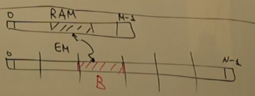
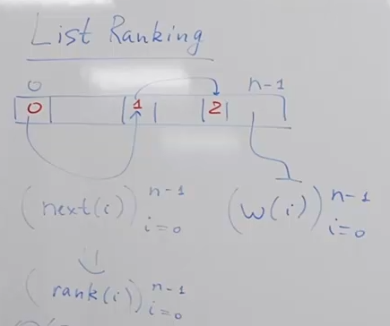
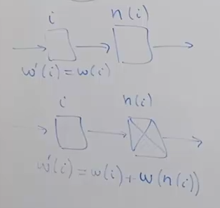

<!-- markdownlint-disable MD024 MD025 -->

# **Lecture 1 - Intro**

## External Memory

RPM -
6 * 10 ** 3

space, latency, throughtput - RAM, HDD

seek time

Most of tasks are IO (CPU <-> HDD) bound.

## Notation

- $M$ - RAM size

- $N$ - EM (external memory) size [input size]

- $B$ - block size: B-aligned, continuous memory

$$\text{time}(x) = \text{latency} + \frac{x}{\text{tp}}$$

$$\text{cost}(x) = \left[\frac{x}{B}\right]$$

$\to$ $B \sim$ 1-10MB.

## Sorting

$\text{MergeSort}(a_1, \dots a_N)$

- if $B \le N \le M \to \text{cost} = O\left(\frac{N}{B}\right)$

- if $N >> M$:

  One step in MergeSort:

  - RAM: $\text{cost}(x) = O(\left|\alpha| + |\beta|\right)$

  - EM: $\text{cost}(x) = O\left(\frac{|\alpha| + |\beta|}{B}\right)$

  $\to$ $\text{cost} = O\left(\frac{N}{B} \log(\frac{N}{B})\right)$ - bad, far from case $N \le M$

### K-ary tree

$K \le \frac{M}{B} \to \text{cost} = O\left(\frac{N}{B} \log_{K}(\frac{N}{B})\right)$

Best: $$\text{cost} = O\left(\frac{N}{B} \log_{\frac{M}{B}}(\frac{N}{B})\right)$$

EM sorting is not done in-place in order to satisfy **transactionality**.

---

Linux **Memory Mapping** (of EM to seem like RAM).

Reading/Writing with bufferization.

# **Seminar 1**

# **Lecture 2 - List ranking & Time forward processing & B-tree**

## List Ranking

$n(i) = \text{next}(i)$

### Reduction

### Join

Duplicate pairs $\to$ sort one by the first key, sort the other by the second key $\to$ 2 pointers to do join.

Using joins on pairs:

$$
<i, \text{deleted}(i)>
$$
$$
<i, w(i)>
$$
$$
<i, \text{n}(i)>
$$

we get:

$$
<i, n(i), \text{deleted}(i), \text{deleted}(n(i)), w(i), w(n(i))>
$$

## Stable Set, Coloring

**Stable set** (**independent set**) - set of vertices that are mutually non-adjacent — that is, no two vertices in the set share an edge.

| Term                    | Definition                                                                                                    |
| ----------------------- | ------------------------------------------------------------------------------------------------------------- |
| **Maximum stable set**  | A stable set of largest possible size in the graph. Its size is the **stability number** ( \alpha(G) ).       |
| **Maximal stable set**  | A stable set that **cannot be extended** by adding any other vertex (but not necessarily of maximum size).    |

# **Lecture 3 - Buffer Tree**

