<!-- markdownlint-disable MD001 MD024 MD025 MD033 MD045 -->

# Setup

[Repository](https://gitlab.com/Lipovsky/concurrency-course)

**Submodules** allow you to keep a Git repository as a subdirectory of another Git repository.

## VScode

[Vscode setup](https://gitlab.com/Lipovsky/concurrency-course/-/blob/master/docs/ide/vscode.md).

Перезапустите VScode: `Ctrl+Shift+p` $\rightarrow$ "Reload Window"

## SSH

1. Create a key:

   ```bash
   cd /workspace/concurrency-course/docker/config/keys
   ssh-keygen -t ed25519 -f ./gitlab-private-key
   ```

2. Add to SSH

   ```bash
   eval "$(ssh-agent -s)"
   ssh-add gitlab-private-key
   ```

3. Copy key:

   ```bash
   cat gitlab-private-key
   ```

4. Sign in to GitLab.
5. Select Add new key and add content of .pub
6. Check that works:

   ```bash
   ssh -T git@gitlab.com
   ```

```bash
clippy attach git@gitlab.com:concurrency-course-workspace/2025/solutions/ysda-y-vladislav-y-balabaev-y-vbalab.git
```

## Restarting

Если вы выключите компьютер / исчезнет контейнер / произойдет что-то непонятное:

```bash
systemctl start docker
docker/client/bin/restart
```

# Troubleshooting

### Manytask Problems

В любой непонятной ситуации с приложением поможет одно из двух:

- /signup → Заполнить поля формы → Нажать Register
- / → Нажать Login

### Reinstalling Container

Удалить и пересоздать контейнер – всегда безопасно, вы не потеряете написанный код:

```bash
./docker/client/bin/remove
./docker/client/bin/create
./docker/client/bin/login
clippy hi                       # информация о платформе хост-системы (не контейнера)
clippy cmake
clippy warmup
# Do SSH
# Do CI
```

### Vscode Syntax Highlighting

After each step do: `Ctrl+Shift+p` > clang: Restart language server

1. This:

   ```cpp
   rm -rf /tmp/vscode-build/
   ```

2. This:

   ```cpp
   clippy cmake --clean
   clippy warmup
   ```

3. Then:

    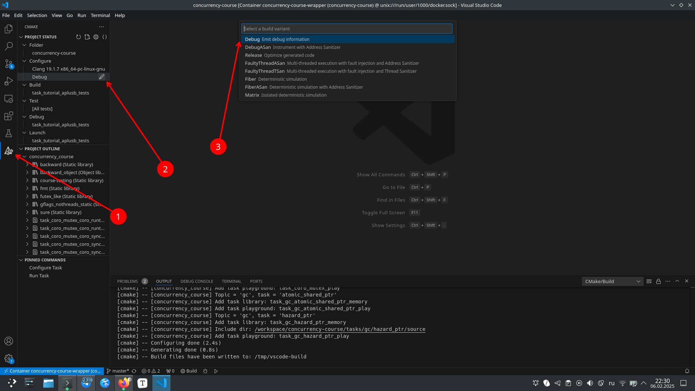

# Workflow

## Start

```bash
sudo systemctl start docker

cd workspace/concurrency-course
docker/client/bin/restart
docker/client/bin/login

clippy hi
# disable VPN
clippy update
```

## Task

Разрешается менять только файлы / директории, перечисленные в поле `submit_files` конфига задачи [`task.json`](task.json).

```bash
clippy test
clippy test --no-censor
clippy test --config my_config.json

clippy format
clippy tidy
clippy validate

clippy commit -m 'solve ...'
# disable VPN
clippy push
clippy merge-request
```

Команду merge-request нужно выполнить всего лишь _один_ раз для каждой задачи.  
Все новые изменения: commit & push, они попадут в существующий MR и перезапустят CI.

## `clippy`

Эти [Clippy commands](https://gitlab.com/Lipovsky/clippy/-/blob/master/docs/commands.md) нужно вызывать из директории с задачей (в том числе из любой поддиректории):

```bash
clippy test                     # Собирает и запускает тесты задачи
clippy test --no-censor
clippy test --config {path}     # В конфиге должна быть секция `tests` в том же формате, что и в task.json

clippy target                   # Собирает и запускает конкретную цель задачи
clippy target tests Debug       # Запускаем цель `tests` в сборке `Debug`
clippy target tests Debug -- --arg1 1 --arg2 2

clippy gdb      # Собирает конкретную цель задачи и запускает на ней GDB
clippy gdb tests Debug
clippy gdb tests Debug -- --arg1 1 --arg2 2
```

```bash
clippy format          # Форматирует код решения задачи с помощью clang-format. Используется конфиг .clang-format из корня репозитория
clippy tidy            # Применяет clang-tidy к решению задачи. Используется конфиг .clang-tidy из корня репозитория
clippy lint            # tidy + format
clippy censor          # Проверяет решение на наличие запрещенных паттернов (см. секцию censor в конфиге задачи и в корневом конфиге .clippy.json)
clippy validate        # Запускает линтеры в режиме проверки + censor
```

```bash
clippy attach          # Клонирует remote репозиторий решений локально в соседнюю с репозиторием курса директорию, связывает репозиторий курса с репозиторием решений (для команд commit, push и т.д.)
clippy attach-local    # Привязывает к репозиторию задач уже существующий локальный репозиторий решений
clippy solutions       # Печатает локальный путь / remote привязанного репозитория с решениями
clippy commit, ci      # Коммитит файлы текущей задачи (см. submit_files в task.json) в ветку локального репозитория с решениями
clippy push            # Пушит коммиты из ветки текущей задачи локального репозитория решений в remote-репозиторий решений
clippy merge-request   # Создает для текущей задачи MR из ветки решения в master со всеми запушенными коммитами
clippy apply           # Перенести код решения из ветки локального репозитория решений в директорию с задачей
```

# Homework 1

## Locking

### Deadlock & Livelock

**Deadlock** - взаимная блокировка, при которой ни один из потоков не может продолжить работу независимо от дальнейшего поведения планировщика, поскольку каждый поток заблокировался на ожидании другого.

Deadlock – терминальная конфигурация, выйти из него нельзя.

**Livelock** - разрешится сам по себе при удачном планировании потоков.

### How to unlock?

The locking order matters, and the unlocking order does not ([YOU ARE A F\*CKING MORON](https://lkml.org/lkml/2008/10/8/150)).

### Determinism

Воспроизводить (и, как следствие, отлаживать) многопоточные баги сложно из-за **недетерминизма** исполнения многопоточного кода, который обусловлен двумя обстоятельствами:

- Потоки исполняются физически параллельно на разных ядрах процессора
- Поток в любой момент может быть вытеснен с ядра планировщиком операционной системы по прерыванию от таймера или IO.

---

### `std::mutex`

`std::mutex` - **synchronization** primitive that is used to protect shared data from being simultaneously modified by multiple threads.

Calling thread _owns_ a mutex from the time that it successfully calls either `lock` or `try_lock` until _it_ calls `unlock`.

`std::mutex` is not **recursive**, so thread can't lock owning mutex again $\rightarrow$ UB: deadlock | crash.

```cpp
std::mutex mtx;
int shared_data = 0;

void increment() {
    mtx.lock();
    ++shared_data;
    mtx.unlock();
}

void decrement() {
    mtx.lock();
    --shared_data;
    mtx.unlock();
}

int main() {
    std::thread t1(increment);
    std::thread t2(decrement);

    t1.join();
    t2.join();
}
```

Worst $\rightarrow$ Best (when possible):  
manually `(un)lock`ing $\rightarrow$ `std::unique_lock` $\rightarrow$ `std::lock_guard`

---

#### `std::lock_guard`

`std::lock_guard` - RAII type that locks a mutex when it is created and automatically unlocks it when it goes out of scope.

`lock_guard` is non-copyable and non-movable.

```cpp
void increment() {
    std::lock_guard<std::mutex> guard(mtx);

    ++shared_data;
}
```

---

#### `std::unique_lock`

`std::unique_lock` - more flexible `std::lock_guard` with ability to `lock` & `unlock`.

`std::unique_lock` - not-copyable but moveable.

## Big Lipovsky

### [TinyFibers](https://gitlab.com/Lipovsky/tinyfiber/-/blob/master/docs/user-guide.md)

### [Twist](https://gitlab.com/Lipovsky/twist/-/blob/master/docs/ru/README.md)

**Stateless model checking** - имея симулятор многопоточных исполнений и умея кастомизировать планировщик, можно в цикле перебирать все исполнения для данного теста с помощью поиска в глубину по расписаниям.

# Homework 2

`volatile` - type qualifier used to tell the compiler that the value of the variable can change at any time outside the program's control (e.g., in hardware registers, interrupt service routines, or multi-threaded programs).  
The compiler should not optimize the access to this variable.

## Name Mangling

**Name mangling** - encoding additional information into function or variable names to support overloading, namespaces, and templates.  
It is a way to differentiate them at the binary level.

```cpp
void print(int x);      // -> _Z5printi
void print(double x);   // -> _Z5printd
```

### C

But C doesn't support name mangling.

We use extern "C" to prevent name mangling when calling C functions from C++ code:

```cpp
extern "C" {
#include "_.h"
}
```

## `std::atomic` (task: SPINLOCK)

Atomicity is always subjective. Smth is atomic to smth.

`std::atomic` - **lock-free synchronization** primitive, which enables manipulating shared data directly at the _hardware level_ (in asm).

It can be configured with specific memory orderings.

```asm
FUNCTION_NAME(AtomicLoad):
    movq (%rdi), %rax
    retq

FUNCTION_NAME(AtomicStore):
    movq %rsi, (%rdi)
    retq

FUNCTION_NAME(AtomicExchange):
    xchg (%rdi), %rsi   # implicitely `lock`ed
    movq %rsi, %rax
    retq
```

Simple assembly instructions (like `mov`, `add`, `sub`, `xchg`) are **inherently atomic** _at level higher than assembly_, but when a function contains more than one instruction, the function itself loses atomicity.

Therefore, we only need to modify the `AtomicExchange`, since it does both read & write.  
We want to do it without using assembly's `lock`, because atomics by definition refer to a lock-free structure.

To achieve this, we need to perform both the read & write operations in a single instruction, `xchg` does that and it is atomic.  
On the other hand, the instruction `movq %rsi, %rax` just reads the value from a register that has already been written, without interacting with shared data between threads, and thus does not affect atomicity.

### About lock-free

Intel and AMD manuals state that `xchg` with a memory operand has an implicit `lock` prefix, making it atomic across multiple processors.

So, `std::atomic`'s `exchange()`, `fetch_add()` (because it does `xchg` or `lock xadd`) are actually doing asm's `lock`.  
They are C++ level lock-free, but _not_ assembly level lock-free

Also `load()` is always `mov` no matter which memory order is chosen, so choosing memory order for `load()` is unnecessary.

## `std::mutex::try_lock` (task: TRY_LOCK)

`std::mutex::try_lock` is allowed to fail **spuriously** and return false even if the mutex is not currently locked by any other thread.

## `futex` (task: MUTEX)

[Futexes Are Tricky](https://dept-info.labri.u-bordeaux.fr/~denis/Enseignement/2008-IR/Articles/01-futex.pdf)

[futex](https://github.com/torvalds/linux/blob/master/kernel/futex/waitwake.c) - fast user-space mutex from linux kernel.

futex - aligned integer which is touched only by atomic assembler instructions, it is identified by a piece of memory which can be shared between processes or threads.

**Core idea** of futex in **mutex**:  
futex is only involved when there is **contention** (for that we have atomic counter): we do `wait` & `wake`.  
If no contantion $\rightarrow$ no futex is used.

```cpp
#include <linux/futex.h>
```

# Homework 3

## Fast & Slow paths in Acquire (task: SEMAPHORE)

- `Acquire()` denotes the entry of a thread into the critical section
- `Release()` denotes its exit

$\to$ mutex can be represented as a binary semaphore with an initial value of 1.

### Implementation of `std::counting_semaphore`

Had to delete it, because `std::atomic` wasn't allowed.

```cpp
class Semaphore {
 public:
  explicit Semaphore(size_t initial)
      : counter_(initial) {
  }

  void Acquire() {
    // FAST PATH:
    size_t current = counter_.load(std::memory_order_relaxed);
    while (current > 0) {
      if (counter_.compare_exchange_weak(current, current - 1)) {
        return;
      }
    }

    // SLOW PATH:
    twist::ed::std::unique_lock lock(mutex_);
    cv_.wait(lock, [this] {
      return counter_.load() > 0;
    });

    counter_.fetch_sub(1);
  }

  void Release() {
    counter_.fetch_add(1);
    cv_.notify_one();
  }

 private:
  twist::ed::std::atomic<size_t> counter_;
  twist::ed::std::mutex mutex_;
  twist::ed::std::condition_variable cv_;
};
```

## [std::barrier](https://en.cppreference.com/w/cpp/thread/barrier) (task: BARRIER)

# Homework 4

## Promise $\to$ Future (task: STD_LIKE)

Пара (`Future<T>`, `Promise<T>`) образует одноразовый канал для возврата результата из асинхронной операции.

Результат – значение типа `T` или исключение.

С каналом работают два потока:

- _Producer_ – поток, выполняющий асинхронную операцию
- _Consumer_ – поток, запускающий асинхронную операцию и потребляющий ее результат

Producer и consumer – это _роли_ потоков, один поток может совмещать разные роли (работая с разными каналами).

Канал – одноразовый (_one-shot_): передать можно только один результат.

`Promise<T>` – конец канала для записи, предоставляет producer-у два метода:

- `SetValue` для передачи значения и
- `SetException` для передачи исключения (в виде [`std::exception_ptr`](https://en.cppreference.com/w/cpp/error/exception_ptr)).

`Future<T>` – конец канала для чтения, предоставляет consumer-у единственный метод `Get`, который блокирует поток до тех пор, пока через `Promise` не будет отправлен результат.

# Homework 5

## Machine context (task: COROUTINE)

```cpp
static void MachineContextTrampoline(void*, void*, void*, void*, void*, void*, void* arg7) {
  ITrampoline* t = (ITrampoline*)arg7;
  t->Run();
}
```

In asm `arg7` is stored at `8(%rsp)`.

| Arg number | Register |
| ---------- | -------- |
| 1          | RDI      |
| 2          | RSI      |
| 3          | RDX      |
| 4          | RCX      |
| 5          | R8       |
| 6          | R9       |
| 7+         | Stack    |

Your trampoline gets passed up to 7 void\*s, **BUT** only `arg7` is actually used.  
This is a trick to pass a single argument while matching a low-level context switch of x86-64 System V ABI **calling conventions**, where the entry function must accept a fixed prototype.

---

```cpp
void* SetupMachineContext(void* stack, void* trampoline, void* arg);    // implemented in .asm

void MachineContext::Setup(StackView stack, ITrampoline* trampoline) {
rsp_ = SetupMachineContext((void*)&stack.back(), (void*)MachineContextTrampoline, (void*)trampoline);
}
```

`stack` (StackView*) - the bottom (_highest address_) of a preallocated on a heap stack via `using StackView = std::span<std::byte>`.
`trampoline` (MachineContextTrampoline*) - will take `arg` as trampoline and will `Run()` it.
`arg` (ITrampoline\*)- continuation - 7th argument that will be passed to MachineContextTrampoline (`trampoline`) to be `Run()`ned.

## Context Switching (task: COROUTINE)

1. Before 1st `Resume()`:

   - `exec_context_` is fully prepared (its stack is set up, and its entry point is the trampoline that will invoke your lambda)
   - `caller_context_` is empty

2. During 1st `Resume()`:

   - Saving into the `caller_context_`: The current execution state — the registers, stack pointer, and other CPU state of the caller—is saved into `caller_context_`
   - Switching to the Coroutine's `exec_context_`

3. After 1st `Resume()`:

   - continuation (here is lambda from the beginnig, because it's 1st `Resume()`) starts running until `self.Suspend()` where it saves current coroutine context and does context switch back

# Homework 6

## `Defer` (task: MUTEX)

[Defer](https://gobyexample.com/defer)

Implimentatiton:

```cpp
template <typename F>
class [[nodiscard]] Defer {
 public:
  explicit Defer(F&& f)
      : func_(std::move(f)) {
  }

  ~Defer() {
    func_();
  }

 private:
  F func_;
};
```

Example:

```cpp
fiber::WaitGroup wg;

for (size_t i = 0; i < 123; ++i) {
    wg.Add(1);

    fiber::Go([&] {
        Defer defer([&wg] {
            wg.Done();
        });

        ...     // task itself
    });
}

wg.Wait();
```

# Homework 7

## Type Erasure (task: FUNCTION)

```cpp
class UniqueFunction {
 private:
  // For type erasure
  struct IRunnable {
    virtual ~IRunnable() = default;

    virtual void Run() = 0;
  };

  template <typename F>
  struct Runnable final : IRunnable {
    F f;

    explicit Runnable(F&& f)
        : f(std::move(f)) {
    }
    void Run() override {
      f();
    }
  };

 public:
  template <typename F>
  explicit UniqueFunction(F&& f)
      : func_(std::make_unique<Runnable<std::decay_t<F>>>(std::move(f))) {
  }

  UniqueFunction(UniqueFunction&& ufunc)
      : func_(std::move(ufunc.func_)) {
  }

  UniqueFunction& operator=(UniqueFunction&& ufunc) {
    func_ = std::move(ufunc.func_);
    return *this;
  }

  // Non-copyable
  UniqueFunction(const UniqueFunction&) = delete;
  UniqueFunction& operator=(const UniqueFunction&) = delete;

  void operator()() {
    func_->Run();
  }

 private:
  std::unique_ptr<IRunnable> func_;
};
```

# Lecture 1 - Intro

"The Free Lunch Is Over: A Fundamental Turn Toward Convergence" - number of transistors still grows, but clock speed is not growing since 2000 $\rightarrow$ need to use parallelism.

**Concurrency**:

- **task switching** on 1 core
- **parrallel** (literally simultaneously) on n cores
- parrallel + task switching

**Parallelism**:

- of process: isolation, need to use communication channels: signals, sockets, ...
- of threads: in the same address space within a process

A lot of concurrency $\rightarrow$ a lot of context switching.

## Sockets

**Socket** - endpoint for communication between two machines or processes.

Types of Sockets:

- Stream Sockets (`SOCK_STREAM`): reliable, two-way, connection-based byte stream. Use TCP protocol.

- Datagram Sockets (`SOCK_DGRAM`): connectionless, unreliable communication channel. Use UDP protocol.

`epoll` - sef of system calls of scalable I/O event notification mechanism in Linux.

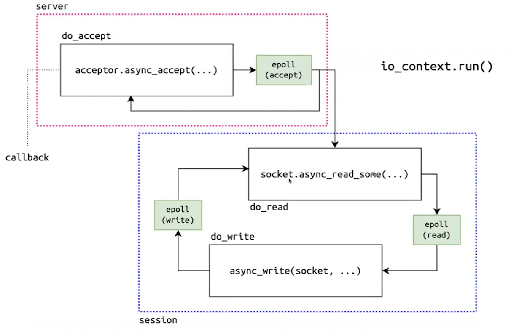

# Lecture 2 - Mutual Exclusion (Mutex)

Race condition.
Data race $\leftarrow$ can be found using ThreadSanitizer

## Safe & Liveness

**Critical section** - code between `mutex.lock()` and `mutex.unlock()`.

- **Safe**: critical section can be accessed only by 1 thread at a time.

  Mutual exclusion is a safety property.  
   It ensures that nothing _bad_ happens.

- **Liveness**: system will eventually reach a desirable state.

  Freedom from deadlock is a liveness property.
  It ensures that something _good_ will eventually happen.

Safety properties are violated in _finite_ executions, while liveness properties are violated in _infinite_ executions.

## Strong & Relaxed Consistency

Consistency extremes:

- **Strong consistency**: All memory operations are ordered, and threads always see the most recent updates to memory.

- **Relaxed consistency**: Allows some reordering of operations for performance reasons, which might lead to threads seeing stale or inconsistent data.

## Sequential Consistency

- $ \mathcal{T} = \{T_1, T_2, \dots, T_n\} $ - set of all threads in the system.
- $ O*i = \{ o*{i1}, o*{i2}, \dots, o*{im_i} \} $ - sequence of **read** or **write** memory operations of thread $ T_i $.
- $ O = \bigcup\_{i=1}^{n} O_i $

- $ \pi*i = (o*{i1}, o*{i2}, \dots, o*{im_i}) $ - **program order** of operations of each thread $ T_i $.

A memory system is **sequentially consistent** if there exists a global order $ S = (s*1, s_2, \dots, s_m) $ of all operations such that: $ \forall o*{ij}, o*{ik} \in O_i $ with $ j < k: s_j $ (of type $ o*{ij} $) precedes $ s*k $ (of type $ o*{ik} $) in $ S $ regardless of what happens in other threads.

In simpler terms, sequence consistency allows different operations from different processes to appear in any order globally, but within each process, the order of operations must not change.

Like you have only 1 core and only the ability to switch among threads.

### C++

`memory_order_seq_cst` - (strongest ordering available in C++) guarantees that atomic operations across threads are sequentially consistent.

## Spinlock

Waiting mechanism:

- **Mutex**: **Block** the thread and release CPU.

  Mutexes tend to be more sophisticated, often implemented using operating system-level mechanisms that allow threads to be blocked and awakened efficiently.

- **Spinlock**: Keep the thread active, **spinning** until the lock is available.

  Spinlock can be _efficient_ when contention is low (i.e., lock is held for a very short period of time), but _inefficient_ with high contention because threads waste CPU cycles spinning.

A universal implementation of a mutex will be _adaptive_: the waiting thread first optimistically spins around on the processor core, and only then parks in the operating system kernel.

### Spinlock Implementations

The following implementations are bad, because:

- no specification of memory orderings
- no caching
- busy-waiting

#### Peterson Spinlock

```cpp
class PetersonLock {
public:
    void lock(int id) {
        int other = 1 - id;
        flag_[id] = true;
        turn_ = other;  // Give the other thread a chance to run

        while (flag_[other] && turn_ == other) {
            // Spin loop (busy-wait)
        }
    }

    void unlock(int id) {
        flag_[id] = false;
    }

private:
    std::atomic<bool> flag_[2];
    std::atomic<int> turn_ = 0;
};
```

#### Test-And-Set Spinlock

```cpp
class TasSpinlock {
public:
    void lock() {
        while (locked_.exchange(true)) {
            // Spin loop (busy-wait)
        }
    }

    void unlock() {
        locked_.store(false);
    }

private:
    std::atomic<bool> locked_ = false;
};
```

#### Test-And-Test-And-Set Spinlock (Optimized TAS)

See lecure 5.

#### Ticket Spinlock

1. ```cpp
   class TicketSpinlock {
   public:
       void lock() {
           int my_ticket = next_ticket.fetch_add(1);

           while (my_ticket != now_serving.load()) {
               // Spin loop (busy-wait)
           }
       }

       void unlock() {
           now_serving.fetch_add(1);
       }

   private:
       std::atomic<int> next_ticket = 0;
       std::atomic<int> now_serving = 0;
   };
   ```

2. ```cpp
   class SpinLock {
   public:
   void Lock() {
       while (thread_count_.fetch_add(1) > 0) {
       thread_count_.fetch_sub(1);
       }
   }

   void Unlock() {
       thread_count_.fetch_sub(1);
   }

   private:
   std::atomic<size_t> thread_count_{0};
   };
   ```

---

### [PAUSE](https://c9x.me/x86/html/file_module_x86_id_232.html)

`PAUSE` hint - CPU-specific optimization used in spinlocks or busy-wait loops.

It temporarily halts the execution of the current thread, allowing the processor to reduce power consumption and release resources such as the memory bus and cache bandwidth, preventing the processor from wasting excessive CPU cycles while waiting for a lock to be released.

Manually:

```cpp
while (...) {
    _mm_pause();                                // Intel/AMD CPUs
    __asm__ __volatile__("pause" ::: "memory"); // directly in asm
    __builtin_ia32_pause();                     // GCC/Clang
}
```

## [futex](https://github.com/torvalds/linux/blob/master/kernel/futex/waitwake.c)

# Lecture 3, 4 - Thread Pool

**OS limit**: Linux can handle ~1024–32,768 threads per proccess by default, or ~4 million system-wide.  
Furthermore, there is no point in setting number of threads within process beyond **hardware limit** of n_cores;

So we limited by number of threads while number of tasks can be inf $\rightarrow$ can't just give each task a thread $\rightarrow$ fix number of threads and queue there all tasks $\rightarrow$ `ThreadPool`.


## `std::conditional_variable`

**Spurious wakeup** - condition variable's `wait()` can return even if no `notify_one()` or `notify_all()` was called.

Without a predicate, the thread might wake up, assume the condition is met, and proceed incorrectly.

### Adding predicate

Checks conditions _before_ waiting and _after_ each (spurious too) wake-up:

```cpp
cv_.wait(lock, [&] { return cond; });
```

is the same as:

```cpp
while (!cond) {
    cv_.wait(lock);
}
```

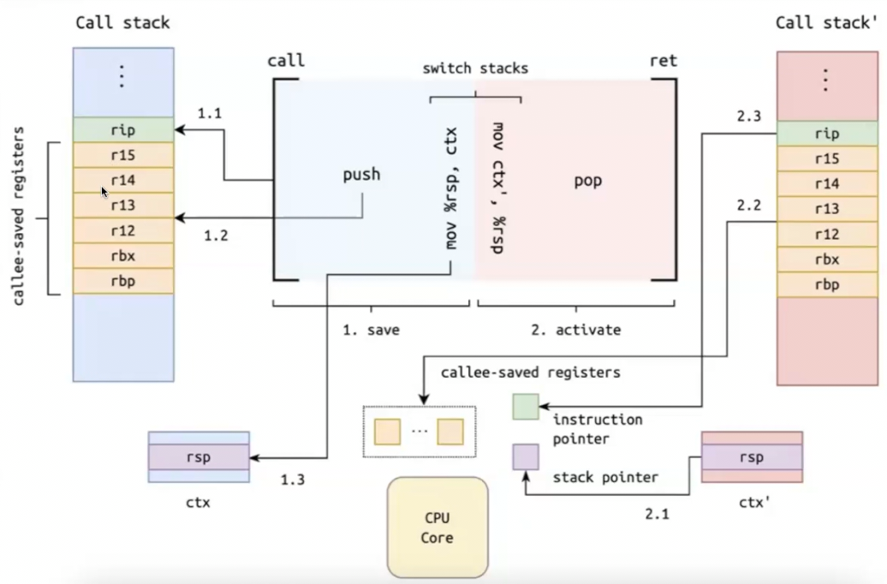

# Lecture 5 - Coroutines & Fibers, IO

**Thundering herd** - performance issue, when multiple threads all awakened simultaneously for the same event, causing unnecessary contention.

## False sharing

> Checkout MESI in akos notes


**False sharing** - when multiple threads on different CPU cores access different variables that happen to be stored in the same cache line: any update by one thread marks the _entire cache line_ as "Modified" and "**Invalidated**" it in other cores.

### Solution

```cpp
constexpr size_t kCacheLineSize = std::hardware_destructive_interference_size;
```

1. **Padding**

   ```cpp
   struct KeepOnSeparateCacheLines {
       std::atomic<int32_t> counter;
       char padding[kCacheLineSize - sizeof(std::atomic<int32_t>)];
   };
   ```

2. `alignas` - better!

   ```cpp
   struct alignas(kCacheLineSize) KeepOnSeparateCacheLines {
       std::atomic<int32_t> counter;
   };
   ```

   OR

   ```cpp
   struct KeepOnSeparateCacheLines {
       alignas(kCacheLineSize) std::atomic<int32_t> counter1;
       alignas(kCacheLineSize) std::atomic<int32_t> counter2;
   };
   ```

---

## False sharing in `cas`

[Great visualization of MESI](https://www.scss.tcd.ie/jeremy.jones/vivio/caches/ALL%20protocols.htm)

`.exchange()` of C++ is `cas` of asm and it does writing $\to$ does Modified to itself & Invalidate to others in MESI $\to$ expensive.

```cpp
class TatasSpinlock {
public:
    void lock() {
        while (locked_.exchange(true, std::memory_order::acquire)) {
            while (locked_.load(std::memory_order::relaxed)) {    // better do also this!
                // Spin Loop, but no writing -> goes by Sharing in MESI, no extra Invalidation
                SpinLoopHint();  // also use this!
            }
        }
    }

    void unlock() {
        locked_.store(false, std::memory_order::release);
    }

private:
    std::atomic<bool> locked_ = false;
};
```

## Fiber

**Fiber** – lightweight thread implemented by stackful coroutine operating entirely in user space.

The scheduler maintains a queue of ready-to-run fibers.

- Fibers are **cooperative** - `Yield()` control to the scheduler only voluntarily.

- Fibers execute within OS thread (**carrier thread**).

> single-threaded scheduler + cooperativeness = deterministic execution.

### Thread types

- Hardware-thread - actual physical thread on a CPU

- OS-thread - given to us by the OS - **preemptively** scheduled

- Fiber-thread - thread of execution that is our fiber - **cooperatively** scheduled

### Why We Need Fibers at All?

1. Very low cost of context-switch since operating completely in user space.

2. Fibers don't need kernel support or stacks per task, allowing thousands to run with minimal memory.

> Fibers are ideal for async I/O

Implement your _own context switching_, don't use system calls: these need to be generic interfaces, they need to do a lot more work

### Idea of Fibers

_Файбер_ = _Корутина_ × _Планировщик_

Компоненты в этой формуле **ортогональны**:

- _Планировщик_ (пул потоков) не знает про файберы и корутины, его единственная ответственность – исполнять _задачи_.
- _Корутина_ не знает про потоки, задачи и планировщики, она лишь реализует suspendable процедуру.

Реализация файберов **комбинирует** эти компоненты:

- генерирует служебные задачи для планировщика,
- возобновляет и останавливает в них корутины, которые исполняют процедуры пользователей.

### 1:N $\times$ M:N

- **1:N**: N fibers to 1 OS thread (Python’s `async`/`await`) $\leftarrow$ _not what you’re interested in_

- **M:N**: pool of M OS threads where we execute fibers

# Lecture 6 - Memory Model: Hierarchy, Coherence

---

# Lecture 7 - Memory Model: SC-DRF

## Store Buffer

**Store Buffer** - hardware queue in modern CPUs that holds write operations before they are committed to memory.

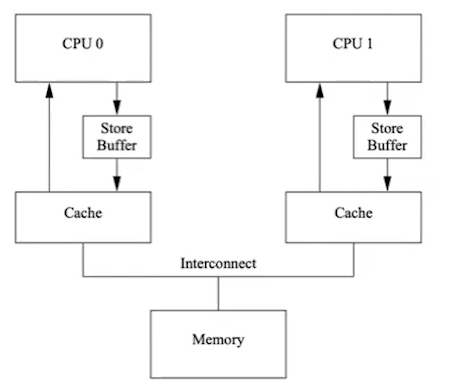

It allows **reordering** by enabling the CPU to continue executing instructions without waiting for stores to complete $\to$ **out-of-order execution**.

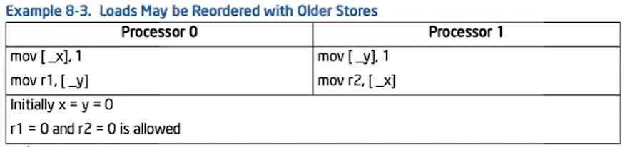

Different processor architectures $\to$ different reordering.

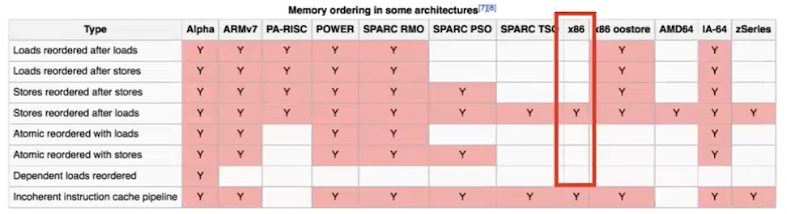

## Memory Model

**Memory model** - part of language semantic this is all about ordering, so it should work under _any_ processor architecture.

Memory model basically specifies _how reads can be guaranteed to observe writes_, allowing formal reasoning about reordering and visibility in real hardware.

Sequential consistency chosen $\to$ **Interleaving model** that simplifies concurrency as a shuffle of thread actions, assuming atomicity and no hardware effects.

**Memory orders** are used inside memory models to control how strict or relaxed operations are.

### Operational vs Declarative

1. **Operational** MM:  
   Defines how the system executes memory operations.

   Describes step-by-step mechanisms like store buffers, reorder queues, fences.

2. **Declarative** MM - define what executions are allowed using axioms, relations, and constraints.

   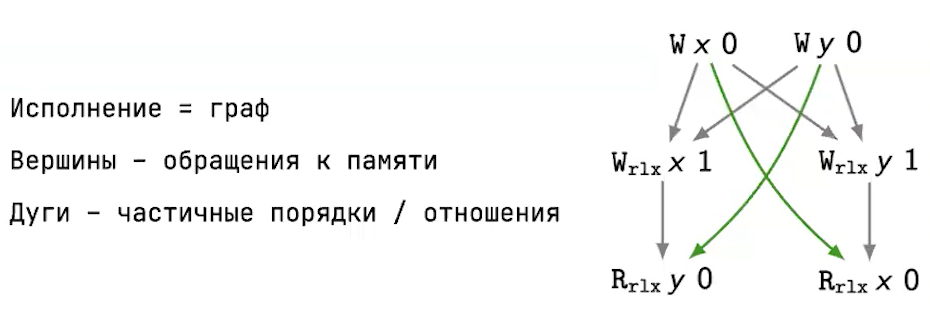

   **reads-from** (green) - relation linking read with write.

   _Target_: formalize expectations of reads-from.

### C++

C++11 (and later) memory model is declarative, since it defines axioms and relations, such as:

- happens-before
- reads-from
- modification order
- sequenced-before

## Data Race

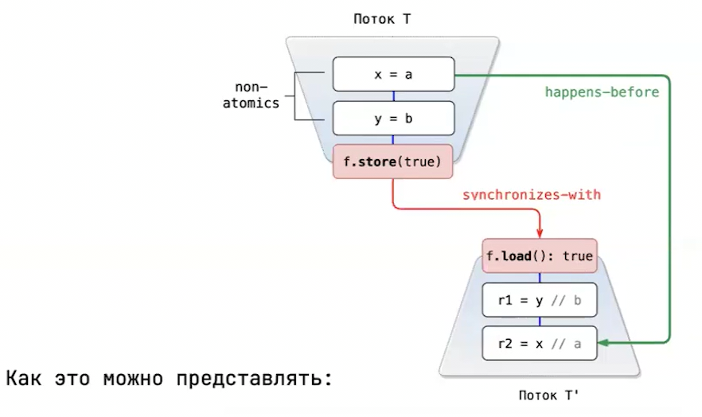

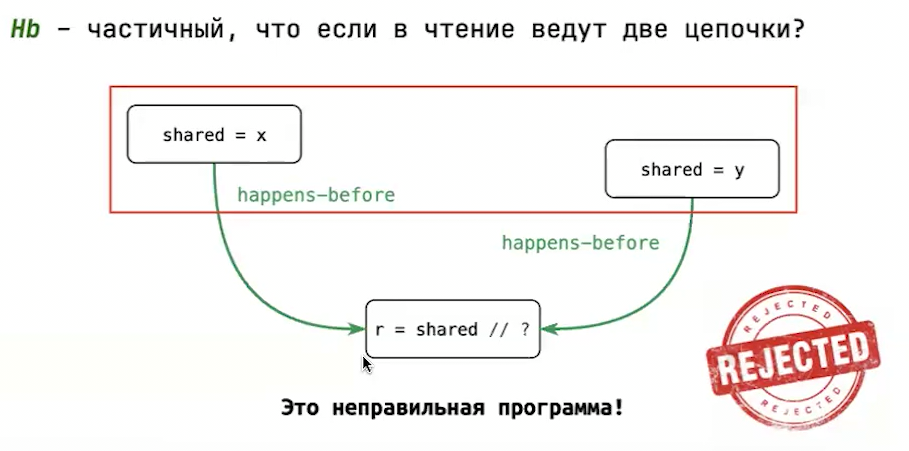

Two memory accesses **conflict** if:

- they access the same memory location
- and at least one of the accesses is a write

**Data race** - two conflicting non-atomic memory accesses that are not ordered within happens-before.

Data race is UB.

### DRF Guarantee

Data-race-free Guarantee:  
Program is **correctly synchronized** $\equiv$ all sequentially consistent _executions_ are free of data races.

# Lecture 8 - Futures I

## Sequential Composition with Futures

Callback hell:

```cpp
void asyncA(Output, Callback<OutputA>);
void asyncB(OutputA, Callback<OutputB>);

auto result = std::make_shared<double>();
fooAsync(input, [=](Output output) {
    asyncA(output, [=](OutputA outputA) {
        asyncB(outputA, [=](OutputB outputB) {
            *result = outputB * M_PI;
        });
    });
});
```

$\to$ future then sequencies:

```cpp
Future<OutputA> futureA(Output);
Future<OutputB> futureB(OutputA);

OutputB b(OutputA outputA) {
    if (somethingExceptional) throw anException;
    return OutputB();
}

Future<double> fut =
    fooFuture(input)
    .then(futureA)
    .then(futureB)
    .then([](OutputB outputB) {
        return outputB * M_PI;
    });
```

$\to$ pipes `|` with futures.

# Lecture 9 - Non-blocking Synchronization

## ABA problem

**ABA problem** occurs when a thread reads a shared variable as value A, gets delayed, during which another thread changes the value from A $\to$ B $\to$ A, and the first thread resumes and sees A, assuming it’s unchanged—potentially causing incorrect behavior in **CAS**-based (Compare-And-Swap) operations.

## Trieber Lock-Free Stack

## Michael-Scott Lock-Free Queue

## Stack Elimination Backoff

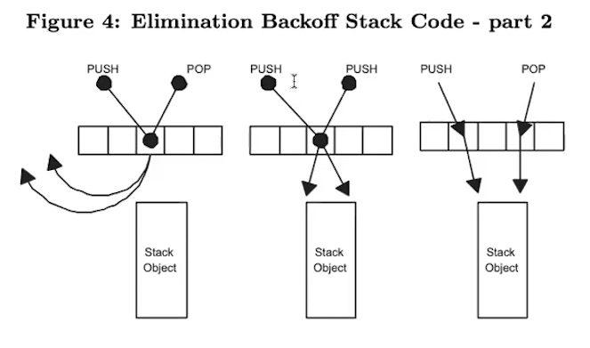


## Abstract Buskets Queue

The idea is that threads in which CAS fails at `Push()`, because the other thread `Push()`ed first, we assume that these `Push()`es are in **logical equivalence class** (busket group) and can be permutated freely.  
So we don't try to `Push()` failed from the beginning, but try to stick them _before_ (or after) the node that succeeded.  
So that between groups `Push()`es won't permutate, only within group $\to$ **linearizability**.

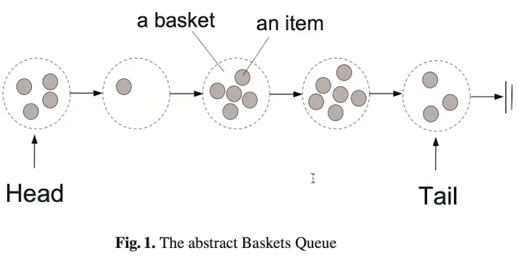

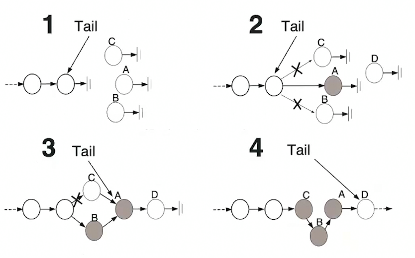

**Linearizability** guarantee: between groups, order matters; within group, it's flexible.

> INSIGHT: spend time on building tests & deterministic simulation, then you'll build & refactor in future the service much faster and safer -- [Testing Distributed Systems](https://www.youtube.com/watch?v=4fFDFbi3toc)

# Lecture 10 - Work-Stealing Thread Pool

# Lecture 11 - Stackless Coroutines

# Lecture 12 - Futures II

# Lecture 13 - Futures & Fibers

# Lecture 14 - Cancellation & Structured Concurrency

# Lecture 15 - Memory Model: C++20 MM

# Lecture 16 - Monads & Effects

# Lecture 17 - Consensus

# Lecture 18 - Multi-Cas, Reagents, Txns
