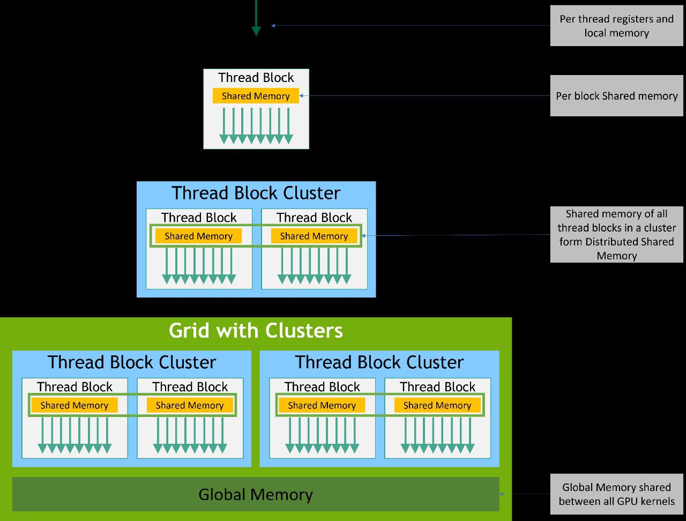
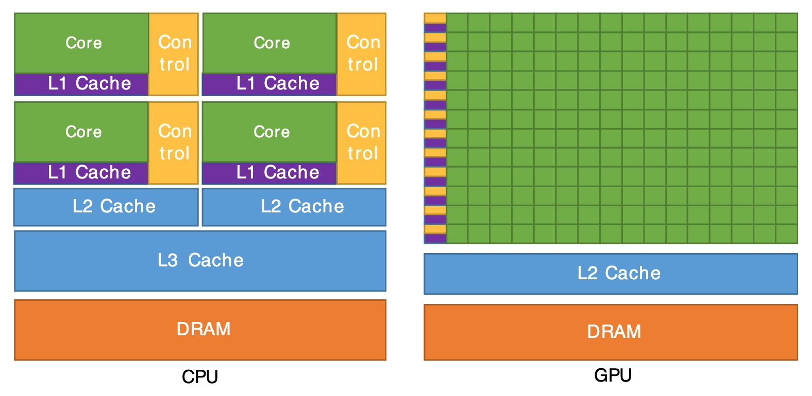
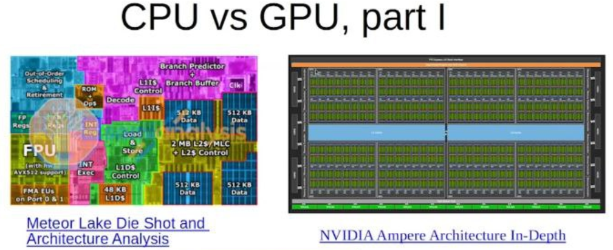
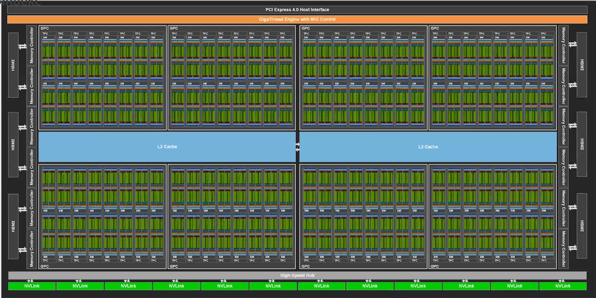
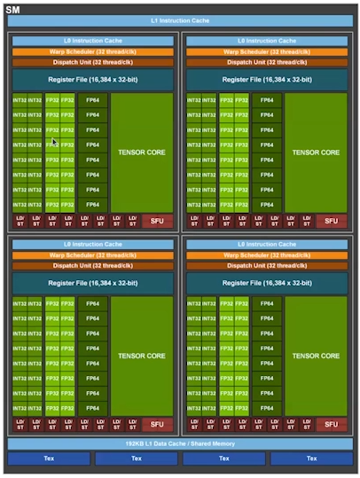
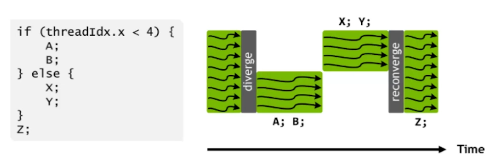
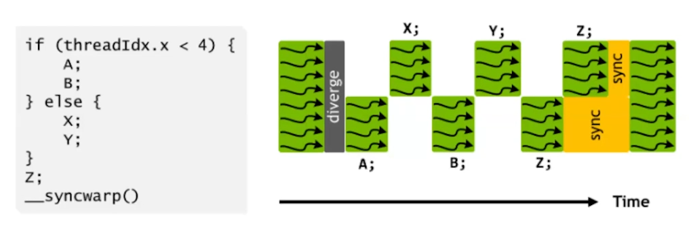
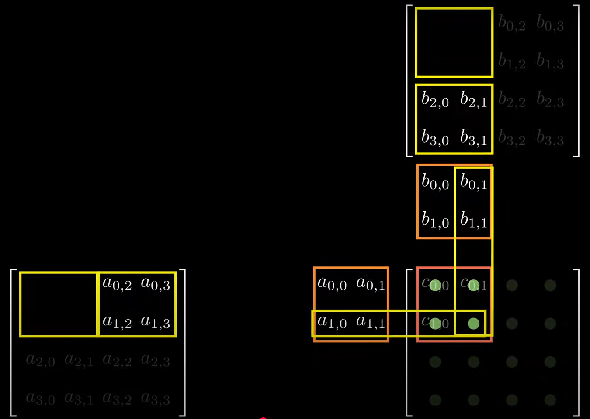
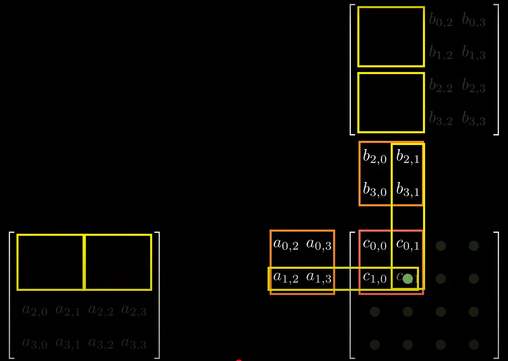

<!-- markdownlint-disable MD001 MD010 MD024 MD025 MD049 -->

# Workflow

```bash
ssh balabaevvl@45.93.203.34
ssh shad-gpu

# scp /path/to/local/file username@remote_host:/path/to/remote/destination
scp main.cu shad-gpu:courses:cuda/
scp notes.md shad-gpu:courses/cuda/

# scp username@remote_host:/path/to/remote/file /path/to/local/destination
scp -r shad-gpu:courses/cuda/* .
```

# Lecture 1 - Intro

Full C++ is supported for the **host** code.  
However, only a subset of C++ is fully supported for the **device** code.

## `nvcc`

`nvcc` (NVIDIA CUDA Compiler) - compiler driver provided by NVIDIA.

It separates:

- Host code (runs on **CPU**): regular C++ code

- Device code (runs on **GPU**): marked by `__global__`, `__device__`, or `__host__ __device__`

Combines the CPU object files and embedded GPU binaries into a final executable.

```bash
nvcc main.cu
nvcc --compiler-bindir=/usr/bin/g++-11 main.cu                          # specifying C++ compiler
nvcc --compiler-bindir=/usr/bin/g++-11 -Xcompiler "-Wall -O2" main.cu   # adding g++ flags

nvidia-smi                                                              # see GPUs
nvidia-smi -L

./a.out                                                                 # calls on 0st GPU by default
CUDA_VISIBLE_DEVICES=2 ./a.out                                          # explicitely call on 3rd GPU
# BUT order from `nvidia-smi -L` is different here, because it reprioritizes by GPU generation
# -> use either:
CUDA_DEVICE_ORDED=PCI_BUS_ID CUDA_VISIBLE_DEVICES=2 ./a.out
# OR
CUDA_VISIBLE_DEVICES=GPU-6c76a2c5-5375-aa06-11d4-0fddfac30e91 ./a.out    # better!
```

## Function Attributes

| Attribute             | Meaning                                          |
| --------------------- | ------------------------------------------------ |
| `__global__`          | Called from host with `<<<...>>>`, runs on device|
| `__device__`          | Called from device, runs on device|
| `__host__`            | Called from host, runs on host (default in C++) |
| `__host__ __device__` | Can be called from both host and device          |

**CUDA kernel** - (`__global__`) GPU function launched from the CPU and executed in parallel by many threads on the GPU.

> You write the kernel as if it’s for _one_ thread, and CUDA runs it in _many_ threads.

## Variable Attributes

| Attribute      | Location                        |
| -------------- | ---------------------------------------------- |
| `__device__`   | Global memory (GPU, accessible by all threads) |
| `__shared__`   | Shared memory (per block, fast access)         |
| `__constant__` | Constant memory (read-only, fast, small)       |
| `__managed__`  | Unified memory (accessible by CPU and GPU)     |

## CUDA Hierarchy

Grid $\to$ Blocks $\to$ Warps $\to$ Threads.

Both blocks and threads can be _1D, 2D, or 3D_.

```cpp
int32_t x = blockIdx.x * blockDim.x + threadIdx.x;
```

```cpp
dim3 blockDim{16, 16}; // 256 threads per block
dim3 gridDim{32, 32};  // 1024 blocks per grid -> 262,144 threads

__global__ void KernelFunc();

KernelFunc<<<gridDim, blockDim>>>();
```



### Thread

**Thread** - single execution unit (like a mini CPU core) that runs the **kernel**.

Memory:

- own registers
- local memory
- shared access to memory _within block_
- global memory

### Warp

**Warp** - the real hardware unit - group of _32_ CUDA threads that execute instructions in lock-step on a **Streaming Multiprocessor (SM)**.

All 32 threads in a warp share the same **program counter (PC)** — they execute _the same instruction_ at _the same time_, on _different data_.

### Block

**Block** - array of threads grouped by warps.

Since block made of warps $\to$ do number of threads in block $: 32$.

All threads in a block run _on one_ SM.  
Threads within a block are executed _warp by warp_, not all at once.

`dim_{SM} <= 1024` $\to$ `blockDim <= 1024`

### Grid

**Grid** - array of blocks.

`gridDim < 2 << 31 - 1`*

# Lecture 2.1 - Writing Kernel

Data Parallelism is for GPU

SPMD

Task Parallelism is for CPU

## Sync

CUDA Kernel execution is async $\to$ use `cudaDeviceSynchronize`.

```bash
CUDA_LAUNCH_BLOCKING=1 ./a.out  # all kernel functions are synchronized
```

## Memory Allocation

- CUDA has no RAII

- Host/Device pointers data are indistinguishable $\to$ Write `Host`/`Device` suffixes in code

- There is no lazy memory allocation $\to$ If you did `cudaMalloc`, then it actually allocated physical memory

```cpp
constexpr size_t kElemenents = 1 << 20;
constexpr size_t kBufferSize = kElemenents * sizeof(int);

int* aHost = reinterpret_cast<int*>(malloc(kBufferSize));
int* bHost = reinterpret_cast<int*>(malloc(kBufferSize));

int* aDevice;
CudaCheck(cudaMalloc(&aDevice, kBufferSize));

cudaMemcpy(aDevice, aHost, kBufferSize, cudaMemcpyHostToDevice);
cudaMemcpy(bHost, aDevice, kBufferSize, cudaMemcpyDeviceToHost);

cudaFree(aDevice);
free(bHost);
free(aHost);
```

## `cudaError`

CUDA returns flags like any syscall.

```cpp
void CudaCheck(cudaError_t cuda_error) {
  if (cuda_error == cudaSuccess) {
    return;
  }

  throw std::runtime_error(cudaGetErrorString(cuda_error));
}
```

## `compute-sanitizer`

```bash
/usr/local/cuda-12.6/bin/compute-sanitizer ./a.out
/usr/local/cuda-12.6/bin/compute-sanitizer --leak-check=full ./a.out
```

# Lecture 2.2 - GPU Architectures

## PTX, SASS

CUDA C++ $\to$ PTX (virtual ISA) $\to$ SASS (real ISA) $\to$ GPU

**PTX (Parallel Thread Execution)** - **JIT-compiled** or **AOT-emitted** intermediate (like LLVM IR), virtual assembly language, portable across GPU generations.

**SASS (Streaming Assembler)** - hardware-specific low-level machine code executed on specific GPU architecture by SMs.

Why JIT is used on GPUs?

- Only way for applications to run on devices that did not exist at the time the application was compiled

- Portability across GPU generations

- Runtime-known constants (e.g., tensor shapes)

> If you provide nothing or only provide PTX and observe a noticeable startup delay the first time the kernel is launched — that’s the JIT compiler working $\to$ use `nsys` and `nvprof`.

### Flags

| nvcc flag             | Output        | PTX-to-SASS compiled at                                   |
| --------------------- | ------------- | --------------------------------------------------------- |
| `--ptx`               | `.ptx` file   | **At runtime (JIT)**                                    |
| `--cubin`             | `.cubin` file | Already SASS — done at **compile-time**                 |
| `--fatbin` or default | `.fatbin`     | Contains both PTX and SASS; **driver chooses at runtime** |

Specifying GPU:

```bash
# compute_XX - PTX code target
# sm_XX - SASS code target
-gencode=arch=compute_XX,sm_XX
```

```bash
CUDA_FORCE_PTX_JIT=1        # no SASS lookup
CUDA_DISABLE_PTX_JIT=1      # no PTX lookup
```

To see how it gets compiled:

```bash
nvcc main.cu -time stat
less -S stat
```

# Lecture 3 - Blocks

## CPU vs GPU





> The GPU devotes more transistors to data processing but lucks functionality

## Synchronization

All threads _within block_ should reach _the same_ `__syncthreads()`, otherwise deadlock.

`__syncthreads()` acts on shared memory $\to$ is expected to be lightweight.

There is no synchronization between blocks.

## Indexing

```cpp
constexpr size_t kElemenents = 1 << 12;
constexpr size_t kBufferSize = kElemenents * sizeof(int);

constexpr size_t kThreads = 1024;
constexpr dim3 kBlockDim{kThreads};
constexpr dim3 kGridDim{(kElemenents + kThreads - 1) / kThreads};
```

```cpp
int linearThreadIdx = threadIdx.x * 1
                    + threadIdx.y * blockDim.x
                    + threadIdx.z * blockDim.y * blockDim.x;

int warpIdx = linearThreadIdx / 32;
int laneIdx = linearThreadIdx % 32;
```

## Streaming Multiprocessor (SM)

> Modern SMs are often split internally into multiple partitions (**sub-SMs**).

- **SM**: has L1 data cache, shared memory, texture units, instruction cache _that sub-SMs can use_.

- **sub-SM**: has its own L0 instruction cache, warp scheduler, register file, execution pipelines.





Not all data types get dedicated hardware.  
Other precisions (e.g. INT8, INT16, FP16, BF16, TF32) are executed on these _existing_ units.

## Warp Scheduling

**Zero overhead** for **warp-switching** (while switching context on CPU is heavy).

## Control Divergence

**Control divergence** - happens when threads in the same warp follow different execution paths due to conditional branches (`if`, `switch`, `for`, etc.).

Divergence _reduces_ parallel efficiency, since only part of the warp is active at a time.



### Independent Thread Scheduling

Starting with Volta (Compute Capability 7.0), NVIDIA introduced **Independent Thread Scheduling**:  
Each thread has _its own_ PC, call stack, and register state $\to$ divergent threads can progress without waiting for others.

BUT: Requires **explicit synchronization** in some cases where programmers previously assumed implicit warp lockstep.  
CUDA introduced `__syncwarp()` for this.



# Lecture 4 - Shared Memory

```bash
nvidia-smi dmon -i 1  # to see pwr, temp, mem, ...
```

## FLOP

**FLOP** - single floating-point operation (e.g., `a + b`, `x * y`).

**FLOPS** - FLOPs per second (a performance metric).

| GPU               | FP32 (TFLOPS) | FP64 (TFLOPS) |
|-------------------|---------------|---------------|
| NVIDIA RTX 3090   | 35.6          | 0.56          |
| NVIDIA A100       | 19.5          | 9.7           |
| NVIDIA H100       | 67            | 34            |

Compilers often optimize `a * b + c` into a single **FMA** instruction (counts as 2 FLOPs).

**Arithmetic Intensity** = FLOP / B - FLOP per byte of memory transferred.  
It helps analyze whether a kernel is **compute-bound** or **memory-bound**.

| Kernel          | FLOP/B          | Bound    |
|-----------------|-----------------|----------|
| Matrix Multiply | $ \frac{N}{6} $ | Compute  |
| Vector Add      | 0.08            | Memory   |
| 3D Stencil      | 1–2             | Memory   |
| FFT             | ~5              | Balanced |

### Example

```cpp
__global__ void MatMul(float *A, float *B, float *C, size_t N, size_t M, size_t K) {
    size_t row = blockIdx.y * blockDim.y + threadIdx.y;
    size_t col = blockIdx.x * blockDim.x + threadIdx.x;

    if (row >= M || col >= N) {
      return;
    }
  
    float sum = 0.0f;
    for (size_t k = 0; k < K; ++k) {
        sum += A[row * K + k] * B[k * N + col];  // 2 FLOPs (multiply + add)
    }

    C[row * N + col] = sum;
}

// Total FLOPs: (M * N) * K * 2
```

> 1:24:00

The problem is, while having a lot more of compute, we have ~cache memory as in CPU.

## Memory Types

| Memory Type     | Scope       | Location             | Performance                 | Notes                                                                 |
|-----------------|-------------|----------------------|-----------------------------|-----------------------------------------------------------------------|
| **Registers**   | Per-thread  | On-chip              | Fastest                     | Used automatically for scalar vars.                |
| **Local Memory**| Per-thread  | Off-chip (DRAM)      | Slow (≈ global memory)      | Despite the name, stored in DRAM; used when registers spill or for arrays. |
| **Shared Memory**| Per-block  | On-chip (lives on L1) | Much faster than DRAM       | _Programmer-managed cache_; enables intra-block communication.           |
| **Global Memory**| Per-grid   | Device DRAM          | Slowest (unless coalesced)  | Accessible to all threads and the host. |
| **Constant Memory**| Per-grid | Device DRAM + cache  | Fast if broadcasted         | Read-only for device; cached. |

Both shared memory and L1 cache are implemented in the same on-chip **SRAM**, partitioned between them.

## Tiled Matrix Multiplication

Check out Tiled Matrix Multiplication [implementation](tiling.cu).

```cpp
__shared__ float As[TILE][TILE];
__shared__ float Bs[TILE][TILE];
```




