<!-- markdownlint-disable MD024 MD025 MD041-->

> the lectures are based on [this CV course](https://courses.cv-gml.ru/cv/2025/).

# **Lecture 1 - Introduction**

It was really interesting! But not useful.

# **Lecture 2 - ...**

## Tonal Correction

### Autocontranst

#### **Stable Autocontrast**

#### **Color Images**

RGB $\to$ **YUV** or **YIQ**, apply autocontrast to Y only $\to$ RGB.

### Gamma Correction

Human eye
...
formula

### Histogram Equalization

## Color Correction

### Gray World

## Noise Reduction

> у вас не хватает фотонов, картинка начинает шуметь

$\to$ Do image averaging, by CLT noise $to$ mean=0.

## Blurring & Sharpening

- **Blurring** is done convolution $\to$ **sharpening** is convolution also.

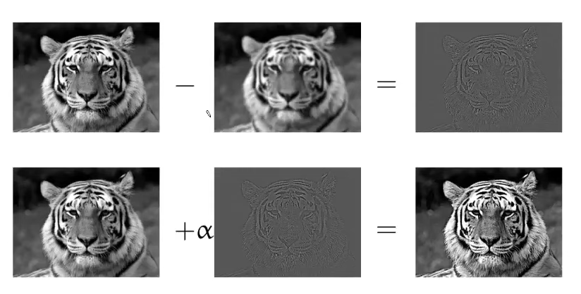

## Fast Filtering

### Fast Box Filter

**Fast box filter** - **optimized way to compute box (uniform) blur**—i.e., convolution with a kernel where all weights are equal:

$$
K = \frac{1}{N} \begin{bmatrix}
1 & 1 & \dots & 1\\
\vdots & \vdots & \ddots & \vdots\\
1 & 1 & \dots & 1
\end{bmatrix}
$$

The naive convolution cost is:

$$
O(W \cdot H \cdot r^2)
$$

for image size $W \times H$ and kernel radius $r$.

### **Key idea**

Use a **summed-area table / integral image** so each box sum is computed in $O(1)$ instead of $O(r^2)$. Then the total complexity becomes:

$$
O(W \cdot H)
$$

regardless of kernel size.

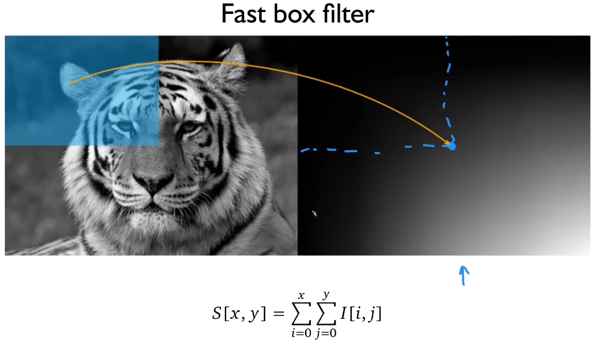

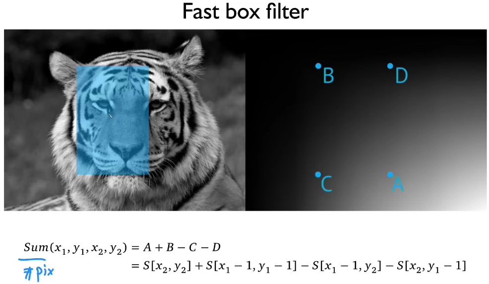

## Image Gradient: Edge Detection

**Image gradient** measures how intensity changes in space—i.e., how fast pixel values vary along $x$ and $y$ directions.

- Intuitively: it tells you where the image changes sharply $\to$ which corresponds to **edges**.

Let $ I(x, y) $ be a grayscale image (continuous or treated as such).

The gradient is a **vector**:

$$
\nabla I(x, y) =
\begin{bmatrix}
\frac{\partial I}{\partial x} \\
\frac{\partial I}{\partial y}
\end{bmatrix}
$$

- $ \frac{\partial I}{\partial x} $ — how brightness changes left→right  
- $ \frac{\partial I}{\partial y} $ — how brightness changes top→bottom  

Magnitude (strength of edge):

$$
|\nabla I| = \sqrt{ \left(\frac{\partial I}{\partial x}\right)^2 + \left(\frac{\partial I}{\partial y}\right)^2 }
$$

Direction (angle of edge normal):

$$
\theta = \arctan \frac{\frac{\partial I}{\partial y}}{\frac{\partial I}{\partial x}}
$$

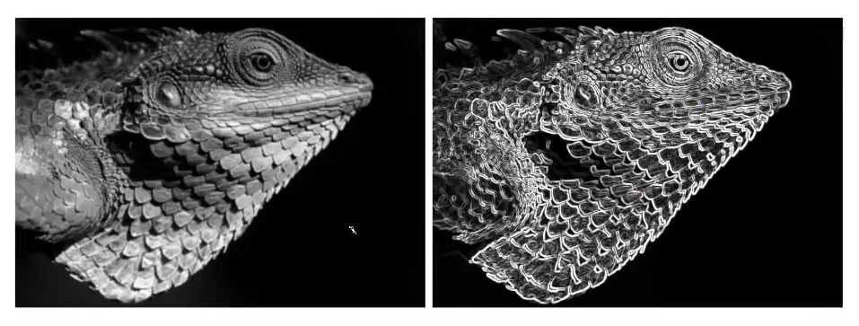

# **Seminar 4**

- We did NN using numpy only!

`model.eval()` does _not_ disable gradient tracking $\to$ still need `torch.no_grad()`.

# **Lecture 5 - CNN**

## FCN

Unlike architectures that use a Flatten layer, **fully convolutional networks (FCNs)** can, in principle, process images of _arbitrary_ size.

In such networks, increasing the input image size leads to a corresponding increase in the output size.

## Inception block

Instead of choosing one kernel size (e.g. 3×3), the **Inception block**: multiple convolutions with different receptive fields in parallel, then concatenates their outputs along channels.

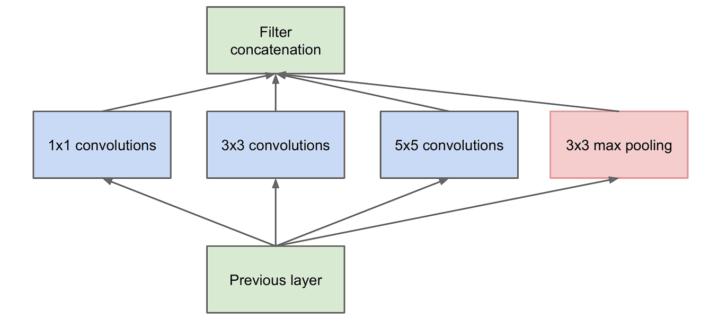

### Inception block with dim reduction

Before expensive spatial (like 5x5x256x256) convolutions, reduce channel dimension using 1×1 convolutions.

- 1×1 convolutions act as **learned projections**.

$\to$ parallel hypothesis testing at different scales, made feasible by 1×1 bottlenecks.

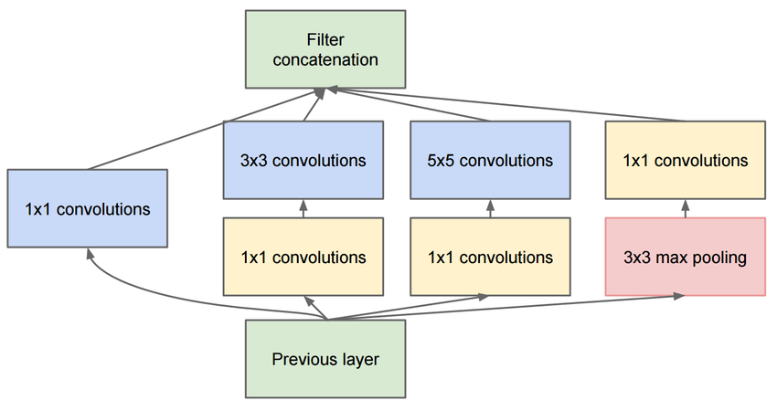

## SqueezeNet

**SqueezeNet** - CNN designed to achieve AlexNet-level accuracy with ~50× fewer parameters.

- Replaces most 3×3 with 1×1 convolutions

- Uses a **Fire module**:
  - **Squeeze**: 1×1 convolution reduces the number of channels
  - **Expand**: a mix of 1×1 and 3×3 convolutions restores representational capacity

- **Delays downsampling**, keeping feature maps large for longer

$\to$ ~**1.25M parameters** (vs ~60M in AlexNet)

## Depthwise Separable Convolutions

### 1. Standard convolution (baseline)

- Input feature map: shape $(H, W, C_{\text{in}})$
- Output channels: $C_{\text{out}}$
- Kernel size: $k \times k$

Each output channel has a kernel of shape:

$$
k \times k \times C_{\text{in}}
$$

So every output channel mixes:

- **spatial information** (via $k \times k$)
- **cross-channel information** (via $C_{\text{in}}$)

```py
self.conv = nn.Conv2d(
    in_channels=c_in,
    out_channels=c_in,
    kernel_size=k,
    stride=stride,
    padding=padding,
    bias=bias,
)
```

- **Parameters:**

$$
k^2 \cdot C_{\text{in}} \cdot C_{\text{out}}
$$

- **MACs (roughly):**

$$
H \cdot W \cdot k^2 \cdot C_{\text{in}} \cdot C_{\text{out}}
$$

This is expensive when $C_{\text{in}}$ and $C_{\text{out}}$ are large.

### 2. Depthwise convolution

Apply one $k \times k$ filter per input channel. No channel mixing.

- Input: $(H, W, C_{\text{in}})$
- Kernels: $C_{\text{in}}$ kernels of size $k \times k \times 1$
- Output: $(H, W, C_{\text{in}})$

Each channel is processed **independently**.

```py
self.depthwise = nn.Conv2d(
    in_channels=c_in,
    out_channels=c_in,
    kernel_size=k,
    stride=stride,
    padding=padding,
    groups=c_in,    #!
    bias=bias,
)
```

- **Parameters:**

$$
k^2 \cdot C_{\text{in}}
$$

- **MACs:**

$$
H \cdot W \cdot k^2 \cdot C_{\text{in}}
$$

$\to$ Captures **spatial structure**, but no feature interaction.

### 3. Pointwise convolution (1×1)

Standard $1 \times 1$ convolution. Mixes channels at each spatial location.

- Input: $(H, W, C_{\text{in}})$
- Kernels: $1 \times 1 \times C_{\text{in}} \times C_{\text{out}}$
- Output: $(H, W, C_{\text{out}})$

```py
self.pointwise = nn.Conv2d(
    c_in,
    c_out,
    kernel_size=1,
    stride=1,
    padding=0,
    bias=bias,
)
```

- **Parameters:**

$$
C_{\text{in}} \cdot C_{\text{out}}
$$

- **MACs:**

$$
H \cdot W \cdot C_{\text{in}} \cdot C_{\text{out}}
$$

$\to$ Captures **cross-channel relationships**, but no spatial context.

### 4. Depthwise Separable Convolutions

Depthwise Convolution + Poinwise Convolution

```py
x = self.depthwise(x)
x = self.pointwise(x)
```

- **Parameters:**

$$
k^2 C_{\text{in}} + C_{\text{in}} C_{\text{out}}
$$

> $\to$ instead of one standard MobileNet uses stack of Depthwise & Pointwise

#### **Reduction factor**

For typical settings (e.g. $k = 3$):

$$
\frac{k^2 C_{\text{in}} + C_{\text{in}} C_{\text{out}}}
     {k^2 C_{\text{in}} C_{\text{out}}}
\approx
\frac{1}{C_{\text{out}}} + \frac{1}{k^2}
$$

#### **Example:**

- $k = 3$, $C_{\text{out}} = 128$
- Reduction ≈ **8–9× fewer parameters and FLOPs**

## EfficientNet(with graph!)

> Find a good small network, then scale it correctly.

Fixed ratios:

$$
\text{depth} \sim \alpha^{\phi}, \quad
\text{width} \sim \beta^{\phi}, \quad
\text{resolution} \sim \gamma^{\phi}
$$

- $\phi$ controls model size
- $\alpha, \beta, \gamma$ are found by small grid search

Constraint for scaling:

$$
\alpha \beta^2 \gamma^2 \approx 2
$$

# **Seminar 5**

## `torch.nn.CrossEntropyLoss`

$$
\mathcal{L}
= -\log \left( \frac{e^{z_y}}{\sum_{j=1}^{C} e^{z_j}} \right)
= -z_y + \log \sum_{j=1}^{C} e^{z_j}
$$

What PyTorch actually computes is:

$$
\mathcal{L} = -z_y + \log \sum_{j} e^{z_j}
$$

Because computing this way is more numerically stable.

$\to$ model computes raw logits, not softmax probas of them.

## `torch.save` & `torch.load`

Those are just `pickle`s decorators, so when saving insure you save state and not model itself.

Also, do `torch.load("...", weights_only=True)`, so no malisious software would be execute.

## `lightning`

Great incapsulation for training&evaluation.

# **Lecture 6 - Transformers**

## LayerNorm vs BatchNorm (Transformer context)

### Why Transformers use LayerNorm?

- LN is **batch-size independent** → stable with small per-device batches and variable sequence lengths.
- LN **scales better in distributed training** (no costly cross-device stat sync).
- Works naturally with token-based architectures (attention + per-token MLP).

### Why normalization helps (modern view)

Historically, people motivated normalization with "it makes activations look nicely distributed (e.g., Gaussian) so training is easier."

Actually, LN:

- improves gradient conditioning
- **smooths the optimization landscape**
- stabilizes deep residual stacks

### Why two LayerNorms per Transformer block

- One before attention (token mixing)
- One before MLP (channel mixing)

**Pre-norm design** improves gradient flow and enables very deep transformers.

## Vision Transformer (ViT & DeiT)

First to use NLP's attention to images.

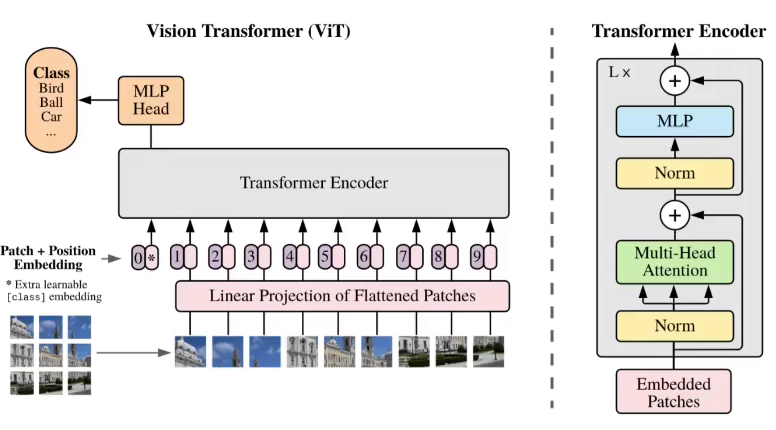

> Self-Attention might be view as dynamic convolution.

### Label Smoothing

For $K$ classes and smoothing factor $\varepsilon$:

- **correct class:**

$$
\tilde{y}_{\text{true}} = 1 - \varepsilon
$$

- **incorrect classes:**

$$
\tilde{y}_{i \neq \text{true}} = \frac{\varepsilon}{K - 1}
$$

$\to$ it penalizes overconfident predictions - acts as regularization on logits

### Stochastic Depth

- randomly drop entire **residual branches**
- identity shortcut is kept

For a residual block:

$$
x_{l+1} = x_l + f(x_l)
$$

With probability $p$:

$$
x_{l+1} = x_l
$$

With probability $1 - p$:

$$
x_{l+1} = x_l + \frac{f(x_l)}{1 - p}
$$

(to keep expected activations constant.)

- At **inference**: no dropping, full network is used.

## Swin Transformer

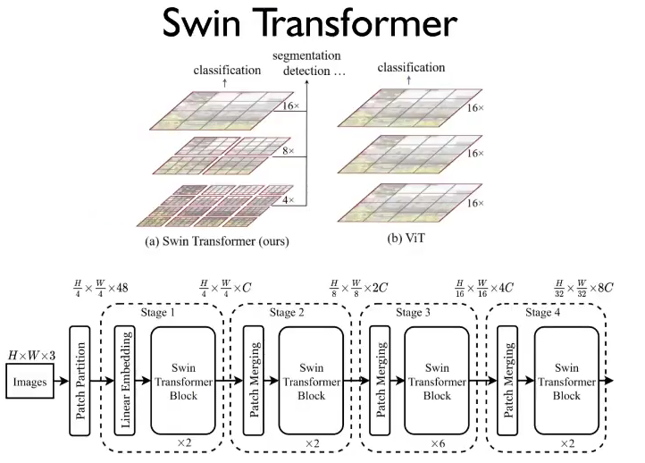

### Shifted Window Attention

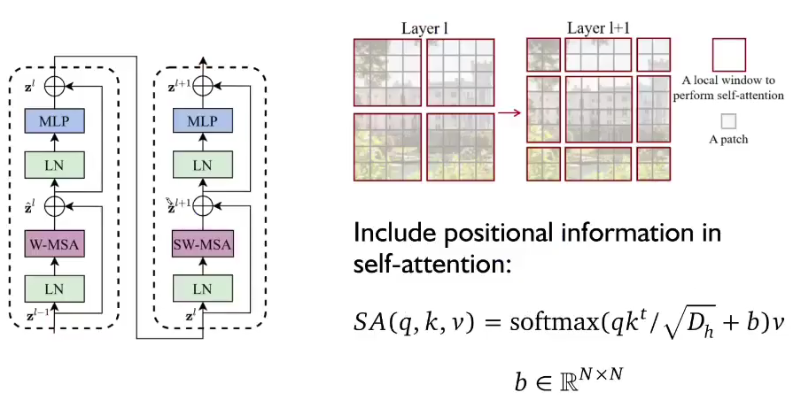

## ConvNeXt

Modernizes ResNets into a transformer-like fully CNN.

## MobileNetV4 (SOTA for Mobile)

Did a lot of architectures speed comparisons to find one that works ~well on all mobile devices (pixel, samsung, iphone, ...).

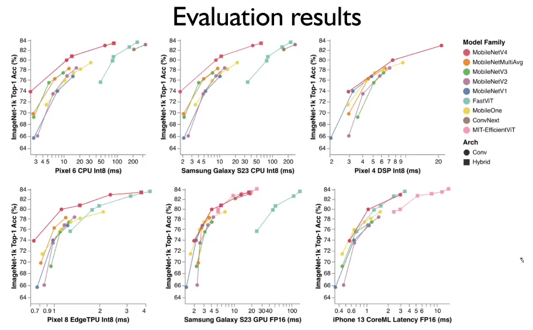

### Universal Inverted Bottleneck

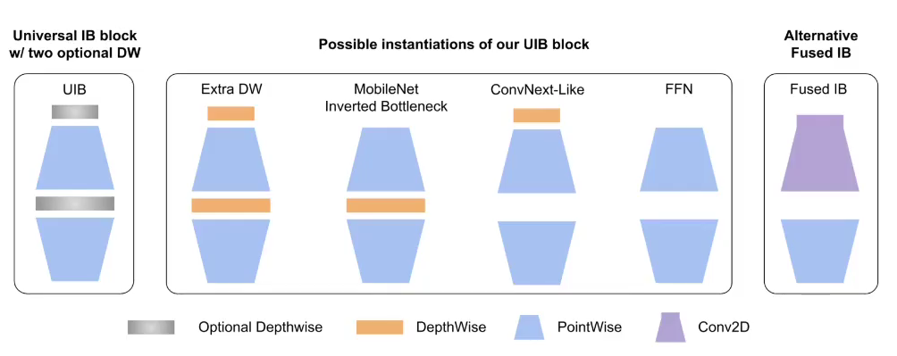

### Mobile MQA (Multi-Query-Attention)

All heads share the same Keys and Values but keep separate Queries.

Also, KV-cache helps (critical for mobile NPUs)!

# **Seminar 6**

## Class Mixup

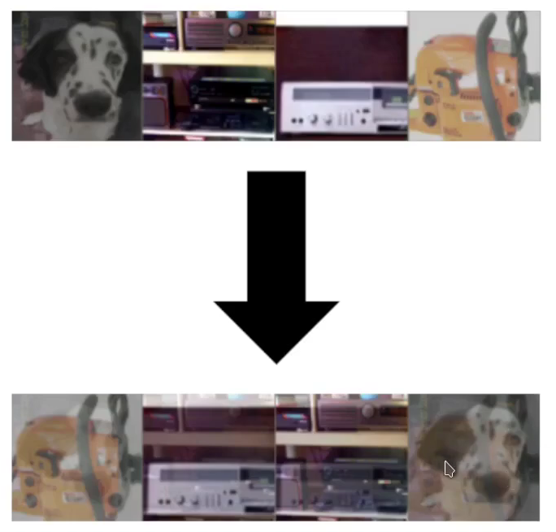

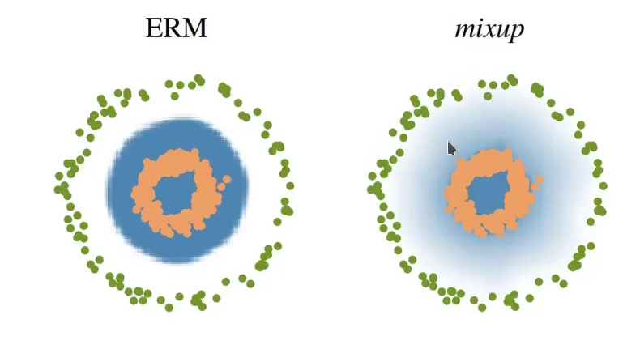

# **Lecture 7 - ...**

Skipped

# **Lecture 8 - Detection**

## Task Statement

### Object Detection

Output a set of **bounding boxes** with classes:

$$
\{(x_i, y_i, w_i, h_i, c_i)\}_{i=1}^N
$$

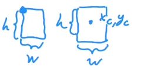

### IoU

IoU (Intersection over Union) is the overlap ratio between a predicted bounding box and the ground-truth box:

$$
\text{IoU}=\frac{\text{area}(B_{\text{pred}}\cap B_{\text{gt}})}{\text{area}(B_{\text{pred}}\cup B_{\text{gt}})}
$$

## R-CNN

### R-CNN

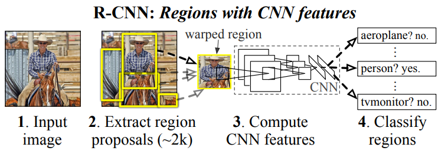

Do extraction of **RoI (Region of Interest)** using, for example, **Selective Search**:

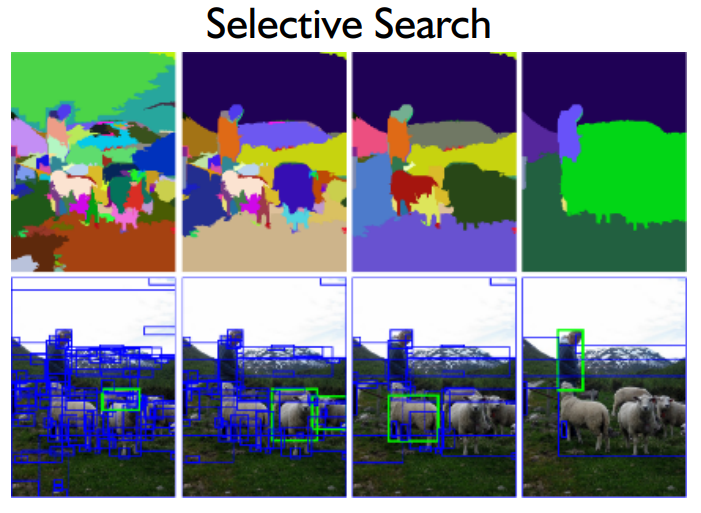

### Fast R-CNN

The full image is passed through a CNN _once_ to produce a convolutional feature map. Each RoI is then mapped onto this feature map and converted into a fixed-size feature tensor using RoI Pooling (by dividing the RoI into a grid and max-pooling per cell).

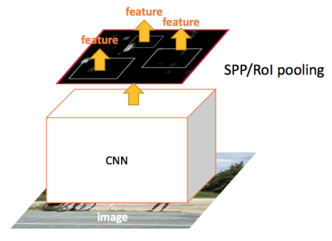

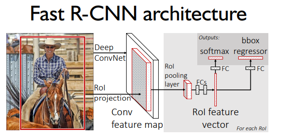

Using features compute class and bounding box (to refine RoI given before by Selective Search).

### Faster R-CNN

Replace slow external proposal methods (e.g., Selective Search) with a learned **Region Proposal Network (RPN)** that shares computation with the detector.

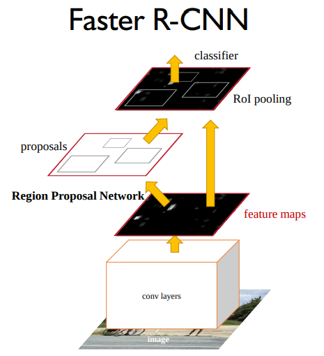

## YOLO (You Only Look Once)

1. Split image into grid of 7x7 cells
2. In parallel:
    1. For every cell predict two bboxes and P(Object)
    2. For every cell also predict P(Class)
3. Combine bboxes and class probabilities
4. Apply NMS and probability thresholding

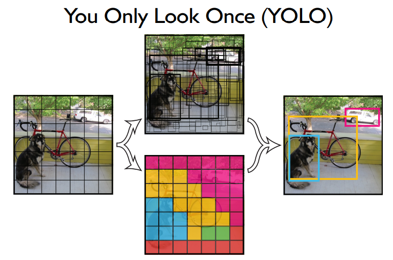

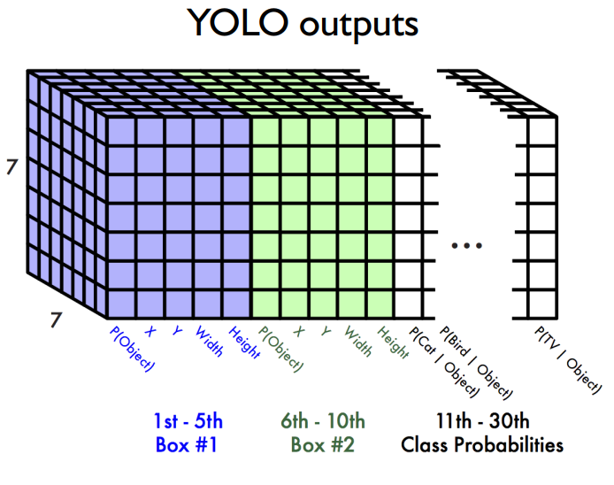

## RetinaNet

### Focal Loss

Down-weights easy examples so training focuses on hard
positives/negatives:

$$
\mathrm{FL}(p_t) = -\alpha (1 - p_t)^{\gamma}\log(p_t)
$$

- $\gamma > 0$ ("focusing parameter") reduces loss for well-classified examples (when $p_t$ is high)
- $\alpha$ balances positives vs negatives


## Anchor-Free Detection

### FCOS

For every pixel predict $(l, r, t, b)$.

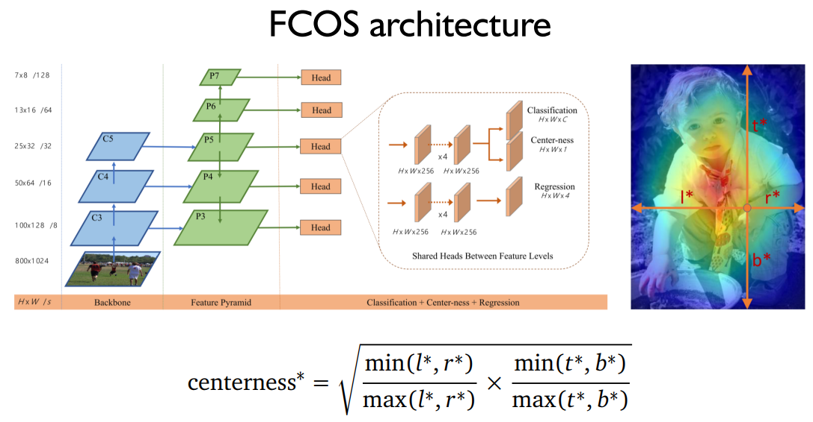

### DETR

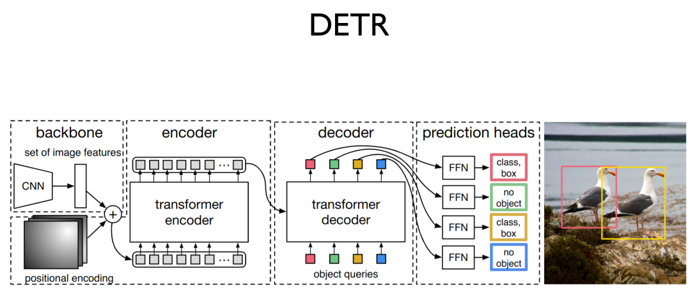

# **Lecture 9 - Segmentation**

## Overview

### “Things” vs “Stuff”

**Things** - countable objects with clear instances and boundaries (person, car, dog).

**Stuff** - uncountable/background regions without meaningful instances (road, sky, grass).

### Segmentation Types

**Semantic segmentation**: labels all pixels with a class (both things + stuff), but does not split thing instances (all persons share “person”).

**Instance segmentation**: detects and masks thing instances only (separate ID/mask per object). Stuff is usually ignored or handled separately.

**Panoptic segmentation**: labels all pixels; things get (class + instance ID), stuff get (class only). Every pixel is assigned exactly once.

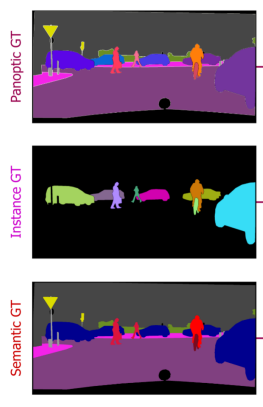

## Semantic Segmentation

### SegNet

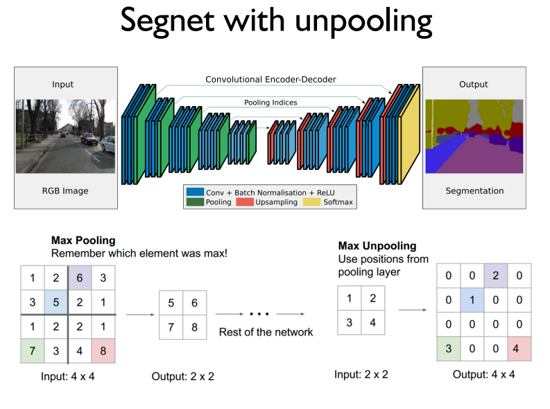

### DeconvNet

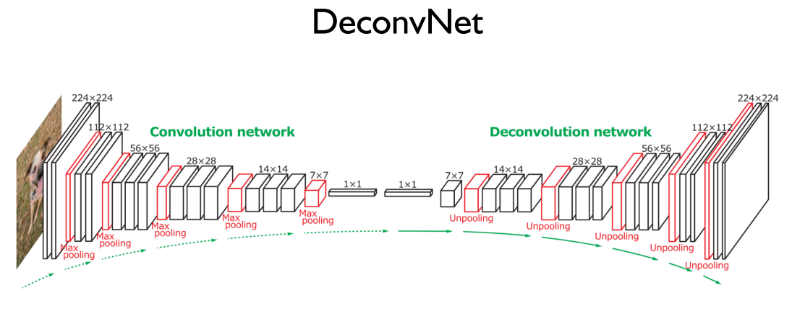

### U-Net

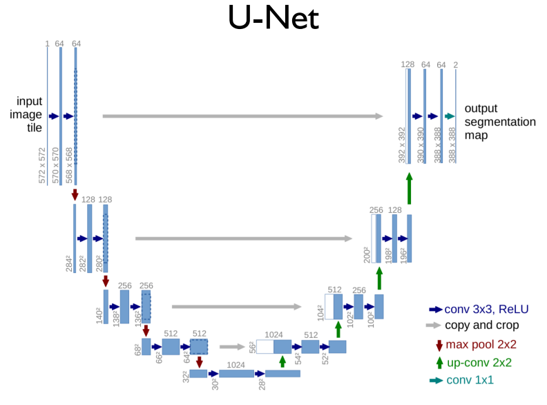

### Hourglass Network

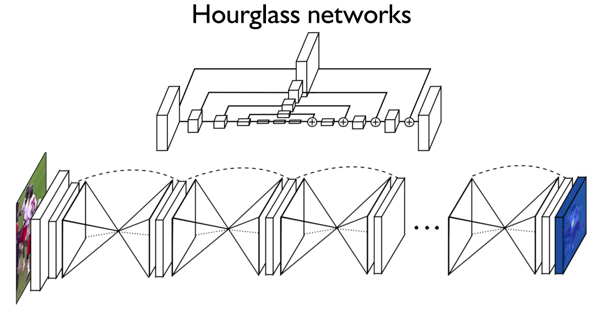

### HR-Net

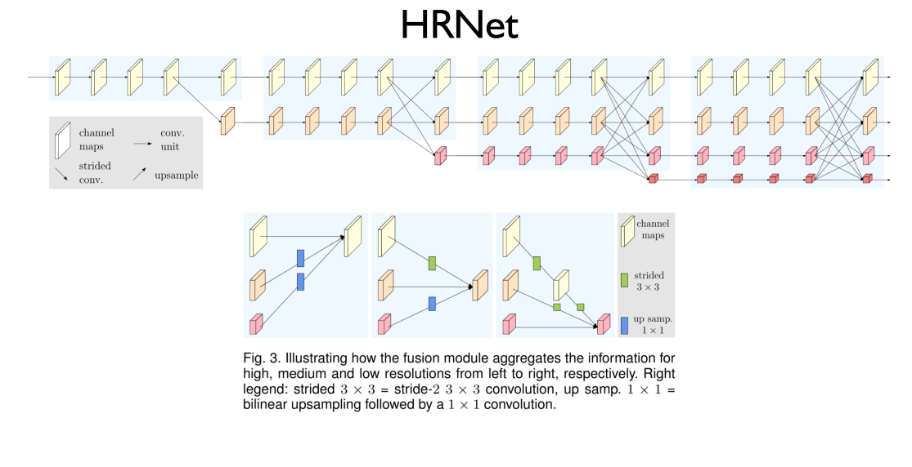

### SegFormer

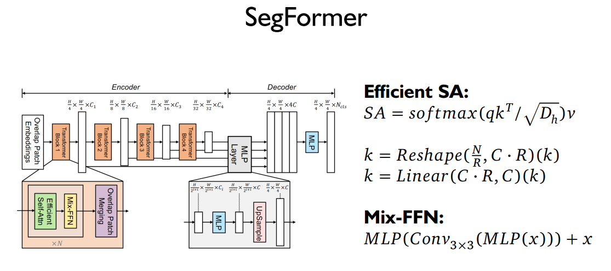

## Instance Segmentation

### Mask R-CNN

Mask R-CNN extends Faster R-CNN to do **instance segmentation**: for each detected object it outputs (1)
**class**, (2) **bounding box**, and (3) a **pixel-level mask**.

#### Three parallel heads per RoI

After extracting a fixed-size RoI feature:

- **Classification head**
- **Box regression head**
- **Mask head**: predicts a _binary mask_ for the object  :
  - **RoIAlign** extracts features for that RoI and the mask head predicts an $m \times m$ grid (often $28 \times 28$) that represents the object's shape _relative_ to bbox.
  - That $m \times m$ mask is then **upsampled** and warped back to the box size in the image.

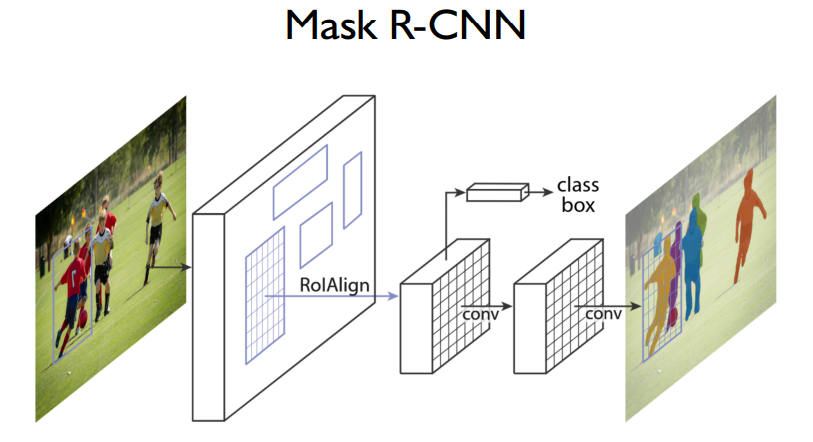

## Panoptic Segmentation

### Mask2Former

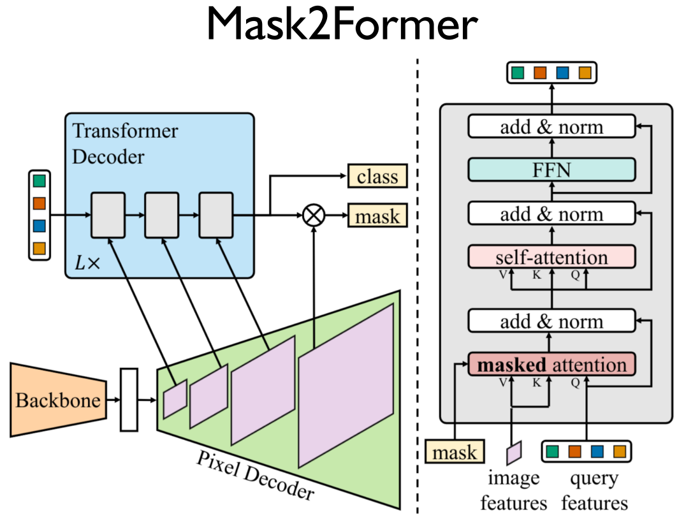

### OneFormer

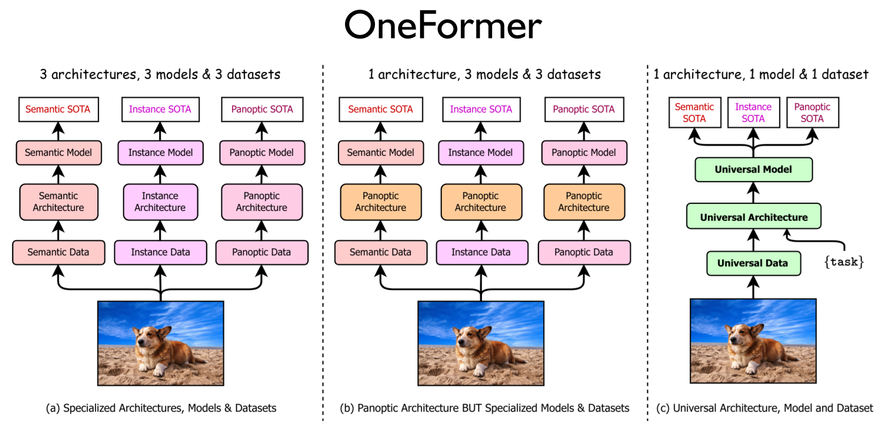

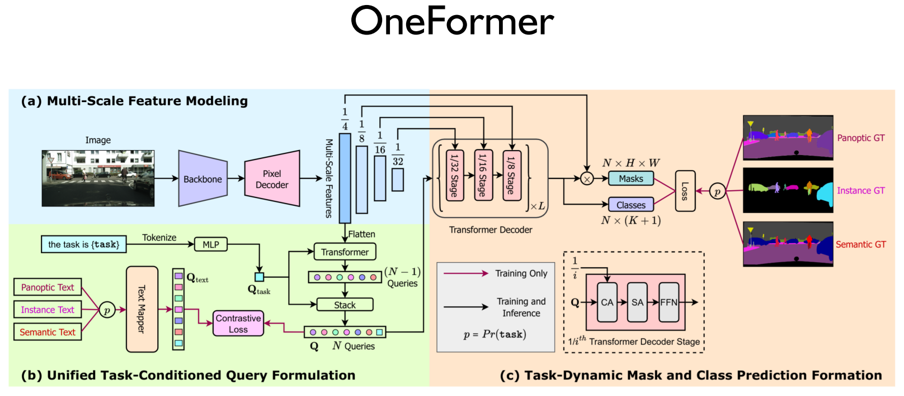
