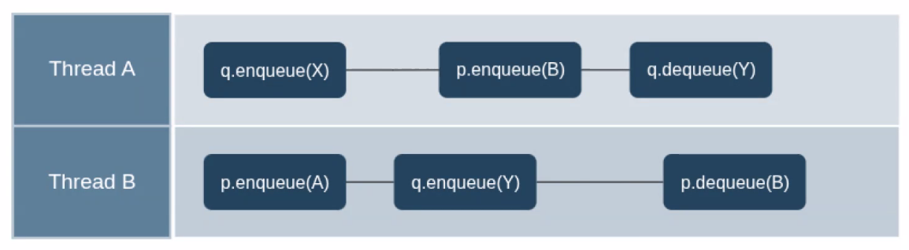
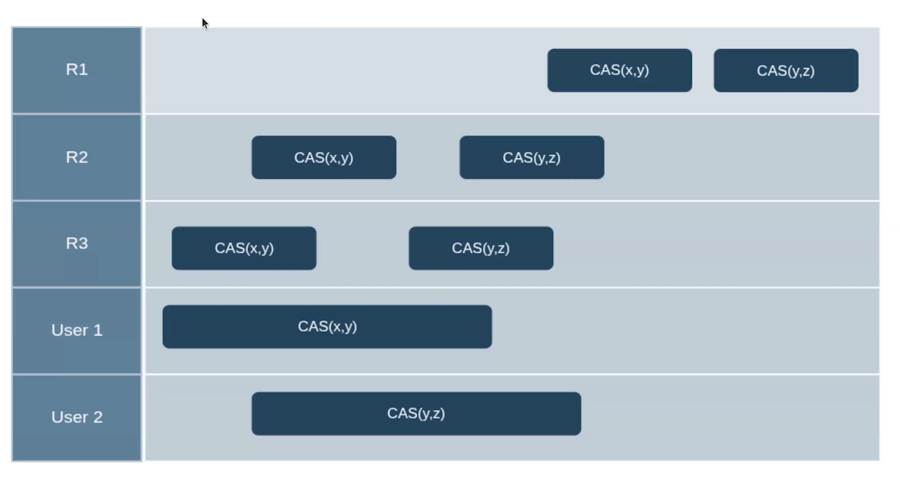
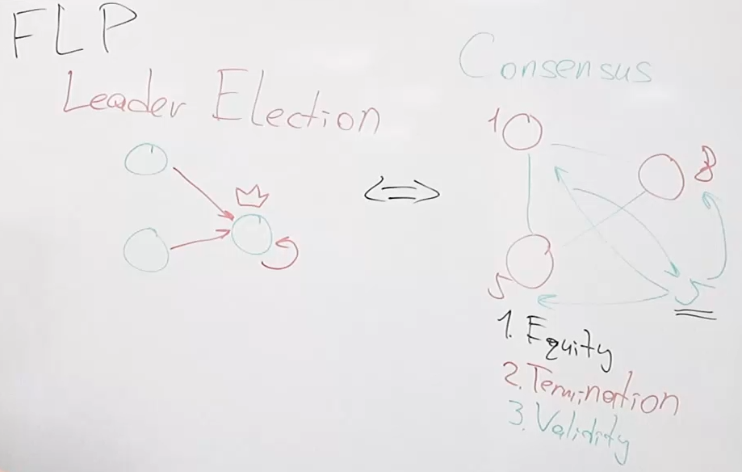
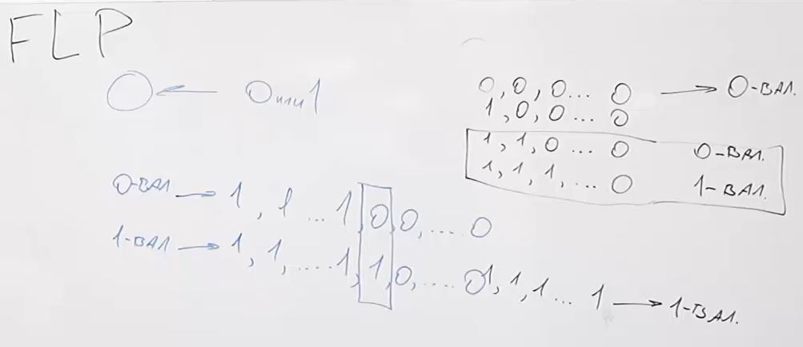

<!-- markdownlint-disable MD001, MD025 -->

# **Lecture 1 - Intro**

- **Consistency=Correctness** (safety): nothing “bad” happens.
- **Liveness** (progress): something “good” eventually happens.

**Linear/Concurrent history**.

Quiscent << Sequential << Linearizable

## Quiescent Consistency Model

QC enforces **correctness** (nothing for liveness) only at **quiescent points**, unlike linearizability which enforces it at every operation.

_Between_ quiescent points, operations may appear out of order, but once the system becomes quiescent, the visible state must match some _legal_ sequential execution.

## Sequential Consistency Model

**Total order** & **Order within thread**:  
all operations must appear in some sequential order that preserves the program order of each thread

### SC is weaker than Linearizability



This is “gray zone” of SC — _correctness_ is only judged at the _global level_, not per-object local histories.

> Non-**linearizable** history that is still sequentially consistent.

## Linearizable Consistency Model

**Linearizability** = atomic + respects **real-time order**.

## CAP Theorem

You can have max 2 out of 3:

- linearizability (Consistency)
- Availability - every request received must result in response by any _non-failing_ node
- asynchronous network (Partition tolerance - terribly mis-named)

> this theorem is very basic and constrained: [Please stop calling databases CP or AP](https://martin.kleppmann.com/2015/05/11/please-stop-calling-databases-cp-or-ap.html).

## [Latency Numbers Every Programmer Should Know](https://gist.github.com/jboner/2841832)

```txt
Latency Comparison Numbers (~2012)-------------------------------
L1 cache reference                           0.5 ns
Branch mispredict                            5   ns
L2 cache reference                           7   ns                      14x L1 cache
Mutex lock/unlock                           25   ns
Main memory reference                      100   ns                      20x L2 cache, 200x L1 cache
Compress 1K bytes with Zippy             3,000   ns        3 us
Send 1K bytes over 1 Gbps network       10,000   ns       10 us
Read 4K randomly from SSD*             150,000   ns      150 us          ~1GB/sec SSD
Read 1 MB sequentially from memory     250,000   ns      250 us
Round trip within same datacenter      500,000   ns      500 us
Read 1 MB sequentially from SSD*     1,000,000   ns    1,000 us    1 ms  ~1GB/sec SSD, 4X memory
Disk seek                           10,000,000   ns   10,000 us   10 ms  20x datacenter roundtrip
Read 1 MB sequentially from disk    20,000,000   ns   20,000 us   20 ms  80x memory, 20X SSD
Send packet CA->Netherlands->CA    150,000,000   ns  150,000 us  150 ms
```

# **Lecture 2 - Linearizable Register Constructing**

## Event Model

Each process $ p_i $ performs **operations**:  
  $ e_n = \text{write}(v) $ or $ e_m = \text{read}() $.

A **history** $ H $ — is a set of all events (invocations and responses) ordered by real time.

## Linearizability

A system is **linearizable** if there exists a total order of operations consistent with the **real-time order**.

$$
\forall\, e_1, e_2 \in H : \text{if } e_1.\text{response} < e_2.\text{invocation} \Rightarrow e_1 \prec e_2
$$

- Intuition: even though execution is distributed, the result must be **as if** all operations happened sequentially.

### Linearizable Shared Register

**Linearizable shared register** - replicated variable that behaves exactly like a single memory cell — every read sees the latest write, and all operations appear to occur instantly and in real-time order, even though the system is distributed.

## Theorem: Message Lifetime $\le$ Graph Diameter

**Statement:**  
In a reliable synchronous network $ G = (V, E) $ with diameter $ d(G) $,  
a message cannot "live" (i.e., propagate further) longer than $ d(G) $ rounds:

$$
\text{Lifetime}(m) \le d(G)
$$

$\to$ Consensus or register algorithms in synchronous settings have time complexity bounded by $ O(d(G)) $.

## Quorums

- **Write quorum** $ Q_w $, **Read quorum** $ Q_r $:
  $$
  Q_w, Q_r \subseteq V, \quad |Q_w| + |Q_r| > |V|
  $$
  Ensures intersection $ Q_w \cap Q_r \ne \emptyset $, providing **consistency**.

### Time Tracking

Each quorum stores:

- **timestamp** of the last write $ ts $,
- **value** $ v $.

When reading:

1. Contact all nodes in $ Q_r $.
2. Pick the value with the **max timestamp**.

When writing:

1. Query for max timestamp in $ Q_r $.
2. Write new value $ v' $ with timestamp $ ts' = \max(ts) + 1 $ to $ Q_w $.

## ABD Algorithm (Attiya–Bar-Noy–Dolev, 1995)

**Goal:**  
Emulate a **linearizable shared register** in an asynchronous message-passing system.

### System Model

- $ n $ nodes, reliable channels, asynchronous.
- Up to $ f < \frac{n}{2} $ crashes tolerated.

### Algorithm Sketch

**Write(v):**

1. Read phase: get highest $ (ts, v) $ from majority.
2. Write phase: send $ (ts+1, v) $ to majority.

**Read():**

1. Read phase: get highest $ (ts, v) $ from majority.
2. Write-back phase: re-write this pair to majority (ensures linearizability).

### Guarantees

- **Safety:** Linearizable.
- **Liveness:** Wait-free (as long as a quorum responds).

$$
Q_w \cap Q_r \neq \emptyset \to \text{no stale reads.}
$$

## DHTs (Distributed Hash Tables)

**DHT** — a **key–value store** distributed across nodes, supporting:

$$
\text{PUT}(key, value), \quad \text{GET}(key)
$$

Each key is mapped to one or several nodes by a hash function.

### N-Hot DHT

Each key is stored on **N replicas**:

$$
\text{Nodes} = \{ h_1(key), h_2(key), \dots, h_N(key) \}
$$

- Improves fault tolerance.
- Reads/writes can use quorum intersection logic similar to ABD.

**Example:**  
**Cassandra**, **DynamoDB** use N-hot replication (e.g., N=3, quorum R=2, W=2).

### Zero-Hop DHT

**Zero-Hop DHT**: every node knows the mapping of all keys (full membership view).  

$\to$ No intermediate routing — direct lookup.

[+] Constant lookup time $ O(1) $.  
[-] Poor scalability (membership table grows with $ O(N) $).

## ABD vs DHT

| Property | ABD Register | N-hot DHT | Zero-hop DHT |
|-----------|---------------|------------|---------------|
| Consistency | Linearizable | Eventual (or quorum) | Linearizable possible |
| Lookup time | $O(d(G))$ | $O(\log N)$ | $O(1)$ |
| Replication | Quorum-based | N replicas | Full map |
| Scalability | Medium | High | Low |

# **Lecture 3 - Extrapolation of ABD Algorithm**

## Atomic Broadcast

**Atomic Broadcast** (**Total Order Broadcast**) — a communication primitive ensuring that all non-faulty nodes deliver the same set of messages in the same order.

1. **Validity**  
   If a correct process broadcasts a message $ m $, then some correct process eventually delivers $ m $.

2. **Uniform Agreement**  
   If a process delivers $ m $, then every correct process eventually delivers $ m $.

3. **Uniform Integrity**  
   Each message is delivered **at most once**, and only if it was previously broadcast.

4. **Uniform Total Order**  
    $$
    \forall p_i, p_j : (p_i \text{ delivers } m_1 \text{ before } m_2)
    \to (p_j \text{ delivers } m_1 \text{ before } m_2)
    $$



## Consensus

Each process proposes a value $ v_i $.  
They must **agree on one common value** satisfying 3 properties:

1. **Validity**  
   The decided value must be one of the proposed ones.

   $$
   v_{\text{decided}} \in \{ v_i \mid \text{some process proposed } v_i \}
   $$

2. **Agreement (Safety)**  
   All non-faulty nodes agree on the same value.

3. **Termination (Liveness)**  
   Every correct process eventually decides some value.

### Atomic Broadcast $\equiv$ Consensus

- Consensus $\to$ Atomic Broadcast: decide the order of messages one by one.

- Atomic Broadcast $\to$ Consensus: agree to deliver a single message as the chosen proposal.

This equivalence is foundational for protocols like **Paxos**, **Raft**, and **Zab**.

## 3. KV-Storage Example: Dynamo

**Amazon Dynamo (2007)** — a key-value store based on **eventual consistency**, not strict linearizability.

### Design Principles

- **Partitioning:** consistent hashing over nodes.
- **Replication:** N-hot replication (key stored on N nodes).
- **Quorums:** $ R + W > N $ ensures read-write intersection.
- **Versioning:** vector clocks to track causality.
- **Reconciliation:** client-side conflict resolution.

# **Lecture 4 - FLP**

## Setting (FLP Impossibility Theorem)

### System model

- **Processes:**  
  A finite set of $ n \ge 2 $ deterministic processes $ P_1, \dots, P_n $.  

- **Communication:**  
  - Asynchronous message-passing system.  
  - Messages are delivered **reliably** (no loss, duplication, or corruption),  
    but with **unbounded delay** — there is _no upper bound_ on message transmission time.  
  - There is no global clock and no assumptions on relative process speeds.  
  - A message that is sent is _eventually delivered_ unless the recipient has crashed.

- **Failures:**  
  - At most **one crash failure** (a process may stop taking steps forever).  
  - No Byzantine (malicious) faults — just halting.

- **Determinism:**  
  - Processes are fully deterministic automata:  
    their next step depends only on their current state and received messages.  
  - No randomness, no nondeterministic branching.

### Consensus problem definition

Each process $ P_i $ starts with an **input value** $ v_i \in \{0,1\} $.  
They must decide on an **output value** $ d_i \in \{0,1\} $ satisfying the three standard properties:

1. **Termination:**  
   Every non-faulty process eventually decides on some value.

2. **Agreement:**  
   No two processes decide differently:  
   $$
   \forall i,j \quad d_i = d_j
   $$

3. **Validity:**  
   The decided value must be one of the initial values:  
   $$
   d_i \in \{v_1, \dots, v_n\}
   $$

### Adversarial scheduler

An **asynchronous adversary (scheduler)** controls message delivery and process scheduling:

- It can delay any message arbitrarily long.
- It can choose which process takes the next step.
- It may cause one process to crash at any time (stop forever).
- But it must respect reliability: any message sent to a live process will _eventually_ be delivered if the sender and receiver both keep running.

### Goal of FLP theorem

**Claim:**  
In this model, **no deterministic consensus algorithm** can guarantee all three properties (Termination, Agreement, Validity) if even **one process may crash**.

Formally:

There exists a fair execution (i.e., where all non-crashed processes take infinitely many steps and all messages are eventually delivered) such that **no process ever decides** — i.e., the system remains forever in a _bivalent_ (undecided) state.

### Key idea of the proof

- The system can start in a **bivalent configuration** (where both 0 and 1 are still possible decisions).
- Because communication is asynchronous, the adversary can always delay just the right message to _keep_ the system bivalent.
- Thus, the algorithm can be _forever indecisive_ — violating Termination, while still preserving Agreement and Validity.

#### Consensus & Leader Election



#### Bivalent State



## 1. Ben-Ora - Non-Determinism

Deterministic consensus is impossible (FLP), because an adversary can always keep the system in a bivalent state by delaying messages.

**Ben-Or’s trick**: introduce randomization so that even an adversary can’t predict all outcomes — eventually, by chance, all processes align on one value.

> You still cannot guarantee deterministic termination for all runs, but you can get consensus w.p. 1.

## 2. Paxos - Add timing (partial synchrony)

Once the system eventually behaves synchronously, deterministic consensus is possible.

# **Lecture 4.2 - Lock Service**

## Lock Service

...

## Google File System & Google Big Table

...

# **Lecture 5 - [Paxos](https://lamport.azurewebsites.net/pubs/paxos-simple.pdf)**
