<!-- markdownlint-disable MD024 MD025 -->

# > [2025-DGM-MIPT-YSDA-course](https://github.com/r-isachenko/2025-DGM-MIPT-YSDA-course)

# **Lecture 1 - Autoregressive Models**

## Generative Models

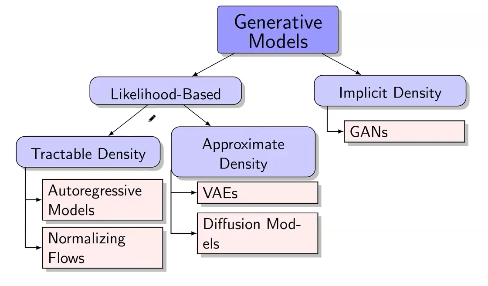

## CoV (Change of Variable) for Probabilities

If $ z = f(x) $, then

$$
p_X(x)
= p_Z(f(x)) \, \left| \det \frac{\partial f(x)}{\partial x} \right|
= p_Z(z) \, \big| \det J_f(x) \big|
$$

### Proof

For any Borel set $ A \subset \mathbb{R}^d $,

$$
\mathbb{P}(X \in A) = \mathbb{P}(Z \in f(A)).
$$

Using densities,

$$
\int_A p_X(x) \, dx
= \int_{f(A)} p_Z(z) \, dz.
$$

Apply the **multivariate change-of-variables** formula for integrals with
$z = f(x)$:

$$
\int_{f(A)} p_Z(z) \, dz
= \int_A p_Z(f(x)) \, \big| \det J_f(x) \big| \, dx.
$$

Since this holds for every Borel $A$, the integrands are equal almost everywhere:

$$
p_X(x)
= p_Z(f(x)) \, \big| \det J_f(x) \big|.
$$

## LOTUS (Law of Unconscious Statistician)

If $ \mathbf{Y} = f(x) $, then

$$
\mathbb{E}_{Y \sim p_Y}[g(Y)]
= \int_{\mathbb{R}^d} g(\mathbf{y}) \, p_Y(\mathbf{y}) \, d\mathbf{y}
= \int_{\mathbb{R}^d} g(f(x)) \, p_X(x) \, dx
= \mathbb{E}_{X \sim p_X}[g(f(X))]
$$

### Proof

2 CoVs: 1 multivariate & 1 for probabilites.

$$
\int_{\mathbb{R}^d} g(\mathbf{y}) \, p_Y(\mathbf{y}) \, d\mathbf{y} =
$$
$$
\int_{\mathbb{R}^d} g(\mathbf{y}) \, p_X(x) \big|\det J_f^{-1}(x) \big| \big|\det J_f(x) \big| \, dx =
$$
$$
\int_{\mathbb{R}^d} g(f(x)) \, p_X(x) \, dx
$$

## Dirac Delta Function

$$
\delta(x - a) =
\begin{cases}
0, & x \neq a \\
\infty, & x = a
\end{cases},
\quad
\int \delta(x - a) f(x) \, dx = f(a)
$$

Used to represent deterministic mappings:
$ p(x \mid z) = \delta(x - f_\theta(z)) $.

## Forward KL as MLE

$$
\mathrm{KL}(p_{\text{data}} \,\|\, p_\theta) =
$$

$$
\int p_{\text{data}}(x) \log \frac{p_{\text{data}}(x)}{p_\theta(x)} \, dx =
$$

$$
\int p_{\text{data}}(x) \log p_{\text{data}}(x) \, dx
- \int p_{\text{data}}(x) \log p_\theta(x) \, dx =
$$

$$
-\mathbb{E}_{p_{\text{data}}}[\log p_\theta(x)] + \text{const} \approx
$$

$$
-\frac{1}{n} \sum_{i=1}^n \log p_\theta(x_i) + \text{const} =
$$

$$
-\frac{1}{n} \log{L} + const \;\to\; \min_\theta
$$

MLE $\equiv$ minimizing forward $\mathrm{KL}$.

### Reverse KL

$$
\mathrm{KL}(p_\theta \,\|\, p_{\text{data}})
=
$$

$$
\int p_\theta(x) \log \frac{p_\theta(x)}{p_{\text{data}}(x)} \, dx =
$$

$$
\mathbb{E}_{p_\theta}[\log p_\theta(x) - \log p_{\text{data}}(x)] \;\to\; \min_\theta
$$

$\to$ can't simplify.

## Autoregressive Models

$$
p_\theta(x) = \prod_{j=1}^m p_\theta(x_j \mid x_{1:j-1}),
\quad
\log p_\theta(x) = \sum_{j=1}^m \log p_\theta(x_j \mid x_{1:j-1})
$$

### MLE for Autoregressive Models

$$
\theta^* = \arg\max_\theta
\sum_{i=1}^n \sum_{j=1}^m
\log p_\theta(x_{ij} \mid x_{i,1:j-1})
$$

Equivalent to next-step prediction.

### Sampling

$$
\hat{x}_1 \sim p_\theta(x_1), \quad
\hat{x}_2 \sim p_\theta(x_2 \mid \hat{x}_1), \quad
\dots, \quad
\hat{x}_m \sim p_\theta(x_m \mid \hat{x}_{1:m-1})
$$

The generated sample is $ \hat{x} = (\hat{x}_1, \hat{x}_2, \ldots, \hat{x}_m) $.

### PixelCNN

Autoregressive model for images.  
Each pixel conditioned on previous ones (in raster scan order).

### Limitations

- Loss of spatial structure  
- $ O(n^2) $ steps (for images) with $ O(n^2) $ attention per step $\to$ $ \sum_{i=1}^{n^2} i^2 = \frac{n^2 (n^2 + 1)(2n^2 + 1)}{6} = O(n^6) $
- No bidirectional structure

# **Lecture 2 - NF (Normalizing Flows)**

## Inverse Function Theorem (Jacobian Determinant)

If $f$ is **diffeomorphism** - invertible and its Jacobian is continuous and non-singular, then for $ z=f(x) $:

$$
J_{f^{-1}}(z) = \big(J_f(x)\big)^{-1},
\qquad
\left|\det J_{f^{-1}}(z)\right| = \frac{1}{\left|\det J_f(x)\right|}.
$$

In order $J$ to be invertable it needs to be squared $\to$ $\text{dim}(x) = \text{dim}(z)$.

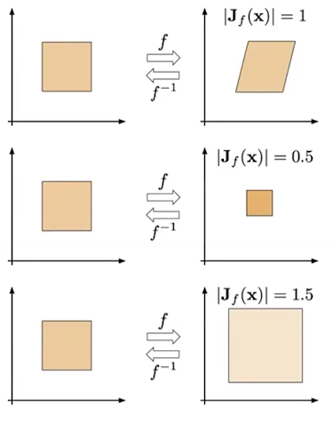

## Normalizing Flows

### Fitting Normalizing Flows

**Normalizing Flow** — differentiable, invertible mapping that transforms data $ x $ to latent noise $ z $.

By **CoV**:

$$
\log p_X(x) =
$$

$$
\log \left(
    p_Z(z) \left| \det\!\left(\frac{\partial z}{\partial x}\right) \right| \right) =
$$

$$
\log \left(
    p_Z\!\left(f_{\theta}(x)\right) \left| \det\!\left(\frac{\partial f_{\theta}(x)}{\partial x}\right) \right|
 \right) =
$$

$$
\log p_Z\!\left(f_{\theta}(x)\right)
+ \log \left|\det(J_{f_\theta})\right|
\;\to\; \max_{\theta}
$$

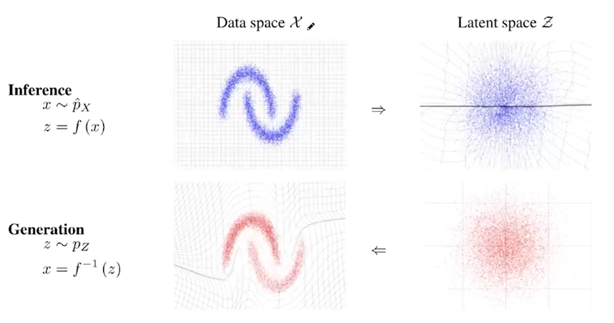

### Composition of Normalizing Flows

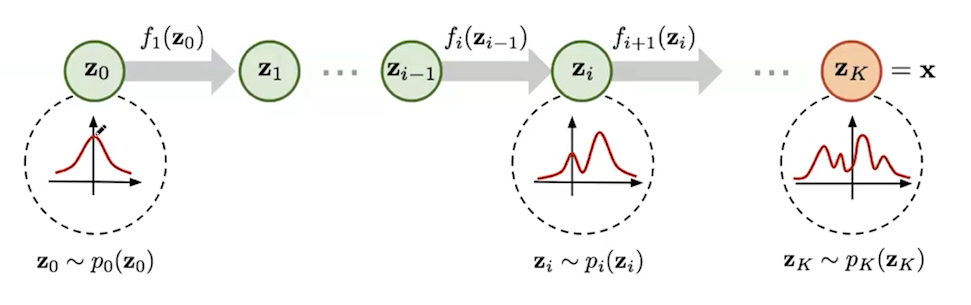

**Theorem:**  
If every $ \{ f_k \}_{k=1}^K $ satisfies the conditions of the change-of-variables theorem,  
then the composition $ f(x) = f_K \circ \ldots \circ f_1(x) $ also satisfies them.

$$
p_{X}(x)
= p_{Z_k}(f(x)) \left| \det\!\left( \frac{\partial f(x)}{\partial x} \right) \right|
= p_{Z_k}(f(x)) \left| \det\!\left( \frac{\partial f_K}{\partial f_{K-1}} \cdots \frac{\partial f_1}{\partial x} \right) \right|
$$

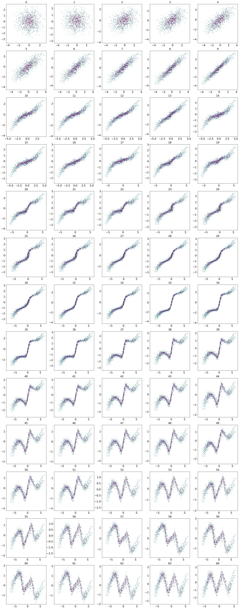

## NF Examples: 1. Linear NF

Simplest flow: linear transformation

$$
z = f(x) = Ax + \mathbf{b}, \quad A \in \mathbb{R}^{n\times n}
$$

Then

$$
\log p_{\theta}(x) = \log p(Ax + \mathbf{b}) + \log|\det A|
$$

Efficient if $ \det(A) $ is easy to compute.

### LU Decomposition

Decompose $ A = LU $,  
where $ L $ — lower-triangular with 1s on diagonal, $ U $ — upper-triangular.  
Then:

$$
\log|\det A| = \sum_i \log|U_{ii}|
$$

Efficient: $ O(n) $ determinant and easy inverse.

### QR Decomposition

Decompose $ A = QR $,  
$ Q $ orthogonal ($ \det Q = \pm1 $), $ R $ upper-triangular.  
Then:

$$
\log|\det A| = \log|\det R| = \sum_i \log|R_{ii}|
$$

Often used to stabilize flow training.

## NF Examples: 2. Gaussian Autoregressive NF

For each dimension $ i $:

$$
z_i = \frac{x_i - \mu_i(x_{1:i-1})}{\sigma_i(x_{1:i-1})}
\quad \to \quad
x_i = \mu_i(z_{1:i-1}) + \sigma_i(z_{1:i-1}) \, z_i
$$

This defines an invertible autoregressive transformation.

Jacobian is triangular $\to$
$\log|\det J_{f_\theta}| = -\sum_i \log \sigma_i(x_{1:i-1})$

Implemented in **MAF** (Masked Autoregressive Flow) and **IAF** (Inverse Autoregressive Flow).

## NF Examples: 3. Coupling Layer (RealNVP)

$$
x = [x_1, x_2] = [x_{1:d}, x_{d+1:m}],
$$

$$
z = [z_1, z_2] = [z_{1:d}, z_{d+1:m}]
$$

$$
\begin{cases}
x_1 = z_1 \\
x_2 = z_2 \odot \sigma_\theta(z_1) + \mu_\theta(z_1)
\end{cases}
\qquad
\begin{cases}
z_1 = x_1 \\
z_2 = (x_2 - \mu_\theta(x_1)) \odot \frac{1}{\sigma_\theta(x_1)}
\end{cases}
$$

Jacobian is block-triangular:

$$
\det\!\left( \frac{\partial z}{\partial x} \right)
= \det\!\begin{pmatrix}
I_d & 0_{d \times (m-d)} \\
\frac{\partial z_2}{\partial x_1} & \frac{\partial z_2}{\partial x_2}
\end{pmatrix}
= \prod_{j=1}^{m-d} \frac{1}{\sigma_{j,\theta}(x_1)}.
$$

Efficient, invertible, scalable — basis for **RealNVP** and **Glow** architectures.

# **Lecture 3 - VAE (Variational AutoEncoders)**

> In NF latent variable $z$ was translated into $x$, but in LVM $z$ is translated into $p(x | z)$ (whole distribution).

## MLE Problem

$$
\theta^* = \arg\max_{\theta} p_{\theta}(x) = \arg\max_{\theta} \prod_{i=1}^{n} p_{\theta}(x_i) = \arg\max_{\theta} \sum_{i=1}^{n} \log p_{\theta}(x_i).
$$

The distribution $ p_{\theta}(x) $ can be highly **complex and often intractable** (just like the true data distribution $ p_{\text{data}}(x) $).

## Extended Probabilistic Model

Introduce a latent variable $ z $ for each observed sample $ x $:

$$
p_{\theta}(x) = \int p_{\theta}(x, z) dz = \int p_{\theta}(x|z) p(z) dz = \mathbb{E}_{p(z)}[p_{\theta}(x|z)].
$$

Both $ p_{\theta}(x|z) $ and $ p(z) $ are usually much simpler than $ p_{\theta}(x) $.

### Naive Monte Carlo Estimation

$$
\log p_{\theta}(x) = \log \mathbb{E}_{p(z)}[p_{\theta}(x|z)]
\ge \mathbb{E}_{p(z)}[\log p_{\theta}(x|z)]
\approx \frac{1}{K} \sum_{k=1}^{K} \log p_{\theta}(x|z_k), \quad z_k \sim p(z)
$$.

#### **Problem**

As the dimensionality of $ z $ increases, the number of samples $K$ needed to adequately cover the latent space grows exponentially.

## ELBo (Evidence Lower Bound)

### Inequality Derivation

$$
\log p_{\theta}(x) =
\log \int p_{\theta}(x, z) dz =
\log \int \frac{q(z)}{q(z)} p_{\theta}(x, z) dz =
$$
$$
= \log \mathbb{E}_{q} \!\left[ \frac{p_{\theta}(x, z)}{q(z)} \right] \ge
\mathbb{E}_{q} \log \frac{p_{\theta}(x, z)}{q(z)} =
\int q(z) \log \frac{p_{\theta}(x, z)}{q(z)} dz =
\mathcal{L}_{q,\theta}(x) \leftarrow  \text{ELBo}
$$

- Here, $ q(z) $ is any distribution such that $ \int q(z) dz = 1 $.
- We assume that $ \mathrm{supp}(q(z)) = \mathrm{supp}(p_{\theta}(z|x)) = \mathbb{R}^d $.

### Equality Derivation

$$
\mathcal{L}_{q,\theta}(x) =
$$

$$
= \int q(z) \log \frac{p_{\theta}(x, z)}{q(z)} dz =
$$

$$
= \int q(z) \log \frac{p_{\theta}(z|x) p_{\theta}(x)}{q(z)} dz =
$$

$$
= \log p_{\theta}(x) \cdot \int q(z) dz + \int q(z) \log \frac{p_{\theta}(z|x)}{q(z)} dz  =
$$
$$
= \log p_{\theta}(x) - \mathrm{KL}(q(z) \| p_{\theta}(z|x))
$$

### Log-Likelihood Decomposition

$$
\log p_{\theta}(x)
= \mathcal{L}_{q,\theta}(x) + \mathrm{KL}(q(z) \| p_{\theta}(z|x)),
$$

where
$$
\mathcal{L}_{q,\theta}(x) =
\mathbb{E}_{q} \log p_{\theta}(x|z) - \mathrm{KL}(q(z) \| p(z))
$$

- Instead of maximizing the likelihood, maximize the **ELBO**:

    $$
    \max_{\theta} p_{\theta}(x)
    \;\;\to\;\;
    \max_{q, \theta} \mathcal{L}_{q,\theta}(x)
    $$

## Amortized Inference

### Variational Posterior

$$
    q(z) = \arg \max_q \mathcal{L}_{q, \theta^*}(x)
    = \arg \min_q \mathrm{KL}(q \| p_{\theta^*}) = p_{\theta^*}(z | x)
$$

- $ p_{\theta^*}(z|x) $ may be **intractable**;
- $ q(z) $ is **individual for each data point** $ x $.

**Intuition**: each $ q(z) $ ("each", because we have $q$ for each $x$) estimates the posterior $ p_{\theta^*}(z|x) $ (note, having $\theta^*$).

### Amortized Variational Inference

We restrict the family of possible distributions $ q(z) $ to a parametric class $ q_\phi(z|x) $ (later, $N(\mu_\phi(x), \Sigma_\phi^2(x))$), **conditioned on data** $ x $ and **parameterized by** $ \phi $.

$$
\mathcal{L}_{\phi, \theta}(x) =
\int q_\phi(z|x) \log p_\theta(x|z) dz -
\mathrm{KL}(q_\phi(z|x) \| p(z))
$$

- $ q_\phi(z|x) = \text{NN}_\phi(x) $, the **encoder** - ResNet of `nn.Conv*d`

- $ p_\theta(x|z) = \text{NN}_\theta(z) $, the **decoder** - ResNet of `nn.Conv*d_transpose`

## ELBo Gradients

### Gradient Update

$$
    \begin{bmatrix}
    \phi_k \\
    \theta_k
    \end{bmatrix}
    =
    \begin{bmatrix}
    \phi_{k-1} + \eta \cdot \nabla_\phi \mathcal{L}_{\phi, \theta}(x) \\
    \theta_{k-1} + \eta \cdot \nabla_\theta \mathcal{L}_{\phi, \theta}(x)
    \end{bmatrix}
    \Bigg|_{(\phi_{k-1}, \theta_{k-1})}
$$

- $ \phi $ denotes the parameters of the variational posterior $ q_\phi(z|x) $
- $ \theta $ represents the parameters of the generative model $ p_\theta(x|z) $

## 1. Gradient $ \nabla_\theta \mathcal{L}_{\phi, \theta}(x) $

$$
\nabla_\theta \mathcal{L}_{\phi, \theta}(x) = \nabla_\theta \int q_\phi(z|x) \log p_\theta(x|z) dz
$$

$$
= \int q_\phi(z|x) \nabla_\theta \log p_\theta(x|z) dz
$$

$$
    \approx \nabla_\theta \log p_\theta(x|z^*), \quad z^* \sim q_\phi(z|x)
$$

$q_\phi(z|x)$ is much more narrow than $p(z)$ from "Naive Monte Carlo Estimation" part $\to$ we can sample.

## 2. Gradient $ \nabla_\phi \mathcal{L}_{\phi, \theta}(x) $

Unlike the $ \theta $-gradient, the density $ q_\phi(z|x) $
now depends on $ \phi $, so standard Monte Carlo estimation _can’t_ be applied:

$$
\nabla_\phi \mathcal{L}_{\phi, \theta}(x)
= \nabla_\phi \int q_\phi(z|x) \log p_\theta(x|z) dz - \nabla_\phi \mathrm{KL}(q_\phi(z|x) \| p(z))
$$

$$
\ne \int q_\phi(z|x) \nabla_\phi \log p_\theta(x|z) dz - \nabla_\phi \mathrm{KL}(q_\phi(z|x) \| p(z))
$$

### Reparametrization Trick (LOTUS Trick)

$$
\nabla_\phi \int q_\phi(z|x) f(z) dz
= \nabla_\phi \int p(\boldsymbol{\epsilon}) f(\mathbf{g}_\phi(x, \boldsymbol{\epsilon})) d\boldsymbol{\epsilon}
$$

$$
= \int p(\boldsymbol{\epsilon}) \nabla_\phi f(\mathbf{g}_\phi(x, \boldsymbol{\epsilon})) d\boldsymbol{\epsilon}
\approx \nabla_\phi f(\mathbf{g}_\phi(x, \boldsymbol{\epsilon})), \quad
\boldsymbol{\epsilon} \sim p(\boldsymbol{\epsilon})
$$

### Variational Assumption

$$
p(\boldsymbol{\epsilon}) = \mathcal{N}(0, \mathbf{I}); \quad
z = \mathbf{g}_\phi(x, \boldsymbol{\epsilon}) =
\Sigma_\phi(x) \odot \boldsymbol{\epsilon} + \mu_\phi(x);
$$

$$
q_\phi(z|x) = \mathcal{N}(\mu_\phi(x), \Sigma_\phi^2(x))
$$

Here, $ \mu_\phi(\cdot) $ and $ \Sigma_\phi(\cdot) $ are parameterized functions (outputs of a neural network).  

### 1. Reconstruction Term

$$
\nabla_\phi \int q_\phi(z|x) \log p_\theta(x|z) dz
= \int p(\boldsymbol{\epsilon}) \nabla_\phi
\log p_\theta(x|\mathbf{g}_\phi(x, \boldsymbol{\epsilon})) d\boldsymbol{\epsilon}
$$

$$
\approx \nabla_\phi \log p_\theta(x|
\Sigma_\phi(x) \odot \boldsymbol{\epsilon} + \mu_\phi(x)),
\quad \boldsymbol{\epsilon} \sim \mathcal{N}(0, \mathbf{I})
$$

### 2. KL Term

$ p(z) $ is the prior over latents $ z $, typically $ p(z) = \mathcal{N}(0, \mathbf{I}) $.

$$
\nabla_\phi \mathrm{KL}(q_\phi(z|x) \| p(z))
= \nabla_\phi \mathrm{KL}(\mathcal{N}(\mu_\phi(x), \Sigma_\phi^2(x)) \| \mathcal{N}(0, \mathbf{I}))
$$

This expression admits a **closed-form analytic solution**.

## VAE (Variational AutoEncoder)

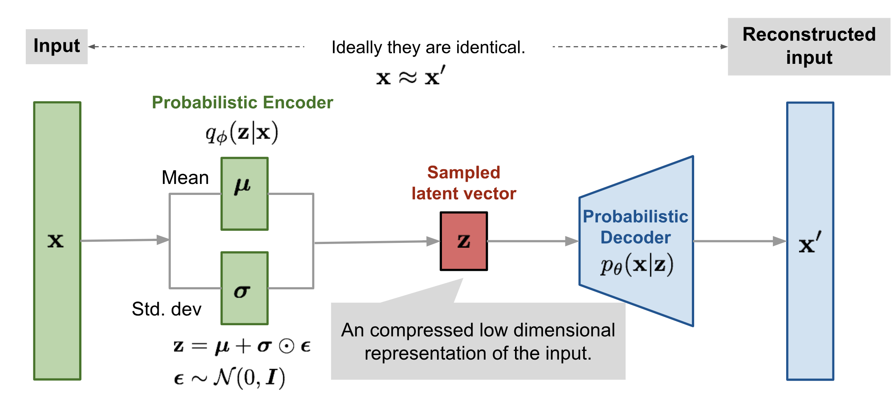

### Training

- Pick a batch of samples $ \{ x_i \}_{i=1}^B $ (here we use Monte Carlo technique).
- Compute the objective for each sample (apply the reparametrization trick):

$$
    \boldsymbol{\epsilon}^* \sim p(\boldsymbol{\epsilon}); \quad
    z^* = \mathbf{g}_\phi(x, \boldsymbol{\epsilon}^*);
$$

$$
\mathcal{L}_{\phi, \theta}(x)
\approx \log p_\theta(x|z^*) -
\mathrm{KL}(q_\phi(z|x) \| p(z)).
$$

- Update parameters via stochastic gradient steps with respect to $ \phi $ and $ \theta $.

### Inference

- Sample $ z^* $ from the prior $ p(z) $ ($ \mathcal{N}(0, \mathbf{I}) $);
- Generate data from the decoder $ p_\theta(x|z^*) $.

**Note:**  
The encoder $ q_\phi(z|x) $ isn’t needed during inference.

# **Lecture 4.1 - VQ-VAE (Vector Quantized VAE)**

## Discrete VAE Latent

### Assumptions

- Let $ c \sim \mathrm{Categorical}(\boldsymbol{\pi}) $, where  
  $$
  \boldsymbol{\pi} = (\pi_1, \ldots, \pi_K), \quad \pi_k = P(c = k), \quad \sum_{k=1}^K \pi_k = 1.
  $$

- Suppose the VAE adopts a discrete latent variable $ c $ with prior  
  $$
  p(c) = \mathrm{Uniform}\{1, \ldots, K\}.
  $$

### ELBO

$$
    \mathcal{L}_{\phi, \theta}(x) = \mathbb{E}_{q_\phi(c|x)} \log p_\theta(x|c)
    - \mathrm{KL}(q_\phi(c|x) \| p(c)) \;\to\; \max_{\phi, \theta}.
$$

#### **KL Term Simplifiaction**

$$
\mathrm{KL}(q_\phi(c|x) \| p(c)) =
$$

$$
= \sum_{k=1}^K q_\phi(k|x) \log \frac{q_\phi(k|x)}{p(k)} =
$$

$$
    = \sum_{k=1}^K q_\phi(k|x) \log q_\phi(k|x)
    - \sum_{k=1}^K q_\phi(k|x) \log p(k) =
$$

$$
= -\mathcal{H}(q_\phi(c|x)) + \log K.
$$

### Vector Quantization

Define the codebook (dictionary) space $\{ \mathbf{e}_k \}_{k=1}^K$ with $\mathbf{e}_k \in \mathbb{R}^L$.

#### **Quantized Representation**

$\forall z \in \mathbb{R}^L$ nearest-neighbor lookup $z_k$ in the codebook:

$$
    z_q = \mathbf{q}(z) = \mathbf{e}_{k^*}, \quad \text{where } k^* = \arg\min_k \|z - \mathbf{e}_k\|.
$$

#### **Quantization Procedure**

If the encoded tensor has spatial dimensions, quantization is independently applied to each of the $W \times H$ locations.

$\to$ $K^{H' \cdot W'}$ initial latent states.

### Deterministic Variational Posterior

$$
    q_\phi(c = k^* | x) =
    \begin{cases}
    1, & \text{for } k^* = \arg\min_k \|z_e - \mathbf{e}_k\|, \\
    0, & \text{otherwise.}
    \end{cases}
$$

$\to$ entropy $\mathcal{H} = 0$:

$$
\mathrm{KL}(q_\phi(c|x) \| p(c))
= -\mathcal{H}(q_\phi(c|x)) + \log K = \log K.
$$

### Straight-Through Gradient Estimator

$$
\mathcal{L}_{\phi, \theta}(x) =
\mathbb{E}_{q_\phi(c|x)} \log p_\theta(x|\mathbf{e}_c) - \log K
= \log p_\theta(x|z_q) - \log K,
$$

#### **Problem**

The $\argmin$ operation is non-differentiable.

#### **Solution**

$$
\frac{\partial \log p(x | z_q, \theta)}{\partial \phi}
= \frac{\partial \log p_\theta(x | z_q)}{\partial z_q}
\cdot \frac{\partial z_q}{\partial \phi} =
$$

$$
= \frac{\partial \log p_\theta(x | z_q)}{\partial z_q}
\cdot \frac{\partial z_q}{\partial z_e}
\cdot \frac{\partial z_e}{\partial \phi}
\approx
\frac{\partial \log p_\theta(x | z_q)}{\partial z_q}
\cdot \frac{\partial z_e}{\partial \phi}
$$

## VQ-VAE (Vector Quantized VAE) - Algorithm

### Training

- **Vector-quantize** (per spatial location if applicable):
    $$
    k^* = \arg\min_k \| z_e - \mathbf{e}_k \|_2, \quad
    z_q = \mathbf{e}_{k^*}, \quad
    z_e = \mathrm{NN}_{e, \phi}(x).
    $$

- **Compute ELBO objective:**
    $$
    \mathcal{L}_{\phi, \theta}(x) = \log p_\theta(x | z_q) - \log K.
    $$

- **Compute total loss** with codebook and commitment losses (with stop-gradient `sg[·]`):
    $$
    \mathcal{L}
    = -\mathcal{L}_{\phi, \theta}(x)
    + \| \mathrm{sg}[z_e] - \mathbf{e}_{k^*} \|_2^2
    + \beta \| z_e - \mathrm{sg}[\mathbf{e}_{k^*}] \|_2^2
    $$

- **Use straight-through gradient estimation** for encoder.

### Sampling

- Sample $ c \sim p(c) = \mathrm{Uniform}\{1, \ldots, K\} $.
- Generate $ x \sim p_\theta(x | \mathbf{e}_c) $.

# **Lecture 4.2 - ELBo Surgery**

## KL Term Surgery

$$
    \frac{1}{n} \sum_{i=1}^n \mathcal{L}_{\phi, \theta}(x_i)
    = \frac{1}{n} \sum_{i=1}^n
    \left[
    \mathbb{E}_{q_\phi(z|x_i)} \log p_\theta(x_i|z)
    - \mathrm{KL}(q_\phi(z|x_i) \| p(z))
    \right].
$$

Let:

- $ q_{\text{agg}, \phi}(z) = \frac{1}{n} \sum_{i=1}^n q_\phi(z|x_i) $ is the **aggregated variational posterior**

- $\mathbb{I}_q[x, z]$ is the **mutual information** between $x$ and $z$ under the data distribution $p_{\text{data}}(x)$ and $q_\phi(z|x)$.

$$
\frac{1}{n} \sum_{i=1}^n \mathrm{KL}(q_\phi(z|x_i) \| p(z)) =
$$

$$
= \frac{1}{n} \sum_{i=1}^n \int q_\phi(z|x_i)
\log \frac{q_\phi(z|x_i)}{p(z)} dz =
$$

$$
= \frac{1}{n} \sum_{i=1}^n \int q_\phi(z|x_i)
\log \frac{q_{\text{agg}, \phi}(z) q_\phi(z|x_i)}
{p(z) q_{\text{agg}, \phi}(z)} dz =
$$

$$
    = \int \frac{1}{n} \sum_{i=1}^n q_\phi(z|x_i)
    \log \frac{q_{\text{agg}, \phi}(z)}{p(z)} dz
    + \frac{1}{n} \sum_{i=1}^n \int q_\phi(z|x_i)
    \log \frac{q_\phi(z|x_i)}{q_{\text{agg}, \phi}(z)} dz =
$$

$$
    = \mathrm{KL}(q_{\text{agg}, \phi}(z) \| p(z))
    + \frac{1}{n} \sum_{i=1}^n
    \mathrm{KL}(q_\phi(z|x_i) \| q_{\text{agg}, \phi}(z)) =
$$

$$
= \mathrm{KL}(q_{\text{agg}, \phi}(z) \| p(z)) + \mathbb{I}_q[x, z]
$$

- The **first term** encourages $q_{\text{agg}, \phi}(z)$ to match the prior $p(z)$.
- The **second term** reduces the information about $x$ encoded in $z$.

## Prior Distribution

$$
    \frac{1}{n} \sum_{i=1}^n \mathcal{L}_{\phi, \theta}(x_i)
    =
$$

$$
    = \frac{1}{n} \sum_{i=1}^n
    \left[
    \mathbb{E}_{q_\phi(z|x_i)} \log p_\theta(x_i|z)
    - \mathrm{KL}(q_\phi(z|x_i) \| \textcolor{blue}{p(z)})
    \right] =
$$

$$
    = \frac{1}{n} \sum_{i=1}^n
    \mathbb{E}_{q_\phi(z|x_i)} \log p_\theta(x_i|z)
    - \mathbb{I}_q[x, z]
    - \mathrm{KL}(q_{\text{agg}, \phi}(z) \| \textcolor{blue}{p(z)}).
$$

$$
\text{Reconstruction Loss} \quad
-\quad \text{Mutual Information} \quad
-\quad \text{Marginal KL.}
$$

The prior distribution $\textcolor{blue}{p(z)}$ only appears in the last term.

### Optimal VAE Prior

$$
\mathrm{KL}(q_{\text{agg}, \phi}(z) \| p(z)) = 0
\quad \Longleftrightarrow \quad
p(z) = q_{\text{agg}, \phi}(z)
= \frac{1}{n} \sum_{i=1}^n q_\phi(z|x_i).
$$

Hence, the **optimal prior** $p(z)$ is the **aggregated variational posterior** $q_{\text{agg}, \phi}(z)$.

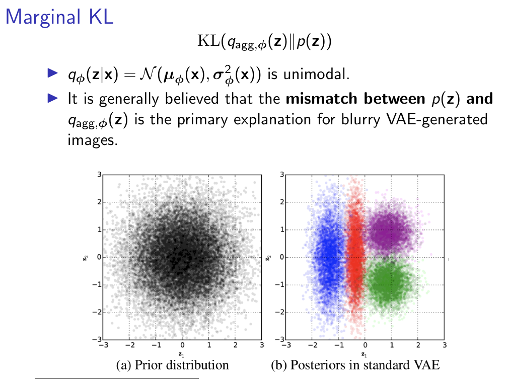

## NF-Based VAE Prior

- Standard Gaussian prior $ p(z) = \mathcal{N}(0, \mathbf{I}) $ often leads to **over-regularization**.

- Aggregated posterior as the prior $p(z) = q_{\text{agg}, \phi}(z) = \frac{1}{n} \sum_{i=1}^n q_\phi(z|x_i) $ risks **overfitting** and incurs _high computational cost_.

$\to$ use **Normalizing Flows** within latent space.

## Posterior Collapse

The decoder is so powerful, that it learned $p_{data}$ itself and doesn't need $z$: $\mathbb{E}_{q_\phi(z|x)} \log_{p_\theta}{x | z} = \log_{p_\theta}{x}$.

$$
L(\theta, \varphi) = \log p_\theta(x) - KL\{ q_\varphi(z \mid x) \,\|\, q(z) \}
$$

$\to$ $ q_\varphi(z \mid x) = q(z). $

There are two techniques to alleviate this effect.

1. **KL-annealing**

$$
    L(\varphi, \theta, \beta)
    = \mathbb{E}_{q_\varphi(z \mid x)} \log p_\theta(x \mid z)
    - \beta \cdot KL\{ q_\varphi(z \mid x) \,\|\, q(z) \}
$$

2. **Free-bits**

$$
    L(\varphi, \theta, \lambda)
    = \mathbb{E}_{q_\varphi(z \mid x)} \log p_\theta(x \mid z)
    - \max\bigl(\lambda,\, KL\{ q_\varphi(z \mid x)\,\|\, q(z) \}\bigr)
$$

# **Lecture 5 - GAN (Generative Adversarial Networks)**

## Comparing Distributions

Task: make the **model distribution** $ p_\theta(x) $ approximate the **true data distribution** $ p_{\text{data}}(x) $.

- How do we measure the "distance" between two distributions?

### 1 Total Variation Distance (TVD)

$$
\mathrm{TVD}(p, q) = \frac{1}{2} \int_{\mathcal{X}} |p(x) - q(x)| \, dx
$$

- Symmetric, bounded in $[0,1]$.  
- Not smooth $\to$ problematic for gradient-based optimization when supports are _disjoint_ (too far away).

### 2 Kullback–Leibler Divergence (KL)

$$
D_{\mathrm{KL}}(p \,||\, q) = \int_{\mathcal{X}} p(x) \log \frac{p(x)}{q(x)} \, dx
$$

Not symmetric: $ D_{\mathrm{KL}}(p||q) \neq D_{\mathrm{KL}}(q||p) $  

- $ D_{\mathrm{KL}}(p||q) $ penalizes missing support $\to$ **mode covering**.

    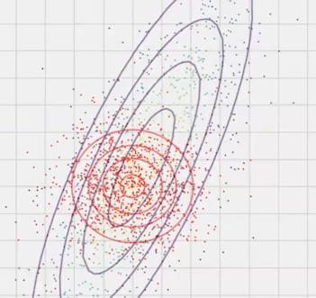

- $ D_{\mathrm{KL}}(q||p) $ penalizes assigning mass to unsupported regions $\to$ **mode seeking**.

    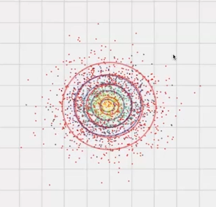

Used in maximum likelihood training (e.g., VAEs via ELBO).

### 3 Jensen–Shannon Divergence (JS)

Let $ m(x) = \frac{1}{2}(p(x) + q(x)) $. Then

$$
D_{\mathrm{JS}}(p || q) = \frac{1}{2} D_{\mathrm{KL}}(p || m) + \frac{1}{2} D_{\mathrm{KL}}(q || m)
$$

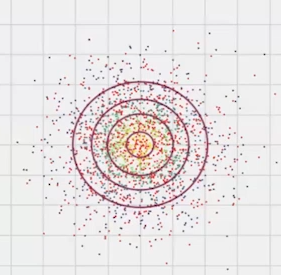

- Symmetric, bounded in $[0, \log 2]$  
- Finite even with disjoint supports  
- Used in **original GAN** training (Goodfellow et al., 2014)

**Problem**: When distributions are on disjoint manifolds, **gradient vanishes**.

### 4 Wasserstein Distance (Earth Mover’s Distance)

$$
W(p, q) = \inf_{\gamma \in \Pi(p,q)} \mathbb{E}_{(x,y) \sim \gamma} [ \| x - y \| ]
$$

where $ \Pi(p,q) $ is the set of joint distributions with marginals $ p $ and $ q $.

**Kantorovich–Rubinstein duality:**

$$
W(p, q) = \sup_{\|f\|_L \leq 1} \mathbb{E}_{x \sim p}[f(x)] - \mathbb{E}_{x \sim q}[f(x)]
$$

- Think of moving "earth" from $ p $ to match $ q $.  
- Finite and smooth even with disjoint supports.  
- Leads to **Wasserstein GAN (WGAN)** with stable training and meaningful gradients.

| Metric | Symmetric | Finite if supports disjoint? | Smooth Gradients? | Common use |
|--|--||--||
| TVD    | ✅        | ❌                           | ❌                 | Theory     |
| KL     | ❌        | ❌                           | 🚫 (p,q unstable) | MLE, VAEs  |
| JS     | ✅        | ✅                           | 🚫 (vanishes)      | Vanilla GAN |
| Wasserstein | ✅   | ✅                           | ✅            | WGAN |

## Distance Theorem

Let $ \pi $ be a distribution on a compact space $ \mathcal{X} $ and let $ \{p_t\}_{t=1}^\infty $ be a sequence of distributions on $ \mathcal{X} $.

$$
    \mathrm{KL}(\pi \,\|\, p_t) \to 0 
    \quad \text{(or } \mathrm{KL}(p_t \,\|\, \pi) \to 0\text{)} 
    \tag{1}
$$

$$
\mathrm{JSD}(\pi \,\|\, p_t) \to 0
\tag{2}
$$

$$
W(\pi \,\|\, p_t) \to 0
\tag{3}
$$

In summary, as $ t \to \infty $, (1) $\Rightarrow$ (2), and (2) $\Rightarrow$ (3).

## Likelihood-Free Learning

- Poor Likelihood & High-Quality Samples

    $$
    p_1(x) = \frac{1}{n} \sum_{i=1}^n \mathcal{N}(x \mid x_i, \epsilon I)
    $$

    Excellent, sharp samples but poor likelihoods.

- High Likelihood & Poor Samples

    $$
    p_2(x) = 0.01\,p(x) + 0.99\,p_{\text{noise}}(x)
    $$

    $$
    \log \left[0.01\,p(x) + 0.99\,p_{\text{noise}}(x)\right]
    \ge
    \log \left[0.01\,p(x)\right]
    = \log p(x) - \log 100
    $$

    Mostly noisy, irrelevant samples, but $\log p(x)$ scales linearly with $m$.

## Discriminator

Define a discriminative model (classifier):

$$
p(y = 1 \mid x) = P(x \sim p_{\text{data}}(x)),
\qquad
p(y = 0 \mid x) = P(x \sim p_{\theta}(x))
$$

### Cross-Entropy for Discriminator

$$
    \min_{p(y \mid x)}
    \Big[
    - \mathbb{E}_{p_{\text{data}}(x)} \log p(y=1 \mid x)
    - \mathbb{E}_{p_{\theta}(x)} \log p(y=0 \mid x)
    \Big]
$$

$$
=
\max_{p(y \mid x)}
\Big[
\mathbb{E}_{p_{\text{data}}(x)} \log p(y=1 \mid x)
+
\mathbb{E}_{p_{\theta}(x)} \log p(y=0 \mid x)
\Big]
$$

## GAN

- **Discriminator:** A classifier $ p_\phi(y=1 \mid x)=D_\phi(x)\in[0,1] $  distinguishing real and generated samples.  
  The discriminator aims to **maximize** cross-entropy.

- **Generator:** The generative model $ x = G_\theta(z),\; z\sim p(z) $ seeks to fool the discriminator.  
  The generator aims to **minimize** cross-entropy.

$$
\min_{\theta} \max_{\phi}
\Big[
\mathbb{E}_{p_{\text{data}}(x)} \log D_{\phi}(x)
+
\mathbb{E}_{p(z)} \log(1 - D_{\phi}(G_{\theta}(z)))
\Big]
$$

## GAN Optimality Theorem

The following minimax game

$$
\min_G \max_D
\Big[
\mathbb{E}_{p_{\text{data}}(x)} \log D(x)
+
\mathbb{E}_{p(z)} \log(1 - D(G(z)))
\Big]
$$

achieves its global optimum precisely when $ p_{\text{data}}(x) = p_\theta(x) $ and $ D^*(x) = 0.5 $.

> It shows existance of global optimum! **But** the conditions on _any_ function $p_\theta$ and optimal $D$ at any step are never satified $\to$ might not converge to global optimum.

## Mode Collapse

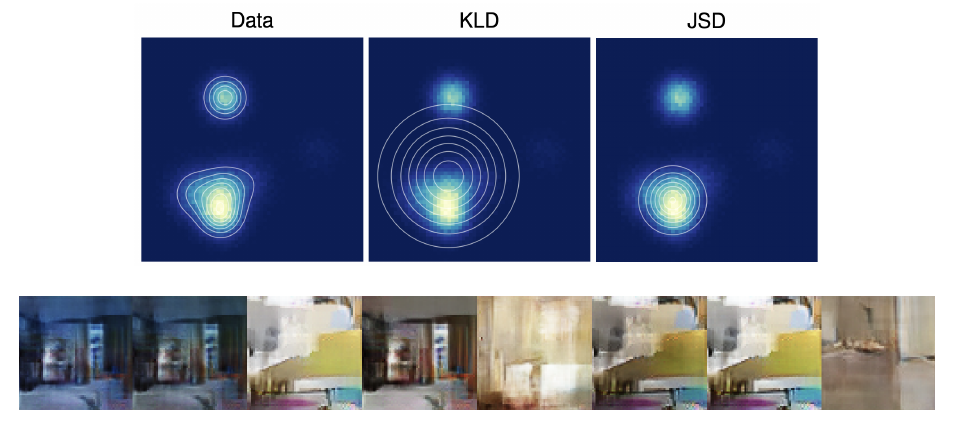

$\to$ WGAN.

## Theorem (Kantorovich–Rubinstein Duality)

$$
    W(\pi \,\|\, p) 
    = \frac{1}{K} 
    \max_{\| f \|_L \le K}
    \left[
    \mathbb{E}_{\pi(x)} f(x)
    -
    \mathbb{E}_{p(x)} f(x)
    \right]
$$

where $ f : \mathbb{R}^m \to \mathbb{R} $ is $K$-Lipschitz ($ \|f\|_L \le K $):

$$
| f(x_1) - f(x_2) | \le K \| x_1 - x_2 \|, \quad
\forall x_1, x_2 \in \mathcal{X}.
$$

We can thus estimate $ W(\pi \,\|\, p) $ using only samples and a function $ f $.

- We must ensure that $ f $ is $K$-Lipschitz continuous.
- Let $ f_\phi(x) $ be a feedforward neural network parameterized by $ \phi $.
- If the weights $ \phi $ are restricted to a compact set $ \Phi $, then $ f_\phi $ is $K$-Lipschitz.
- Clamp weights within the box $ \Phi = [-c, c]^d $ (e.g. $ c = 0.01 $) after each update.

$$
    K \cdot W(p_{\text{data}} \,\|\, p_\theta)
    = 
    \max_{\|f\|_L \le K}
    \left[
    \mathbb{E}_{p_{\text{data}}(x)} f(x)
    -
    \mathbb{E}_{p_\theta(x)} f(x)
    \right]
$$

$$
    \ge
    \max_{\phi \in \Phi}
    \left[
    \mathbb{E}_{p_{\text{data}}(x)} f_\phi(x)
    -
    \mathbb{E}_{p_\theta(x)} f_\phi(x)
    \right]
$$

## WGAN

Replacing JS with **Wasserstein distance** gives non-vanishing gradients even with **disjoint supports**:

$$
    \min_\theta W(p_{\text{data}} \,\|\, p_\theta)
    \;\;\approx\;\;
    \min_\theta \max_{\phi \in \text{Lip-1}}
    \left[
    \mathbb{E}_{p_{\text{data}}(x)} f_\phi(x)
    -
    \mathbb{E}_{p(z)} f_\phi(G_\theta(z))
    \right]
$$

The discriminator $ D $ is replaced by function $ f $:  
in WGAN, it is known as the **critic**, which is *not* a classifier.

### Enforcing Lipschitz Constraint

- **Weight clipping** ([Arjovsky et al., 2017](https://arxiv.org/abs/1701.07875))

  - Simply clip discriminator weights to a fixed box $[-c,c]$.  
  - "Weight clipping is a clearly **terrible** way to enforce a Lipschitz constraint.":
    - If $c$ large $\to$ optimizing critic is hard
    - If $c$ small $\to$ vanishing gradients

- **Gradient penalty** (Gulrajani et al., 2017)  
  - Add penalty on the **norm of discriminator gradients** w.r.t. interpolated samples:
  $$
  \mathcal{L}_{\text{GP}} = \lambda \, \mathbb{E}_{\hat{x} \sim P_{\hat{x}}} \big[ \big( \| \nabla_{\hat{x}} D(\hat{x}) \|_2 - 1 \big)^2 \big]
  $$

  - Encourages discriminator to be 1-Lipschitz without hard clipping.

- **Spectral normalization** (Miyato et al., 2018)  
  - Normalize each weight matrix by its **largest singular value** (spectral norm):

  $$
  W_{\text{SN}} = \frac{W}{\sigma_{\max}(W)}
  $$

# **Lecture 6.1 - Evaluation of Likelihoood-Free Models**

## 1. Fréchet Inception Distance (FID)

### Derivation from Wasserstain

$$
    W(p_{data} \,\|\, p_\theta)
    =
    \inf_{\gamma \in \Gamma(p_{data}, p_\theta)}
    \mathbb{E}_{(x_1, x_2) \sim \gamma}
    \| x_1 - x_2 \|
    =
    \inf_{\gamma \in \Gamma(p_{data}, p_\theta)}
    \int \| x_1 - x_2 \| \, \gamma(x_1, x_2) \, dx_1 dx_2
$$

#### **Theorem**

If  
$$
p_{data}(x) = \mathcal{N}(\mu_{data}, \Sigma_{data}),
\qquad
p_\theta(x) = \mathcal{N}(\mu_\theta, \Sigma_\theta),
$$
then

$$
    W_2^2(p_{data} \,\|\, p_\theta)
    =
    \|\mu_{\text{data}} - \mu_\theta\|^2
    +
    \mathrm{tr}
    \left[
    \Sigma_{\text{data}} + \Sigma_\theta
    -
    2\left(
    \Sigma_{\text{data}}^{1/2}
    \Sigma_\theta
    \Sigma_{\text{data}}^{1/2}
    \right)^{1/2}
    \right]
$$

### Frechet Inception Distance

$$
    \mathrm{FID}(p_{\text{data}}, p_\theta)
    =
    W_2^2(p_{\text{data}} \,\|\, p_\theta)
$$

#### **Intuition:**

- Mean difference $\to$ global shift
- Covariance difference $\to$ diversity & mode coverage
- Lower FID = closer generated distribution to real

#### **Why preferred:**

- Compares to real data
- Sensitive to both quality and diversity

Widely used for GANs, diffusion models, etc

#### **Limitations:**  

- Gaussian assumption in feature space.  
- Depends on feature extractor (typically Inception v3).

## 2. Precision-Recall

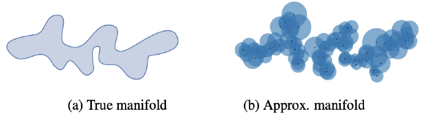

- $ \mathcal{S}_{\text{data}} = \{ x_i \}_{i=1}^n \sim p_{\text{data}}(x) $ — real samples;
- $ \mathcal{S}_\theta = \{ x_i \}_{i=1}^n \sim p_\theta(x) $ — generated samples.

Define a binary function:

$$
\mathbb{I}(x, \mathcal{S}) =
\begin{cases}
1, & \text{if } \exists\, x' \in \mathcal{S} : \|x - x'\|_2 \le \|x' - \mathrm{NN}_k(x', \mathcal{S})\|_2; \\
0, & \text{otherwise}.
\end{cases}
$$

$$
\Pr(\mathcal{S}_{\text{data}}, \mathcal{S}_\theta)
= \frac{1}{n} \sum_{x \in \mathcal{S}_\theta} \mathbb{I}(x, \mathcal{S}_{\text{data}});
\qquad
\mathrm{Rec}(\mathcal{S}_{\text{data}}, \mathcal{S}_\theta)
= \frac{1}{n} \sum_{x \in \mathcal{S}_{\text{data}}} \mathbb{I}(x, \mathcal{S}_\theta).
$$

Embed the samples using a pretrained network (as in FID).

## 3. CLIP

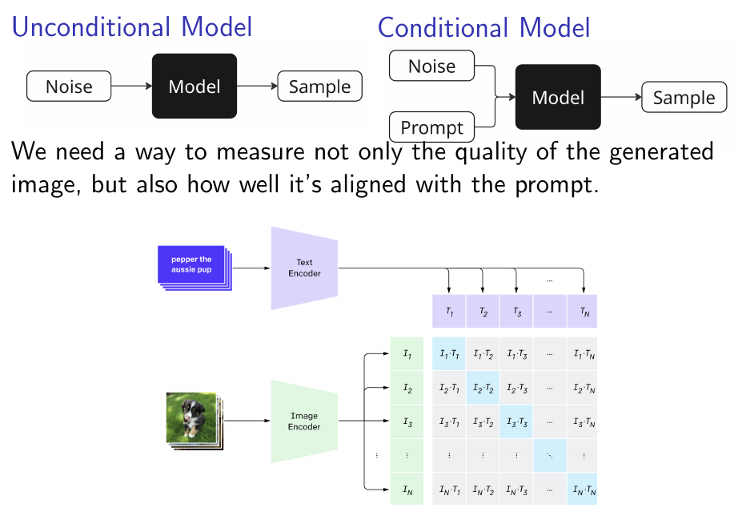

# **Lecture 6.2 - Denoising Score Matching**

> Move away from concept, when we were estimating $p_\theta(x)$ (AR, NF) or were approximating it (VAE), to estimation of $s_\theta(x) = \nabla{x} \log{p_\theta(x)}$, because with Langevin Dynamics we can sample from $p_\theta(x)$ (which we don't estimate) using only $s_\theta(x)$.

## Unnormalized Density

$$
p_\theta(x) = \frac{\hat{p}_\theta(x)}{Z_\theta},
\qquad
Z_\theta = \int \hat{p}_\theta(x)\, dx
$$

Easy choice: $ \hat{p}_\theta(x) = \exp(-f_\theta(x))$.

#### **Gradient**

The gradient of the normalized log-density = the gradient of the _unnormalized_ log-density:

$$
    \nabla_x \log p_\theta(x)
    =
    \nabla_x \log \hat{p}_\theta(x)
    -
    \nabla_x \log Z_\theta
    =
    \nabla_x \log \hat{p}_\theta(x)
$$

- Note, that the gradient is taken with respect to $x$, not $\theta$.

## Langevin Dynamics

### Theorem

Consider an **energy-based model**  
$$
p_\theta(x) = \exp(-f_\theta(x)),
$$
with continuously differentiable $ f(x): \mathbb{R}^m \to \mathbb{R} $ that satisfies:

- **L-smoothness:**  
  $$
  \|\nabla f_\theta(x) - \nabla f_\theta(y)\| \le L \|x - y\|;
  $$

- **Strong convexity:**  
  $$
  (\nabla f_\theta(x) - \nabla f_\theta(y))^\top (x - y) \ge m \|x - y\|^2
  \quad \text{for some } m > 0.
  $$

Consider a Markov chain:

$$
    x_{l+1} = x_l + \frac{\eta}{2} \cdot \nabla_{x_l} \log p_\theta(x_l)
    + \sqrt{\eta} \cdot \epsilon_l,
    \qquad
    \epsilon_l \sim \mathcal{N}(0, I).
$$

Then, for any $ \eta < \frac{2}{L}$:

- The Markov chain has a **unique stationary distribution** $ \pi_\eta $.
- $ W_2(\pi_\eta, p) \le C \eta $, and as $ \eta \to 0 $ we have  
  $$
  \pi_\eta \xrightarrow{d} p.
  $$

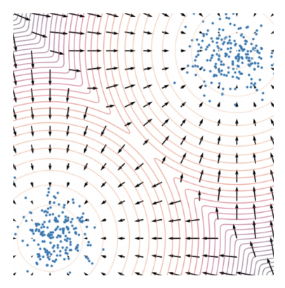

- The density $ p_\theta(x) $ is the **stationary distribution** of the Markov chain.
- $ \nabla_x \log p_\theta(x) $ defines a **vector field**.

## Denoising Score Matching

Let us perturb the original data with Gaussian noise:

$$
x_\sigma = x + \sigma \cdot \epsilon,
\qquad
x \sim p_{\text{data}}(x)
\qquad
\epsilon \sim \mathcal{N}(0, I),
$$

Then:

$$
q(x_\sigma \mid x) = \mathcal{N}(x, \sigma^2 I).
$$

$$
q(x_\sigma) = \int q(x_\sigma \mid x) p_{\text{data}}(x)\, dx.
$$

### Assumption

The solution to

$$
\frac{1}{2}
\mathbb{E}_{q(x_\sigma)}
\| s_{\theta,\sigma}(x_\sigma) - \nabla_{x_\sigma} \log q(x_\sigma) \|_2^2
\;\;\to\;\; \min_\theta
$$

satisfies  

$$
s_{\theta,\sigma}(x_\sigma)
\approx
s_{\theta,0}(x_0)
= s_\theta(x)
$$

if $\sigma$ is **sufficiently small**.

### Theorem (DSM)

Under mild regularity conditions:

$$
    \mathbb{E}_{q(x_\sigma)}
    \| s_{\theta,\sigma}(x_\sigma)
    -
    \nabla_{x_\sigma} \log q(x_\sigma)
    \|_2^2
    =
    \mathbb{E}_{p_{\text{data}}(x)}
    \mathbb{E}_{q(x_\sigma \mid x)}
    \| s_{\theta,\sigma}(x_\sigma)
    -
    \nabla_{x_\sigma} \log q(x_\sigma | x)
    \|_2^2
    + \text{const}
$$

where

$$
    \nabla_{x_\sigma} \log q(x_\sigma \mid x)
    =
    - \frac{x_\sigma - x}{\sigma^2}
    = - \frac{\epsilon}{\sigma}.
$$

- $ s_{\theta,\sigma}(x_\sigma) $ is trained to **denoise** the noised samples $ x_\sigma $.

### DSM's Objective

- Initial objective:

    $$
    \mathbb{E}_{p_{\text{data}}(x)}
    \| s_\theta(x) - \nabla_x \log p_{\text{data}}(x) \|_2^2
    \to \min_\theta
    $$

- Noised objective:

    $$
    \mathbb{E}_{q(x_\sigma)}
    \| s_{\theta,\sigma}(x_\sigma)
    -
    \nabla_{x_\sigma}\log q(x_\sigma)
    \|_2^2
    \to \min_\theta
    $$

- Equivalent to denoising:

    $$
    \mathbb{E}_{p_{\text{data}}(x)}
    \mathbb{E}_{q(x_\sigma\mid x)}
    \| s_{\theta,\sigma}(x_\sigma)
    -
    \nabla_{x_\sigma}\log q(x_\sigma \mid x)
    \|_2^2
    \to \min_\theta
    $$

    $$
    \mathbb{E}_{p_{\text{data}}(x)}
    \mathbb{E}_{\mathcal{N}(0, I)}
    \left\|
    s_{\theta,\sigma}(x + \sigma \cdot \epsilon)
    +
    \frac{\epsilon}{\sigma}
    \right\|_2^2
    \to \min_\theta
    $$

### Langevin Dynamics (score-based)

$$
    x_{l+1}
    = x_l
    + \frac{\eta}{2} \cdot s_{\theta,\sigma}(x_l)
    + \sqrt{\eta}\, \epsilon_l,
    \qquad
    \epsilon_l \sim \mathcal{N}(0, I).
$$

## NCSN (Noise-Conditioned Score Network)

#### **Problem**

- For **small** $ \sigma $, $ s_{\theta,\sigma}(x) $ becomes inaccurate and Langevin dynamics fails to traverse modes.

- For **large** $ \sigma $, robustness in low-density regions is achieved, but the model learns a distribution that is overly corrupted.

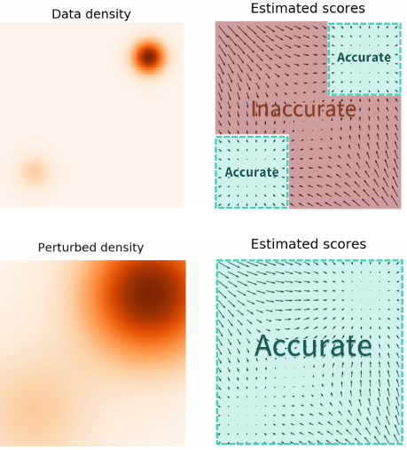

### NCSN

- Specify a sequence of noise levels:  
  $$
  \sigma_1 < \sigma_2 < \cdots < \sigma_T
  $$

- Perturb each data point with different noise levels:  
  $$
  x_t = x + \sigma_t \epsilon,
  \qquad
  x_t \sim q(x_t)
  $$

- Choose $ \sigma_1, \sigma_T $ such that:  
  $$
  q(x_1) \approx p_{\text{data}}(x),
  \qquad
  q(x_T) \approx \mathcal{N}(0, \sigma_T^2 I)
  $$

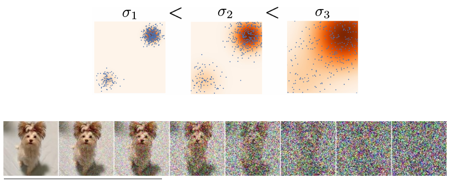

Train the denoising score function $ s_{\theta,\sigma_t}(x_t) $ for each noise level $ \sigma_t $ using a unified weighted objective:

$$
    \sum_{t=1}^T
    \sigma_t^2
    \mathbb{E}_{p_{\text{data}}(x)}
    \mathbb{E}_{q(x_t \mid x)}
    \|
    s_{\theta,\sigma_t}(x_t)
    -
    \nabla_{x_t} \log q(x_t \mid x)
    \|_2^2
    \to \min_\theta
$$

where
$$
    \nabla_{x_t} \log q(x_t \mid x)
    =
    - \frac{x_t - x}{\sigma_t^2}
    =
    - \frac{\epsilon}{\sigma_t}
$$

### Training

1. Sample $ x_0 \sim p_{\text{data}}(x) $
2. Sample $ t \sim U\{1, T\} $ and $ \epsilon \sim \mathcal{N}(0, I) $
3. Construct noisy images $ x^i_t = x^i_0 + \sigma_t \epsilon $
4. Evaluate loss
    $$
    \mathcal{L}
    = \sum_{i}\sigma_t^2
      \left\|
        s_{\theta,\sigma_t}(x^i_t)
        + \frac{\epsilon}{\sigma_t}
      \right\|_2^2
    $$

### Sampling (Annealed Langevin Dynamics)

- Sample initial point  
    $$
    x_0 \sim \mathcal{N}(0, \sigma_T^2 I) \approx q(x_T)
    $$

- At each noise level, apply $ L $ steps of Langevin dynamics:
    $$
    x_l = x_{l-1}
    + \frac{\eta_t}{2} s_{\theta,\sigma_t}(x_{l-1})
    + \sqrt{\eta_t} \epsilon_l,
    \qquad
    \epsilon_l \sim \mathcal{N}(0, I)
    $$

- Update $ x_0 := x_L $ and reduce to the next lower $ \sigma_t $

# **Lecture 7 - Gaussian Diffusion Process**

> The difference between NCSN and Gaussian Diffusion Process is in form of Markow Chain & denoising process, because we already can apply Langevin Dynamics to Diffusion (since [star]), but we can do better.

[star] _approximation_ of diffusion markov chain (first order tailor) is exactly Langvein Dynamics under $\beta_t=\eta$ and ...

## Gaussian Diffusion Markow Chain

$$
x_t = \sqrt{1 - \beta_t}\, x_{t-1} + \sqrt{\beta_t}\, \epsilon_t,
\qquad
\epsilon_t \sim \mathcal{N}(0, I)
$$

$$
q(x_t \mid x_{t-1}) = \mathcal{N}(\sqrt{1 - \beta_t}\, x_{t-1},\, \beta_t I)
$$

## Gaussian Diffusion Process as NCSN

### Langevin Dynamics

$$
    x_{l+1} = x_l + \frac{\eta}{2} \cdot \nabla_{x_l} \log p_\theta(x_l)
    + \sqrt{\eta}\, \epsilon_l,
    \qquad
    \epsilon_l \sim \mathcal{N}(0, I)
$$

Connection to **diffusion**:

$$
x_t = \sqrt{1 - \beta_t}\, x_{t-1} + \sqrt{\beta_t}\, \epsilon_t
$$

$$
\approx
\left( 1 - \frac{\beta_t}{2} \right) x_{t-1} + \sqrt{\beta_t}\, \epsilon_t
$$

$$
    = x_{t-1}
    + \frac{\beta_t}{2}(-x_{t-1})
    + \sqrt{\beta_t}\, \epsilon_t
$$

- $ \beta_t = \eta $  
- $ \nabla_{x_{t-1}} \log p(x_{t-1} \mid \theta) = -x_{t-1} = \nabla_{x_{t-1}} \log \mathcal{N}(0, I) $

### Scores

- NCSN:
    $$
    q(x_t \mid x_0) = \mathcal{N}(x_0, \sigma_t^2 I),
    \qquad
    q(x_1) \approx p_{\text{data}}(x),
    \qquad
    q(x_T) \approx \mathcal{N}(0, \sigma_T^2 I)
    $$

    $$
    \nabla_{x_t} \log q(x_t \mid x_0)
    = - \frac{x_t - x_0}{\sigma_t^2}
    $$

- Gaussian Diffusion:

    $$
    q(x_t \mid x_0)
    =
    \mathcal{N}(\sqrt{\bar{\alpha}_t} x_0,\,
    (1 - \bar{\alpha}_t) I),
    \qquad
    q(x_1) \approx p_{\text{data}}(x),
    \qquad
    q(x_T) \approx \mathcal{N}(0, I)
    $$

    $$
    \nabla_{x_t} \log q(x_t \mid x_0)
    =
    - \frac{x_t - \sqrt{\bar{\alpha}_t} x_0}{1 - \bar{\alpha}_t}
    $$

## Theorem (Feller, 1949)

In the reverse process ($ q(x_{t-1}) $ and $ q(x_t) $ are intractable):

$$
    q(x_{t-1} \mid x_t)
    =
    \frac{q(x_t \mid x_{t-1})\, q(x_{t-1})}
        {q(x_t)}
    \approx
    p_\theta(x_{t-1} \mid x_t)
$$

If $ \beta_t $ is sufficiently small $\to$ $ q(x_{t-1} \mid x_t) $ is **Gaussian**.

> That's why diffusion requires $ T \approx 1000 $ steps for convergence

# **Lecture 8 - DDPM**

## Forward & Reverse Processes

### Forward Processes

1. $\mathbf{x}_0 = \mathbf{x} \sim p_{\text{data}}(\mathbf{x})$;

2. $$
    \mathbf{x}_t
    = \sqrt{1 - \beta_t}\,\mathbf{x}_{t-1}
    + \sqrt{\beta_t}\,\epsilon,
    \quad \epsilon \sim \mathcal{N}(0,I);
    $$

3. $\mathbf{x}_T \sim p_\infty(\mathbf{x}) = \mathcal{N}(0,I)$.

### Reverse Processes

1. $\mathbf{x}_T \sim p_\infty(\mathbf{x}) = \mathcal{N}(0,I)$;

2. $$
    \mathbf{x}_{t-1}
    = \sigma_{\theta,t}(\mathbf{x}_t)\cdot \epsilon + \mu_{\theta,t}(\mathbf{x}_t),
    \quad \epsilon \sim \mathcal{N}(0,I);
    $$

3. $\mathbf{x}_0 = \mathbf{x} \sim p_{\text{data}}(\mathbf{x})$.

## Conditioned Reverse Distribution

### Reverse Kernel (**Intractable**)

$$
q(x_{t-1}\mid x_t) = \frac{q(x_t \mid x_{t-1})\, q(x_{t-1})}{q(x_t)}
$$

### Conditioned Reverse Kernel (**Tractable**)

$$
q(x_{t-1} \mid x_t, x_0)
= \frac{ q(x_t \mid x_{t-1}, x_0)\, q(x_{t-1}\mid x_0) }
        { q(x_t \mid x_0) }
$$

$$
= \frac{
\mathcal{N}(\sqrt{1-\beta_t}\, x_{t-1}, \beta_t I)
\cdot
\mathcal{N}(\sqrt{\bar{\alpha}_{t-1}}\, x_0, (1-\bar{\alpha}_{t-1})\, I)
}{
\mathcal{N}(\sqrt{\bar{\alpha}_t}\, x_0, (1-\bar{\alpha}_t)\, I)
}
$$

$$
= \mathcal{N}(\tilde{\mu}_t(x_t, x_0),\, \tilde{\beta}_t \cdot I)
$$

Here,
$$
\tilde{\mu}_t(x_t, x_0)
= \frac{\sqrt{\alpha_t}(1-\bar{\alpha}_{t-1})}{1-\bar{\alpha}_t}\, x_t + \frac{\sqrt{\bar{\alpha}_{t-1}}(1-\alpha_t)}{1-\bar{\alpha}_t}\, x_0
$$

$$
\tilde{\beta}_t
= \frac{(1-\alpha_t)(1-\bar{\alpha}_{t-1})}{1-\bar{\alpha}_t}
= \text{const.}
$$

## Distribution Summary

**Forward process**:

$$
q(x_t \mid x_{t-1}) = \mathcal{N}(\sqrt{1-\beta_t}\, x_{t-1}, \beta_t I)
$$

$$
q(x_t \mid x_0) = \mathcal{N}(\sqrt{\bar{\alpha}_t}\, x_0, (1-\bar{\alpha}_t) I)
$$

**Reverse process**:

$$
q(x_{t-1}\mid x_t)
= \frac{q(x_t\mid x_{t-1})\, q(x_{t-1})}{q(x_t)}
\approx \mathcal{N}\left( \mu_{\theta,t}(x_t),\, \sigma_{\theta,t}^2(x_t) \right)
$$

**Conditioned reverse process**:

$$
q(x_{t-1} \mid x_t, x_0) =
\mathcal{N}\left( \tilde{\mu}_t(x_t, x_0),\, \tilde{\beta}_t I \right)
$$

## Loss

### ELBO

$$
\log p_\theta(x)
\ge \mathbb{E}_{q(x_{1:T}\mid x_0)}
\log \frac{p_\theta(x_0, x_{1:T})}{q(x_{1:T}\mid x_0)}
= \mathbb{E}_{q(x_{1:T}\mid x_0)}
\log
\frac{
p(x_T) \prod_{t=1}^T p_\theta(x_{t-1}\mid x_t)
}{
\prod_{t=1}^T q(x_t\mid x_{t-1})
}
= \mathcal{L}_{\phi,\theta}(x)
\to \max_{q,\theta}
$$

$$
\mathcal{L}_{\phi,\theta}(x)
= \mathbb{E}_{q(x_1\mid x_0)} \log p_\theta(x_0\mid x_1) - \mathrm{KL}( q(x_T\mid x_0) \,\|\, p(x_T)) - \sum_{t=2}^T
\underbrace{
\mathbb{E}_{q(x_t\mid x_0)}
\mathrm{KL}\big( q(x_{t-1}\mid x_t, x_0) \,\|\, p_\theta(x_{t-1}\mid x_t) \big)}_{\mathcal{L}_t}
$$

- **First term** - the decoder distribution

- **Second term** - constant

- **Third term** - the main contributor to the ELBO

### Reparametrization

$$
q(x_{t-1}\mid x_t, x_0)
= \mathcal{N}\!\big( x_{t-1} \mid \tilde{\mu}_t(x_t,x_0),\, \tilde{\beta}_t I \big),
$$

$$
p_\theta(x_{t-1}\mid x_t)
= \mathcal{N}\!\big( x_{t-1} \mid \mu_{\theta,t}(x_t),\, \sigma^2_{\theta,t}(x_t) I \big)
$$

Then:

$$
\mathcal{L}_t
= \mathbb{E}_{q(x_t\mid x_0)}
\mathrm{KL}\!\left( q(x_{t-1}\mid x_t, x_0) \,\|\, p_\theta(x_{t-1}\mid x_t) \right)
$$

$$

= \mathbb{E}_{q(x_t\mid x_0)}
\mathrm{KL}\!\left(
\mathcal{N}(\tilde{\mu}_t(x_t,x_0), \tilde{\beta}_t I)
\;\|\;
\mathcal{N}(\mu_{\theta,t}(x_t), \tilde{\beta}_t I)
\right)
$$

$$
= \mathbb{E}_{q(x_t\mid x_0)}
\left[
\frac{1}{2\tilde{\beta}_t}
\left\|\tilde{\mu}_t(x_t,x_0) - \mu_{\theta,t}(x_t)\right\|^2
\right]
$$

$$
= \mathbb{E}_{\epsilon \sim \mathcal{N}(0,I)}
\left[
\frac{(1-\alpha_t)^2}{2\tilde{\beta}_t\, \alpha_t (1-\bar{\alpha}_t)}
\left\|
\epsilon - \epsilon_{\theta,t}(x_t)
\right\|^2
\right]
$$

$$
= \mathbb{E}_{\epsilon\sim\mathcal{N}(0,I)}
\left[
\frac{(1-\alpha_t)^2}{2\tilde{\beta}_t\, \alpha_t (1-\bar{\alpha}_t)}
\left\|
\epsilon - \epsilon_{\theta,t}\big( \sqrt{\bar{\alpha}_t}\, x_0 + \sqrt{1-\bar{\alpha}_t}\,\epsilon \big)
\right\|^2
\right]
$$

### Simplified Objective

$$
\mathcal{L}_{\text{simple}}
= \mathbb{E}_{t \sim U\{2,T\}}
\mathbb{E}_{\epsilon\sim\mathcal{N}(0,I)}
\left\|
\epsilon -
\epsilon_{\theta,t}\big( \sqrt{\bar{\alpha}_t}\, x_0 + \sqrt{1-\bar{\alpha}_t}\, \epsilon \big)
\right\|^2
$$

## DDPM (Denoising Diffusion Probabilistic Model)

### Training

1. Obtain a sample $\mathbf{x}_0 \sim p_{\text{data}}(\mathbf{x})$.

2. Sample time index $t \sim U\{1, T\}$ and noise $\epsilon \sim \mathcal{N}(0,I)$.

3. Generate noisy image  
    $$
    \mathbf{x}_t = \sqrt{\bar{\alpha}_t}\,\mathbf{x}_0 + \sqrt{1-\bar{\alpha}_t}\,\epsilon.
    $$

4. Compute the loss  
    $$
    \mathcal{L}_{\text{simple}} = \|\epsilon - \epsilon_{\theta,t}(\mathbf{x}_t)\|^2.
    $$

### Sampling (Ancestral Sampling)

1. Sample $\mathbf{x}_T \sim \mathcal{N}(0,I)$.

2. Compute:
    $$
    \mu_{\theta,t}(\mathbf{x}_t)
    = \frac{1}{\sqrt{\alpha_t}}\,\mathbf{x}_t - \frac{1-\alpha_t}{\sqrt{\alpha_t(1-\bar{\alpha}_t)}}\,
    \epsilon_{\theta,t}(\mathbf{x}_t).
    $$

3. Denoise:
    $$
    \mathbf{x}_{t-1}
    = \mu_{\theta,t}(\mathbf{x}_t) + \sqrt{\tilde{\beta}_t}\,\epsilon,
    \quad \epsilon \sim \mathcal{N}(0,I).
    $$

# **Lecture 9.1 - DDPM Guidance**

## DDPM as a Score-Based Generative Model

### DDPM $\to$ Score-Based

The forward noising process is:

$$
q(x_t \mid x_0) = \mathcal{N}\!\left( \sqrt{\bar{\alpha}_t}\, x_0,\; (1-\bar{\alpha}_t)\, I \right)
$$

The score of the forward process:

$$
\nabla_{x_t} \log q(x_t \mid x_0)
= - \frac{x_t - \sqrt{\bar{\alpha}_t} \, x_0}{1 - \bar{\alpha}_t}
= - \frac{\varepsilon}{\sqrt{1-\bar{\alpha}_t}}.
$$

We reparameterize the model as:

$$
s_{\theta,t}(x_t)
= -\, \frac{\varepsilon_{\theta,t}(x_t)}{\sqrt{1-\bar{\alpha}_t}}
= \nabla_{x_t} \log p_\theta(x_t).
$$

Loss:

$$
\mathcal{L}_t
= \mathbb{E}_{q(x_t \mid x_0)}
\Bigg[
\frac{(1-\alpha_t)^2}{2 \tilde{\beta}_t \alpha_t}
\left\| s_{\theta,t}(x_t) - \nabla_{x_t} \log q(x_t \mid x_0) \right\|_2^2
\Bigg].
$$

### DDPM vs NCSN: Objectives

#### **DDPM Objective**

$$
\mathbb{E}_{p_\text{data}(x_0)}
\mathbb{E}_{t \sim U\{1,T\}}
\mathbb{E}_{q(x_t \mid x_0)}
\Bigg[
\frac{(1 - \alpha_t)^2}{2 \tilde{\beta}_t \alpha_t}
\left\| s_{\theta,t}(x_t) - \nabla_{x_t}\log q(x_t \mid x_0) \right\|_2^2
\Bigg]
$$

with

$$
x_t = \sqrt{\bar{\alpha}_t}\, x_0 + \sqrt{1-\bar{\alpha}_t}\, \varepsilon.
$$

#### **NCSN Objective**

$$
\mathbb{E}_{p_\text{data}(x_0)}
\mathbb{E}_{t \sim U\{1,T\}}
\mathbb{E}_{q(x_t \mid x_0)}
\left\|
s_{\theta,\sigma_t}(x_t) - \nabla_{x_t} \log q(x_t \mid x_0)
\right\|_2^2
$$

with

$$
x_t = x_0 + \sigma_t \varepsilon.
$$

> Maximizing the ELBO leads to the same objective as denoising score matching!

### Summary

- Different Markov chains:
  - DDPM:
    $ x_t = \sqrt{\bar{\alpha}_t}\, x_0 + \sqrt{1-\bar{\alpha}_t}\, \varepsilon $
  - NCSN:  
    $ x_t = x_0 + \sigma_t \varepsilon $

- Different sampling:
  - DDPM: Ancestral sampling  
  - NCSN: Annealed Langevin dynamics

- $\mathcal{L}_t$ coincide: ELBO $\equiv$ score matching.

## 1. Classifier Guidence

### Guided Score Function

$$
x_{t-1}
= \frac{1}{\sqrt{1-\beta_t}}\, x_t + \frac{\beta_t}{\sqrt{1-\beta_t}} \cdot \nabla_{x_t} \log p_\theta(x_t \mid \textcolor{blue}{y}) + \sigma_t \cdot \varepsilon
$$

Where

$$
s_{\theta,t}(x_t, y) =
$$

$$
= \nabla_{x_t} \log p_\theta(x_t \mid y)
= \nabla_{x_t} \log p_\theta(x_t) + \nabla_{x_t} \log p(y \mid x_t)
$$

$$
= s_{\theta,t}(x_t) + \nabla_{x_t} \log p(y \mid x_t)
$$

### Guidance Scale

$$
s^\gamma_{\theta,t}(x_t, y)
= s_{\theta,t}(x_t) + \gamma \cdot \nabla_{x_t} \log p(y \mid x_t)
$$

- The **guidance scale** $ \gamma $ adjusts the strength of classifier guidance.

- $ s^\gamma_{\theta,t}(x_t, y) $ is _not_ the true guided score function $ s_{\theta,t}(x_t, y) $.

### Scaled Guided Score

$$
\nabla^{\gamma}_{x_t} \log p_\theta(x_t \mid y)
= \nabla_{x_t} \log p_\theta(x_t) + \gamma \cdot \nabla_{x_t} \log p(y \mid x_t)
$$

$$
= \nabla_{x_t} \log p_\theta(x_t) + \nabla_{x_t} \log p(y \mid x_t)^\gamma
$$

$$
= \nabla_{x_t} \log \left(
\frac{p_\theta(x_t)\, p(y \mid x_t)^\gamma}{Z}
\right)
$$

$\to$ Increasing $ \gamma $ sharpens $ p(y \mid x_t) $, making it more **contrastive**.

### Training

$$
x_{t-1}
= \frac{1}{\sqrt{\alpha_t}}\, x_t + \frac{\beta_t}{\sqrt{1-\beta_t}} \cdot s^\gamma_{\theta,t}(x_t, y) + \sigma_t \cdot \varepsilon
$$

- Train the DDPM as before.

- Train an additional **classifier** $ p(y \mid x_t) $ on noisy data  
  (note that it is dependent on time $ t $).

## 2. Classifier-free Guidence

$$
\nabla^{\gamma}_{x_t} \log p_\theta(x_t \mid y)
= \nabla_{x_t} \log p_\theta(x_t) + \gamma \cdot \nabla_{x_t} \log p(y \mid x_t)
$$

$$
= \nabla_{x_t} \log p_\theta(x_t) + \gamma \cdot \left( \nabla_{x_t} \log p_\theta(x_t \mid y) - \nabla_{x_t} \log p_\theta(x_t) \right)
$$

$$
= (1 - \gamma)\, \nabla_{x_t} \log p_\theta(x_t) + \gamma \, \nabla_{x_t} \log p_\theta(x_t \mid y)
$$

Thus,

$$
s^\gamma_{\theta,t}(x_t, y)
= (1-\gamma)\, s_{\theta,t}(x_t) + \gamma \, s_{\theta,t}(x_t, y)
$$

### Naive training approach

- Train an **unguided** score function model $ s_{\theta,t}(x_t) $.

- Train a **guided** score function model $ s_{\theta,t}(x_t, y) $.

- Use their convex combination at inference.

### CFG algorithm

Introduce the **"absence of conditioning"** label $ y = \varnothing $.

Use it to get unguided score function $ s_{\theta,t}(x_t) = s_{\theta,t}(x_t, \varnothing) $.

- Train a _single_ model $ s_{\theta,t}(x_t, y) $ using **supervised** data, but artificially drop labels $y$ with some fixed probability (simulating the case $ y = \varnothing $).

- Apply the model **twice during inference** to get:  
  - $ s_{\theta,t}(x_t, \varnothing) $ (unguided)  
  - $ s_{\theta,t}(x_t, y) $ (guided)

# **Lecture 9.2 - Continuous-Time Normalizing Flows**

## Continuous-Time Dynamics

Consider an Ordinary Differential Equation (ODE):

$$
\frac{d x(t)}{d t} = f_\theta(x(t), t),
\qquad x(t_0) = x_0.
$$

$$
x(t_1) = \int_{t_0}^{t_1} f_\theta(x(t), t)\, dt + x_0
$$

Here, $ f_\theta : \mathbb{R}^m \times [t_0, t_1] \to \mathbb{R}^m $ is a **vector field**.

## Flow

Let us call **the flow** $ \psi : \mathbb{R}^m \times [t_0, t_1] \to \mathbb{R}^m $ the solution of the ODE:

$$
\frac{d}{dt} \psi_t(x_0)
= f_\theta(\psi_t(x_0), t),
\qquad \psi_0(x_0) = x_0.
$$

## Numerical Solution of ODEs

$$
\psi_t(x_0)
= \int_{t_0}^{t_1} f_\theta(x(t), t)\, dt + x_0
\;\approx\;
\mathrm{ODESolve}_f(x_0, \theta, t_0, t_1).
$$

### Euler Update Step

$$
x(t+h)
= x(t) + h \cdot f_\theta(x(t), t)
$$

### Heun’s Update Step

$$
x(t+h)
= x(t) + \frac{h}{2} \Big( f_\theta(x(t), t) + f_\theta(x'(t+h), t+h) \Big)
$$

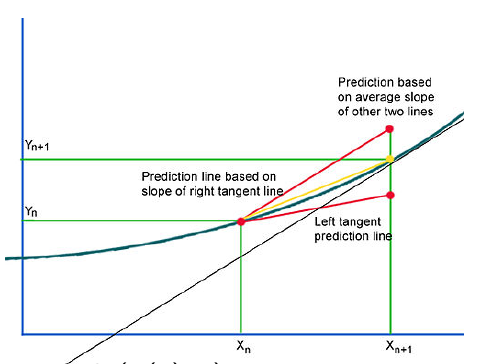

## Probability Path

$ p_t(x) = p(x, t) $ describes the **probability path** interpolating between $ p_0(x) $ and $ p_1(x) $.

## Theorem (Picard)

If $ f $ is continuously differentiable with a bounded derivative in $ x $ and continuous in $ t $, then the ODE has a **unique solution** giving a flow $ \psi_t $.

This guarantees the ODE is **uniquely reversible**.

$$
\psi_1(x_0)
= x_0 + \int_0^1 f_\theta(\psi_t(x_0), t)\, dt
$$

$$
x(1)
= x(0) + \int_0^1 f_\theta(x(t), t)\, dt
$$

$$
x(0)
= x(1) + \int_1^0 f_\theta(x(t), t)\, dt
$$

> Unlike discrete-time flows, $ f $ **need not be invertible** (uniqueness ensures bijection).

# **Lecture 10 - SDE & ODE**

## Continuity Equation for NF Log-Likelihood

### Theorem (Continuity Equation)

If $f$ is uniformly **Lipschitz continuous** in $x$ and continuous in $t$, then

$$
\frac{d \log p_t(x(t))}{dt}
= - \operatorname{tr}\!\left(
\frac{\partial f(x(t), t)}{\partial x(t)}
\right)
$$

$\to$ given $x_0 = x(0)$, the solution to the continuity equation gives the density $p_1(x(1))$.

#### Solution of the Continuity Equation

$$
\log p_1(x(1))
= \log p_0(x(0)) - \int_0^1
\operatorname{tr}\!\left(
\frac{\partial f(x(t), t)}{\partial x(t)}
\right)\, dt.
$$

## SDE Basics

$$
dx = f(x,t)\,dt + g(t)\,dw
$$

- $f(x,t) : \mathbb{R}^m \times [0,1] \to \mathbb{R}^m$ is the **drift term** (vector field).  
- $g(t) : \mathbb{R} \to \mathbb{R}$ is the **diffusion term** (if $g(t)=0$, we recover the standard ODE).  
- $w(t)$ is the standard **Wiener process** ($dw = \epsilon \cdot \sqrt{dt}$).

### Discretizing the SDE (Euler Update Step)

$$
x(t + dt) = x(t) + f(x(t),t)\,dt + g(t)\,\epsilon\,\sqrt{dt}
$$

If $dt = 1$, then

$$
x_{t+1} = x_t + f(x_t,t) + g(t)\,\epsilon
$$
  
- $p : \mathbb{R}^m \times [0,1] \to \mathbb{R}_+$ specifies a **probability path** from $p_0(x)$ to $p_1(x)$.

### Theorem (Kolmogorov–Fokker–Planck)

The evolution of $p_t(x)$ is governed by

$$
\frac{\partial p_t(x)}{\partial t}
= -\operatorname{div}\!\left( f(x,t)p_t(x) \right) + \frac{1}{2} g^2(t)\, \Delta_x p_t(x)
$$

Here,

- Divergence operator:
    $$
    \operatorname{div}(v)
    = \sum_{i=1}^m \frac{\partial v_i(x)}{\partial x_i}
    = \operatorname{tr}\!\left( \frac{\partial v(x)}{\partial x} \right)
    $$

- Laplas operator:
    $$
    \Delta_x p_t(x)
    = \sum_{i=1}^m \frac{\partial^2 p_t(x)}{\partial x_i^2}
    = \operatorname{tr}\!\left( \frac{\partial^2 p_t(x)}{\partial x^2} \right)
    $$

Thus,

$$
\frac{\partial p_t(x)}{\partial t}
= \operatorname{tr}\!\left( - \frac{\partial}{\partial x}\big[f(x,t)p_t(x)\big] + \frac{1}{2} g^2(t) \frac{\partial^2 p_t(x)}{\partial x^2}
\right)
$$

## DDIM & Probability Flow ODE

### 1. ODE and Continuity Equation (reduced KFP)

$$
dx = f(x,t)\,dt
$$

$$
\frac{d \log p_t(x(t))}{dt}
= -\operatorname{tr}\!\left( \frac{\partial f_\theta(x,t)}{\partial x} \right)
\;\;\Longleftrightarrow\;\;
\frac{\partial p_t(x)}{\partial t}
= -\operatorname{div}\!\left(f(x,t)p_t(x)\right)
$$

Source of randomness: $p_0(x)$.

### 2. SDE and KFP Equation

$$
dx = f(x,t)\,dt + g(t)\,dw
$$

$$
\frac{\partial p_t(x)}{\partial t}
= -\operatorname{div}\!\left(f(x,t)p_t(x)\right) + \frac{1}{2} g^2(t)\,\Delta_x p_t(x)
$$

Sources of randomness: $p_0(x)$ & $w(t)$.

### Theorem  
Suppose the SDE

$$ dx = f(x,t)\,dt + g(t)\,dw $$

induces $p_t(x)$ $\to \exist$ ODE (**Probability Flow ODE**) with the **same** probability path $p_t(x)$, given by

$$
dx = \left(
f(x,t) - \frac{1}{2} g^2(t)\, \frac{\partial}{\partial x} \log p_t(x)
\right) dt
$$

- **score function** in continuous time:
  $$
  s(x,t) = \frac{\partial}{\partial x}\log p_t(x)
  $$

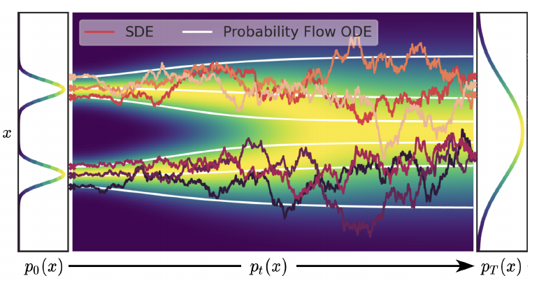

> $\to$ DDPM is _equivalent_ to **DDIM**, because DDPM's SDE produces the same $p_t(x)$ as DDIM's Probability path ODE, but DDIM makes inference more stable & faster.
