<!-- markdownlint-disable MD024 MD025 -->

# **Lecture 1 - Intro**

## Missing Data

1. **Missing Completely at Random** - probability of a missing value is independent of both the observed and unobserved data.

    - Drop rows
    - Imputation:

        - Mean/Median/Mode
        - Model Prediction based on observed data: OLS, K-NN, ...

2. **Missing at Random** - probability of a missing value depends only on observed data.

    - -//-

3. **Missing Not at Random** - probability of a missing value depends on the missing data itself.

    - "Missing or not" variable:

        - New binary for continuous
        - New class for categorical

    - Cannot be dropped!!!

# **Lecture 2 - OLS**

## [Bias-Variance Decomposition](https://en.wikipedia.org/wiki/Bias%E2%80%93variance_tradeoff)

Decomposition: **bias**, **variance**, **irreducible error** (intrinsic noise in data).

$y = f(X) + \epsilon$

$$
\text{MSE} = \mathbb{E}[(y - \hat{f}(X))^2] = \text{Bias}^2 + \text{Variance} + \sigma^2
$$

- **High Bias**: The model is too simple (e.g., underfitting), leading to systematic errors.

- **High Variance**: The model is too complex (e.g., overfitting), capturing noise instead of patterns.

### For Parameter

$$
\mathbb{E}[(\theta - \hat{\theta}(X))^2] = \text{Bias}^2 + \text{Variance}
$$

$\to$ **classes of efficiency** of bias=b.

## Regularization

### Problem

$$
\hat{\theta}_{OLS} = (X^TX)^{-1} X^T y
$$

Therefore:

$$
\mathbb{V}[\hat{\theta}] = \sigma^2 (X^T X)^{-1}
$$
$$
\mathbb{V}[\hat{y}(x)] = x^T \mathbb{V}[\hat{\theta}] x = \sigma^2 x^T (X^T X)^{-1} x
$$

The more number of regressors $d$ at fixed $N$ $\to$ the closer $X$ to being singular (**multicollinearity**) $\to$ $(X^T X)^{-1}$ closer to $\infin$ $\to$ crazy variance.

---

### Ridge

Before doing so need **standartization** of $X$ and $y$:

$$
z_{new} = \frac{z - \mathbb{E}[z]}{\mathbb{V}[z]}
$$

```py
scaler = StandardScaler()

X_train = scaler.fit_transform(X_train)
X_test = scaler.transform(X_train)
```

Task:

$$L(\theta) = ||y - X\theta||^2 + \lambda ||\theta||^2 \to \min_{\theta \in R^d}$$

$\theta_0$ is not included in $\lambda ||\theta||^2$.

$$
\hat{\theta}_{Ridge} = (X^TX + \lambda \mathit{I})^{-1} X^T y
$$

#### Properties

1. $\lambda$
    - $\lambda = 0$ $\to$ $\hat{\theta}_{Ridge} = \hat{\theta}_{OLS}$
    - $\lambda = \infin$ $\to$ $\hat{\theta}_{Ridge} = 0$ (except for $\theta_0$)

2. Now $\hat{\theta}_{Ridge}$ is **biased**(!):  
    $$
    \mathbb{E}[\hat{\theta}_{Ridge}] = x^T (X^TX + \lambda \mathit{I})^{-1} X^T X \theta
    $$

    Leading to biased prediction:
    $$
    \mathbb{E}[\hat{y}(x)] = x^T (X^TX + \lambda \mathit{I})^{-1} X^T X \theta
    $$

3. But $\hat{\theta}_{Ridge}$ has less variance:
    $$
    \mathbb{V}[\hat{\theta}_{Ridge}] = (X^TX + \lambda \mathit{I})^{-1} X^T X (X^TX + \lambda \mathit{I})^{-1}
    $$

4. For unrelevant $x^d$: $\hat{\theta}_{Ridge}^d \in (0, 1)$ (кружок)

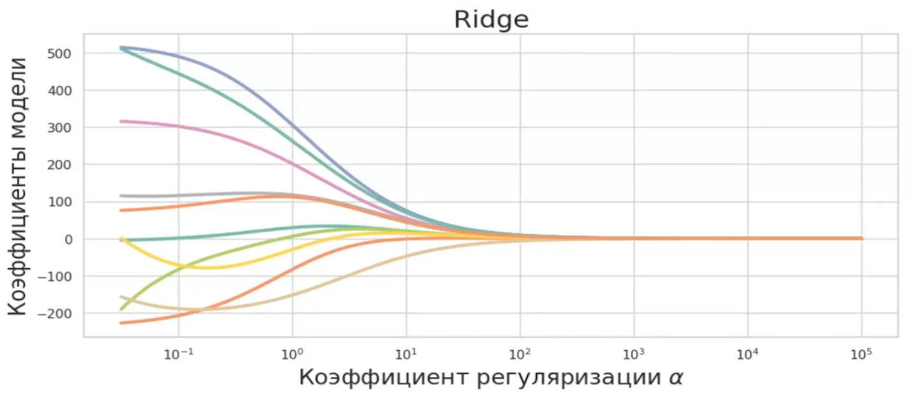

### Lasso

$$\lambda ||\theta||^1$$

1. -//-

2. -//-

3. -//-

4. For unrelevant $x^d$: $\hat{\theta}_{Lasso}^d = 0$ (ромбик):  
    Линии уровная $L(\theta)$ будут касаться ромбика более вероятно в уголках ромбика, там, где $\theta_{Lasso}^d=0$ для каких-то $d$.

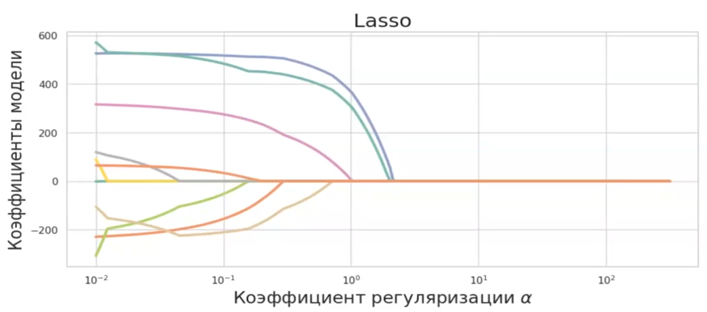

### Elastic

$$\lambda_1 ||\theta||^1 + \lambda_2 ||\theta||^2$$

Very much as Ridge, but seems to be better.

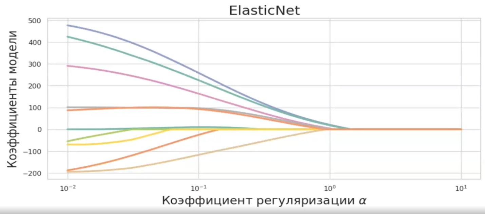

# **Lecture 3 - Maximum Likelihood, Logit**

proebav

# **Lecture 4 - Сonfidence Intervals**

## Definitions

### (Exact) Confidence Interval

$X$ - sample, that has some distribution.

A pair of statistics $ (T_1(X), T_2(X)) $ forms a **confidence interval** for the parameter $ \theta $ at a **confidence level** $ \alpha $, if
$$
P (T_1(X) \leq \theta \leq T_2(X)) \geq \alpha
$$

This is probability on $X$, because $\theta$ is not a random variable, but just a number.  
So, this is probability of probability of **covering** the true parameter at a given confidence level.

### Asymptotic Confidence Interval

$$
\lim_{n \to \infin}  P (T_1(X) \leq \theta \leq T_2(X)) \geq \alpha
$$

### Vald Confidence Interval

Let $\hat{\theta}$ - asymptotically normal with variance $\sigma^2(\theta)$, then:
$$
\sqrt{n} \frac{\hat{\theta} - \theta}{\sigma(\hat{\theta})} = \sqrt{n} \frac{\hat{\theta} - \theta}{\sigma(\theta)} \frac{\sigma(\theta)}{\sigma(\hat{\theta})} \to \mathit{N}_{0, 1} \cdot 1 = \mathit{N}_{0, 1}
$$

**Vald Confidence Interval**:
$$
(\hat{\theta} - \mathit{N}_{\frac{1+\alpha}{2}} \frac{\sigma(\hat{\theta})}{\sqrt{n}}, \hat{\theta} + \mathit{N}_{\frac{1+\alpha}{2}} \frac{\sigma(\hat{\theta})}{\sqrt{n}})
$$

which is asymptotic CI.

## OLS CI

### Asymptotic Confidence Interval

$$
\hat{\boldsymbol{\beta}} \sim \mathcal{N}(\boldsymbol{\beta}, \sigma^2 (\mathbf{X}^\top \mathbf{X})^{-1})
$$

$$
\hat{\beta}_j \pm z_{\alpha/2} \cdot \sqrt{\widehat{\text{Var}}(\hat{\beta}_j)}
$$

### Exact Confidence Interval

$$
\frac{\hat{\beta}_j - \beta_j}{\widehat{\text{SE}}(\hat{\beta}_j)} \sim t_{n-k}
$$

$$
\hat{\beta}_j \pm t_{\alpha/2, n-k} \cdot \widehat{\text{SE}}(\hat{\beta}_j)
$$

# **Lecture 5 - Bayesian Methods**

proebav

# **Lecture 6 - Dimensionality Reduction Methods**

proebav!

t-SNE

# **Lecture 7 - Decision Trees**

## Splitting (Impurity) Criterion

   $$
   Q(X_m, j, t) = \frac{|X_l|}{|X_m|} H(X_l) + \frac{|X_r|}{|X_m|} H(X_r) \to \min_{t}
   $$

### For Classification

$ K $ classes
   $$
   p_k = \frac{1}{|\mathcal{I}|} \sum_{i \in \mathcal{I}} \mathbb{I}\{Y_i = k\}
   $$

1. **Entropy Criterion**
    $$
    H(X) = -\sum_{k=1}^{K} p_k \ln p_k
    $$
    We assume that $ 0 \ln 0 = 0 $.

2. **Gini Criterion**
    $$
    H(X) = \sum_{k=1}^{K} p_k (1 - p_k)
    $$

### For Regression

**MSE**:
   $$
   H(X) = \frac{1}{|\mathcal{I}|} \sum_{i \in \mathcal{I}} (Y_i - \overline{Y})^2,
   $$
where
   $$
   \overline{Y} = \frac{1}{|\mathcal{I}|} \sum_{i \in \mathcal{I}} Y_i.
   $$

## Prediction

### Classification

1. **Most popular class in the leaf:**
   $$
   \hat{y} = \arg\max_k \sum_{i \in \mathcal{I}_{\text{leaf}}} \mathbb{I}\{Y_i = k\}
   $$

2. **Class probability estimates** $ \hat{p} = (\hat{p}_1, ..., \hat{p}_K) $, where
   $$
   \hat{p}_k = \frac{1}{|\mathcal{I}_{\text{leaf}}|} \sum_{i \in \mathcal{I}_{\text{leaf}}} \mathbb{I}\{Y_i = k\}
   $$

### Regression with MSE criterion

   $$
   \hat{y} = \frac{1}{|\mathcal{I}_{\text{leaf}}|} \sum_{i \in \mathcal{I}_{\text{leaf}}} Y_i
   $$

## Dealing with Missing Values

For every missing $x_{i,j}$:
$$
x_{i,j} = \max_{i}{x_{i, j}} + 1
$$
So the tree will make a split for .

## Categorical Data

Let $ \mathcal{I}_m(j, c) $ be the indices of objects that have reached node $ m $ and have $ x_j = c $.

### Conversion to Continuous Variables: Binary Classification

$$
\hat{p}_m(j, c) = \frac{1}{|\mathcal{I}_m(j, c)|} \sum_{i \in \mathcal{I}_m(j, c)} \mathbb{I}\{Y_i = 1\}.
$$

Replace the category $ c_k $ with the rank of the value $ \hat{p}_m(j, c) $, i.e., its ordinal number in the sorted set $ \hat{p}_m(j, c_1), \dots, \hat{p}_m(j, c_q) $, and work with it as a continuous variable in this node.

---

### Conversion to Continuous Variables: Regression

$$
\hat{y}_m(j, c) = \frac{1}{|\mathcal{I}_m(j, c)|} \sum_{i \in \mathcal{I}_m(j, c)} Y_i.
$$

Replace the category $ c_k $ with the rank of the value $ \hat{y}_m(j, c) $, i.e., its ordinal number in the sorted set $ \hat{y}_m(j, c_1), \dots, \hat{y}_m(j, c_q) $, and work with it as a continuous variable in this node.

## Feature Importance

### MDI (Mean Decrease in Impurity)

The overall error reduction at the stage of splitting node $ m $ by feature $ j $ at threshold $ t $, relative to the entire dataset:

$$
\Delta I_j^m = \frac{|X_m|}{|X|} H(X_m) - \frac{|X_\ell|}{|X|} H(X_\ell) - \frac{|X_r|}{|X|} H(X_r).
$$

Contribution of each feature to error reduction:

$$
\Delta I_j = \sum_{m} \Delta I_j^m \cdot \mathbb{I} \left\{ \text{the split at node } m \text{ occurs based on feature } j \right\}.
$$

**Feature importance** estimate:

$$
I_j = \frac{\Delta I_j}{\sum_{j=1}^{d} \Delta I_j}.
$$

```py
sklearn_model.feature_importances_
```

Downside: is calculated on the _train_ sample only.

## Pros and Cons of Decision Trees

Pros:

1. Interpretable
2. Captures complex nonlinear dependencies
3. Handles categorical features
4. Handles missing values
5. Do not require feature normalization and scaling

Cons:

1. Prone to overfitting
2. Handle linear dependencies poorly
3. Decision rules are always parallel to the feature axes

## FPR, TPR, ROC-AUC

## Precision, Recall, PR-curve

# **Lecture 8 - Random Forest**

**Random Forest** = (Bagging + RSM) on Decision Trees

- **Bagging** (Bootstrap Aggregating): Focuses on sampling rows (instances)

- **RSM**: Focuses on sampling columns (features).

**Depth** of Trees in RF should be high (5-10) so they would have little bias and a lot of variance, which will be lower after bagging.  
BUT NOT ALWAYS, sometimes 1-2 is better, the lower the variance of $y$, the smaller depth should be.

## Bagging (Bootstrap Aggregating) Formulas

### 1. Bootstrap Sampling

Given a dataset $D$ with $N$ samples:

- Generate $M$ bootstrap samples $ D_i $ by sampling with replacement:
  $$
  D_i = \{ x_j | x_j \sim D, j = 1, \dots, N \}
  $$
  Each $ D_i $ has the same size as $D$, but some samples may appear multiple times while others may be absent.

### 2. Model Training

- Train an independent base model $ f_i(x) $ on each bootstrap sample $ D_i $.
  $$
  f_i(x) = \text{Train}(D_i)
  $$
  where $\text{Train}$ is the chosen learning algorithm (e.g., Decision Tree).

### 3. Aggregation (Final Prediction)

- **For Regression** (Averaging Predictions):
  $$
  \hat{y} = \frac{1}{M} \sum_{i=1}^{M} f_i(x)
  $$

- **For Classification** (Majority Voting):
  $$
  \hat{y} = \arg\max_{y} \sum_{i=1}^{M} \mathbb{I}(f_i(x) = y)
  $$

---

### Bias-Variance Tradeoff in Bagging

Bagging primarily reduces **variance** without significantly increasing **bias**:

$$
\text{Var}(\hat{y}) \approx \frac{1}{M} \text{Var}(f(x))
$$

As $M$ increases, the variance decreases, making the model more stable.

- $M = 10-50$ is often sufficient.
- $M = 100-500$ for large datasets with high variance models.

## RSM

**RSM (Random Subspace Method)** - selecting a random subset of features at each split when constructing decision trees.  
This technique helps in reducing overfitting and ensures that trees in the forest are _less correlated_ with each other.

Recommended Subset Sizes in RSM:

- For regression: $ d/3 $
- For classification: $ \sqrt{d} $

## Out-of-Bag validation

**OOB** - internal validation method in Random Forest that estimates model performance without a separate test set by leveraging **bootstrap sampling**.

1. Bootstrap Sampling: Each tree is trained on 2/3 of the training data; the remaining 1/3 **(OOB samples)** are left out

2. OOB Prediction: The OOB samples are predicted by Trees

3. **OOB Error**: The final prediction for each sample is aggregated (majority vote for classification, mean for regression), and error is calculated:

   $$
   \text{OOB Error} = \frac{1}{N} \sum_{i=1}^{N} L(y_i, \hat{y}_i^{OOB})
   $$

## ExtraTrees model

RSM not only on features, but on the splits of each feature.  
So each feature has $k$ random splits $t_k$ to choose from.

# **Lecture 9 - GBDT**

**SGD (Stochastic Gradient Descent)** -  Gradient Descent, but instead of using the entire dataset it takes small batch at a time, making it much faster for large datasets.

**Depth** of Trees in GBDT should be small (3-6) so they would have high bias to predict after and small variance.

## Boosting

**Boosting** predicts antigradient of loss function.

1. Select a base model $ b_0(x) $, set $ \hat{y}_0(x) = b_0(x) $.

2. Repeat for $ t = 1, \dots, T $:

   2.1 Compute gradients on the training set:

   $$
   \tilde{g}^t = \left( \nabla_s \mathcal{L}(Y_i, s) \Big|_{s = \hat{y}_{t-1}(x_i)} \right)_{i=1}^{n}
   $$

   2.2 Train a new model using MSE on the dataset:

   $$
   (x_1, -\tilde{g}_1^t), \dots, (x_n, -\tilde{g}_n^t)
   $$

   2.3 Select the coefficient for $ b_t $ (in case of MSE $\to$ 1):

   $$
   \tilde{\gamma}_t = \arg \min_{\gamma \in \mathbb{R}} \sum_{i=1}^{n} \mathcal{L} \left( Y_i, \hat{y}_{t-1}(x_i) + \gamma b_t(x_i) \right)
   $$

   2.4 Add the model to the composition ($\eta$ - learning rate):

   $$
   \hat{y}_t(x) = \hat{y}_{t-1}(x) + \eta \tilde{\gamma}_t b_t(x)
   $$

## Hyperparameters

# Main Parameters of Gradient Boosting

- `learning_rate` — step size of the optimization method (default value = 0.1);
- `n_estimators` — number of trees used in boosting (default value = 100);
- `subsample` — fraction of the dataset used to train base models, with each base model trained on its own subsample (default value = 1.0). Reducing this parameter can make the trees less overfitted but more biased;
- `min_samples_split` (default value = 2);
- `min_samples_leaf` (default value = 1);
- `max_depth` — maximum tree depth (default value = 3).

# **Lecture 10 - Intro in DL**

## Dense Layer

**Dense layer** (fully connected) - network layer, where every input unit connects to every output unit.

## Activation Function

**Fun fact**: We really have smth like activation functions in our brain: ReLU, sigmoid.

ReLU might give 0 gradient $\to$ Leaky ReLU, ELU, GELU, SiLU **but** they are harder to compute.  

Use ReLU as baseline.

> Use **GELU**, because it's like ReLU, but has non-zero gradient near 0.

## NAS (Neural Architecture Search)

It’s a subfield of **AutoML** of designing neural network structures using search algorithms (RL, evolutionary, gradient-based), guided by a performance objective.

## `.to(device)`

```py
a = torch.ones(N)
a.cuda()    # bad - could be no GPU
```

Do:

```py
CUDA_DEVICE_IDX = 0
device = torch.device(f"cude:{CUDA_DEVICE_IDX}") if torch.cuda.is_available else torch.device("cpu")

a = torch.ones(N)
a.to(device)
```

## [torchsummary](https://pypi.org/project/torch-summary/)

Concise summary of PyTorch models.

## [gradcam](https://github.com/jacobgil/pytorch-grad-cam)

WOW!

Can compute gradients for class by input with highlighting.

## `torch.CrossEntropyLoss`

It takes logits, not softmax'ed probabilities, in order to not lose information.

```py
a = torch.range(1, 20)
plt.bar(range(20), torch.softmax(a, dim=-1))
```

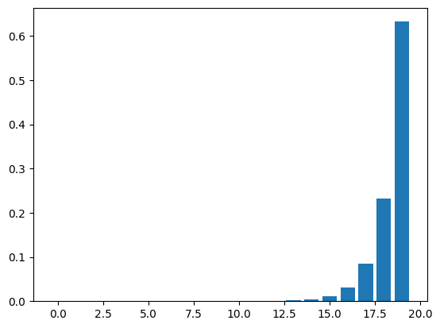

## Adversial Attack

### Supernormal Stimulus

The chicks preferred the dramatic contrast of the red stick with the yellow markings, therefore the artificial stimulus of the stick model was favored over the basic herring gull head and bill models, proving that the artificial stimuli was favored over the naturally occurring stimuli.


# **Lecture 11 - Intro in DL (2)**

**Epoche** - one full pass through the entire training dataset.  
Example: If you have 10,000 samples and batch size = 100 $\to$ 1 epoch = 100 updates.

## Optimization Algorithms

$|B|$ - batch, $|W|$ - weights.

1. **SGD**:

    $$
    \theta_{t+1} = \theta_t - \eta \nabla_\theta L_t
    $$

    By memory: $|B| + |W|$

2. **Momentum**: adds velocity

    $$
    v_{t+1} = \beta v_t + \nabla_\theta L_t
    $$

    $$
    \theta_{t+1} = \theta_t - \eta v_{t+1}
    $$

    By memory: $|B| + 2 |W|$

3. **Adagar**: scales learning rate by past gradients (so if gradients are small, we're learning faster)

    $$
    G_{t+1} = G_t + (\nabla_\theta L_t)^2
    $$

    $$
    \theta_{t+1} = \theta_t - \frac{\eta}{\sqrt{G_{t+1}} + \epsilon} \nabla_\theta L_t
    $$

    By memory: $|B| + 2 |W|$

    Even for Adagar learning rate _matters_.

4. **Adam**: Momentum + Adagar

    $$
    m_{t+1} = \beta_1 m_t + (1 - \beta_1) \nabla_\theta L_t
    $$

    $$
    v_{t+1} = \beta_2 v_t + (1 - \beta_2) (\nabla_\theta L_t)^2
    $$

    $$
    \hat{m}_{t+1} = \frac{m_{t+1}}{1 - \beta_1^{t+1}}, \quad \hat{v}_{t+1} = \frac{v_{t+1}}{1 - \beta_2^{t+1}}
    $$

    $$
    \theta_{t+1} = \theta_t - \eta \frac{\hat{m}_{t+1}}{\sqrt{\hat{v}_{t+1}} + \epsilon}
    $$

    By memory: $|B| + 3 |W|$

> Generally: Use Adam  
> Not enough memory: Use SGD with increased $|B|$ and learning rate.

**Learning rate decay** - technique used to gradually reduce the learning rate during training.

## Normalization

> Always **normalize** your inputs in the model.  

It helps with:

- **gradient explosion**

- **internal covariate shift** - the distribution of activations keeps changing as parameters update.

    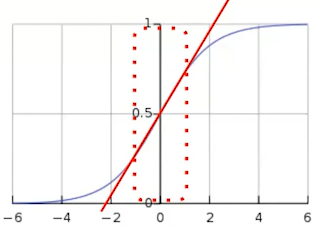

- _regularizations_

- _grid near 0_ denser for float

### Batch & Layer Normalization

**Sample** - example - one instance.  
**Batch** - bag of samples.

| Aspect                       | **Batch Normalization (BN)**                                                                                                           | **Layer Normalization (LN)**                                                                                             |
| ---------------------------- | -------------------------------------------------------------------------------------------------------------------------------------- | ------------------------------------------------------------------------------------------------------------------------ |
| **Normalization**       | Mean/variance computed over all samples in the batch, separately per feature.   | Mean/variance computed within a single sample, across all its features. |
| **Formulas**                 | $$\mu_d = \tfrac{1}{B}\sum_i x_{i,d}$$ $$\sigma_d^2 = \tfrac{1}{B}\sum_i (x_{i,d} - \mu_d)^2$$ $$\hat{x}_{i,d} = \tfrac{x_{i,d} - \mu_d}{\sqrt{\sigma_d^2 + \epsilon}}$$                                                | $$\mu_i = \tfrac{1}{D}\sum_d x_{i,d}$$ $$\sigma_i^2 = \tfrac{1}{D}\sum_d (x_{i,d} - \mu_i)^2$$ $$\hat{x}_{i,d} = \tfrac{x_{i,d} - \mu_i}{\sqrt{\sigma_i^2 + \epsilon}}$$                                |
| **Stability**                | Can destabilize if batch is too small or highly non-i.i.d. across batch.                                                               | Stable even with variable batch size or sequence lengths.                                                                |
| **Best for**          | CNNs (large batches and images are i.i.d.).                                                                 | Transformers, RNNs, NLP (batch statistics are unreliable).                                                   |

## Regularization

L1, L2, ElasticNet

### Dropout

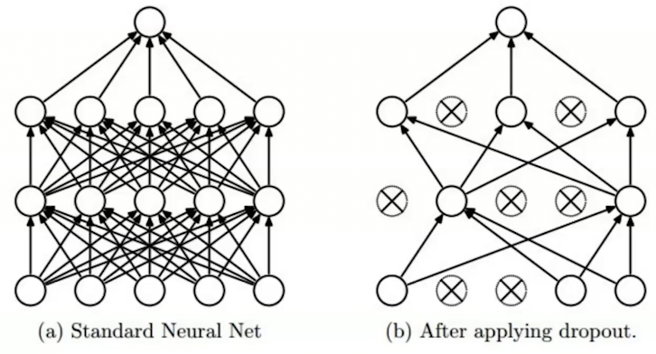

### Data Augmentation

Text augmentations.

Use `albumentations` library for CV.

# **Lecture 12 - CNN**

We apply CNN when _input_ data has structural relations within itself.

**Kernel** $\equiv$ **Filter**

CNN = Convolutions & Pooling & Dense Layers

> In the beginning they thought that kernel size should be big to capture features. But 3x3 or 5x5 are actually capture similiraly while having much less parameters.

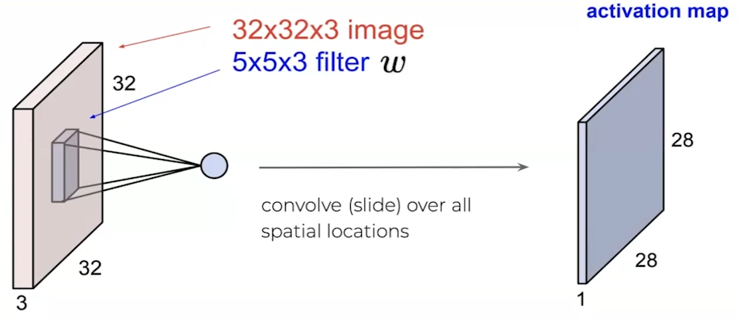

## Convolution Implementation

_Conceptually_, CNNs apply a small kernel sliding over an input.  
But under the hood, there are multiple equivalent views of how to do it.

> In practice: cuDNN/oneDNN benchmark several of these with your tensor shapes & datatype and cache the fastest choice.

### FFT-based convolution

...

### Direct convolution (loop-based)

Iterate spatially and apply kernel.

- Pros: low memory
- Cons: harder to optimize at scale

### im2col + GEMM

**GEMM** - general matrix–matrix multiplication.

- Input is "unrolled" into a big **Toeplitz-like** matrix (**im2col**) representation.
- Each row corresponds to one sliding window region of the input.
- The kernel (filter) is flattened into a vector.

Then convolution becomes:

$$
Y = X_{\text{im2col}} \cdot W
$$

- $X_{\text{im2col}}$ — very large, sparse matrix with duplicated pixel values.  
- $W$ — vector of kernel weights.  
- $Y$ — flattened output feature map.

The weights are **shared** and trainable.

- Cons: takes a lot of memory $\to$ avoided on GPUs; might be too sparsed

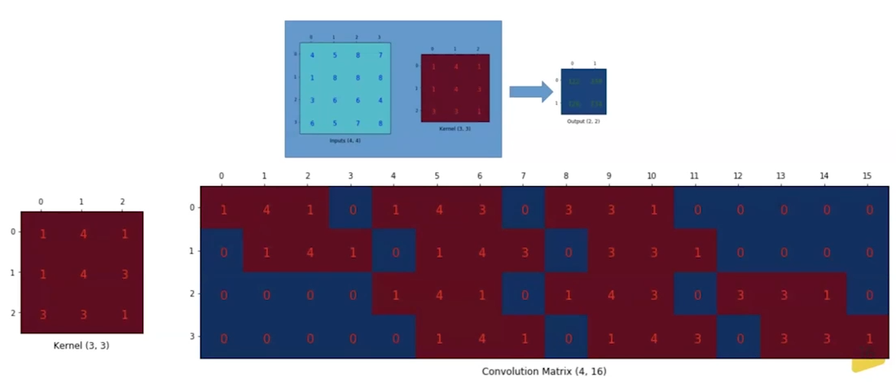

## Convolution VS Pooling

### Convolution

- Takes a kernel (with **learned weights**) and computes weighted sums of local regions.
- Formula (for 2D conv):
    $$
    y_{i,j} = \sum_{m,n} w_{m,n} \cdot x_{i+m,j+n} + b
    $$
- Parameters: kernel weights $w_{m,n}$ are **trainable**.

### Pooling

- Takes a fixed function (no learnable parameters) over a local region.
- Common: **max pooling** (take max), **average pooling** (take mean).
- Example (2×2 max pool):
    $$
    y_{i,j} = \max_{m,n \in \{0,1\}} x_{i+m,j+n}
    $$
- Parameters: **none**

### Summary

- **Convolution** extracts features by learning filters (edges, textures, patterns)

- **Pooling** reduces spatial size (**downsampling**).

## Intermidiate Features

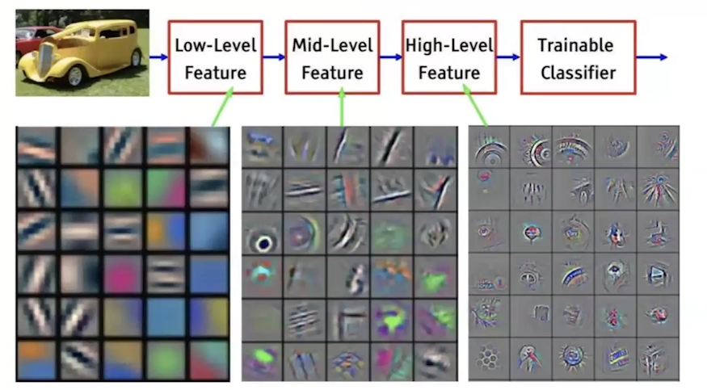

## Stride, Padding, Dilation

- **Stride** - step between 2 convolutions.

- **Padding** - to work with corners (filling zeros).

> Using padding we can keep the dimensionality when using convolution and do many iterations (with activation function).

- **Dilation**:
    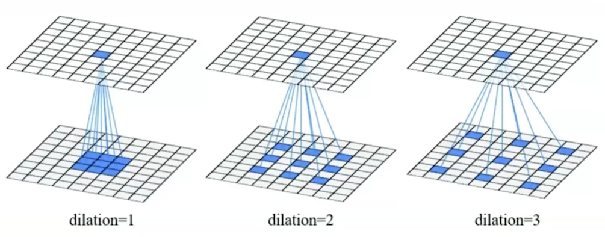

## LeNet (1988)

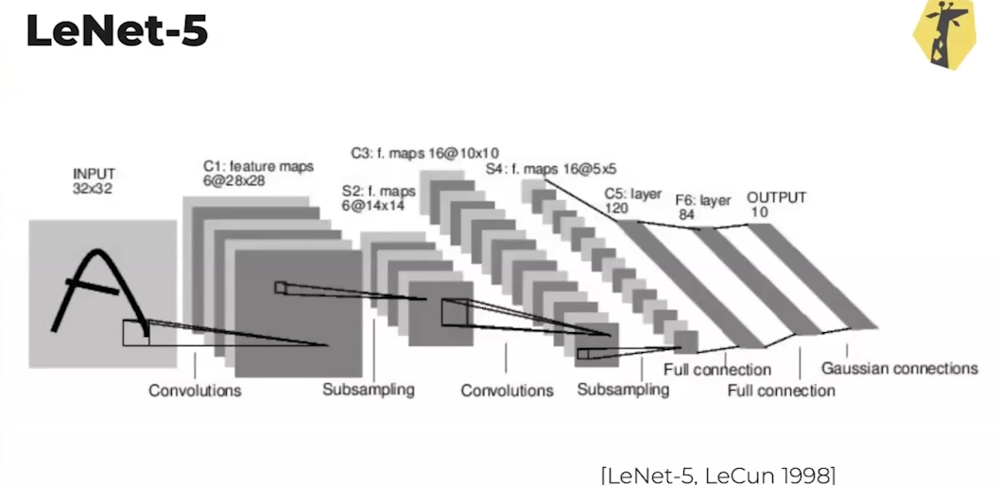

## AlexNet (2012)

The thing is that LeNet & AlexNet architectures are very alike.  
But AlexNet was trained on ton of data that LeNet didn't have.

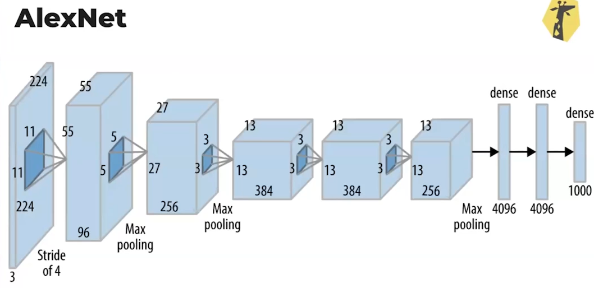

## GoogLeNet (2014)

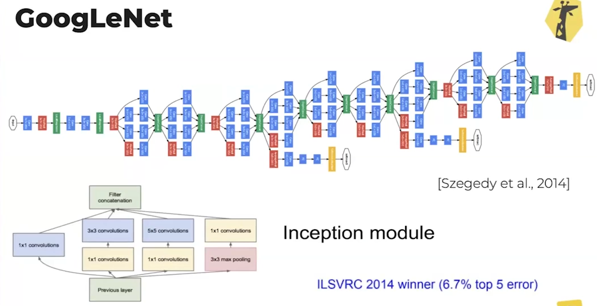

It has 3 heads in order to deal with diminishing gradients $\leftarrow$ now it's outdated:

- Skip connections let gradients flow directly back to earlier layers.
- Batch Normalization (BN, 2015) stabilizes activations and gradients.
- Adam, RMSProp, momentum-SGD with tuned learning rate schedules.

## ResNet (2015)

Using Residual Blocks with padding we can keep the dimensionality and do a lot of iterations with activation functions $\to$ in a way it looks like RNN for images!!

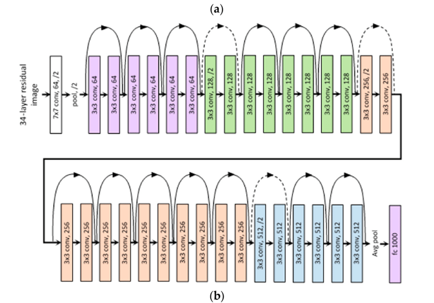

In a way ResNet is ensemble of models if we unwrap it.

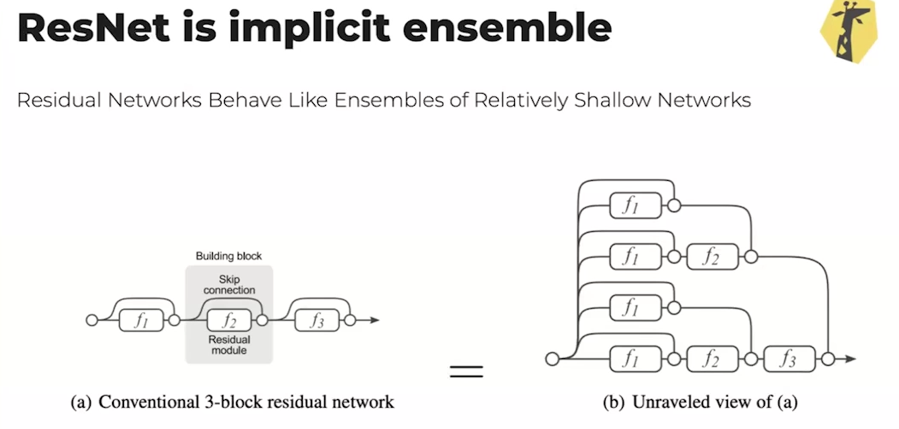

### Residual Block

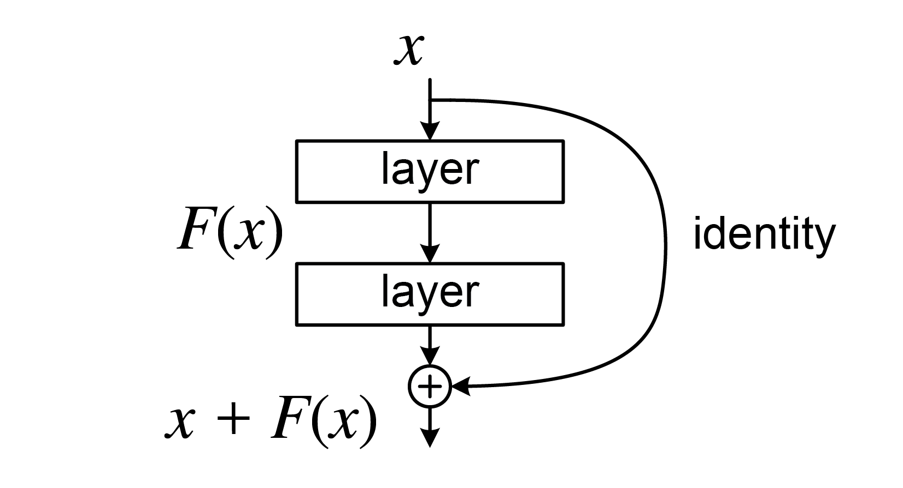

#### Idea

Instead of learning a direct mapping  

$$
y = \mathcal{F}(x)
$$

we let the block learn a **residual function**  

$$
y = \mathcal{F}(x) + x
$$

where:

- $x$ = input,  
- $\mathcal{F}(x)$ = output of a few layers (conv → BN → ReLU),  
- $x$ is added back via a **skip connection (shortcut)**.

This makes optimization easier: if the best mapping is "just pass input through," the block can learn $\mathcal{F}(x) \approx 0$, and the identity mapping survives.

#### Formula

$$
y = \sigma\big( \mathcal{F}(x, W) + W_s x \big)
$$

- $\mathcal{F}(x, W)$: transformation (stack of convs with weights $W$)  
- $W_s$: optional projection (identity or 1×1 conv)  
- $\sigma$: activation (ReLU)

# **Lecture 13 - RNN, LSTM**

## RNN

Idea:

Let the hidden state be initialized as:

$$
h_0 = \bar{0}
$$

The recurrence for hidden states is defined as:

$$
h_1 = \sigma(\langle W_{\text{hid}}[h_0, x_0] \rangle + b)
$$

$$
h_2 = \sigma(\langle W_{\text{hid}}[h_1, x_1] \rangle + b) = \sigma(\langle W_{\text{hid}}[\sigma(\langle W_{\text{hid}}[h_0, x_0] \rangle + b), x_1] \rangle + b)
$$

$$
h_{i+1} = \sigma(\langle W_{\text{hid}}[h_i, x_i] \rangle + b)
$$

The output distribution is computed as:

$$
P(x_{i+1}) = \text{softmax}(\langle W_{\text{out}}, h_i \rangle + b_{\text{out}})
$$

> But $h_0$ can be not 0, but some task specific context.

## Vanilla RNN

Vanilla RNN uses $\tanh$, because $h_t$ should be i.i.d. $\to$ can't use ReLU (ReLU + BatchNorm is okay).

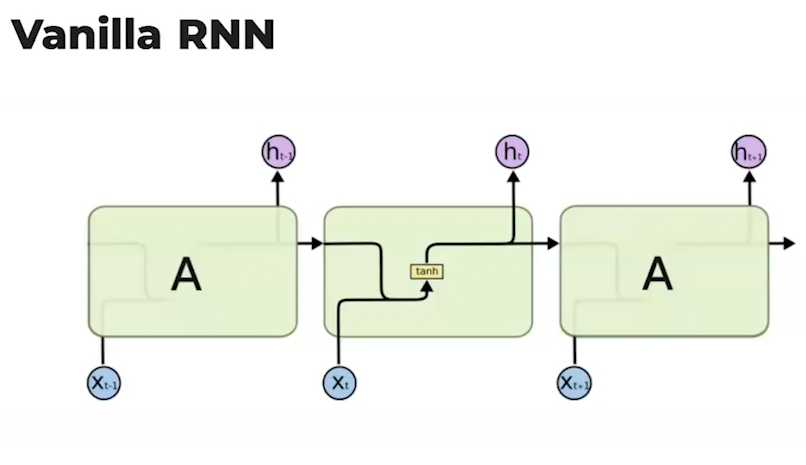

The update rule is:

$$
h_t = \phi(W_h h_{t-1} + W_x x_t + b)
$$

- $h_t$ - **hidden state** (not the target variable)

We input $h_t$ nput to a prediction layer:

$$
\hat{y}_t = g(W_y h_t + b_y)
$$

## LSTM

1. forget gate
2. input gate
3. output gate

- $C_t$ (**cell state**): the **internal long-term memory** of the LSTM, updated additively by gates.

- $h_t$ (**hidden state**): the **output** of the LSTM at timestep $t$, a gated and squashed view of $C_t$, used for predictions or passed to the next layer.

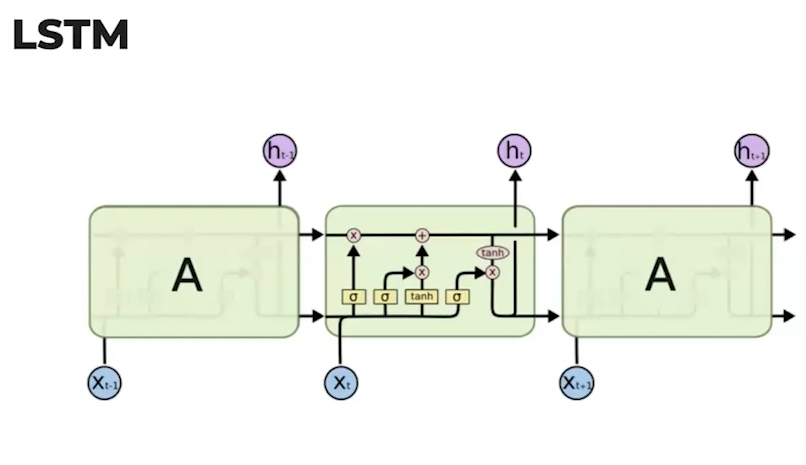

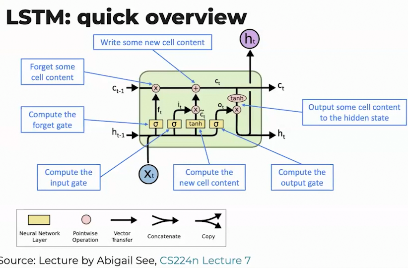

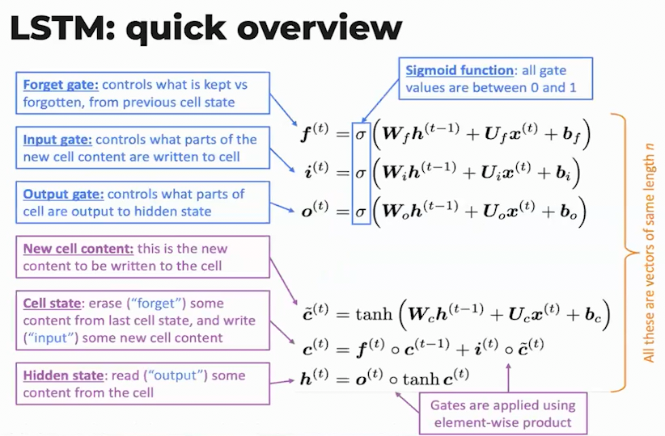

LSTM also solves the problem of **vanishing/exploting gradient**.

We can **parallelize** RNNs & LSTMs training by parallelizing inputs in batches.

## LSTM's Layers

> An **LSTM can be stacked in layers**, just like CNN.

The **output hidden states** from one LSTM layer $(h_t^{(1)})$ are fed as the **inputs** to the next LSTM layer:

$$
h_t^{(l)} = \text{LSTM}^{(l)}(h_{t-1}^{(l)}, h_t^{(l-1)}, C_{t-1}^{(l)})
$$

- $l$ = layer index,  
- $h_t^{(0)} = x_t$ (the original input).

Analogous to CNNs: first layers catch edges, later layers catch objects.

# **Lecture 14 - Self-Supervised Learning**

## Self-Supervised Learning (SSL)

**Self-supervised learning** - subfield of **unsupervised learning** where, instead of relying on external manual labels, the model defines a pretext task with automatically obtainable labels.

> The thing is to use SSL-trained model as a base for later used for downstream tasks model.

Advantages:

- Reduces dependence on expensive labeled data.

- Provides general-purpose representations (foundation models).

- Scales extremely well with data size.

### Learning to inpaint by reconstruction

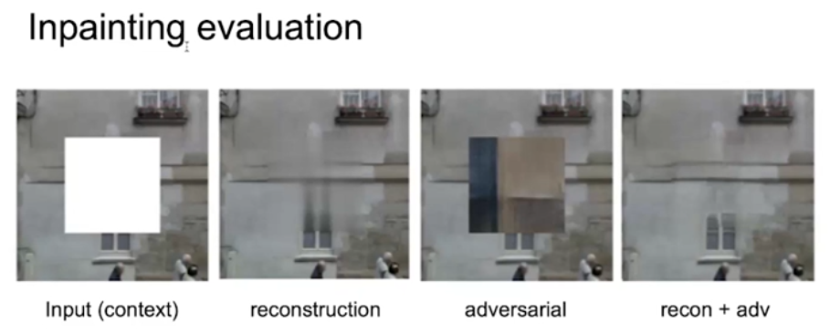

### Image Coloring

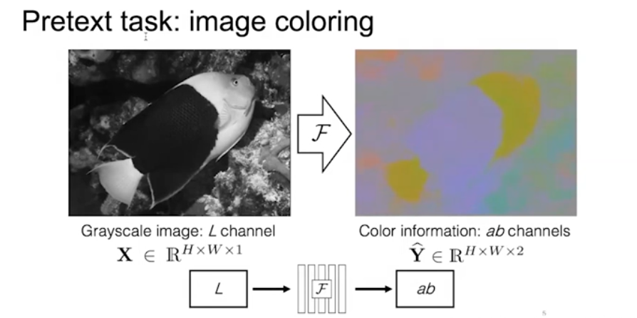

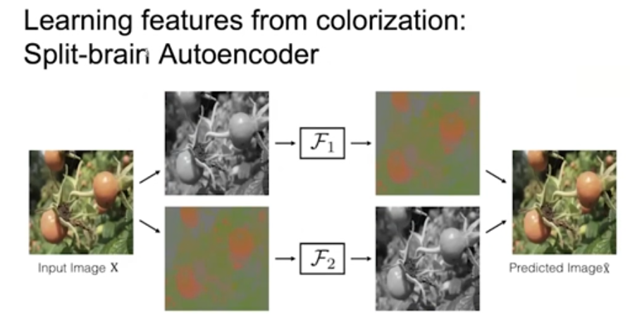

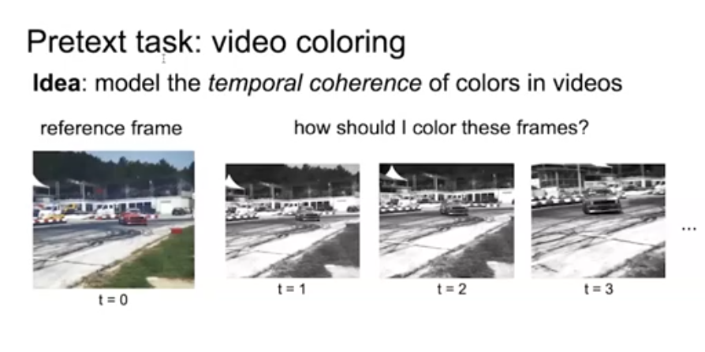

### Contrastive Representative Learning

- Similar samples (positive pairs) are close together
- Dissimilar samples (negative pairs) are far apart

Goal: learn embeddings that capture semantic structure without manual labels.

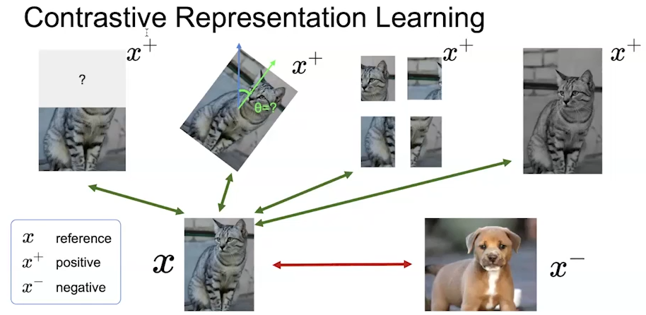

### SimCLR (Google, 2020)

Augmentations + InfoNCE loss.

SimCLR exceeded supervised baselines on **ImageNet** with no labels during pretraining.  
Inspired a huge wave of contrastive and non-contrastive (BYOL, SimSiam) approaches.

### CLIP (OpenAI, 2021)

CLIP learns a joint vision–language embedding space by contrasting images and natural language descriptions.

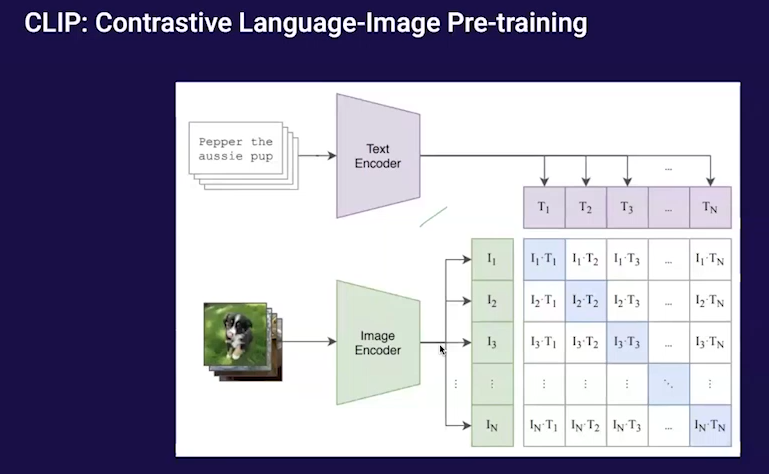

After CLIP we got **diffusion models**!

# **Lecture 15 - Unsupervised Learning**

## Manifold assumption & Latent Space

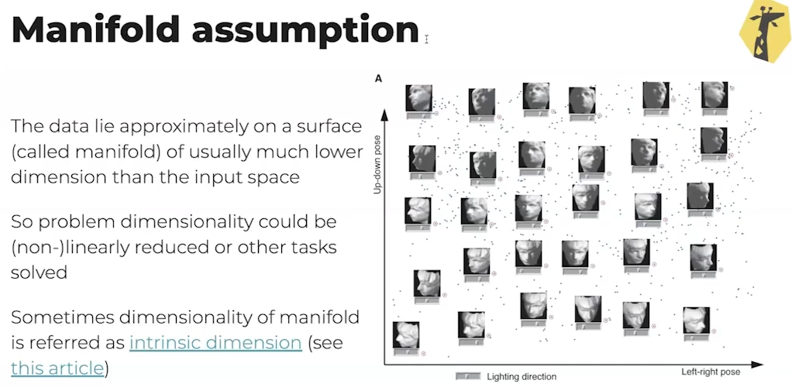

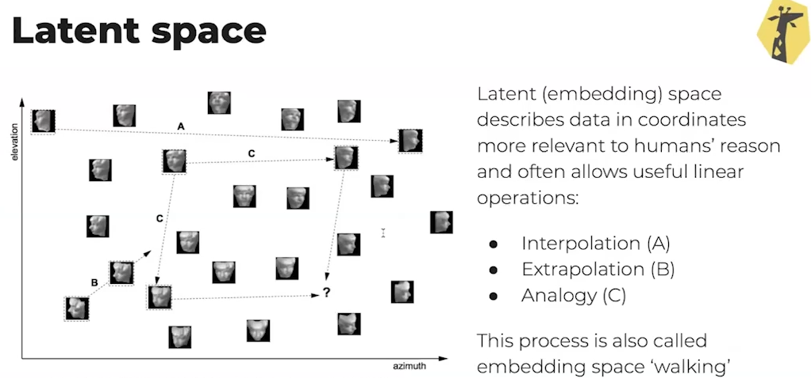

### Word2Vec

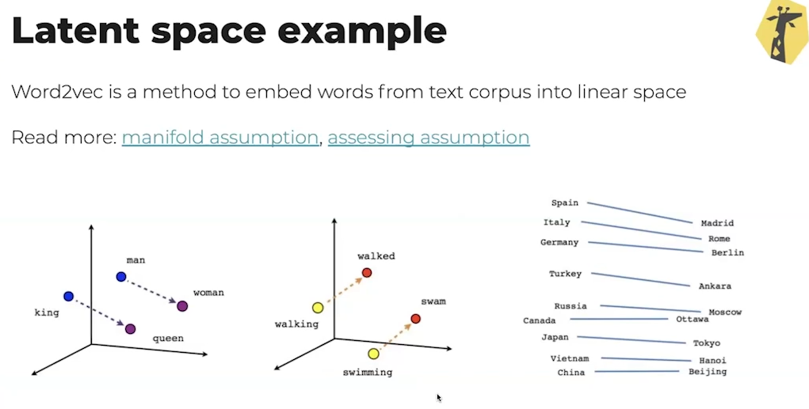
