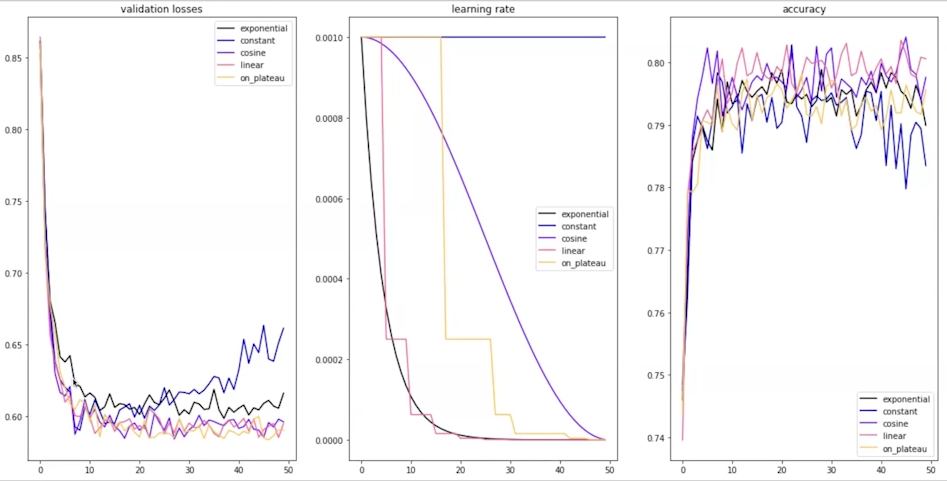
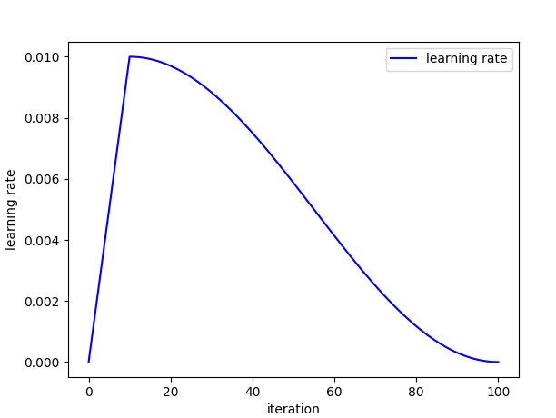
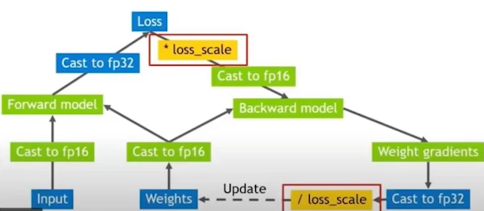
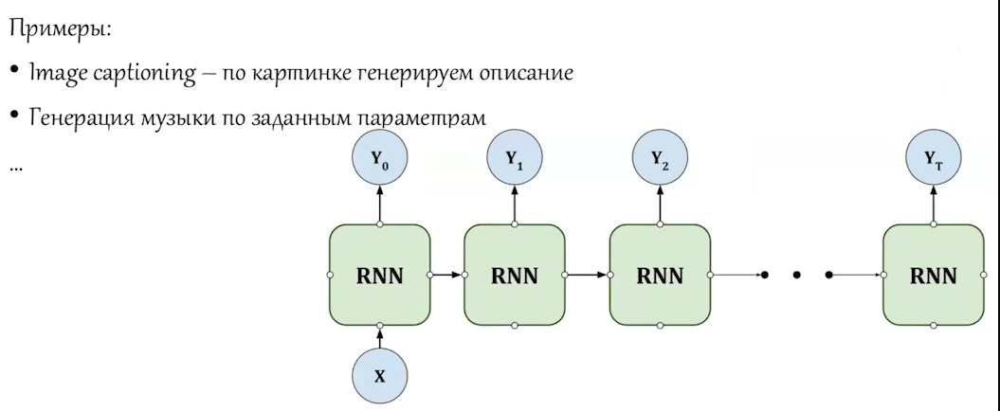
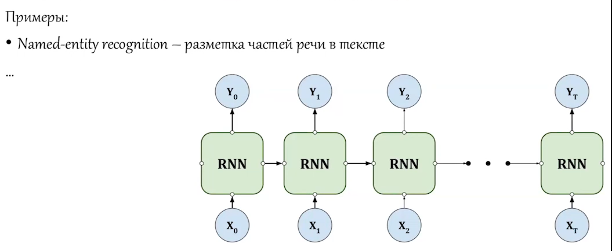
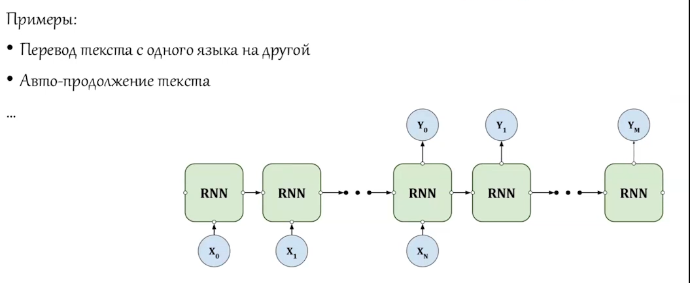
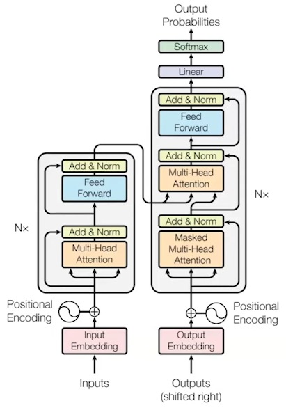
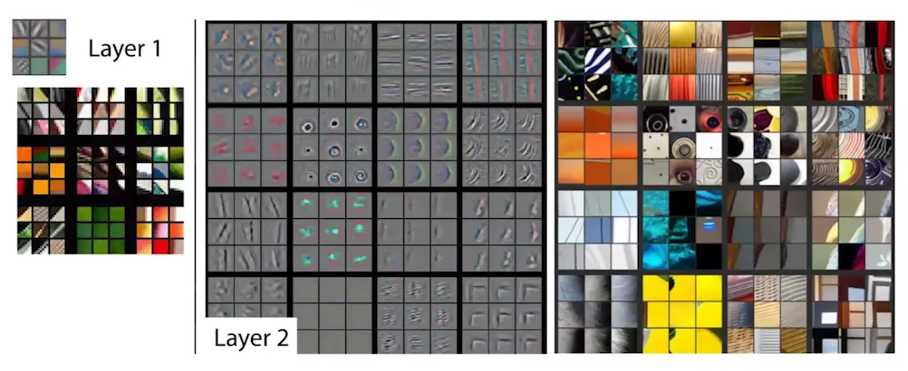
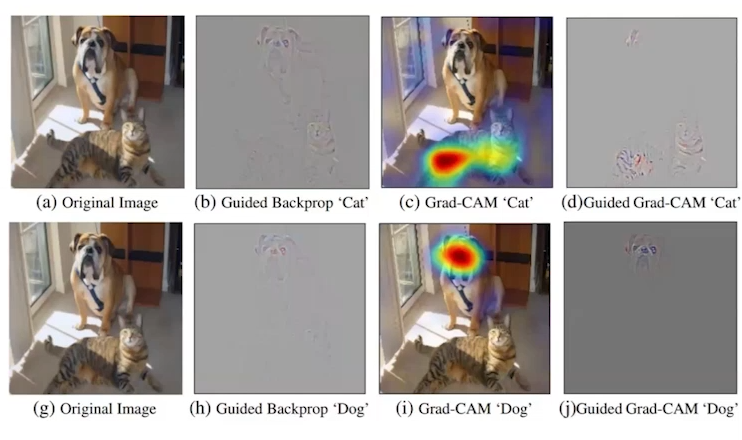

<!-- markdownlint-disable MD024 MD025 -->

# **Lecture 1,2 - Tips & Tricks**

## Working with Pre-trained Model

### Finetuning

> You can do Transfer Learning first and then after training new layers do full Finetuning

### Transfer Learning

### LoRA

[PERF](https://github.com/huggingface/peft) - HuggingFace's LoRA

### Distillation

### Quantizattion

### Triplet loss

## Convergence

### Learning Rate Scheduler

Adam's adaptiveness is not enough.

`torch.optim.lr_scheduler.ReduceLROnPlateau` is nice!



### Warmup

_Statistics gathering_ optimizers need a bit of first steps in order to see path way clearly.



### Loss Scaling



## Overfitting

### Label Smoothing

Changing one-hot to weak one-hot:

[0, 0, 1, 0, 0, 0] $\to$ [0.02, 0.02, 0.9, 0.02, 0.02, 0.02]

> Not that often used.

### Temperature

Use this like with Learning Rate Scheduler (inversed)!

### Noise

Adding noise to input data (especially good with images).

### Augmentations

> Don't do augmentations in validation/test sets.

# **Seminar 1**

## Musthaves

- Do BatchNorm _before_ DropOut.

- Paste only parameters that `require_grad` into optimizer.

- Via increasing hidden layer size (10 -> 20 -> 30 -> ...) we try to learn heavier (larger) patterns in our data.

## Training & Evaluation

```py
criterion = nn.NLLLoss()

def train(model, optimizer, loader, criterion):
    model.train()
    losses_tr = []

    for images, targets in tqdm(loader):
        # Zero out gradients
        optimizer.zero_grad()

        # Move everything to the correct device
        images = images.to(device)
        targets = targets.to(device)

        # Forward pass and loss computation
        out = model(images)
        loss = criterion(out, targets)

        # Backward pass, optimizer step
        loss.backward()
        optimizer.step()

        losses_tr.append(loss.item())

    return model, optimizer, np.mean(losses_tr)


def val(model, loader, criterion, metric_names=None):
    model.eval()
    losses_val = []

    if metric_names:
        metrics = {name: [] for name in metric_names}

    with torch.no_grad():
        for images, targets in tqdm(loader):
            # Same as training, but without backward pass and optimizer step
            images = images.to(device)
            targets = targets.to(device)
            out = model(images)
            loss = criterion(out, targets)
            losses_val.append(loss.item())

            if metric_names and 'accuracy' in metrics:
                _, pred_classes = torch.max(out, dim=1)
                metrics['accuracy'].append(
                    (pred_classes == targets).float().mean().item()
                )

    if metric_names:
        for name in metrics:
            metrics[name] = np.mean(metrics[name])

    if metric_names:
        return np.mean(losses_val), metrics
    else:
        return None
```

### Learning Loop

```py
def learning_loop(
    model,
    optimizer,
    train_loader,
    val_loader,
    criterion,
    scheduler=None,
    min_lr=None,
    epochs=10,
    val_every=1,
    draw_every=1,
    metric_names=None
):
    losses = {'train': [], 'val': []}

    for epoch in range(1, epochs + 1):
        print(f'{epoch}/{epochs}:')

        model, optimizer, loss = train(model, optimizer, train_loader, criterion)
        losses['train'].append(loss)

        if not (epoch % val_every):
            pass
            # `scheduler.step()` here too

        if not (epoch % draw_every):
            pass
```

### `model.train()` & `model.eval()`

| Mode          | Dropout                        | BatchNorm                                |
|---------------|--------------------------------|------------------------------------------|
| `model.train()` | ON (randomly drops neurons)    | Uses current batch’s mean & variance      |
| `model.eval()`  | OFF (all neurons active)       | Uses running averages collected in training |

# **Lecture 2 - Attention & Transormers**

## Embeddings

1. Word embeddings
2. Text embeddings (sentence)

## Sequence Tasks

### Seq2One


### One2Seq



### Seq2Seq Same



### Seq2Seq Different



## Transformer

[Attention Is All You Need [2017]](https://arxiv.org/abs/1706.03762)

## Attention (Idealogically)

All RNN-like architectures suffer from forgetting information.

- Relevancy **score**: $ s_i = score(h_i, z) $ - can be scalar multiplication, bilinear form, NN, ... everything that can turn $h_i$ and $z$ into single number.

- Probabilities: $ a_1, a_2, \ldots = \mathrm{softmax}(s_1, s_2, \ldots) $

- Context: $ c = \sum_i a_i h_i $

- New feature set: $ \tilde{z} = [c; z] $


## Multi-Head Attention

### Step 1: Input Representations

$$
X \in \mathbb{R}^{n_{sequence} \times d_{\text{embedding}}}
$$
where row $X_i$ is the embedding of token $i$.  

### Step 2: Q, K, V

The Transformer learns **three linear projection matrices per head**:

$$
W^Q \in \mathbb{R}^{d_{\text{model}} \times d_k}, \quad
W^K \in \mathbb{R}^{d_{\text{model}} \times d_k}, \quad
W^V \in \mathbb{R}^{d_{\text{model}} \times d_v}
$$

Then:

$$
Q = X W^Q, \quad K = X W^K, \quad V = X W^V
$$

- $Q \in \mathbb{R}^{n \times d_k}$ (queries) - "What am I looking for?"

- $K \in \mathbb{R}^{n \times d_k}$ (keys) - "What properties do I have?"

- $V \in \mathbb{R}^{n \times d_v}$ (values) - "What information should I pass on if selected?"

### Step 3: Scoring Queries Against Keys

How much should token $i$ pay attention to token $j$?

The raw **attention score** between query $Q_i$ and key $K_j$ is:

$$
\text{score}(i,j) = Q_i \cdot K_j^T = \sum_{m=1}^{d_k} Q_{i,m} K_{j,m}
$$

$$
\text{Scores} = Q K^T \in \mathbb{R}^{n \times n}
$$

Row $i$ = how much token $i$ attends to all tokens.

### Step 4: Scaling by $\sqrt{d_k}$

#### **Assumptions**

1. $$
    \mathbb{E}[k_i] = \mathbb{E}[q_i] = 0, \quad \mathrm{Var}[k_i] = \mathrm{Var}[q_i] = 1
    $$

    [Under standard weight initialization (e.g., Xavier) that is okay :)]

2. $ k_i, q_i $ are _independent_ across dimensions

Then:

$$
\mathrm{Var}[K^\top Q]
= \sum_{i=1}^{d_k} \mathrm{Var}[k_i q_i]
= \sum_{i=1}^{d_k} \mathrm{Var}[k_i] \mathrm{Var}[q_i]
= d_k
$$

#### **Scaling**

Because large values push softmax into saturation, leading to vanishing gradients, we scale by $\sqrt{d_k}$ (like temperature):

$$
\text{ScaledScores} = \frac{Q K^T}{\sqrt{d_k}}
$$

### Step 5: Attention

**Attention weights**:

$$
A = \text{softmax}\!\left(\frac{Q K^T}{\sqrt{d_k}}\right) \in \mathbb{R}^{n \times n}
$$

- Row $i$: distribution over which tokens $i$ attends to.  
- Each row sums to 1.  

**Attention output**:

$$
\text{Attention}(Q, K, V) = AV
$$

### Step 6: Multi-Head Attention

> _multi_-head attention instead of a _single_ head to focus on different representation subspaces: Syntactic structure, Positional patterns, Semantic roles, ...

For $h$ heads, we repeat the above with different projection matrices:

$$
\text{head}_i = \text{Attention}(X W_i^Q, \, X W_i^K, \, X W_i^V)
$$

Then concatenate:

$$
\text{MHA}(X) = \text{Concat}(\text{head}_1, \dots, \text{head}_h) W^O
$$

with $W^O \in \mathbb{R}^{hd_v \times d_{\text{model}}}$.

## Positional Encoding

Since the Transformer has no recurrence/convolution, it adds positional encodings (sinusoidal or learned) to capture order.

The **position encoding** is just _added_ to embedding.

### Sinusoidal Positional Encoding (from the paper)

Vaswani et al. (2017) proposed **fixed sinusoidal encodings**.

For a token at position $pos$ and dimension index $i$:

$$
PE_{(pos, 2i)} = \sin\!\left(\frac{pos}{10000^{2i / d_{\text{model}}}}\right)
$$

$$
PE_{(pos, 2i+1)} = \cos\!\left(\frac{pos}{10000^{2i / d_{\text{model}}}}\right)
$$

- $pos \in [0, n-1]$ = token position in the sequence.  
- $i \in [0, d_{\text{model}}/2 - 1]$.  
- $d_{\text{model}}$ = embedding dimension.  

### Learnable Positional Encoding

An alternative: treat position embeddings as **trainable parameters**:

$$
PE \in \mathbb{R}^{n_{\text{max}} \times d_{\text{model}}}
$$

- Advantage: more flexibility.  
- Disadvantage: poor extrapolation to longer sequences.

### Relative Positional Encoding (Modern Variant)

Later work (Transformer-XL, T5, GPT-NeoX) often uses **relative encodings**:

- Instead of absolute positions, attention scores depend on _relative distance_ between tokens.  

$$
\text{score}(i,j) = \frac{Q_i K_j^T + Q_i R_{i-j}^T}{\sqrt{d_k}}
$$

where $R_{i-j}$ encodes the relative offset.  

This improves _long_-context handling.

## Encoder-Decoder



- **Encoder** (left block): processes the input sequence into a contextual representation.

- **Decoder** (right block): generates the output sequence one token at a time.

  Attends both to previously generated tokens and the encoder’s representation:

  - Queries $\{Q_i\}$ come from the decoder.
  - Keys $\{K_i\}$ & Values $\{V_i\}$ come from encoder output.

  Allows decoder to focus on relevant input parts when generating output.

> Embeddings flow from the last layer of Encoder block into all Decoder block's attention (not from the respective (соответствующих) layers).

### Masked Multi-Head Attention

The mask is just 0&1 matrix for decoder not to look into future.

## BERT (encoder-only)

Bidirectional Encoder Representations from Transformers.

### Mask Language Modelling

- Randomly mask ~15% of tokens in input to predict.

That's why it's encoder-only, it get's full sequence, but some word are marked ("cat ___ fish") $\to$ learns to fill in.  
So it's not best for predicting the following word, rather having a context fill skipped word(s).

### RoBERTa

| Change             | Description                            |
| ------------------ | -------------------------------------- |
| Removed **NSP**      | Only **MLM** objective used                |
| More data       | Used 160 GB of text (vs BERT’s ~16 GB) |
| Longer training  | Trained for more steps                 |
| **Dynamic masking** | Recomputed masked positions each epoch |
| Larger batches  | Allowed more stable optimization       |

## GPT-x (decoder-only)

Generative Pretrained Transformer.

## BART

Encoder reads corrupted text in full (like BERT).

Decoder generates clean text autoregressively (like GPT).

### Why GPT-x, but not BART?

1. Masked LM (BERT) and denoising (BART) objectives don’t scale as smoothly $\to$ GPT-x fits the “**just throw more data + compute**” recipe better.

2. BART’s denoising autoencoder focuses more on _reconstruction_: summarization, translation, etc., but less natural for open-ended dialogue, code writing, reasoning $\to$ GPT objective = more general-purpose.

# **Lecture 3 - DL Interpretation**

## _CV part_

## 1. Receptive Field

**Receptive field**: for a given neuron in that feature map, it’s the region of the original input image that could affect that neuron’s value.


## 2. Deconvolutional Network

0. Start with some feature map (CNN's layer) [usually, last]

1. **Deconvolution** - `conv2d_transpose` - apply the transpose of the convolution filter to map activations back toward pixel space.

2. **Unpolling** - reverse pooling by placing activations back into their original pooled positions.

3. **Rectification** - apply the same nonlinearity rules (e.g., keep only positive signals).

4. Repeat layer by layer until reaching the input.




## 3. Gradient-Based

- **Saliency maps** = interpret existing input:

  - Freeze image.
  - Compute gradients of output w.r.t. input.
  - Highlight which input pixels matter for the current prediction.

- **Activation maximization** = generate prototype input.

  - Freeze model parameters.
  - Start with a random/noise image.
  - Optimize the input image itself via gradient ascent so that it maximally activates a chosen neuron/class.

  > Kinda looks like picture for adversarial attack!

  The result is a synthetic image showing what the model “thinks” that class looks like.

  

  $\to$ CNN's look at textures, not at objects.

## 4. Guided Backpropagation

**Guided Backpropagation** improves saliency maps by modifying how ReLUs are handled during backprop.

- In normal backprop:  
    If the forward ReLU output was zero, its gradient is blocked.

- In guided backprop:  

    A gradient is passed only if both the _forward activation and the backward gradient_ (`deconv`) are positive (where it's negative $\to$ 0).

    This “guides” the signal to highlight pixels that positively contribute to the activation.


## 5. CAM

### GAP

**GAP (Global Average Pooling)** compresses each feature map into one value by averaging all its activations, replacing dense layers at the end of CNNs.

So if the last conv layer has 512 feature maps, GAP produces a 512-dimensional vector.

**CAM (Class Activation Mapping)** only works with architectures that end with GAP before the final classification layer.

The _heatmap_ as a weighted sum of feature maps is produced.

## 6. GradCAM

- CAM: directly uses classifier weights.

- Grad-CAM: uses gradients to infer “which feature maps matter” for the class of interest.

## 7. Guided GradCAM



## _LLM part_

Transformer is super easy interpreted, because attention gives importance of each (outputed) word to each (inputted) word.

# **Seminar 3**

## Working with Parameters

`nn.Parameter` - learnable parameters.

```py
class MyNNLinear(nn.Module):
    def __init__(self, in_features, out_features):
        super().__init__()

        self.weights = nn.Parameter(torch.randn(in_features, out_features))
        self.bias = nn.Parameter(torch.randn(out_features))
    
    def forward(self, x):
        return x @ self.weights + self.bias


class MyNet(nn.Module):
    def __init__(self, input_size, output_size):
        super().__init__()
        self.l0 = MyNNLinear(input_size, 2)
        self.l1 = MyNNLinear(2, output_size)
    
    def forward(self, x):
        x = self.l0(x)
        x = F.relu(x)
        x = self.l1(x)
        return x


class MyBiggerNet(nn.Module):
    def __init__(self, input_size, output_size):
        super().__init__()
        self.net0 = MyNet(input_size, 3)
        self.net1 = MyNet(3, output_size)
    
    def forward(self, x):
        x = self.net0(x)
        x = F.relu(x)
        x = self.net1(x)
        return x

net = MyBiggerNet(4, 1)
print([*net.named_children()])
print([*net.net0.l0.parameters()])
```

```py
torch.save({
    "epoch": epoch,
    "model_state_dict": model.state_dict(),
    "optimizer_state_dict": optimizer.state_dict(),
    "scheduler_state_dict": scheduler.state_dict() if scheduler is not None else None,
    "loss": loss,
}, path)

# in reality we could save more frequently, because for LLM's epoch could be 10.000 batches or more.
```

### `torch.register_buffer`

Buffer are non-trainable parameters.

For example, `running_mean`, `running_var` statistics in BatchNorm are buffers.

## Xavier Initialization

[2010, Understanding the difficulty of training deep feedforward neural networks](https://proceedings.mlr.press/v9/glorot10a/glorot10a.pdf)

The goal is to keep the variance of activations (forward pass) and the variance of gradients (backward pass) roughly the same across all layers.  
If the variance shrinks or grows layer by layer, you get _vanishing_ or _exploding gradients_.

> Best suited for **sigmoid** or **tanh** activations.

### Idea

For a neuron: $ y = \sum_{i=1}^{n_{in}} W_i x_i $

- Step 1. Forward pass (activations)

    $$
    Var(y) = n_{in} \cdot Var(W) \cdot Var(x)
    $$

    To keep activations stable:

    $$
    Var(y) \approx Var(x) \quad \Rightarrow \quad Var(W) \approx \frac{1}{n_{in}}
    $$

- Step 2. Backward pass (gradients)

    To keep gradients stable:

    $$
    Var(W) \approx \frac{1}{n_{out}}
    $$

- Step 3. Balance both

    To satisfy both forward and backward constraints, Xavier takes the average:

    $$
    Var(W) = \frac{1}{2}\left(\frac{1}{n_{in}} + \frac{1}{n_{out}}\right)
    = \frac{2}{n_{in} + n_{out}}
    $$

### Formula

$$
Var(W) = \frac{2}{n_{in} + n_{out}}
$$

- **Uniform distribution**:  
    $$
    W \sim U\left(-\sqrt{\frac{6}{n_{in} + n_{out}}}, \, \sqrt{\frac{6}{n_{in} + n_{out}}}\right)
    $$

- **Normal distribution**:  
    $$
    W \sim \mathcal{N}\left(0, \frac{2}{n_{in} + n_{out}}\right)
    $$

## He (Kaiming) initialization

It focuses purely on forward variance preservation, because for `ReLU` the main danger is **vanishing activations**.

> nn.Linear is initialized by He by default!

It ignores the gradient balancing part of Xavier:

$$
Var(W) = \frac{2}{n_{in}}
$$

# **Seminar 3.2**

> HuggingFace's website is not up to date $\to$ better to look at HuggingFace's github.

## [Streamlit](https://github.com/streamlit/streamlit)

```py
pip install streamlit
```

# **Lecture 4 - Generative NN**

UPD: moved to [generative notes](../generative/notes.md).

## Generation Evaluation Metrics

### 2.1 Inception Score (IS)

Given generator samples $ x = G(z) $ and a classifier giving $ p(y|x) $:

$$
\mathrm{IS} = \exp \left( \mathbb{E}_{x \sim p_g} \left[ D_{\mathrm{KL}}(p(y|x) \,\|\, p(y)) \right] \right)
$$

where

$$
p(y) = \int p(y|x) \, p_g(x) \, dx
$$

#### **Intuition:**

- **Sharpness**: $ p(y|x) $ has low entropy for clear, classifiable images.  
- **Diversity**: $ p(y) $ has high entropy across samples.  
- High IS $\to$ sharp & diverse samples.

#### **Limitations:**

- No direct comparison to real data.  
- Depends on pretrained classifier domain.  

### 2.3 Learned Perceptual Image Patch Similarity (LPIPS)

While IS and FID focus on _distribution_ level, they don't directly measure **perceptual similarity** between individual generated images and real targets.

**LPIPS** (Zhang et al., 2018) - perceptual similarity metric, designed to better correlate with human visual judgments.

#### **Definition & Idea**

Given two images $ x $ and $ x' $, LPIPS compares **deep feature maps** extracted from a pretrained network (e.g., AlexNet, VGG, SqueezeNet):

1. Pass both images through a fixed pretrained network $ \phi $.  
2. Extract feature activations at multiple layers:  
   $$
   \phi^l(x), \; \phi^l(x') \quad \text{for layers } l=1,\dots,L
   $$
3. Normalize feature maps channel-wise: $ \hat{\phi}^l $
4. Compute:

$$
\mathrm{LPIPS}(x, x') = \sum_{l} w_l \cdot \| \hat{\phi}^l(x) - \hat{\phi}^l(x') \|_2^2
$$

#### **Intuition**

- Captures high-level perceptual structure rather than pixel-wise differences
- Lower LPIPS = more perceptually similar.

#### **Usage**

- Often reported alongside FID.
