# **Lecture 1 - Intro**

## Deep|Early Fusion

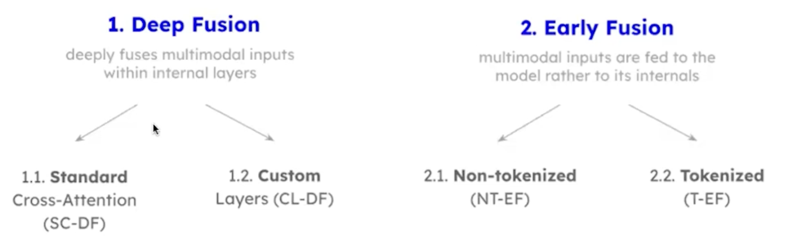

## 1. Deep Fusion: Standard CA

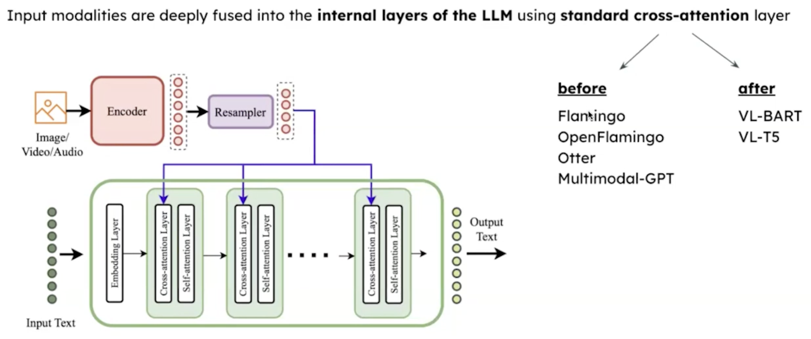

### Flamingo [OpenFlamingo (2022)]

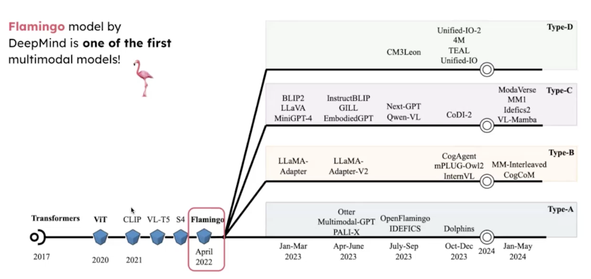

### ViT Tokenization

1. For a 224×224 image with 16×16 patches, you get 14×14 = 196 patches.

2. Flatten each patch (**16×16×3 = 768 numbers**) and pass it through a linear projection $\to$ a vector of dimension $d$ (say 1024) $\equiv$ 196 tokens of 1024.

3. Add positional embeddings so the model knows where each patch came from spatially.

4. Run the whole sequence through transformer blocks (self-attention over patches).

### Flamingo: Perciever Resampler

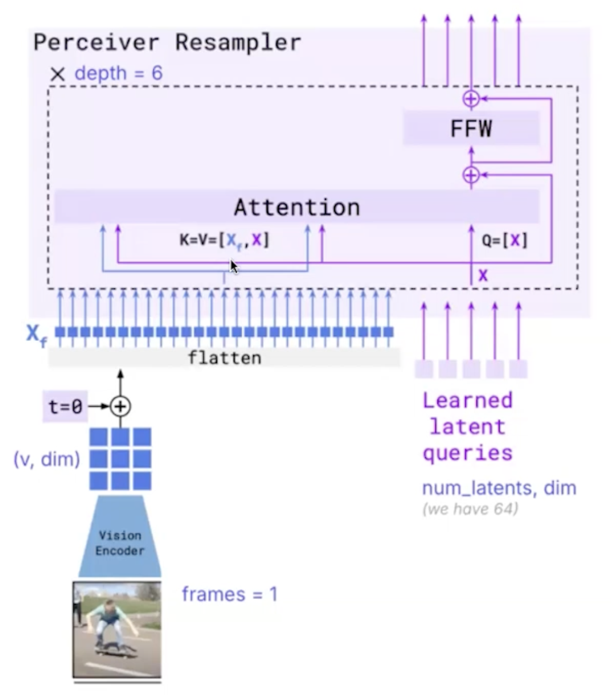

#### **Purpose**

Compresses variable-length encoder outputs (image/video/audio features) into a **fixed, small** number of tokens for the LLM's cross-attention. Originated in Flamingo, based on Perceiver IO.

#### **Why**

Cross-attention cost is $O(N \cdot M)$ — too expensive if $M$ is huge (for ViT above it's 196×1024 patch×dim).

Solution: compress to fixed `num_latents` (e.g. 64×1024 patch×dim) before feeding the LLM.

#### **Architecture**

A small set of **learned latent queries** cross-attend to the encoder features and "soak up" the relevant content.

Attention cost becomes $O(num_latents \cdot N)$ instead of $O(N^2)$, and output is always `[num_latents, d]`.

- `latents`: `nn.Parameter` of shape `[num_latents, d]` (e.g. `[64, 1024]`)

- Stack of $L$ layers (Flamingo: L=6):
  1. **Cross-attention**: $Q$ from latents; $K$, $V$ from **concat** of [encoder features, layers]
  2. **Feed-forward network (FFN)**

  - Both with residual connections + LayerNorm

#### **Why concat**

> We do **concat** for $K$, $V$, because now each latent attends to all encoder tokens **and** all other latents (including itself) in a single attention operation.

We could do _separate self-attention layer_ — and **Q-Former (BLIP-2)** does exactly that: separate cross-attention (latents $\to$ encoder) and self-attention (latents $\to$ latents) blocks.  
But Flamingo's concat trick fuses both into a single attention operation, which has a few advantages.

### Flamingo: Feature Fusion

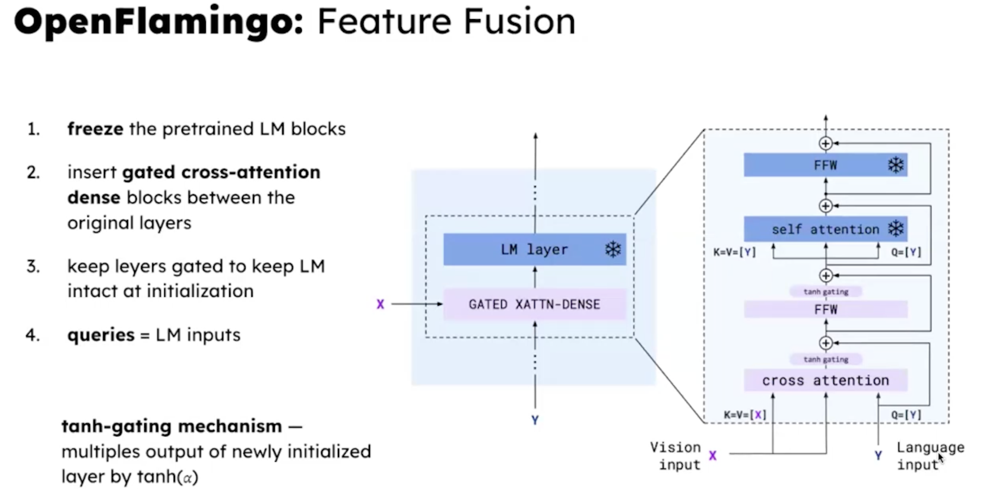

### Flamingo:  $\tanh$-gating Mechanism

Wrap each new layer's output in a tanh gate with a learnable scalar $\alpha$, initialized to zero.

$$\text{output} = \text{residual} + tanh(\alpha) * \text{cross attention(...)}$$

At init: $tanh(0) = 0$, so the new cross-attention contributes nothing $\to$ pretrained capabilities fully preserved.

During training: $\alpha$ is learnable. Gradients flow through tanh, $\alpha$ drifts away from zero, and the cross-attention's contribution gradually "turns on." The model learns how much to trust the new modality pathway.

Why $\tanh$ specifically:

- Bounded in [-1, 1] — prevents the new layer from blowing up the residual stream early in training when it's still noisy.

- Smooth and differentiable everywhere — clean gradients, no dead zones like `ReLU`.

- Zero-centered — $\alpha$ can drift positive or negative; the model can learn to subtract the contribution if useful.

- Saturating — once $\alpha$ gets large, tanh plateaus, so the gate naturally caps the contribution rather than letting it dominate.

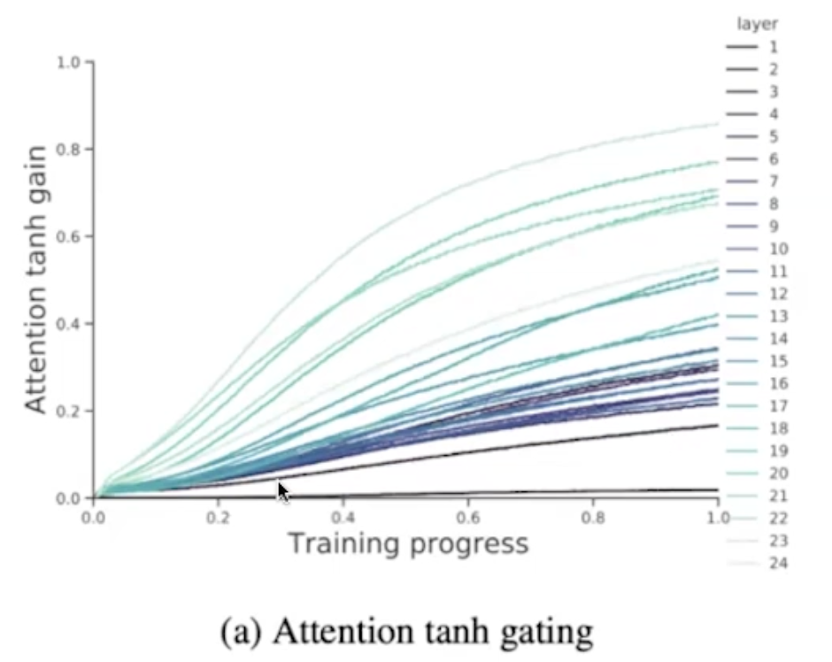

> First layers of MLLM then focus more on text, gradually focusing more on image input.

## 2. Deep Fusion: Custom Layers

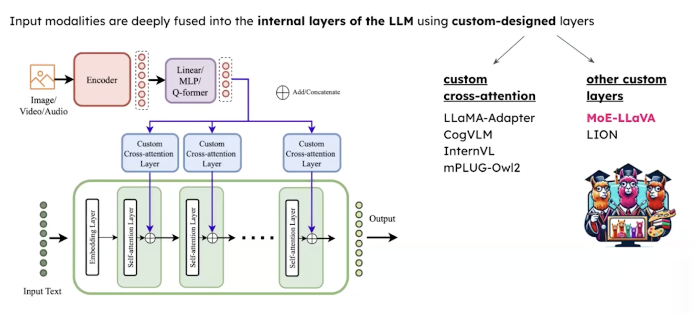

### MoE LLaVA

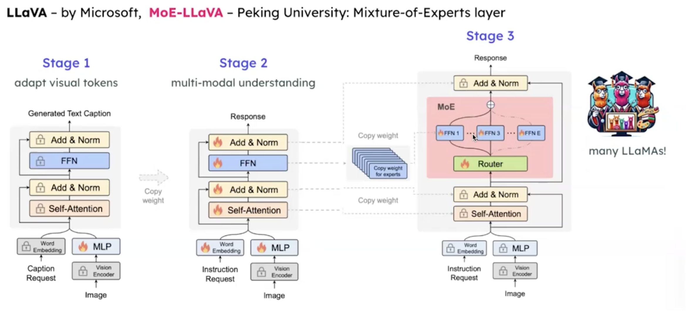

#### **Router**

1. Have E experts, each expert = FFN

    $$\mathcal{E} = [e_1, e_2, \cdots, e_E]$$

2. Router = linear layer that assigns the probability of each token being assigned to each expert

    $$\mathcal{P}(\mathbf{x})_i = \frac{e^{f(\mathbf{x})_i}}{\sum_{j}^{E} e^{f(\mathbf{x})_j}} \qquad f(\mathbf{x}) = \mathbf{W} \cdot \mathbf{x}$$

3. Calculate weighted sum

    $$\text{MoE}(\mathbf{x}) = \sum_{i=1}^{k} \mathcal{P}(\mathbf{x})_i \cdot \mathcal{E}(\mathbf{x})_i$$

## 3. Early Fusion: Non-Tokenized

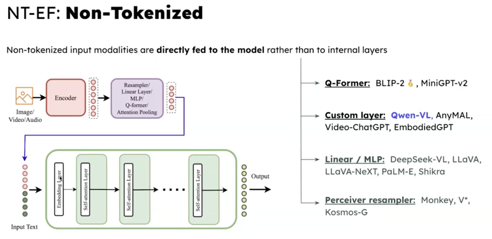

> Just append image/video/... tokens to text tokens, so context window is enlarged.

## 4. Early Fusion: Tokenized

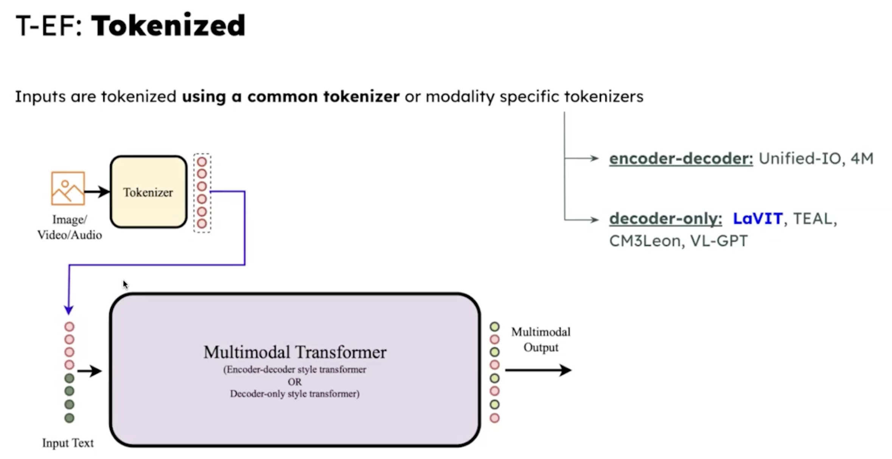

### LaVIT

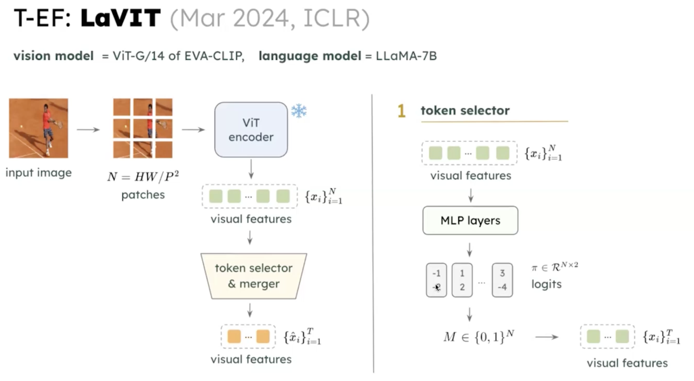

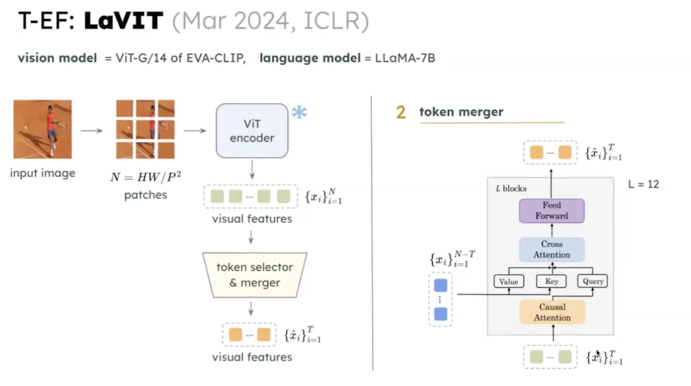

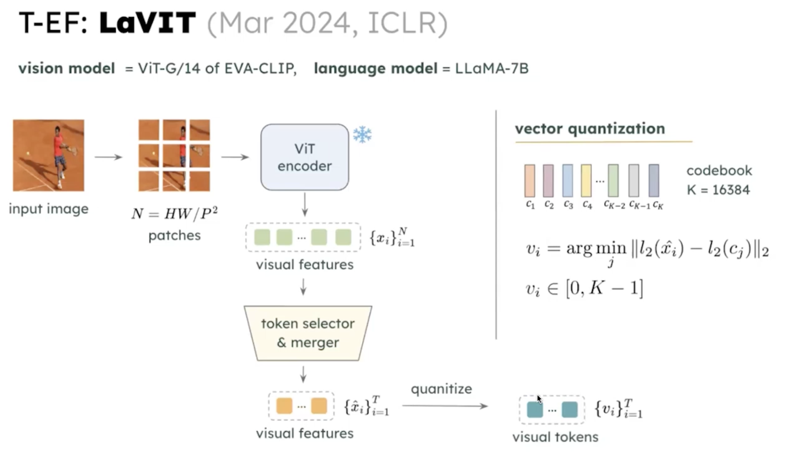

## CLIP

Text encoder in CLIP is some ~BERT model much smaller than LLM.
After training we use only image encoder in our MLLM.

### SigLIP

# **Seminar 1 - VLLMs**

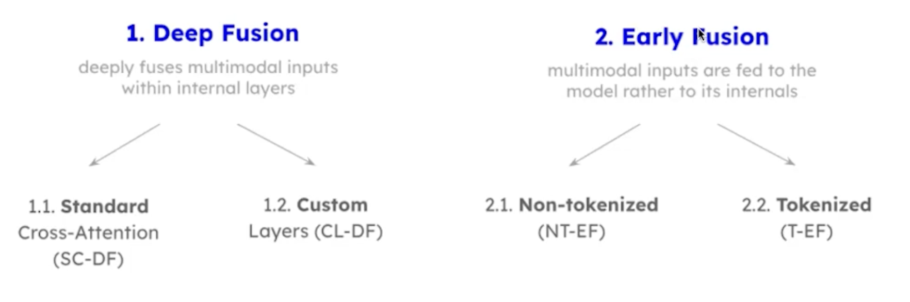

rearrange_many
einsum

mixin??
