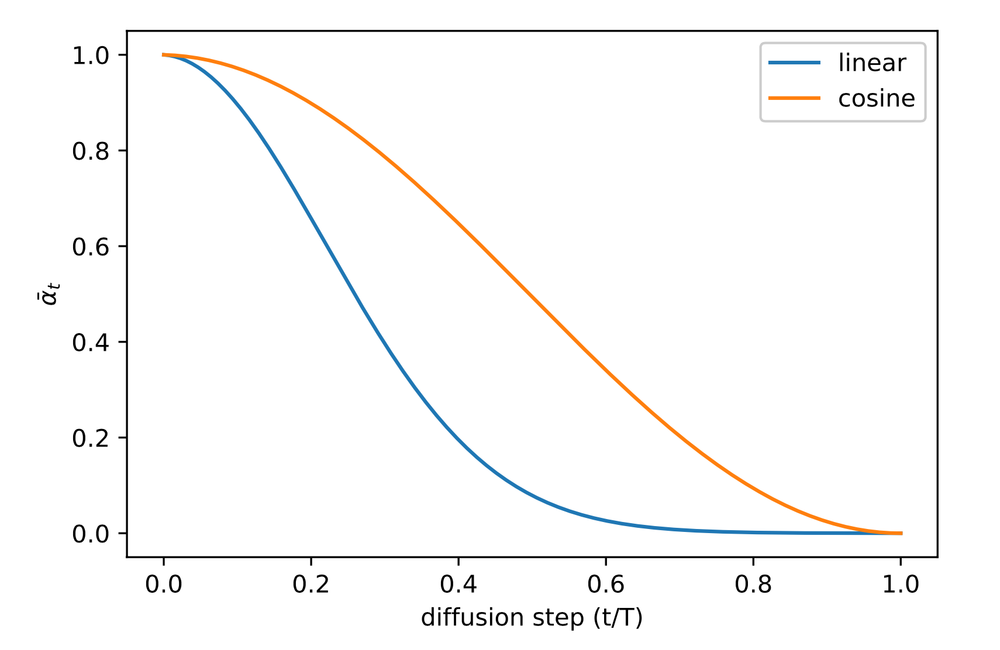

<!-- markdownlint-disable MD024 MD025 -->

# **Diffusion**

[What are Diffusion Models?](https://lilianweng.github.io/posts/2021-07-11-diffusion-models/)

## 1. Forward process is fixed and fully known

We choose a fixed schedule $\{\beta_t\}$, hence $\alpha_t = 1 - \beta_t$, which defines:

- **Forward conditional**

  $$
  x_t = \sqrt{\alpha_t}\,x_{\textcolor{blue}{t-1}} + \sqrt{1-\alpha_t}\,\varepsilon_t,
  \qquad \varepsilon_t \sim \mathcal N(0,I).
  $$

  $$
  q(x_t \mid x_{\textcolor{blue}{t-1}})
  = \mathcal N\big(\sqrt{\alpha_t}\,x_{\textcolor{blue}{t-1}},\;(1-\alpha_t)I\big).
  $$

- **Forward marginal**

  $$
  x_t = \sqrt{\bar\alpha_t}\,x_{\textcolor{blue}{0}} + \sqrt{1-\bar\alpha_t}\,\varepsilon,
  \qquad \varepsilon \sim \mathcal N(0,I).
  $$

  $$
  q(x_t \mid x_{\textcolor{blue}{0}})
  = \mathcal N\big(\sqrt{\bar\alpha_t}\,x_{\textcolor{blue}{0}},\;(1-\bar\alpha_t)I\big),
  $$

  where $\bar\alpha_t = \prod_{s=1}^t \alpha_s$.

- **Posterior**

  $$
  q(x_{t-1}\mid x_t,x_0)
  = \mathcal N\big(\tilde\mu_t(x_t,x_0),\;\tilde\beta_t I\big),
  $$

with both $\tilde\mu_t$ and $\tilde\beta_t$ available in closed form, since we know $x_0$.

No learning happens here — this is the **teacher distribution**.

## 2. Reverse process is learned

We define a reverse Markov chain

$$
p_\theta(x_{t-1}\mid x_t)
= \mathcal N\big(\mu_\theta(x_t,t),\;\Sigma_\theta(x_t,t)\big),
$$

and sampling goes

$$
x_T \sim \mathcal N(0,I),
\quad x_{t-1} \sim p_\theta(x_{t-1}\mid x_t),
\quad t = T,\dots,1.
$$

Our **goal**: make $p_\theta(x_{t-1}\mid x_t)$ match the true posterior $q(x_{t-1}\mid x_t,x_0)$, which depends on $x_0$ and is known during training.

### Posterior variance

The posterior variance of $\tilde\beta_t$ is **known analytically**, so most models **do not learn it**.  
They simply set

$$
\Sigma_\theta(x_t,t) = \tilde\beta_t I,
\quad \tilde\beta_t = \frac{1 - \bar\alpha_{t-1}}{1 - \bar\alpha_t}\,\beta_t.
$$

Some improved versions interpolate between $\beta_t$ and $\tilde\beta_t$, but basic DDPM uses the closed-form.

### Posterior mean

The posterior mean depends on $x_0$:

$$
\tilde\mu_t(x_t, x_0)
= \frac{\sqrt{\alpha_t}(1-\bar\alpha_{t-1})}{1-\bar\alpha_t}\,x_t
- \frac{(1-\alpha_t)\sqrt{\bar\alpha_{t-1}}}{1-\bar\alpha_t}\,x_0.
$$

At inference, we don’t have $x_0$, $\to$ learn $\mu_\theta(x_t, t)$ $\to$ learn $\hat x_0(x_t,t)$ $\to$ learn $\varepsilon_\theta(x_t,t)$:

$$
\hat x_0(x_t,t)
= \frac{x_t - \sqrt{1-\bar\alpha_t}\,\varepsilon_\theta(x_t,t)}
{\sqrt{\bar\alpha_t}}.
$$

$$
\mu_\theta(x_t,t) := \tilde\mu_t(x_t, \hat x_0(x_t,t)).
$$

## 3. Loss

We train a neural network $\varepsilon_\theta(x_t,t)$ to **predict the noise** $\varepsilon$ added during the forward process.

The loss term $L_t$ is parameterized to minimize the difference from $\tilde{\mu}$:

$$
L_t = \mathbb{E}_{\mathbf{x}_0, \epsilon} \left[ \frac{1}{2 \| \Sigma_\theta(\mathbf{x}_t, t) \|_2^2 } \left\| \tilde{\mu}_t(\mathbf{x}_t, \mathbf{x}_0) - \mu_\theta(\mathbf{x}_t, t) \right\|^2 \right]
$$

$$
= \mathbb{E}_{\mathbf{x}_0, \epsilon} \left[ \frac{1}{2 \| \Sigma_\theta \|_2^2 } \left\|
\frac{1}{\sqrt{\alpha_t}} \left( \mathbf{x}_t - \frac{1 - \alpha_t}{\sqrt{1 - \bar{\alpha}_t}} \epsilon_t \right)
- \frac{1}{\sqrt{\alpha_t}} \left( \mathbf{x}_t - \frac{1 - \alpha_t}{\sqrt{1 - \bar{\alpha}_t}} \epsilon_\theta(\mathbf{x}_t, t) \right)
\right\|^2 \right]
$$

$$
= \mathbb{E}_{\mathbf{x}_0, \epsilon} \left[
\frac{(1 - \alpha_t)^2}{2 \alpha_t (1 - \bar{\alpha}_t) \| \Sigma_\theta \|_2^2 }
\left\| \epsilon_t - \epsilon_\theta(\mathbf{x}_t, t) \right\|^2
\right]
$$

$$
= \mathbb{E}_{\mathbf{x}_0, \epsilon} \left[
\frac{(1 - \alpha_t)^2}{2 \alpha_t (1 - \bar{\alpha}_t) \| \Sigma_\theta \|_2^2 }
\left\| \epsilon_t - \epsilon_\theta\left( \sqrt{\bar{\alpha}_t} \mathbf{x}_0 + \sqrt{1 - \bar{\alpha}_t} \epsilon_t, t \right) \right\|^2
\right]
$$

### Simplification of Loss

Empirically, Ho et al. (2020) found that training the diffusion model works better when **ignoring weighting term**:

$$
L_t^{\text{simple}} = \mathbb{E}_{t \sim [1, T], \mathbf{x}_0, \epsilon_t} \left[
\left\| \epsilon_t - \epsilon_\theta(\mathbf{x}_t, t) \right\|^2
\right]
$$

$$
= \mathbb{E}_{t \sim [1, T], \mathbf{x}_0, \epsilon_t} \left[
\left\| \epsilon_t - \epsilon_\theta\left( \sqrt{\bar{\alpha}_t} \mathbf{x}_0 + \sqrt{1 - \bar{\alpha}_t} \epsilon_t, t \right) \right\|^2
\right]
$$

## 4. Inference

1. Start with $x_T \sim \mathcal N(0,I)$.
2. For $t = T, T-1, \dots, 1$:
   - Predict $\varepsilon_\theta(x_t,t)$.
   - Compute $\hat x_0(x_t,t)$.
   - Compute $\mu_\theta(x_t,t)$ using the closed-form posterior mean.
   - Sample
     $$
     x_{t-1} \sim \mathcal N\big(\mu_\theta(x_t,t),\;\tilde\beta_t I\big).
     $$
     (or deterministically if using DDIM).
3. Return $x_0$ as the generated sample.

# **Diffusion - Nuances**

## Why $\sqrt{\alpha_t}$ and $\sqrt{1 - \alpha_t}$

$$
x_t = \sqrt{\alpha_t}\,x_{t-1} + \sqrt{1-\alpha_t}\,\varepsilon_t.
$$

$$
q(x_t \mid x_{t-1}) = \mathcal{N}\big(\sqrt{\alpha_t}\,x_{t-1},\;(1-\alpha_t)I\big),
$$

We want variance to be preserved at every step, _regardless_ of $\alpha_t$, so that the process doesn’t "blow up" or "shrink".

If $\mathrm{Var}(x_{t-1}) = I$ (say at step 0), the variance of $x_t$ is

$$
\mathrm{Var}(x_t)
= \alpha_t\,\mathrm{Var}(x_{t-1}) + (1-\alpha_t)I
= \alpha_t I + (1-\alpha_t)I = I.
$$

## Closed Form $q(x_t \mid x_0)$

### Setup

The forward chain is linear Gaussian:

$$
q(x_t \mid x_{t-1})
= \mathcal N\big(\sqrt{\alpha_t}\,x_{t-1},\;(1-\alpha_t)I\big),
\qquad \alpha_t = 1 - \beta_t \in (0,1).
$$

### Claim (closed form)

$$
x_t = \sqrt{\bar\alpha_t}\,x_0 + \sqrt{1-\bar\alpha_t}\,\varepsilon,
\qquad \varepsilon \sim \mathcal N(0,I).
$$

$$
q(x_t \mid x_0)
= \mathcal N\big(\sqrt{\bar\alpha_t}\,x_0,\;(1-\bar\alpha_t)I\big),
$$

where $ \bar\alpha_t = \prod_{s=1}^t \alpha_s $ and $ \bar\alpha_0 = 1.$

### Proof by induction

- **Base $t = 1$**:  
  $\bar\alpha_1 = \alpha_1$. From the transition,

  $$
  x_1 = \sqrt{\alpha_1}\,x_0 + \sqrt{1-\alpha_1}\,\varepsilon_1,
  $$

  so

  $$
  x_1 \mid x_0 \sim \mathcal N\big(\sqrt{\bar\alpha_1}\,x_0,\;(1-\bar\alpha_1)I\big).
  $$

  ✓

- **Step $t-1 \to t$**: assume

  $$
  x_{t-1} = \sqrt{\bar\alpha_{t-1}}\,x_0
  - \sqrt{1-\bar\alpha_{t-1}}\,\varepsilon_{t-1},
  \qquad \varepsilon_{t-1}\sim\mathcal N(0,I).
  $$

  Then apply the transition:

  $$
  \begin{aligned}
  x_t
  &= \sqrt{\alpha_t}\,x_{t-1} + \sqrt{1-\alpha_t}\,\varepsilon_t\\
  &= \sqrt{\alpha_t}\Big(\sqrt{\bar\alpha_{t-1}}\,x_0
  - \sqrt{1-\bar\alpha_{t-1}}\,\varepsilon_{t-1}\Big)
  - \sqrt{1-\alpha_t}\,\varepsilon_t\\
  &= \sqrt{\alpha_t\bar\alpha_{t-1}}\,x_0
  - \sqrt{\alpha_t(1-\bar\alpha_{t-1})}\,\varepsilon_{t-1}
  - \sqrt{1-\alpha_t}\,\varepsilon_t.
  \end{aligned}
  $$

The last two terms are independent Gaussians; their sum is Gaussian with covariance

$$
\alpha_t(1-\bar\alpha_{t-1})I + (1-\alpha_t)I
= \big(\alpha_t - \alpha_t\bar\alpha_{t-1} + 1 - \alpha_t\big)I
= (1 - \alpha_t\bar\alpha_{t-1})I
= (1 - \bar\alpha_t)I.
$$

Hence

$$
x_t = \sqrt{\bar\alpha_t}\,x_0 + \sqrt{1-\bar\alpha_t}\,\varepsilon,
\qquad \varepsilon \sim \mathcal N(0,I).
$$

## Parametrization of $\beta_\theta$, $\Sigma_\theta$

### $\beta_\theta$

- Ho et al. (2020): **linearly increasing** constants - from $\beta_1 = 10^{-4}$ to $\beta_T = 0.02$.
They are relatively small compared to the normalized image pixel values between $[-1, 1]$.  

- Nichol & Dhariwal (2021): **cosine-based** variance schedule.

    The choice of the scheduling function can be arbitrary, as long as it provides a near-linear drop in the middle of the training process and subtle changes around $t = 0$ and $t = T$:

### $\Sigma_\theta$

- Ho et al. (2020) chose to fix $\beta_t$ as constants instead of making them learnable and set $\Sigma_\theta(\mathbf{x}_t, t) = \sigma_t^2 I$, where $\sigma_t$ is not learned but set to $\beta_t$ or $\tilde{\beta}_t = \frac{1 - \bar{\alpha}_{t-1}}{1 - \bar{\alpha}_t} \cdot \beta_t$.

    Because they found that learning a diagonal variance $\Sigma_\theta$ leads to unstable training and poorer sample quality.

- Nichol & Dhariwal (2021) proposed to learn $\Sigma_\theta(\mathbf{x}_t, t)$ as an interpolation between $\beta_t$ and $\tilde{\beta}_t$ by model predicting a mixing vector $\mathbf{v}$:

    $$
    \Sigma_\theta(\mathbf{x}_t, t) = \exp \left( \mathbf{v} \log \beta_t + (1 - \mathbf{v}) \log \tilde{\beta}_t \right)
    $$

    $$
    L_{\text{hybrid}} = L_{\text{simple}} + \lambda L_{\text{VLB}}
    $$

    They observed that $L_{\text{VLB}}$ is pretty **challenging to optimize** likely due to noisy gradients, so they proposed to use a time-averaging smoothed version of $L_{\text{VLB}}$ with **importance sampling**.

# **DDPM, DDIM**

- **DDPM**:
  - stochastic
  - learning a **reverse diffusion SDE**, then **sampling it forward**
  - slow but diverse

- **DDIM**:
  - deterministic variant
  - solving the **corresponding reverse ODE** deterministically
  - faster at inference, often used in practice for acceleration and more control.

## 1. **DDPM — Denoising Diffusion Probabilistic Models**

**Source:** Ho et al. (2020)  
**Core idea:** Model the **reverse Markov chain** as a parameterized Gaussian, and **learn to denoise step by step**.

### Forward process (fixed)

$$
q(x_t \mid x_{t-1}) = \mathcal N\big(\sqrt{\alpha_t}\,x_{t-1},\,(1 - \alpha_t)I\big),
$$
$$
q(x_t \mid x_0) = \mathcal N\big(\sqrt{\bar\alpha_t}\,x_0,\,(1 - \bar\alpha_t)I\big).
$$

### Reverse process (learned)

$$
p_\theta(x_{t-1}\mid x_t)
= \mathcal N\big(\mu_\theta(x_t, t),\;\Sigma_\theta(x_t,t)\big).
$$

- $\mu_\theta$ computed using predicted $\hat x_0(x_t,t)$ or $\varepsilon_\theta(x_t,t)$.  
- $\Sigma_\theta$ usually set to closed-form $\tilde\beta_t I$ (posterior variance).

### Sampling (stochastic)

$$
x_{t-1} \sim \mathcal N\big(\mu_\theta(x_t,t),\;\tilde\beta_t I\big),
\qquad t = T,\dots,1.
$$

## 2. **DDIM — Denoising Diffusion Implicit Models**

**Source:** Song, Meng, Ermon (2020), “Denoising Diffusion Implicit Models”  
**Core idea:** **Reparameterize the reverse process as a deterministic ODE** → **same marginal distributions** as DDPM but **no noise injection** at inference.

>>> Add info about $\eta$ from the blog

### Deterministic reverse process

Instead of sampling from a Gaussian at each step, DDIM defines:

$$
x_{t-1}
= \sqrt{\bar\alpha_{t-1}}\,
\hat x_0(x_t,t)
- \sqrt{1 - \bar\alpha_{t-1}}\,
\underbrace{\left(
\frac{x_t - \sqrt{\bar\alpha_t}\,\hat x_0(x_t,t)}
{\sqrt{1 - \bar\alpha_t}}
\right)}_{\varepsilon_\theta(x_t,t)}.
$$

or equivalently, they solve a **non-stochastic update** derived from the reverse-time ODE of the diffusion SDE.

# **Conditional Diffusion**

## Intuition in Scores

We work with log-densities to not multiply, but sum.

### (1) Compute the score of the noisy marginal $q(x_t)$

**Forward noising (fixed):**
$$
x_t=\sqrt{\bar\alpha_t}\,x_0+\sqrt{1-\bar\alpha_t}\,\varepsilon,\qquad
\varepsilon\sim\mathcal N(0,I).
$$
Equivalently
$$
q(x_t\mid x_0)=\mathcal N\!\big(\sqrt{\bar\alpha_t}\,x_0,\;(1-\bar\alpha_t)I\big).
$$

**Score of a Gaussian conditional.** For any $x_0$,
$$
\nabla_{x_t}\log q(x_t\mid x_0)
= -\frac{1}{1-\bar\alpha_t}\left(x_t-\sqrt{\bar\alpha_t}\,x_0\right)
= -\frac{1}{\sqrt{1-\bar\alpha_t}}\,
\underbrace{\frac{x_t-\sqrt{\bar\alpha_t}x_0}{\sqrt{1-\bar\alpha_t}}}_{\varepsilon(x_t,x_0)}.
$$
So
$$
\nabla_{x_t}\log q(x_t\mid x_0)=
-\frac{1}{\sqrt{1-\bar\alpha_t}}\,\varepsilon(x_t,x_0).
\tag{★}
$$

**Mixture-score identity.** Since $q(x_t)=\int q(x_t\mid x_0)\,p_\text{data}(x_0)\,dx_0$,
$$
\nabla_{x_t}\log q(x_t)
=\mathbb E_{q(x_0\mid x_t)}\big[\nabla_{x_t}\log q(x_t\mid x_0)\big]
\quad\text{(differentiation under the integral)}.
$$
Plug (★):
$$
\nabla_{x_t}\log q(x_t)
= -\frac{1}{\sqrt{1-\bar\alpha_t}}\;
\mathbb E_{q(x_0\mid x_t)}\big[\varepsilon(x_t,x_0)\big]
= -\frac{1}{\sqrt{1-\bar\alpha_t}}\;
\mathbb E\!\left[\varepsilon\mid x_t\right].
\tag{1}
$$
Equation (1) is a “Tweedie-type” formula for the forward diffusion: **the score equals the (scaled) posterior mean of the noise**.

### (2) What DDPM learns (optimal $\varepsilon_\theta$ under the loss)

**Training objective (Ho et al., “simple” loss):**
$$
\min_\theta\;
\mathbb E_{t,x_0,\varepsilon}\;
\big\|\varepsilon - \varepsilon_\theta(x_t,t)\big\|^2,
\qquad
x_t=\sqrt{\bar\alpha_t}x_0+\sqrt{1-\bar\alpha_t}\varepsilon.
$$

For fixed $t$, this is plain MSE regression of the random target $\varepsilon$ on the regressor $x_t$.  
The **Bayes–optimal predictor** in MSE is the conditional expectation:
$$
\varepsilon_\theta^\star(x_t,t)=\mathbb E\!\left[\varepsilon\mid x_t,t\right]
=\mathbb E\!\left[\varepsilon\mid x_t\right].
\tag{2}
$$

Combine (1) and (2):
$$
\nabla_{x_t}\log q(x_t)
= -\frac{1}{\sqrt{1-\bar\alpha_t}}\;\varepsilon_\theta^\star(x_t,t).
$$

Thus, **at optimum**, DDPM’s noise predictor recovers the score (up to the known scalar factor):
$$
\boxed{\displaystyle
\nabla_{x_t}\log q(x_t)= -\frac{1}{\sqrt{1-\bar\alpha_t}}\;\varepsilon_\theta(x_t,t)}
\quad\text{(when $\varepsilon_\theta$ is well trained).}
$$

## TODO

# **Text-to-Image**

## 1. Classifier-Guided Diffusion (Dhariwal & Nichol, 2021)

## 2. Classifier-Free Guidance (Ho & Salimans, 2022)

Conditional distribution _solely_ tends to mix unconditional structure with conditional adjustment in one vector. That can be weak or entangled.

By training both conditional and unconditional modes, we can compute:

- unconditional score $\to$ natural image prior
- conditional score $\to$ guidance

# distlation, etc

...

# **Diffusion Bridges**

...
