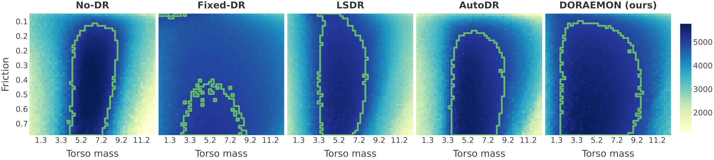

<!-- markdownlint-disable MD025 -->

# Classical Robotics

Robotics:

1. manipulation
2. locomotion
3. whole-body control

## Kinematics

### 1. Forward Kinematics (FK)

**Goal:** find where the end-effector is, given the joint angles.

- Input: configuration $ q = [\theta_1, \theta_2, \dots, \theta_n] $ (joint angles or displacements)  
- Output: position/orientation $ p = [x, y, z, \dots] $ of the end-effector  

Formally:
$$
p = f(q)
$$

**Example (2-link planar arm):**
$$
\begin{aligned}
x &= l_1 \cos(\theta_1) + l_2 \cos(\theta_1 + \theta_2) \\
y &= l_1 \sin(\theta_1) + l_2 \sin(\theta_1 + \theta_2)
\end{aligned}
$$

### 2. Inverse Kinematics (IK)

**Goal:** find which joint angles achieve a desired end-effector position/orientation.

- Input: desired $ p^*= [x^*, y^*, z^*, \dots] $  
- Output: configuration $ q = f^{-1}(p^*) $

Formally:
$$
q = f^{-1}(p^*)
$$

IK is **often much harder** because:

- There may be **multiple solutions** (different poses reaching the same point);
- Or **no solution** (target unreachable);
- Or it may require **numerical optimization** rather than a closed form.

### 3. Differential Inverse Kinematics (diff-IK)

$p = f(q) \to$ **velocity kinematics equation**:

$$
\dot{p} = J(q) \, \dot{q},
$$
where $ J(q) = \frac{\partial f(q)}{\partial q} $ is the **Jacobian matrix** — it maps joint velocity space to end-effector velocity space.

- If $ J(q) $ is square and invertible:
  $$
  \dot{q} = J(q)^{-1} \, \dot{p}.
  $$

- Otherwise, use **pseudo-inverse**:
  $$
  \dot{q} = J(q)^{\dagger} \, \dot{p},
  $$
  where $ J^{\dagger} = J^T (J J^T)^{-1} $ minimizes the joint velocity norm $ \|\dot{q}\| $.

This method is:

- Local
- Numerically stable
- Useful for real-time control in static environments (e.g., industrial manipulators)

#### **Extensions**

- **With constraints:**  
  Diff-IK can include joint limits, collision avoidance, or optimization terms by solving:
  $$
  \min_{\dot{q}} \|J(q)\dot{q} - \dot{p}_{des}\|^2 + \lambda \|\dot{q}\|^2
  $$
  (a **damped least-squares** formulation).

- **For redundant robots:**  
  Null-space motions can be added to achieve secondary goals (e.g., posture optimization):
  $$
  \dot{q} = J^{\dagger} \dot{p}_{des} + (I - J^{\dagger}J)\dot{q}_{null}.
  $$

## Feedback Control Loop

**Feedback control loop** - system that continuously monitors its output, compares it to a desired target (**setpoint**), and adjusts its actions to minimize the difference — called the **error**.

1. The **controller** receives a desired value (setpoint).  
2. The **system output** is measured by sensors.  
3. The **error** between the desired and actual output is computed:  
   $$
   e(t) = r(t) - y(t)
   $$
4. The controller sends a corrective command (control signal $u(t)$) to the actuators:  
   $$
   u(t) = f(e(t))
   $$
5. The plant responds, producing a new output $y(t)$.  
6. The process repeats continuously — forming a _loop_.

# Robot Learning: RL

## [Domain Randomization](https://arxiv.org/abs/1703.06907)

**Domain randomization** - sim-to-real transfer technique in which the parameters of a simulated environment are sampled from a broad distribution during training.

### [AutoDR](https://arxiv.org/abs/1910.07113)

Fixed wide ranges from the start may make learning too hard or unstable.

1. Start with a narrow uniform parameter distribution.

2. Gradually increasing variation (as performance goes above some threshold) helps the agent to build robustness incrementally.

### [DORAEMON (Domain Randomization via Entropy Maximization)](https://arxiv.org/abs/2311.01885)

Instead of setting a fixed randomisation range or manually designing a curriculum, DORAEMON dynamically widens the range based on entropy.

$$
\max_{\varphi} \; \mathrm{H}(\nu_{\varphi})
\quad \text{s.t.} \quad
\Pr_{\xi \sim \nu_{\varphi},\; \tau \sim \pi,\, E(\xi)} \big[ \text{success}(\tau) \big] \ge \alpha
$$

where $ \mathrm{H}(\cdot) $ is entropy, $ \pi $ is the current policy, and $ \alpha $ is a chosen minimum success probability.

# OTHER

do # Lecture - Data-driven RL
with ## [Reinforcement Learning with Prior Data (RLPD)](https://arxiv.org/abs/2302.02948) - Offline-to-Online RL algorithm leveraging prior data to effectively accelerate the training of a SAC agent.

reward classifiers: [SERL: A Software Suite for Sample-Efficient Robotic Reinforcement Learning](https://github.com/rail-berkeley/serl).
