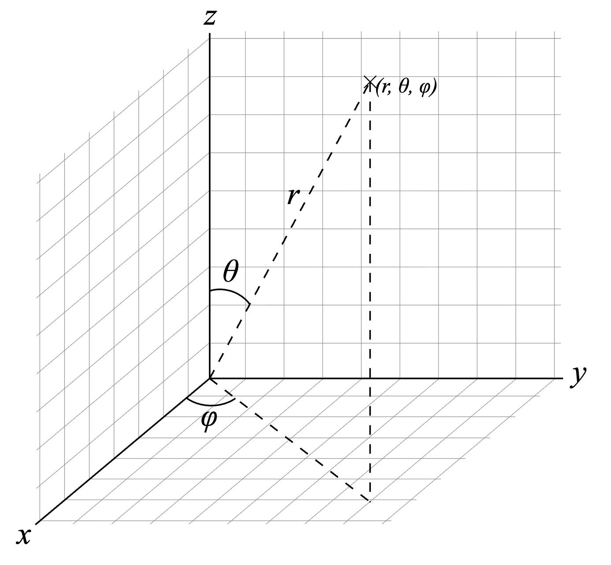
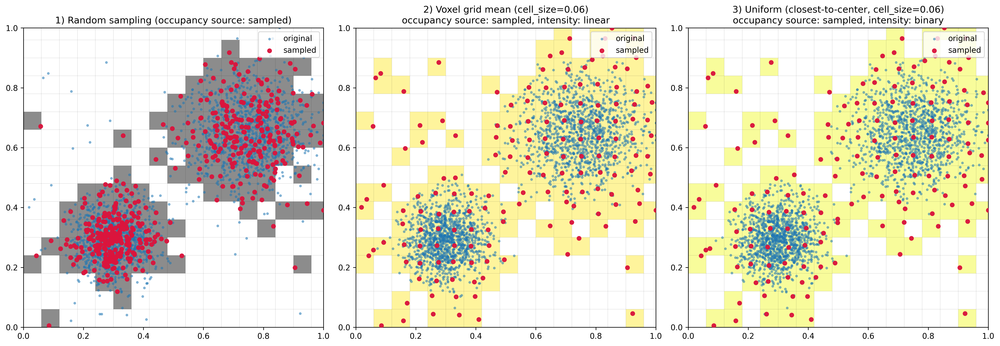
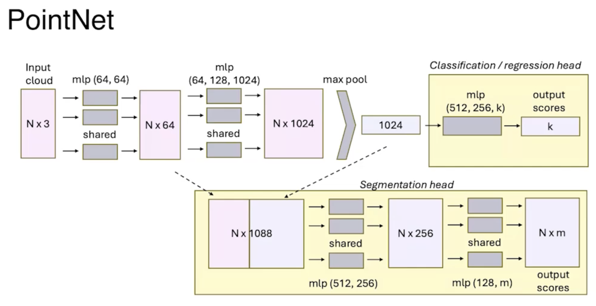
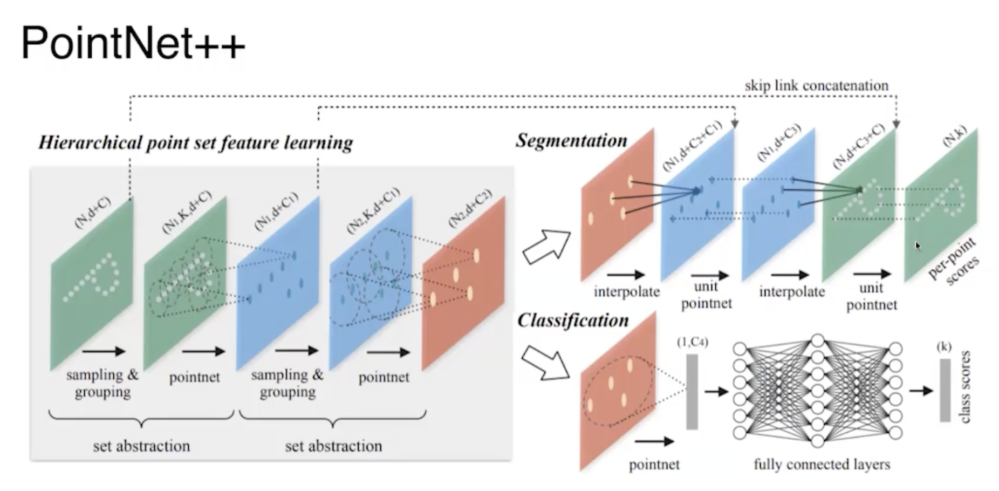

<!-- markdownlint-disable MD024 MD025 -->

# **Lecture 01 - Area Intro**

Nothing Interesting.

# **Homework 01**

## Worklow

### Run Docker on Mac

```bash
colima list

colima start
colima status
colima stop

colima start --cpu 4 --memory 8 --disk 100
colima start --edit
```

Check if colima is set:

```bash
docker context ls
docker context show
```

If colima is not set:

```bash
docker context use colima
unset DOCKER_HOST
```

### Setup

1. Do:

    ```bash
    docker run -p 6080:80 --shm-size=512m tiryoh/ros2-desktop-vnc:jazzy

    # or, with mount:
    docker run -p 6080:80 --shm-size=512m \
    -v "$PWD/course/hw01_turtle/ros2_turtlesim_src":/home/ubuntu/ws/src \
    tiryoh/ros2-desktop-vnc:jazzy

    # or start existing container:
    docker start <name>
    ```

2. Then go to [http://127.0.0.1:6080/](http://127.0.0.1:6080/).  
    (If the screen is locked, password is "ubuntu")

3. Open terminator and do:

    ```bash
    ros2 run turtlesim turtlesim_node
    ```

```bash
cd ~/ws
colcon build
source install/local_setup.bash

# or make auto source:
echo "source /home/ubuntu/ws/install/local_setup.bash" >> ~/.bashrc
```

#### VSCode

At the workspace root (in `ws`, same level as `src/`), create a file named `.env`:

```env
PYTHONPATH=/opt/ros/jazzy/lib/python3.12/site-packages
```

### Execute

```bash
# from one terminal:
ros2 run turtlesim turtlesim_node

# from another terminal:
ros2 run turtlesim_contest_evaluation turtlesim_contest_hide_gift_node 5 5 2 4

# from another terminal:
ros2 run turtlesim_contest_submission turtlesim_contest_submission_node

# from another terminal:
ros2 action send_goal /find_hidden_gift turtlesim_contest_interface/action/FindHiddenGift "{search_area: {bottom_left: {x: 0, y: 0}, top_right: {x: 11, y: 11}}}"
```

## ROS2 Action

In ROS2, an **action** definition always has:

- **Goal** - input sent by the client

- **Feedback**:  
    Sent zero or many times while it’s running.  
    Used for progress/state updates that the client can observe without waiting for completion.

- **Result** - sent once at the end when the action finishes.

# **Lecture 2 - Localization**

Main localization sensors:

- GNSS

- Lidar
Movement correction of lidar (10Hz, 100km/h, `do we take into account not only time but also speed?`)
bad with micro objects - snow

- Inertial Measurment Unit (IMU) - bad at path increments intergration

- Odometry

эффект доплера, радар
у радара есть преимущество (в отл. от лидара) - он видит скорость $\to$ решая систему, можно узнать нашу скорость (эту скорость можно сравнивать с датчиками)

## Kalman Filter

Evolution model:

$$
x_t = A_t x_{t-1} + r_t,
\qquad r_t \sim \mathcal N(0,R_t),
$$

Innovation model:

$$
z_t = C_t x_t + q_t,
\qquad q_t \sim \mathcal N(0,Q_t).
$$

### (Evolution) Prediction step

State mean:
$$
\hat{\mu}_t = A_t \mu_{t-1}
$$

State covariance:
$$
\hat{\Sigma}_t = A_t \Sigma_{t-1} A_t^T + R_t
$$

Predicted observation mean:
$$
\hat{z}_t = C_t \hat{\mu}_t
$$

Predicted observation covariance:
$$
S_t = C_t \hat{\Sigma}_t C_t^T + Q_t
$$

Cross-covariance between state and observation:
$$
\Sigma_{xz,t} = \hat{\Sigma}_t C_t^T
$$

### (Innovation) Correction step

Kalman gain:
$$
K_t = \hat{\Sigma}_t C_t^T \left(C_t \hat{\Sigma}_t C_t^T + Q_t\right)^{-1}
= \Sigma_{xz,t} S_t^{-1}
$$

Innovation:
$$
\nu_t = z_t - \hat{z}_t
= z_t - C_t \hat{\mu}_t
$$

Updated state mean:
$$
\mu_t = \hat{\mu}_t + K_t \nu_t
$$

Updated state covariance:
$$
\Sigma_t = (I - K_t C_t)\hat{\Sigma}_t
$$

More numerically stable Joseph form:
$$
\Sigma_t = (I-K_tC_t)\hat{\Sigma}_t(I-K_tC_t)^T + K_t Q_t K_t^T
$$

### Gaussian approximation form

Gaussian form explicitly:

$$
x_t \mid z_{1:t-1} \sim \mathcal N(\hat{\mu}_t,\hat{\Sigma}_t)
$$

$$
z_t \mid z_{1:t-1} \sim \mathcal N(\hat{z}_t,S_t)
$$

$$
x_t \mid z_{1:k} \sim \mathcal N(\mu_t,\Sigma_t)
$$

## EKF (Extended Kalman Filter)

For a nonlinear state-space model

Evolution model:
$$
x_t = f_t(x_{t-1}) + r_t,
\qquad r_t \sim \mathcal N(0,R_t),
$$

Innovation model:
$$
z_t = h_t(x_t) + q_t,
\qquad q_t \sim \mathcal N(0,Q_t),
$$

the EKF applies the standard Kalman filter formulas to the local linearization of the nonlinear maps $f_t$ and $h_t$.

Define the Jacobians:
$$
F_t = \left.\frac{\partial f_t(x)}{\partial x}\right|_{x=\mu_{t-1}},
\qquad
H_t = \left.\frac{\partial h_t(x)}{\partial x}\right|_{x=\hat{\mu}_t}.
$$

### Prediction step

Predicted state mean:
$$
\hat{\mu}_t = f_t(\mu_{t-1})
$$

Predicted state covariance:
$$
\hat{\Sigma}_t = F_t \Sigma_{t-1} F_t^T + R_t
$$

Predicted observation mean:
$$
\hat{z}_t = h_t(\hat{\mu}_t)
$$

Predicted observation covariance:
$$
S_t = H_t \hat{\Sigma}_t H_t^T + Q_t
$$

Cross-covariance between state and observation:
$$
\Sigma_{xz,t} = \hat{\Sigma}_t H_t^T
$$

### Correction step

Kalman gain:
$$
K_t = \hat{\Sigma}_t H_t^T \left(H_t \hat{\Sigma}_t H_t^T + Q_t\right)^{-1}
= \Sigma_{xz,t} S_t^{-1}
$$

Innovation:
$$
\nu_t = z_t - \hat{z}_t
= z_t - h_t(\hat{\mu}_t)
$$

Updated state mean:
$$
\mu_t = \hat{\mu}_t + K_t \nu_t
$$

Updated state covariance:
$$
\Sigma_t = (I - K_t H_t)\hat{\Sigma}_t
$$

More numerically stable Joseph form:
$$
\Sigma_t
=
(I-K_tH_t)\hat{\Sigma}_t(I-K_tH_t)^T + K_t Q_t K_t^T
$$

### Gaussian approximation form

The EKF keeps the posterior Gaussian only approximately:

$$
x_t \mid z_{1:t-1} \approx \mathcal N(\hat{\mu}_t,\hat{\Sigma}_t)
$$

$$
z_t \mid z_{1:t-1} \approx \mathcal N(\hat{z}_t,S_t)
$$

$$
x_t \mid z_{1:t} \approx \mathcal N(\mu_t,\Sigma_t)
$$

### First-order linearization view

Around the current estimate,
$$
f_t(x) \approx f_t(\mu_{t-1}) + F_t(x-\mu_{t-1}),
$$

$$
h_t(x) \approx h_t(\hat{\mu}_t) + H_t(x-\hat{\mu}_t).
$$

### Common notation mapping

Sometimes the same equations are written as
$$
x_t^- = f(x_{t-1}^+), \qquad
P_t^- = F_t P_{t-1}^+ F_t^T + R_t,
$$

$$
y_t = z_t - h(x_t^-),
\qquad
S_t = H_t P_t^- H_t^T + Q_t,
$$

$$
K_t = P_t^- H_t^T S_t^{-1},
$$

$$
x_t^+ = x_t^- + K_t y_t,
\qquad
P_t^+ = (I-K_tH_t)P_t^-.
$$

# **Lecture 3 - Lidar Point Cloud**

## Системы координат

### Сферическая система координат

Положение точки $P$ в сферической системе координат определяется тройкой $(r, \theta, \varphi)$, где

- $r \ge 0$ &mdash; **расстояние** (**range/distance**)
- $\theta \in [-\pi/2, \pi/2]$ &mdash; **зенитный** или **полярный** угол (**elevation angle**)
- $\varphi \in [0, 2\pi)$ &mdash; **азимутальный** угол (**azimuth angle**)



### Декартова система координат

$$
\begin{align*}
\begin{pmatrix}
x\\
y\\
z
\end{pmatrix} =
\begin{pmatrix}
r \cos\theta \cos\phi \\
r \cos\theta \sin\phi\\
r \sin\theta
\end{pmatrix}
\end{align*}
$$

$$
\begin{align*}
\begin{pmatrix}
r\\
\phi\\
\theta\\
\end{pmatrix} = \bold(x, y, z) = \begin{pmatrix}
\sqrt{x^2 + y^2 + z^2}\\
\arctan \left(\frac{y}{x}\right)\\
\arcsin \left(\frac{z}{\sqrt{x^2 + y^2 + z^2}}\right)
\end{pmatrix}
\end{align*}
$$

### Примеры

#### **Найдем уравнение прямой, которая проходит через две точки $\boldsymbol{a}$ и $\boldsymbol{b}$.**

Несколько видов уравнения прямой:

1. $Ax + By + C = 0$
2. $\langle\boldsymbol{n}, \boldsymbol{p}\rangle = d$
3. $\boldsymbol{p_0} + t \boldsymbol{d}$

Остановимся на первом типе:
$$
\begin{cases}
A a_x + B a_y + C = 0\\
A b_x + B b_y + C = 0
\end{cases}
\Rightarrow
\begin{cases}
A = -b_y + a_y\\
B = b_x - a_x\\
C = a_x b_y - a_y b_x\\
\end{cases}
$$

$$
\begin{cases}
\boldsymbol{n} = [-B, A]^T\\
d = -C
\end{cases}
$$

#### **Найдем координату точки пересечения двух прямых.**

Даны две прямые $A_1 x + B_1 y + C_1 = 0$ и $A_2 x + B_2 y + C_2 = 0$. Требуется найти их точку пересечения $(x, y)^T$:
$$
\begin{cases}
A_1 x + B_1 y + C_1 = 0\\
A_2 x + B_2 y + C_2 = 0
\end{cases}
$$

## Фильтрация

Сэмплирование облака размера $N$:

- Случайное:
  - Fisher-Yates shuffle (выбираем случайное подмножество размера $K$
- Детерминированное
  - Voxel grid
  - Uniform sampling



## Normals estimation

При сопосоставлении облаков мы будем минимизировать ICP-метрику point-to-plane. А это значит, что нам потребуется уметь оценивать нормали target-облака. И если в этой процедуре совершить ошибку, то ничего хорошего матчинг не покажет.

Нормаль для некоторой точки $\bold{P}_i$ облака $\bold{P} = [\bold{P}_1, \dots, \bold{P}_N]$ оценивается по некоторой окрестности самой точки $\bold{P}_i$, т.е. находятся ближайшие соседей $\bold{P}_i$, и через них проводится плоскость. Нормаль данной плоскости и берется в качестве нормали точки $\bold{P}_i$. По сути параметры поиска нормали представлюят собой параметры поиска ближайших соседей:

## Лидарная одометрия

### Лидарная одометрия (v1.0)

Пусть к нам пришло очередное лидарное облако $\bold{Q} = [\bold{Q}_1, \dots, \bold{Q}_{M}]$ ($\bold{Q}_i \in \R^3$). Предыдущее лидарное облако обозначим как $\bold{P} = [\bold{P}_1, \dots, \bold{P}_N]$ ($\bold{P}_i \in \R^3$). Требуется найти перемещение $\bold{T}$ лидара в пространстве относительно его предыдущей позы. Если говорить неформально, то это такой трансформ, который делает облако $\bold{Q}$ &laquo;похожим&raquo; на $\bold{P}$:
$$
\bold{T} \otimes \bold{Q} \approx \bold{P}.
$$
Эту задачу решает алгоритм ICP, описанный на лекции. Хорошее описание этого алгоритма также можно найти в документации `opend3d`.

В результате из последовательности лидарных облаков $\bold{P}_0$, $\bold{P}_1$, $\dots$, $\bold{P}_t$ получаем последовательность относительных перемещений лидара $\bold{T}_{1 \to 0}$, $\bold{T}_{2 \to 1}$, $\dots$, $\bold{T}_{i \to (i - 1)}$, $\dots$, $\bold{T}_{t \to (t - 1)}$. Здесь $\bold{T}_{i \to (i - 1)}$ обозначает трансформ, который представляет собой переход из системы координат лидарного облака $i$ в систему координат лидарного облака $i - 1$.

Наличие последовательность относительных перемещений лидара $\bold{T}_{1 \to 0}$, $\bold{T}_{2 \to 1}$, $\dots$, $\bold{T}_{i \to (i - 1)}$, $\dots$, $\bold{T}_{t \to (t - 1)}$ позволяет легко найти трансформ между любыми двумя облаками:

1. Трансформ из системы координат облака $\bold{P}_i$ в систему координат облака $\bold{P}_j$, где $i > j$, находится следующим образом:
    $$
    \bold{T}_{i \to j} = \bold{T}_{j \to (j - 1)} \otimes \dots \otimes \bold{T}_{(i - 1) \to (i - 2)} \otimes \bold{T}_{i \to (i - 1)}
    $$
2. Обратный трансформ находится как
    $$
    \bold{T}_{j \to i} = \bold{T}_{i \to j}^{-1} = \bold{T}_{i \to (i - 1)}^{-1} \otimes \dots \otimes \bold{T}_{j \to (j - 1)}^{-1}.
    $$

Обозначим через $\bold{T}_{0 \to \mathrm{world}}$ позу лидара в начальный момент времени относительно интересующей нас системы координат под названием $\mathrm{world}$. Это может быть, например, система координат в референсной точке проекции Меркатора. Ну или же вообще единичный трансформ, тогда мы по сути будем оценивать всю траекторию относительно начального положения лидара. В любом случае теперь мы можем выразить позу центрального лидара в момент времени $t$ относительно интересующей нас системы координат $\mathrm{world}$ через позу лидара в момент времени $t - 1$ отностиельно  $\mathrm{world}$:
$$
\bold{T}_{t \to \mathrm{world}} = \bold{T}_{t \to (t - 1)} \otimes \bold{T}_{(t - 1) \to \mathrm{world}}.
$$
Рекуррентно раскрывая $\bold{T}_{(t - 1) \to \mathrm{world}}$, получаем
$$
\bold{T}_{t \to \mathrm{world}} = \bold{T}_{t \to (t - 1)} \otimes \dots \otimes \bold{T}_{i \to (i - 1)} \otimes \dots  \otimes \bold{T}_{1 \to 0} \otimes \bold{T}_{0 \to \mathrm{world}}.
$$

Также мы можем взять все найденные положения лидара в пространстве $\{\bold{T}_{i \to \mathrm{world}}\}_{i=0}^t$ и смержить все облака в единое облако карты $\bold{M}_t$:
$$
\bold{M}_t = \sum\limits_{i=0}^t \bold{T}_{i \to \mathrm{world}} \bold{P}_i
$$

> При слиянии облаков стоит разряжать карту, например, с помощью вокселизации, чтобы не было роста объема карты в ситуации, когда машина просто стоит.

### Лидарная одометрия (v2.0)

У описанного выше алгоритма на практике проявляется основной недостаток &mdash; его низкая точность. Причин этому множество. Например, те же пустые пространства между колец в лидарном облаке, из-за которых при движении лидара значительная часть точек нового очередного облака может просто не попадать в окрестность точек предыдущего облака.

Поэтому рассмотрим небольшое расширение простейшей лидарной одометрии, в которой в каждый момент времени будем поддерживать буфер из $T$ предыдущих облаков, смерженных в карту. При поступлении очередного лидарного облака будем матчить его не к предыдущему, а именно к этой __on-the-fly-карте__. Затем добавляем новое облако в буфер, и попутно удаляем самое старое облако.

Пусть в момент времени $t$ к нам пришло облако $\bold{P}_t$, и мы каким-то обазом нашли его положение $\bold{T}_{t \to \mathrm{world}}$. Тогда в после матчинга обновляем on-the-fly-карту:
$$
\bold{M}_{[t - T + 1, t]} = \sum\limits_{i = t - T + 1}^{t} \bold{T}_{i \to \mathrm{world}} \otimes \bold{P}_i.
$$
Затем в момент времени $t + 1$ поступает облако $\bold{P}_{t + 1}$. Матчим его к облаку $\bold{M}_{[t - T + 1, t]}$, и находим трансформ $\bold{T}_{(t + 1) \to \mathrm{world}}$. Теперь добавляем облако $\bold{P}_{t+1}$ в карту и попутно удаляем облако $\bold{P}_{t - T + 1}$.

Фактически данный алгоритм действий эквивалентен простейшей лидарной одометрии в случае $T = 1$, т.е. когда в буфере всего одно облако.

# **Lecture 4 - Perception**

## Occupancy Grid

## PointNet



### PointNet++



## Intrinsic matrix

It maps 3D points to 2D image pixels.

The intrinsic matrix looks like:

$$
K = \begin{bmatrix} f_x & 0 & c_x \\ 0 & f_y & c_y \\ 0 & 0 & 1 \end{bmatrix}
$$

Where:

- **fx, fy** — focal lengths in pixels (how much the lens magnifies)
- **cx, cy** — principal point (where the optical axis hits the image, usually near the center)

**Usage:** Projects a 3D point (in camera coordinates) to 2D pixel coordinates:

$$
\begin{bmatrix} u \\ v \\ 1 \end{bmatrix} = K \cdot \frac{1}{Z} \begin{bmatrix} X \\ Y \\ Z \end{bmatrix}
$$
