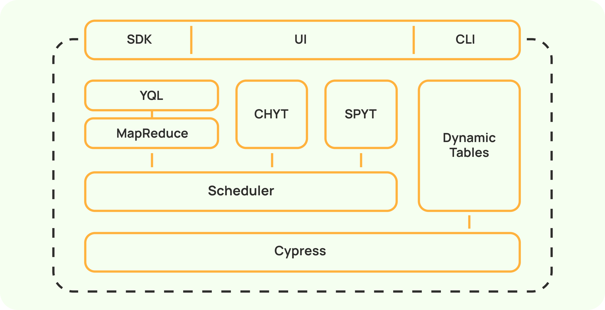
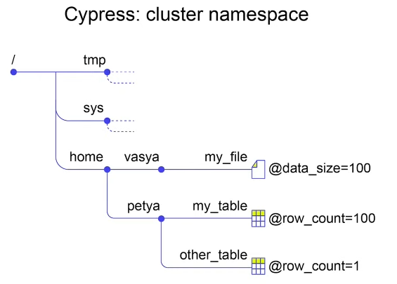
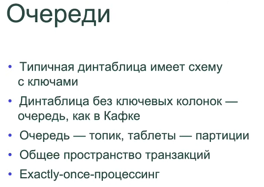
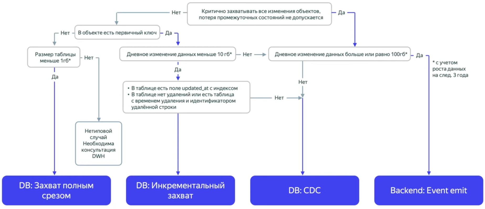

<!-- markdownlint-disable MD001 MD010 MD024 MD025 MD049 -->

# Notes

```bash
ls ~/.yt/token
```

# Lecture 1

[YTsaurus](https://ytsaurus.tech/docs/en/overview/about)

## Architecture



The YTsaurus architecture contains three layers:

- Distributed file system and metadata storage: Cypress.
- Scheduler for distributed computing with MapReduce model support.
- High-level computing engines: YQL, CHYT, and SPYT.

1. Storage:

    - **Data nodes** — data plane, store data  

    - **Masters** — control plane, store metadata, RAFT groups  

    - **Tablet nodes** — data plane, dynamic tables, stateless  

2. Compute:

    - **Exec nodes** — perform computations  

    - **Scheduler/controller agents** — manage computations  

**MapReduce** is used for processing.

Users have API that works on HTTP/RPC.

### Tables



File - **блобик** with a byte sequence $\to$ why to use files directly? $\to$ use **Static/Dynamic (KV storages) No-SQL tables**.

**Multi-tenancy** - 

- YQL over YT
- ClickHouse over YT
- Spark over YT



# Lecture 2



