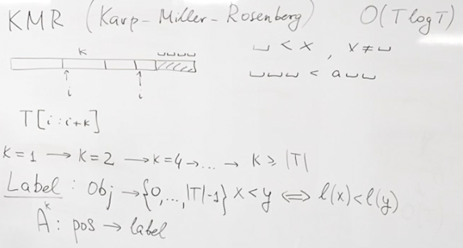
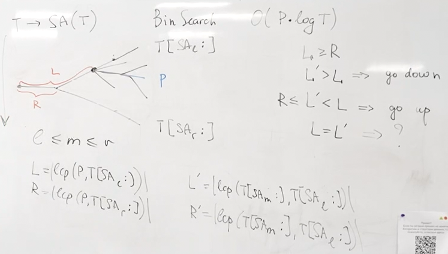
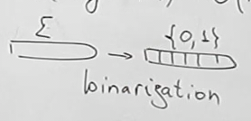
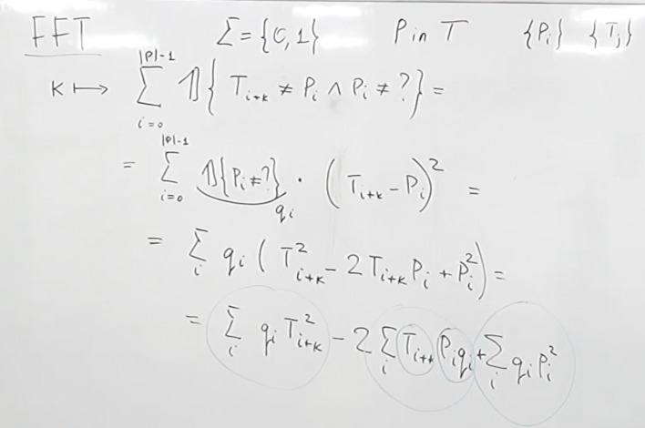

<!-- markdownlint-disable MD025, MD001, MD024 -->

# Lecture 1 - String Pattern Matching (KMP, Z-fun)

## KMP (Knuth-Morris-Pratt)

Idea: skip over parts of the text that have already been examined.

**Proper** prefix/suffix of a string - any prefix/suffix of the string except the string itself.

### LPS (Longest Prefix Suffix)

In the **LPS (Longest Prefix Suffix)** array, we compare proper prefixes of the pattern with its suffixes to find repeating patterns.

```cpp
std::vector<size_t> LPSArray(const std::string& str) {
    size_t size = str.size();
    std::vector<size_t> prefixes(size, 0);

    for (size_t i = 1; i < size; ++i) {
        size_t last = prefixes[i - 1];

        while (last > 0 && str[last] != str[i]) {
            last = prefixes[last - 1];
        }

        prefixes[i] = last + static_cast<size_t>(str[last] == str[i]);
    }

    return prefixes;
}
```

---

```cpp
bool KMPSearch(const std::string &text, const std::string &pattern) {
    int n = text.length();
    int m = pattern.length();

    std::vector<int> lps = LPSArray(pattern);

    int i = 0; // text[]
    int j = 0; // pattern[]

    while (i < n) {
        if (pattern[j] == text[i]) {
            i++;
            j++;
        }

        if (j == m) {
            return true; // pattern is `text[i - j : i]`
        }

        if (i < n && pattern[j] != text[i]) {
            if (j != 0) {
                j = lps[j - 1];
            } else {
                i++;
            }
        }
    }

    return false;
}
```

## Z-function

### Naive: LCP (Longest Common Prefix)

```cpp
size_t LongestCommonPrefixFromIndex(const std::string& str, size_t index) {
    size_t size = str.size();

    size_t lcp = 0;
    while (index < size && str[lcp] == str[index]) {
        ++index;
        ++lcp;
    }

    return lcp;
}

std::vector<size_t> ArrayZFunction(const std::string& str) {
    std::vector<size_t> zfun(str.size());

    for (size_t i = 0; i < str.size(); ++i) {
        zfun[i] = LongestCommonPrefixFromIndex(str, i);
    }

    return zfun;
}
```

### Using Z-blocks

```cpp
std::vector<size_t> ArrayZFunction(const std::string& str) {
    size_t size = str.size();

    std::vector<size_t> zfun(size, 0);
    zfun[0] = size;

    size_t left = 0;
    size_t right = 0;

    for (size_t i = 1; i < size; ++i) {
        if (i < right) {
            zfun[i] = std::min(zfun[i - left], right - i);
        }

        while (i + zfun[i] < size && str[zfun[i]] == str[i + zfun[i]]) {
            ++zfun[i];
        }

        if (i + zfun[i] > right) {
            right = i + zfun[i];
            left = i;
        }
    }

    return zfun;
}
```

# Lecture 2 - Multiple Pattern Search (Aho-Corasick)


1. Construct **Prefix Tree (Trie)**
2. Build Failures for each node & Group words
3. Search words within text by moving through Trie

```cpp
#include <queue>
#include <string>
#include <unordered_map>
#include <vector>

struct SearchResult {
    std::string word;
    size_t index;
};

// PrefixTree built in O(\sum{patterns})
struct AhoCorasick {
    std::unordered_map<char, AhoCorasick*> children;
    AhoCorasick* failure;
    std::vector<std::string> words;

    AhoCorasick() {}

    AhoCorasick(const std::vector<std::string>& patterns) {
        for (const std::string& str : patterns) {
            Insert(str);
        }

        BuildFailureLinks();
    }

    void BuildFailureLinks() {
        std::queue<AhoCorasick*> que;
        failure = this;

        for (auto [_, child] : children) {
            child->failure = this;
            que.push(child);
        }

        while (!que.empty()) {
            AhoCorasick* front = que.front();
            que.pop();

            for (auto [chr, node] : front->children) {
                AhoCorasick* fail = front->failure;

                while (fail != this &&
                       fail->children.find(chr) == fail->children.end()) {
                    fail = fail->failure;
                }

                if (fail->children.find(chr) != fail->children.end()) {
                    node->failure = fail->children[chr];

                    for (const std::string& word : node->failure->words) {
                        node->words.push_back(word);
                    }
                } else {
                    node->failure = this;
                }

                que.push(node);
            }
        }
    }

    std::vector<SearchResult> SearchWithinText(const std::string& text) {+
        std::vector<SearchResult> results;

        AhoCorasick* node = this;

        for (size_t i = 0; i < text.size(); ++i) {
            char chr = text[i];

            while (node != this &&
                   node->children.find(chr) == node->children.end()) {
                node = node->failure;
            }

            if (node->children.find(chr) != node->children.end()) {
                node = node->children[chr];
            }

            for (const std::string& word : node->words) {
                results.push_back(
                    {.word = word, .index = i - (word.size() - 1)});
            }
        }

        return results;
    }

private:
    void Insert(const std::string& str) {
        AhoCorasick* cur = this;

        for (char chr : str) {
            if (cur->children.find(chr) == cur->children.end()) {
                cur->children[chr] = new AhoCorasick();
            }

            cur = cur->children[chr];
        }

        cur->words.push_back(str);
    }
};

int main() {
    AhoCorasick* root = new AhoCorasick({"abc", "abde", "bcd"});

    std::vector<SearchResult> result = root->SearchWithinText("abcde");
}
```

# Lecture 3 - Suffix Tree (Ukkonen)

**Task**: $P$ in $T$ $\to$ index.

Idea:

1. Preprocess: construct Suffix Tree of all substrings of $T$
2. Query: find $P$ there.

## Naive approach

Substring $\equiv$ prefix of suffix of string.

Trie of all substrings of $T$ $\equiv$ Trie of all suffixes of $T$.

**Suffix tree** - compressed Trie of all suffixes of a given string.

But to bild Trie of all suffixes it takes $O(T^2)$ $\to$ to do it in $O(T)$ use Ukkonen.

## Ukkonen's Suffix Tree


- A - continuation of list (implicit location)

- B - creating a new leaf vertex (explicit location) from:
  - 2: explicit
  - 3: implicit location

- C - nothing to do

---

code

# Lecture 4.1 - Radix Sort

Radix Sort sorts by digits, not by comparisons.

It’s efficient for integers and has $O(nk)$ time complexity, where $n$ is number of elements and $k$ is number of digits.

Steps:

1. Find the maximum number of digits in the largest number.

2. Starting from the least significant digit, group numbers into "buckets" (0–9) based on the current digit.

3. Reassemble the list from the buckets.

4. Repeat the process for each digit position.

It usually uses **Counting Sort** as a stable subroutine for sorting digits.

## Example

Sort [170, 45, 75, 90, 802, 24, 2, 66]

1. unit digit: [170, 90, 802, 2, 24, 45, 75, 66]
2. tens: [802, 2, 24, 45, 66, 170, 75, 90]
3. hundreds: [2, 24, 45, 66, 75, 90, 170, 802]

# Lecture 4 - Suffix Array (KMR & Karkkainen-Sanders)

**Suffix array** - sorted array of all suffixes of a string.


So we have suffix array that represents (if turned into suffixes):

```txt
[
    a
    aba
    abacaba
    acaba
    ba
    bacaba
    caba
]
```

And we can literally do **binary search** within this suffix array.

## KMR (Karp-Miller-Rosenberg)

$O(T \log T)$ time because $1 \to 2 \to 4 \to \dots \to T$ and at each step calculation of $A^k$ by $O(T)$.



$A^1$ is calculated using **Counting Sort**:


All other $A^k$ calculated using concatination with $A^\frac{k}{2}$ results using Radix Sort


## Karkkainen-Sanders

$O(n)$ time using a divide and conquer by:

1. Splitting suffixes into mod 3 groups

2. Recursively sorting the 2/3 group with triplets

3. Sorting the rest using those ranks (Radix Sort)

4. Merging both in lexicographic order

> Reduced problem size is ~2n/3, which allows for linear recursion.


# Lecture 5 - LCP Array




# Lecture 6 - Burrows-Wheeler Transform

- didn't watch

# Lecture 7 - Fast Fourier Transform (Substring Search)

## Counting Bits


## FFT


**Binarization** of alphabet $\Sigma$ into sequances of bits ($\{0, 1\}$) of length $\log(\Sigma)$: 



Basically, ASCII (with length of 8 bits = 1 byte) and UTF-8 are alphabets.




1 & 2 circles calculated by FFT, 3rd circle calculated as is.

# Lecture 8

# Lecture 9

# Lecture 10 - Finite Automata & Regular Expressions
