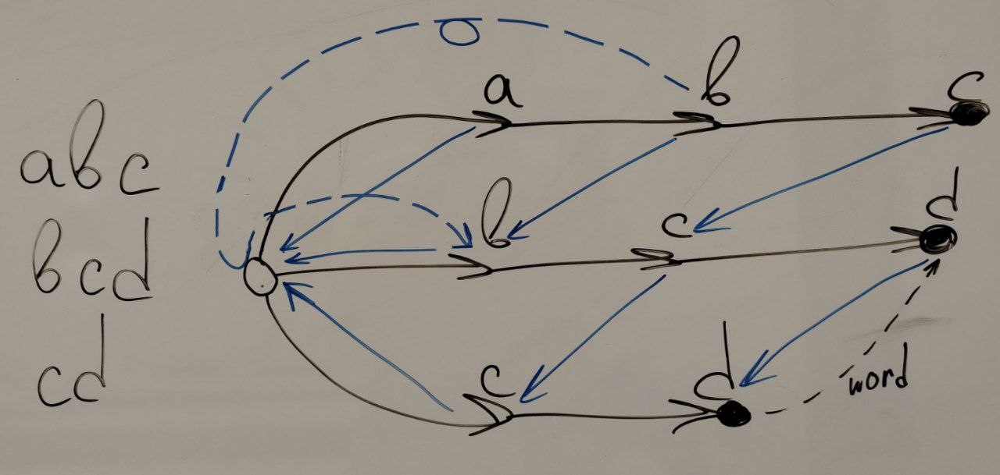

<!-- markdownlint-disable MD025, MD001, MD024 -->

# Lecture 1 - String Pattern Matching (KMP, Z-fun)

## KMP (Knuth-Morris-Pratt)

Idea: skip over parts of the text that have already been examined.

**Proper** prefix/suffix of a string - any prefix/suffix of the string except the string itself.

### LPS

In the **LPS (Longest Prefix Suffix)** array, we compare proper prefixes of the pattern with its suffixes to find repeating patterns.

```cpp
std::vector<size_t> LPSArray(const std::string& str) {
    size_t size = str.size();
    std::vector<size_t> prefixes(size, 0);

    for (size_t i = 1; i < size; ++i) {
        size_t last = prefixes[i - 1];

        while (last > 0 && str[last] != str[i]) {
            last = prefixes[last - 1];
        }

        prefixes[i] = last + static_cast<size_t>(str[last] == str[i]);
    }

    return prefixes;
}
```

---

```cpp
bool KMPSearch(const std::string &text, const std::string &pattern) {
    int n = text.length();
    int m = pattern.length();

    std::vector<int> lps = LPSArray(pattern);

    int i = 0; // text[]
    int j = 0; // pattern[]

    while (i < n) {
        if (pattern[j] == text[i]) {
            i++;
            j++;
        }

        if (j == m) {
            return true; // pattern is `text[i - j : i]`
        }

        if (i < n && pattern[j] != text[i]) {
            if (j != 0) {
                j = lps[j - 1];
            } else {
                i++;
            }
        }
    }

    return false;
}
```

## Z-function

### Naive

```cpp
size_t LongestCommonPrefixFromIndex(const std::string& str, size_t index) {
    size_t size = str.size();

    size_t lcp = 0;
    while (index < size && str[lcp] == str[index]) {
        ++index;
        ++lcp;
    }

    return lcp;
}

std::vector<size_t> ArrayZFunction(const std::string& str) {
    std::vector<size_t> zfun(str.size());

    for (size_t i = 0; i < str.size(); ++i) {
        zfun[i] = LongestCommonPrefixFromIndex(str, i);
    }

    return zfun;
}
```

### Using Z-blocks

```cpp
std::vector<size_t> ArrayZFunction(const std::string& str) {
    size_t size = str.size();

    std::vector<size_t> zfun(size, 0);
    zfun[0] = size;

    size_t left = 0;
    size_t right = 0;

    for (size_t i = 1; i < size; ++i) {
        if (i < right) {
            zfun[i] = std::min(zfun[i - left], right - i);
        }

        while (i + zfun[i] < size && str[zfun[i]] == str[i + zfun[i]]) {
            ++zfun[i];
        }

        if (i + zfun[i] > right) {
            right = i + zfun[i];
            left = i;
        }
    }

    return zfun;
}
```

# Lecture 2 - Multiple Pattern Search (Aho-Corasick)



1. Construct **Prefix Tree (Trie)**
2. Build Failures for each node & Group words
3. Search words within text by moving through Trie

```cpp
#include <queue>
#include <string>
#include <unordered_map>
#include <vector>

struct SearchResult {
    std::string word;
    size_t index;
};

// PrefixTree
struct TrieNode {
    std::unordered_map<char, TrieNode*> children;
    TrieNode* failure;
    std::vector<std::string> words;

    TrieNode() {}

    TrieNode(const std::vector<std::string>& strs) {
        for (const std::string& str : strs) {
            Insert(str);
        }
    }

    void BuildFailureLinks() {
        std::queue<TrieNode*> que;
        failure = this;

        for (auto [_, child] : children) {
            child->failure = this;
            que.push(child);
        }

        while (!que.empty()) {
            TrieNode* front = que.front();
            que.pop();

            for (auto [chr, node] : front->children) {
                TrieNode* fail = front->failure;

                while (fail != this &&
                       fail->children.find(chr) == fail->children.end()) {
                    fail = fail->failure;
                }

                if (fail->children.find(chr) != fail->children.end()) {
                    node->failure = fail->children[chr];

                    for (const std::string& word : node->failure->words) {
                        node->words.push_back(word);
                    }
                } else {
                    node->failure = this;
                }

                que.push(node);
            }
        }
    }

    std::vector<SearchResult> SearchWithinText(const std::string& text) {
        std::vector<SearchResult> results;

        TrieNode* node = this;

        for (size_t i = 0; i < text.size(); ++i) {
            char chr = text[i];

            while (node != this &&
                   node->children.find(chr) == node->children.end()) {
                node = node->failure;
            }

            if (node->children.find(chr) != node->children.end()) {
                node = node->children[chr];
            }

            for (const std::string& word : node->words) {
                results.push_back(
                    {.word = word, .index = i - (word.size() - 1)});
            }
        }

        return results;
    }

private:
    void Insert(const std::string& str) {
        TrieNode* cur = this;

        for (char chr : str) {
            if (cur->children.find(chr) == cur->children.end()) {
                cur->children[chr] = new TrieNode();
            }

            cur = cur->children[chr];
        }

        cur->words.push_back(str);
    }
};

std::vector<SearchResult> AhoCorasick(const std::vector<std::string>& words,
                                      const std::string& text) {
    TrieNode* root = new TrieNode(words);
    root->BuildFailureLinks();

    return root->SearchWithinText(text);
}
```

# Lecture 3 - Suffix Tree

**Task**: $P$ in $T$ $\to$ index.

Idea:

1. Preprocess: construct Suffix Tree of all substrings of $T$
2. Query: find $P$ there.

## Naive approach: Trie of Suffixes

Substring $\equiv$ prefix of suffix of string.

Trie of all substrings of $T$ $\equiv$ Trie of all suffixes of $T$.

**Suffix tree** - compressed Trie of all suffixes of a given string.

But to bild Trie of all suffixes it takes $O(T^2)$ $\to$ to do it in $O(T)$ use Ukkonen.

## Ukkonen


- A - continuation of list

- B - creating a new leaf vertex from:
  - 2: explicit
  - 3: implicit location

- C - nothing to do

---

