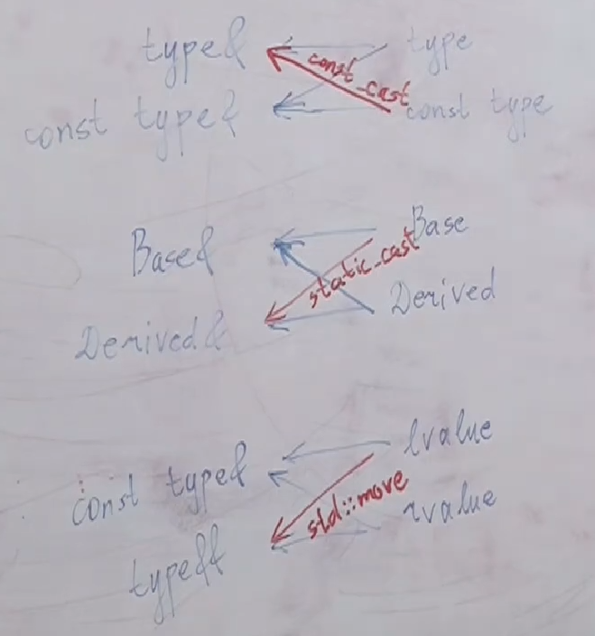

<!-- markdownlint-disable MD001 MD010 MD024 MD025 MD049 -->

# Notes

[Playlist](https://www.youtube.com/playlist?list=PLbtaNY5hOUWnKP8uHAqfqSlQHTR4GMX3p)

Use [cppinsights.io](https://cppinsights.io/).

**TQ** = Tricky question;

# Lecture 3 - Declarations and Definitions, Scopes, Namespaces

**Keyword** - reserved word that has a predefined meaning in the language and cannot be used for naming identifier.

## Lookups

| Lookup Priority | Lookup Type                         | Example                | Comment                      |
| :-------------: | :---------------------------------- | :--------------------- | :--------------------------- |
|       1️⃣        | **Qualified lookup**                | `X::x = 5;` or `obj.x` | Compiler knows exactly where |
|       2️⃣        | **Unqualified lookup**              | `x = 5;`               | Compiler hunts by rules      |
|       3️⃣        | **Argument-dependent lookup (ADL)** | `add(v1, v2);`         | Special case for functions   |

```cpp
namespace X {
    int32_t x = 0;
}

int main() {
    using namespace X;  // only affects `unqualified lookup` (names are visible but not declared).
    using X::x;         // declares X::x into the current scope
    int32_t x = 1;      // okay with `namespace X`; _conflict_ with `X::x`
}
```

### Unintentional Overloading

```cpp
using namespace std;

void distance();        // but std already has distance -> this is an overload
```

### "reference to 'x' is ambiguous"

```cpp
namespace X {
    int32_t x = 0;
}

namespace Y {
    int32_t x = 1;
}

int main() {
    using namespace X;
    using namespace Y;

    std::cerr << x << '\n'; // error: reference to 'x' is ambiguous
}
```

### Point of Declaration

**Point of declaration**: the variable is declated immidiately after `=` sign.

**TQ**:

```cpp
int32_t x = 0;

int main() {
    int32_t x =         x;  // warning: variable 'x' is uninitialized when used within its own initialization -> UB
                // . here `x` is already declared, but not initialized and we initialize it with itself
}
```

# Lecture 4 - Statements, Operators

## `operator`

Left-Associative Operators:

- Overloadable: `()` `[]` `->` `->*` `*` `/` `%` `+` `-` `<<` `>>` `<` `<=` `>` `>=` `==` `!=` `&` `^` `|` `&&` `||` `,`

- Cannot be overloaded: `::` `.` `.*`

Right-Associative Operators:

- Overloadable: `++` `--` `+` `-` `!` `~` `*` `&` `=` `+=` `-=` `*=` `/=` `%=` `>>=` `<<=` `&=` `^=` `|=`

`new` `delete` are overloadble.

### `++a` & `a++`

```cpp
ClassName& operator++();                // ++a
ClassName operator++(/*dummy*/ int);    // a++
```

### Priority

[C++ Operator Precedence](https://en.cppreference.com/w/cpp/language/operator_precedence)

**TQ**:

1. `++a++` $\equiv$ `++(a++)` $\leftarrow$ is not allowed (`++...` takes lvalue, but after first `..++` we get rvalue)

2. `a++++` $\equiv$ `(a++)++` $\leftarrow$ is not allowed (`...++` takes lvalue, but after first `..++` we get rvalue)

3. `a+++b` $\equiv$ `(a++) + b` $\leftarrow$ okay!

4. `++++a` $\equiv$ `++(++a)`$\leftarrow$ okay!

## Random

```cpp
for (declaration | expression; bool expression; expression) {}
```

```cpp
int32_t x = 0;      // here `=` is copy constructor operator
x = 1;              // here `=` is assignment operator
// they are completely different `=`
```

# Lecture 5 - CE, RE, UB

## Floating Point Exception

**TQ**:

```cpp
1 / 0;      // Floating Point Exception
1f / 0f;    // `inf` <- OKAY
```

# Lecture 6 - Pointers

## Reference

Once reference like `int& r = x` is called, `r` _cannot_ be re-binded $\to$ references has to be initialized.

### Reference types

```cpp
sizeof(int*);   // to Object: 8

int a;
sizeof(&a);     // to Variable: 8

void f() {}
sizeof(&f);     // to Function: 8

struct A {
  void f() {}
};
sizeof(&A::f);  // to Member Function: 16 !!!
```

**Pointer-to-member-function** may include both code pointer & **this-adjustment offset** to support **multiple inheritance** and `virtual` functions.

## `void*`

`void*` — generic pointer type — it can point to any type of data, but knows nothing about the type.

`void*` cannot be dereferenced.

## Standard Libraries

### C libraries

**TQ**: why we use `int32_t` without some `cstd::` if we include it with `<cstdint>`?

`int32_t` is from `<cstdint>`, so from C standard library, but it doesn't need anything like `cstd::`, because C had _no namespaces_, so everything from C standard library is _global_.

However, this is in contrast to `<cstdlib>`, `<cmath>`, `<ctime>`, etc., which _place_ functions in `std::`.

### `std` Implementations

C++ Standard Library:

- many `std::` are defined by the ISO standard — all compilers _must_ provide them

- The standard defines **interfaces**, not **implementations**

Library Variants:

- **GCC** $\to$ `libstdc++`
- **Clang** $\to$ `libstdc++` or `libc++`
- **MSVC** $\to$ Microsoft STL

# Lecture 7 - Stack, Static, Heap Memory

---

# Lecture 8 - Arrays, Function Pointers

## Arrays

### Array indexing

**TQ**:

```cpp
int arr[3]{1, 2, 3};

*arr  == arr[0];    // **array-to-pointer conversion**

// the same:
arr[2];
*(arr + 2);
*(2 + arr);
2[arr];

int* p = a + 1;
p[-1];              // ok, *((a + 1) - 1) == *a
```

### Array VS Pointer

```cpp
void f(int* arr);

// the same as

template <size_t N>
void f(int arr[N]);
```

```cpp
int* a;
int b[N];       // b - pointer as well

int* x[10];     // array of pointers
*(x[0]);        // 1st element

int (*y)[10];   // pointer to array
(*y)[0];        // 1st element
```

### `char*`

```cpp
const char* s = "a";        // takes **2 bytes** because C strings always have an automatic '\0' terminator.

const char* str = "ab\0cd";
std::cout << str << '\n';   // "ab" - dereferencing step by step until '\0'
```

### VLA

**VLA (Variable-Length Array)** - array (stored in stack memory) whose size is determined at runtime.

```cpp
int n;
std::cin >> n;
int arr[n];     // GCC extension, not standard C++
```

C++ standard forbids VLAs.  
However, some compilers (like GCC) **violate** standard allowing it as an extension.

Why Are VLAs Not in C++? $\to$ allocating large arrays on the stack can lead to **stack overflow**.

> Compilers generally strive to adhere strictly to the C++ standard.  
> However, in practice, compilers may **violate** the C++ standard.

## `std::size` & `sizeof`

```cpp
int a[N];
std::size(a) == sizeof(a) / sizeof(*a);
```

## `std::reference_wrapper` & `std::ref`

You can't do smth like:

```cpp
std::vector<T&> x;
```

But:

```cpp
std::vector<std::reference_wrapper<T>> v;
v.push_back(std::ref(obj));
```

## Function Pointer

Suppose you have:

```cpp
template <typename T>
bool Cmp(const T& l, const T& r);
```

Three _C_ ways of using it:

1. **Function reference** - address of where function stored in **.text/code section of ELF** binary file.

   ```cpp
   std::sort(v.begin(), v.end(), &Cmp);
   ```

2. **Function pointer** to _instantiated_ version.

   ```cpp
   bool (*cmp)(const T&, const T&) = &Cmp; // or = Cmp
   std::sort(v.begin(), v.end(), cmp);
   ```

3. Implicit **function-to-pointer conversion** to `bool (*)(const T&, const T&)`.

   ```cpp
   std::sort(v.begin(), v.end(), Cmp);
   ```

# Lecture 9 - Complex Definitions

**TQ**: is this allowed? - Yes

```cpp
int& f(int& x) {
    return ++x;
}

f(x) = 10;
```

# Lecture 10 - Constants

`const`-**qualified** object type restricts access to only those member _methods and operators_ that are also `const`-qualified.

## `const`

```cpp
const int x;    // CE: uninitialized `const`
```

## `T* const` & `const T*`

**TQ**: difference between `const int*` and `int* const`

```cpp
int x;

int* const cpx = &x;

const int* px = &x;
// same as
int const* px = &x;
```

```cpp
int x;

const int* pxc = &x;    // allowed implicitly: `int*` -> `const int*`; `x` is still `int*`

*pxc = 1;               // CE
++x;                    // okay


int* px = pxc;          // CE, no implicit `remove_const` conversion
```

## `T& const`

`T& const` is not allowed $\to$ no constant references.

```cpp
int x = 0;
int y = 0;

int& ref = x;
ref = y;

int& const cref = x;    // CE
```

## Lifetime Expansion

**Lifetime expansion** of temporary object on definition:

```cpp
const int& ref = 1;
int&& rref = 1;

// the same with functions:
void f(const T& val);
void f(T&& val);
```

But there is no lifetime expansion on return:

```cpp
const T& f() {
    return 1;   // warning: returning reference to local temporary object
}

T&& g() {
    return 1;   // warning: returning reference to local temporary object
}
```

```cpp
int& ref = 1;           // CE

void f(T& val);
f(1);                   // CE
```

## Typical Arguments

```cpp
void f(const T& val);   // binds to both _lvalues and rvalues_ (lifetime expansion)
void f(T& val);         // only binds to _non-const lvalues_
void f(T val);          // also: must have for small types

void f(const T val);    // don't do this shit :)
```

# Lecture 11 - Typecasts, Assembly stages, Sanitizers

## Typecasts

### 1. `static_cast<T>`

- Compile-time type conversion
- safe-ish
- _checks types_

- UB if used incorrectly

```cpp
int i = 42;
float f = static_cast<float>(i);      // OK

Base* b = new Derived();
Derived* d = static_cast<Derived*>(b); // OK if you're sure
```

### 2. `reinterpret_cast<T>`

- Bit-level reinterpretation of memory.
- Ignores types completely

- May violate strict aliasing ($\to$ UB)

```cpp
int* ip = new int(42);
char* cp = reinterpret_cast<char*>(ip); // View int memory as bytes
```

> Avoid using it. Causes UB when byte structure is different.

### 3. `dynamic_cast<T>`

- Safe **RTTI**-based cast for polymorphic types.

- Only works if the base class has at least one `virtual` function
- Returns `nullptr` on failure (for pointers)
- Throws `std::bad_cast` (for references)

Use it for:

- **Downcasting** polymorphic pointers
- Checking cast validity at runtime

```cpp
Base* b = new Derived();
Derived* d = dynamic_cast<Derived*>(b); // Works if actually Derived*, otherwise RE
```

Counter-example:

```cpp
struct A {};                // No virtual functions
struct B : A {};
A* a = new B;
B* b = dynamic_cast<B*>(a); // Compile error!
```

### 4. `const_cast<T>`

- Adds or removes `const` / `volatile` qualifiers.

- Modifying a `const` object $\to$ UB

```cpp
const int x = 10;
int* px = const_cast<int*>(&x);     // ⚠️ Legal, but modifying is UB

void func(char*);
const char* s = "hello";
func(const_cast<char*>(s));         // OK if func doesn’t write to s
```

> Avoid using it. Causes UB when modifying

### 5-ish. C-style Casting

```cpp
(type)expression
```

A C-style cast in C++ tries to apply these casts in order until one works:

1. `const_cast`

2. `static_cast`

   ```cpp
   int i = (int)3.14f;
   ```

3. `static_cast` + `const_cast`

4. `reinterpret_cast`

   ```cpp
   float f = 3.14f;
   int* p = (int*)&f;  // dangerous bit reinterpretation
   ```

5. `reinterpret_cast` + `const_cast`

> If it would work you won't know which cast it even was.  
> Avoid C-style casting, and use C++-style casts explicitely.

## Casting to: Object VS Pointer

### Object

Cast to object $\to$ essentially _creating a new object_ from the result of the cast.

Casting an object to its base will **slice** off derived attributes.

### Pointer

Cast to pointer $\to$ just changes the interpretation of the memory address without copying the object.

Often used for:  
**Upcasting** for polymorphic behavior, **downcasting** with `dynamic_cast`.

> # PART 2: OOP

# Lecture 12 - Classes

## Private Overloaing

**TQ**:

```cpp
class A {
	void f(int a) {}    // witthout it `0` will be implicitely converted to `float` and `f(float)` will be used
public:
  	void f(float a) {}
};

A cl;
cl.f(0);    // CE: 'f' is a private member of 'A'
cl.f(3.14); // CE: `3.14` is `double` $\to$ no explicit function for `double` $\to$ `f(int)` & `f(float)` are both available $\to$ tries `f(int)` $\to$ private
cl.f(3.14f) // okay
```

This is quite contrintuitive.  
It finds most suitable overload (even if it's private) and tries to call it.

# Lecture 13 - Constructors

## `{}` initializations

```cpp
class A;

// Initialization Types:

// **Initializer List**: if it has `A(std::initializer_list<T>)`
// **Direct List**: if it has any constuctor (except `std::initializer_list`)
// **Aggregate**: if it has no constuctor
A obj{1, 2};

// **Copy List**: if it has any constuctor (except `std::initializer_list`)
// **Copy List with Initializer List**: if it has `A(std::initializer_list<T>)`
// **Aggregate**: if it has no constuctor
A obj = {1, 2};

// **Default Constructor**: if it has `A()`
// **Value**: attributes default-initialized
A obj4{};
```

Constructor with `std::initializer_list` has the highest priority and it will always try to do implicit conversion to it first.

$\to$ it's sometimes better to use `A obj(...)` instead of `A obj{...}` if you don't want do Initializer List Initialization.

## Explicitly Declared Implicitly Defined Constructor (`default`)

Compiler automatically generates a default implementation for it.

```cpp
class A {
    ...
public:
    A(...) = default;

    A(const A&) = default;

    A(A&&) = default;

    ~A() = default;
};
```

In cases where other constructors exist, explicitly declaring an implicit constructor can help the compiler resolve **ambiguities**.

# Lecture 14 - Move Semantics

## `delete`

**TQ**: you have template smth. How to forbid some types to use?

1. SFINAE

2. using `concept`s and `requires`

3. `delete`

   ```cpp
   template <typename T>
   void f(T&& val);

   void f(int val) = delete;
   ```

---

## Copy assignment

**TQ**: In Copy Assignment Operator why do we return `ClassName&` and not:

- `void` // because we want to support `(a = b) = c`;

- `ClassName` // doing extra copy that is unused

- `const ClassName&` // because we want to support `(a = b) = c`;

# Lecture 15 - `const`, `mutable`, `static`, `explicit`

## Type Cast Operator

`operator target_type() const;`

```cpp
class Number {
public:
    Number(double v) : value(v) {}

    operator double() const {
        return value;
    }

    operator int() const {
        return static_cast<value>;
    }

    explicit operator bool() const {
        return value <= 0;
    }

private:
    double value;
};
```

`explicit` **forbids** implicit conversions $\to$ only via `static_cast`.

> It's good practice to make conversion to `bool` explicit (for `if`).

# Lecture 16 - Operator Overloading

> Overload binary operators out of the class.

## `+` & `+=`

> Express overload of `+` through overload of `+=` to avoid extra copying.

```cpp
class Number {
public:
    Number() : value(0) {}

    Number(double v) : value(v) {}

    Number& operator+=(const Number& other) {
        value = value + other.value;
        return *this;
    }

private:
    double value;
};

Number operator+(const Number& left, const Number& right) {
    Number result = left;
    result += right;
    return result;
}

Number x(1.0);
x + 1.0;    // ok
1.0 + x;    // ok
```

### rvalue assigning

**TQ**:

```cpp
Number a, b, c;

a + b = c;  // Ok, because `a + b` returns `Number`, but _strange as fuck_
```

To **forbid** it:

```cpp
Number& Number::operator=(const Number& other) & {...}  // now we can assign only to lvalue
```

C++ built-in primitives like `int32_t` forbid it via `(...) & {...}`.

## `operator<=>`

```cpp
#include <compare>

std::weak_ordering Number::operator<=>(const Number other) const = default;
```

# Lecture 17 - Enums, Inheritence

## Enums

Use `enum class`, because:

- No implicit conversion to/from `int`

- No global name pollution of enumerator's attributes

## `public`, `protected`, `private`

### Access Modifiers

They are _purely compile time_.

```cpp
class A {
public:     // to all
    ...

protected:  // to this & inheritor only (but not to inheritor of inheritor)
    ...

private:    // to this & friends
    ...
}
```

Access modifiers don't affect **scope resolution** (**visibility**) at all, only **accessibility**.

**TQ**:

```cpp
class A {
public:
    void f(double x);

private:
    void f(int x);
};

A a;
a.f(1); // CE: 'f' is a private member of 'A'
```

When accessing smth: 1. In scope? $\to$ 2. Accessable?

### Inheritance Semantics

```cpp
class Base {
public:
    int a;

protected:
    int b;

private:
    int c;
};

class PublicDerived : public Base {
    void f() {
        a = 1; // ✅ OK (public -> public)
        b = 2; // ✅ OK (protected -> protected)
        c = 3; // ❌ was private
    }
};

class ProtectedDerived : protected Base {
    void f() {
        a = 1; // ✅ OK (public -> protected)
        b = 2; // ✅ OK (protected -> protected)
        c = 3; // ❌ was private
    }
};

class PrivateDerived : private Base {
    void f() {
        a = 1; // ✅ OK (public -> private)
        b = 2; // ✅ OK (protected -> private)
        c = 3; // ❌ was private
    }
};

int main() {
    PublicDerived d1;
    d1.a = 10; // ✅ OK
    d1.b = 20; // ❌ protected
    d1.c = 30; // ❌ private

    ProtectedDerived d2;
    d2.a = 10; // ❌ now protected

    PrivateDerived d3;
    d3.a = 10; // ❌ now private
}
```

> Note that attributes of Derived are all **visible**, but some of them are not **accessible**.

Example:

```cpp
class FancyVector : private std::vector<int> {
public:
    void PushBackTwo(int x, int y) {
        push_back(x);
        push_back(y);
    }
};
```

## `friend`

`friend` is not inheritable.

> Best Practice:

```cpp
// class B;    // no need

class A {
    friend class B;
}

class B {}
```

### "строгая мама не разрешает общаться с доброй бабушкой"

**TQ**:

```cpp
struct Granny {
    friend struct Son;

private:
    int x;
};

struct Mom : protected Granny { // or `private`
};

struct Son : Mom {
};

int main() {
    Son s;
    s.x;    // CE
}
```

# Lecture 18 - Inheritence

## EBO

**EBO** - Empty Base Optimization

```cpp
class Base {};          // sizeof(Base) == 1

class Derived: Base {}; // sizeof(Derived) == 1


class Derived: Base {   // sizeof(Derived) == sizeof(Derived::x) == 8
    int64_t x;

    void Method();      // _non-virtual_ methods weight nothing
};
```

## Contructors

```cpp
struct Base {
    int x;
    // NO: Base() : x(0) {};
    // NO: Base(int x) = default
    Base(int x) : x(x) {}
}

struct Derived: Base {
    double y;

    Derived(double y) : Base(0), y(y) {}    // otherwise CE
}
```

## Implicit Inheritence Cast

```cpp
class Derived: public Base {...}

void c(Base base);  // slicing

void r(Base& base);

void p(Base* base);

Derived d;
c(d);       // OK: slicing
r(d);       // OK: implicit cast to Base
p(d);       // OK
```

**Slicing**: `Base` will be **sliced** out of `Derived` using `Base(const Base& b);` copy constructor (which can be default generated or manually implemented).

# Lecture 19 - Multiple & Virtual Inheritence

## Multiple Inheritence

```cpp
class A {
    void f();
    void g(int);
}

class B {
    void f();
    void g(double);
};

class C: public A, public B {};

C c;        // in memory: A B C
c.f();      // CE
c.g(1);     // OK
c.g(1.0)    // OK
```

Methods of base classes get overloaded with each other in derived class.

## Diamond Problem

```txt
  A
 / \
B   C
 \ /
  D
```

```cpp
class A {
public:
    void f();
};

class B : public A {};
class C : public A {};

class D : public B, public C;

D d;        // in memory: |A| |B| |A| |C| |D|

d.f();      // CE
d.A;        // CE, it should be: `d.B::A;` or `d.C::A;`
A& a = d;   // CE
```

### Solution

With **`virtual` inheritance**, D contains only one instance of A, shared by B and C.

```cpp
class A {
public:
    void f();
};

class B : virtual public A {};
class C : virtual public A {};

class D : public B, public C {};

D d;        // in memory: |ptr of B on A| |B| |ptr of C on A| |C| |D| |A|

d.f();      // OK
d.A;        // OK
A& a = d;   // OK
```

## Virtual Table

**Virtual table** - lookup table of function pointers - static, per-class array of function pointers pointing to the most derived overrides of the virtual functions.

A class gets a **vtable** if:

- has at least one `virtual` function.

- not marked `final`

# Lecture 20 - `virtual`

## Destructor

> Always make your base desrtuctor `virtual`, even if there's no dynamic memory in `Derived`.

```cpp
class A {
public:
    // virtual ~A() = default;
    virtual ~A() {
        std::cout << "~A";
    }
};

class B : public A {
public:
    ~B() {
        std::cout << "~B";
    }
};

A* a = new B();
delete a;   // "~B~A", without `virtual` only "~A"
```

---

## Access modifiers, `virtual`

- Access modifiers are _purely compile time_.

- `virtual`ity is _runtime_ thing.

> `virtual` doesn't account for access at all

**TQ:**: which method will be used?

```cpp
class A {
public:
    virtual int f() const {
        return 1;
    }
};

class B : public A {
private:
    int f() const override {
        return 2;
    }
};

B b;
A &a = b;
a.f();     // 2, even though it's private!!
```

# Lecture 21 - RTTI

## `dynamic_cast` vs `static_cast`

If the cast is invalid:

- `static_cast`: compiles and may cause _UB_

- `dynamic_cast`

  - for pointers: returns `nullptr` at _runtime_
  - for references: throws `std::bad_cast` at _compile time_

## RTTI

**RTTI (Run-Time Type Information)** - enables the program to determine the actual type of a _polymorphic_ typed object at _runtime_.

### vtable

**Virtual table (vtable)** - statically allocated array for a _polymorthic class_ created at _compile time_.

- vtable is **per class**, _shared_ among objects

### vptr

**Virtual pointer (vptr)** points to the vtable of the class that constructed the object (i.e., the object's **dynamic type**).

- vptr is **per object**

---

**Dynamic dispatch** - _runtime_ resolution of virtual functions to call (base | derived).

> Virtual calls are slightly _slower_ due to vptr lookup.

### `type_id`

- for non-poly classes: returns _static type_

- for poly classes: performs _RTTI_ returns _dynamic type_

```cpp
#include <typeinfo>

Base* b = new Derived();

const std::type_info info = typeid(*b);
info.name();
```

# Lecure 22 - Memory Layout of Polymorphic Objects

**ABI (Application Binary Interface)** - how binary code is structured and interacts at the machine level.

> Variable can't change the type. But, memory can hold different types over time.

TODO

---

TODO

Where to put

```cpp
// Non-copyable
ThreadPool(const ThreadPool&) = delete;
ThreadPool& operator=(const ThreadPool&) = delete;

// Non-movable
ThreadPool(ThreadPool&&) = delete;
ThreadPool& operator=(ThreadPool&&) = delete;
```

> # PART 3: Templates

# Lecture 23 - Templates, Specialization

## Template Instantiation

Templates are **instantiated** into _actual code_ (actual definitions with specific types) during the **parsing part** of compilation phase.

**TQ**:

```cpp
template <typename T>
void f(T, T) {}

f(1, 1.0);  // CE - no matching function; 'T' ('int' vs. 'double')
```

> First `T` should be infered, only after that with an _actual code_ **conversions** can happen.

### Template Return Type

Template return type can't be infered, because it doesn't look to function's body.

> Provide explicitely `<...>`; Use `auto` (mb with `decltype`)

```cpp
template <typename T, typename R>
R f(T x) {
    return x;
}
```

## Class Template Specialization

Classes have no overloads.

Class can't be declared with other than given number of template parameters.

```cpp
template <typename T, typename U>
class C;

// Partial specialization
// 1
template <typename T>
class C<T, T>;

// 2
template <typename T>
class C<int, T>;

// 3
template <typename T>
class C<int>;

// Full specialization
template <>
class C<int, double>;
```

## Fuction Template Specialization & Overloads

Functions have only full specialization and **overload** (_no_ partial specialization).

> **Overload resolution** is performed before **template instantiation** and does not consider **specializations**, even if they are instantiated.

```cpp
template <typename T>
void f(T);

template <>
void f/*<int>*/(int) {
    std::cout << "<int>";
}

void f(int) {
    std::cout << "int";
}

f<int>(1);  // "<int>"
f(1);       // "int" - no ambiguity
```

> For C++ community: If partial specialization goes to overload, it's a bit stupid to have full specialization at all, why not just do an overload?

### Overload Resolution Rules

1. If an _exact match_ exists among non-template overloads $\to$ use it.

2. Otherwise, consider both _template and non-template_ functions as candidates:

   1. Deduce template arguments.

   2. Apply implicit conversions as needed.

   3. Rank all viable functions.

3. Ranking of Conversions $\to$ Select the best viable candidate (**if not ambiguous**).

4. If the best candidate is a template, then **instantiate** it.

### Ranking of Conversions

| Rank | Conversion Type             | Description                                                |
| ---- | --------------------------- | ---------------------------------------------------------- |
| 1️⃣   | **Exact Match**             | No conversion needed (`int → int`)                         |
| 2️⃣   | **Promotion**               | Small type to larger type (`char → int`, `float → double`) |
| 3️⃣   | **Standard Conversion**     | Conversions like `int → double`, `Derived* → Base*`        |
| 4️⃣   | **User-Defined Conversion** | Uses a constructor or `operator` (e.g. `MyType(int)`)      |
| 5️⃣   | **Ellipsis (`...`)**        | Varargs fallback, worst possible match                     |

# Lecture 24 - Non-Type Parameters, Template Template Parameters

## Non-Type parameters

Non-Type parameters should be `constexpr` when supplied.

```cpp
template <typename T, size_t N, size_t M>
class Matrix;

template <typename T, size_t N>
using SquareMatrix = Matrix<T, N, N>;

template <typename T, size_t N, size_t K, size_t M>
Matrix<T, N, M> operator*(const Matrix<T, N, K>& a, const Matrix<T, K, M>& b);
```

## Template Template Parameters

```cpp
template <typename T, template <typename, typename> typename Container = std::vector>
class Stack {
    Container<T, std::allocator<T>> container;
};

// this compiles with g++, but clang++ gives CE
template <typename T, template <typename> typename Container>
class Stack {
    Container<T> container;
};
```

# Lecture 25 - Dependent Names

## Dependent Names

### 1

```cpp
template <typename T>
struct S {
    using A = int;
};

template <>
struct S<int> {
    static constexpr int A = 0;
};

int x = 0;

template <typename T>
void f() {
    // S<T>::A* x;
    // ? declaration: int* x;
    // ? expression:  0 * 0;
    // Syntax parsing happens before template instantiation!
    // -> As a rule any dependent name is **expression**, so it is `0 * 0`

    // to make it parsed as a type:
    typename S::A* x;
}
```

### 2

```cpp
template <typename T>
struct Base {
    int x;
};

template <>
struct Base<int> {};

template <typename T>
struct Derived: public Base<T> {
    void f() {
        // x;  - CE: use of undeclared identifier 'x'
        ++this->x;
        ++Base<T>::x;
    }
};
```

# Lecture 26 - CRTP, Exceptions

## [CRTP](https://en.wikipedia.org/wiki/Curiously_recurring_template_pattern)

```cpp
template <typename Derived>
class Base {
public:
    void interface() {
        static_cast<Derived*>(this)->implementation();
    }

    // default fallback
    void implementation();
};

class DerivedA : public Base<DerivedA> {
public:
    void implementation();
};

class DerivedB : public Base<DerivedB> {
    // fallback will be used
};

DerivedA a;
a.interface();  // DerivedA impl

DerivedB b;
b.interface();  // Base default impl
```

## Runtime Errors & Exceptions

**Runtime errors**:

1. cause core dumps (OS-level)
2. throw **exceptions** (language-level)
   segmentation fault
   OS-level runtime errors _can't_ be `try`-`catch`ed:

```cpp
try {
    int x;
    std::cin >> x;
    x = 1 / x;              // "Floating point exception" (but it's not C++ exception, but OS's one)

    int* p = nullptr;       // "Segmentation fault"
    *p = 1;
} catch (...) {
    // it won't catch any of those
}
```

But Python does a lot of checking on language-level, making it slower, but we can catch them more easily.

Catching exceptions is really expensive.

# Lecture 27 - Exception Processing

## Function `try` Block

```cpp
void f() try {
    //
} catch (...) {
    //
}
```

```cpp
class A {
    struct B {
        B(int x) {
            if (x == 0) {
                throw;
            }
        }
    }

    C() try: x_(1), y_(0) {
        //
    } catch (...) {
        //
    }

private:
    B x_;
    B y_;
};
```

> # PART 8: Iterators & Standard Library

# Lecture 28 - Exception safety, `std::vector`

## Exception Specification: `noexcept`

```cpp
void f() noexcept;

void t() noexcept try {
    //
} catch (...) {
    //
}

template <typename T>
void p() noexcept(std::is_reference_v<T>);

template <typename T>
void q() noexcept(noexcept(p<T>()));
// std::vector() noexcept(noexcept(Allocator()));
```

_Destructors_ are `noexcept` by default from C++11, to disable this, use `noexcept(false)`.

> When program is terminated, the **stack unwinds** and all the objects call their destructors.

## [Exception safety](https://en.cppreference.com/w/cpp/language/exceptions.html)

**Strong exception guarantee** — If the function throws an exception, the state of the program is rolled back to the state just before the function call (for example, `std::vector::push_back`).

## Any std::_container_

When talking about any container, we should think about:

1. How Iterator will work
2. Invalidatiton of pointers/references/iterators
3. Exception safety
4. Allocator-awaring

## `std::vector`

### `reserve`

> **"How to implement `reserve` of vector"** - single greatest questions to know someone's level of C++ knowleadge.

Check [vector](https://github.com/vbalab/cpp_vector_implementation).

### `reserve` vs `resize`

`reserve` - only grows capacity

`resize` - changes size, does construct/destroy elements

### `max_size`

Theoretical maximum number of elements the container could hold, Determined by the container’s `size_type` (often `std::size_t`) and the allocator’s limitations—typically something like `SIZE_MAX / sizeof(T)`.

### `std::vector<bool>`

Doesn't store store `bool`s as a contiguous array, but rather stores as a bit mask.

```cpp
template <typename T>
void f(T) = delete;

std::vector<bool> v{true};
f(v[0]);    // `std::_Bit_reference`, not `bool`
```

# Lecture 29 - `std::deque`, Iterators

## `std::vector` Invalidation

**TQ**:

1. **Pointer invalidation** on potential reallocation

   ```cpp
   T* p = &vec[0];
   vec.push_back(T());
   *p;                     // UB
   ```

2. **Reference invalidation** on potential reallocation, because reference is stored as pointer internally

   ```cpp
   T& r = vec[0];
   vec.push_back(T());
   r;                      // UB
   ```

3. **Iterator invalidation** on potential reallocation, because `it` holds `T*`

   ```cpp
   std::vector<T>::iterator it = vec.begin();
   vec.push_back(T());
   *it;                    // UB
   ```

> `std::deque` doesn't invalidate `*`/`&` on push, only iterator is invalidated.

## Iterators

Raw pointer is iterator, because it has `operator*`, `operator+`, `operator==`.  
Smart pointers are not iterators, because they have no `operator+`.

### Range-based `for`

```cpp
for (auto& val : v) {
    val;
}

// it get's parsed as:
std::vector<T>::iterator end = v.end();
for (std::vector<T>::iterator it = v.begin(); it != end; ++it) {
    auto& val = *it;
}
// so it just needs `begin` & `end` overloaded
```

## How to know template type?

```cpp
template <typename T>
void f(T) = delete;     // check argument type

template <typename T>
void g() = delete;      // check type

int&& x = 0;

f(x);                       // [with T = int]
g<decltype(x)>();           // [with T = int&&]
```

# Lecture 30 - Iterators, Adapters

## `distance`

```cpp
// or do via concepts | SFINAE
template <typename It>
typename std::iterator_traits<It>::difference_type Distance(It begin, It end) {
    if constexpr (std::is_base_of_v<std::random_access_iterator_tag,
                                    typename std::iterator_traits<It>::iterator_category>) {
        return end - begin;
    }

    size_t i = 0;   // will be casted
    while (begin != end) {
        ++begin;
        ++i;
    }
    return i;
}
```

## Adapters

```cpp
std::vector<int> vec{1, 2, 3};

std::vector<int>::iterator it = vec.end();
std::vector<int>::reverse_iterator rit = std::reverse_iterator(vec.end());
```

## Output Iterator

```cpp
std::vector<int> v;

std::copy({1, 2, 3}, {1, 2, 3} + 3, std::back_inserter(v));

std::ostream_iterator<int> out_it(std::cout, ", ");
std::copy(v.begin(), v.end(), out_it);  // prints: 1, 2, 3,
```

# Lecture 31 - I/O stream

`std::cin` & `std::cout` are tied, holding pointer to each other.  
`cin`/`cout` before taking into buffer flush `cout`/`cin` by holding pointer.  
We can **untie** by setting pointers to `nullptr`.

The same way I/O of C++ synchronized with I/O of C.

```cpp
std::cin.tie(nullptr);  // untie `cout`
std::cout.tie(nullptr); // untie `cin`

std::cin.sync_with_stdio(false);    // untie from C
std::cout.sync_with_stdio(false);   // untie from C
```

# Lecture 32 - `std::list`, `std::map`

## `std::list`

```cpp
template <typename T>
class List {
    struct BaseNode {
        BaseNode* prev;
        BaseNode* next;
    };
    struct Node : public BaseNode {
        T value;
    };

public:
    List() :
    fake_node_(&fake_node_, &fake_node_),   // !
    size_(0) {
    }

private:
    BaseNode* fake_node_;
    size_t size_;
};

int main() {

    return 0;
}
```

## `std::map`

Can't use `operator[]` under `const` $\to$ use `.at()`.  
Because if no value found under `[key]`, it creates new `T()`.

```cpp
std::map<int, char> m;

// inline void std::map<int, char>::insert(std::initializer_list<std::pair<const int, char>> __list)
m.insert({{0, 'a'}, {1, 'b'}});

// inline std::pair<std::map<int, char>::iterator, bool> std::map<int, char>::insert(std::pair<const int, char> &&__x)
m.insert({2, 'c'}); // bool = false -> no insertion (the key was already present).

// auto
// decltype(m)::iterator
// std::map<int, char>::iterator
if (auto it = m.find(3); it != m.end()) {
    it->second = 'd';
}
```

`begin` - lowest (leftest) value of RB tree, `end` - fake node higher than the root of RB tree (- rightest value).

### `std::set`

Absolutely the same, except instead of `std::pair<Key, Value>` stores only `Key`, and there's no `operator[]`.

# Lecture 33 - Stream Iterators

## `std::istream_iterator` & `std::ostream_iterator`

```cpp
template <typename T>
class IstreamIterator {
public:
    using iterator_category = std::input_iterator_tag;
    using value_type = T;
    using reference = const T&;
    using pointer = const T*;
    using difference_type = std::ptrdiff_t;

public:
    IstreamIterator() : in_(nullptr) {
    }

    explicit IstreamIterator(std::istream& in) : in_(&in) {
        *in_ >> value_;
    }

    IstreamIterator& operator++() {
        if (in_ && !(*in_ >> value_)) {
            in_ = nullptr;
        }

        return *this;
    }

    reference operator*() const {
        return value_;
    }

    pointer operator->() const {
        return &value_;
    }

    bool operator==(const IstreamIterator& it) {
        return in_ == it.in_;
    }

    bool operator!=(const IstreamIterator& it) {
        return in_ != it.in_;
    }

private:
    std::istream* in_;
    value_type value_;
};

int main() {
    IstreamIterator<int64_t> it(std::cin);

    std::vector<int64_t> v(it, IstreamIterator<int64_t>());  // Ctrl + D

    std::copy(v.begin(), v.end(), std::ostream_iterator<int64_t>(std::cout, ", "));
}
```

# Lecture 34 - `std::unordered_map`

## Implementation

`std::unordered_map` tries to be versatile by having iterators with full bypass from `begin` to `end` in O(#elements), not O(capacity).

1. GCC’s & clang:
   Buckets are stored in `__node** _M_buckets` (like `std::vector<node*>`).

   `_M_buckets[i]` actually points to the node immediately before the first element of bucket `i`, so that `_M_buckets[i]->next` is the bucket’s true head.  
   This **“predecessor” trick** lets erasure run in constant time without a backward pointer.

2. Microsoft’s STL:
   1. `std::vector<list<value_type>::iterator>` where buckets are stored
   2. one doubly-linked `std::list` where all elements live (nodes sorted by bucket index)

## Iterator

C++ standard guarantees at least a forward iterator.

1. GCC/Clang: forward-only

2. MSVC: **bidirectional**

## Invalidation

- Iterators: invalidated on `rehash` (or clear/erase of that element), but otherwise stable;

- Pointers/References: invalidated only when the element itself is erased (or container is cleared), never by bucket reshuffling.

> # PART 9: Allocators & Memory Management

# Lecture 35 - Allocators

> Container $\to$ allocator_traits $\to$ Allocator $\to$ operator new $\to$ malloc $\to$ OS.

## Allocator

```cpp
template <typename T>
struct Allocator {
    T* allocate(size_t count) {
        // 1.
        // T* buffer = new T[count];
        // `T` might not have default constructor. And even if it did - we don't want to use it

        // 2.
        // T* buffer = reinterpret_cast<T*>(new char[count * sizeof(T)]);
        // still it does unnecessary constuction of `char`
        // need to `reinterpret_cast<char*>` back when `delete[]`

        // 3.
        T* buffer = static_cast<T*>(::operator new(count * sizeof(T)));
        // it's not `new`, but function `operator new` - 1st part of `new`

        return buffer;
    }

    deallocate(T* ptr, size_t /*n*/) {
        // delete[] ptr;

        // delete[] reinterpret_cast<char*>(ptr);

        ::operator delete(ptr);
    }

    // may implement other methods: construct, destroy, ...
};
```

## Allocator Traits

```cpp
template <typename Alloc>
struct AllocatorTraits {
    template <typename U, typename... Args>
    static void construct(Alloc alloc, U* ptr, Args&&... args) {
        if constexpr (/*has construct*/) {
            alloc.construct(ptr, args);
        } else {
            new (ptr) U(std::forward<Args>(args)...);  // placement new
        }
    }

    template <typename U>
    static void destroy(Alloc alloc, U* ptr) {
        if constexpr (/*has construct*/) {
            alloc.destroy(ptr);
        } else {
            ptr->~U();
        }
    }

    // the same way:
    // allocate
    // deallocate
    // ...
};
```

# Lecture 36 - Allocation-aware Containers, `new` & `delete` overloading

## Allocator-aware Copy Assignment

```cpp
Alloc newalloc = AllocTraits::propagate_on_container_copy_assignment::value ? other.alloc_ : alloc_;
```

## `new`

```cpp
void* operator_new_impl(size_t size) {
    if (size == 0) {
        size = 1;   // !
    }
    void* p;

    while ((p = malloc(size)) == nullptr) {
        std::new_handler nh = std::get_new_handler();   // https://en.cppreference.com/w/cpp/memory/new/set_new_handler

        if (nh) {
            nh()
        } else {
            break;
        }
    }

    return p;
}

void* operator new(size_t size /*bytes*/) {
    void* p = operator_new_impl(size)

    if (p == nullptr) {
        __throw_bad_alloc_shim();
    }

    return p;
}
```

operator `new` consists of 2 parts:

1. **function** `operator new`: memory allocation - **can be overrided**

   ```cpp
   static_cast<T*>(::operator new(n))  // :: <- to use globally defined, if you're in a class
   ```

2. **placement new**: constructor (of given type on allocated memory) - **can't be overrided**

   ```cpp
   new (ptr) T(std::forward(args)...);
   ```

## `delete`

```cpp
void operator delete(void* ptr) {
    free(ptr);
}
```

operator `delete` consists of 2 parts:

1. destructor - **can't**

   ```cpp
   ptr->~T();
   ```

2. **function** `operator delete` - **can**

   ```cpp
   ::operator delete(ptr);
   ```

# Lecture 37 - Varieties of `new`

If `new` throws $\to$ standard guarantees that `delete` will be used automatically!

## Overriding `new`

`new` is already defined in `std`, when we override it globally there's no error of **redefinition**, because in `std` it is declared as `_LIBCPP_WEAK` (for llvm) and can be just overrided.

## Bit Fields

```cpp
struct S {
    unsigned char b1 : 3;
    unsigned char    : 2;
    unsigned char b2 : 6;
    unsigned char b3 : 2;
}
```

> # Part 10: Move Semantic

# Lecture 38 - Scoped Allocators, Move Semantic

[38](https://www.youtube.com/watch?v=CSDzObQOguo)

# TODO: tg

# Lecture 39 - `std::move`, lvalue & rvalue

## Move Constructor

```cpp
class S {
public:
    S(const S& other) : str_(other.str_) {}
    S(S&& other) : str_(std::move(other.str_)) {}
private:
    std::string str_;
};
```

## `std::move`

```cpp
template <typename T>
void swap(T& x, T& y) {
    T tmp = std::move(x);
    x = std::move(y);
    y = std::move(tmp);
}
```

# Lecture 40 - `&&`



## `&&` qualifier

```cpp
struct S {
    S& operator=() & {
        ...
    }

    void operator=() && {}
}

// so that "(a + b) = 3;" will do nothing, but `a = 3;` will do copy assignment.
```

```cpp
template <typename T>
class S {
public:
    T GetData() const & {   // but there's no difference if `const` and `const &` HERE
        return data_;
    }

    T GetData() && {
        return std::move(data_);
    }
private:
    T data_;
}
```

# Lecture 41 - `std::forward`, `push_back`

## `std::move_if_noexcept`

`std::move_if_noexcept`:

- if the type's move constructor could `throw` and the type is copyable $\to$ copy.
- otherwise, `std::move`

> Mark _move constructor_ `noexcept` for `std::move_if_noexcept`, which is used in `std` containers.

## `std::vector::push_back`

```cpp
vec.push_back(vec[10]);
```

$\to$ first we push back, then we try to re`reserve` if we need, otherwise `vec[10]` is invalidated before pushing back.

# Lecture 42 - Value Types, Copy Elision, RVO

To work with Move Semantics we need to know only about lvalue & rvalue.

Knowledge of glvalue, xvalue, prvalue are for copy elision.

## Copy Elision && RVO

**Copy elision** - omitting copy/move assignment/constructor, _even if_ copy/move constructor has side effects.

1. (Optional) Temporary to local variable:

   ```cpp
   T x = T();
   T x = T(T(T(T(T()))));
   ```

2. (Guaranteed) **RVO** - return value optimization:

   ```cpp
   template <typename T>
   T f() {
       return T(); // **unnamed** temporary object
   }
   ```

3. (Optional) **NRVO** - named RVO:

   ```cpp
   template <typename T>
   T f() {
       T x();
       return x;   // **named** object
   }
   ```

4. (Optional) Throwing/catching exceptions

   ```cpp
   throw T();     // S constructed directly in exception storage
   ```

5. (Optional) Aggregate initialization

   ```cpp
   T x = { ... };  // direct initialization, copy/move may be elided
   ```

Copy elision works only for _prvalue_.

```cpp
T x = std::move(T());   // xvalue -> won't work
```

## Yet another optimization

```cpp
T f(T x) {
    return x;
}
```

Will be optimized to move (not copy) constructor, because `x` is _local_ variable.

> # PART 11 - Type Deduction

# Lecture 43 - `auto`, `decltype`, `declyte(auto)`

## `auto`

Type deduction works like with templates.

**TQ** will it compile? - yes!

```cpp
template <typename T>
auto f(T x) {
    if constexpr(std::is_same_v<T, int>) {
        return "abc";
    } else {
        return 1;
    }
}

f(1);
f(true);
```

**TQ** will it compile? - NO!!!

```cpp
template <typename T>
auto f(T x) {
    if constexpr(std::is_same_v<T, int>) {
        return "abc";
    }
    return 1;
}

f(1);
f(true);    // CE: 'auto' in return type deduced as 'int' here but deduced as 'const char *' in earlier return statement
```

### `auto` Arguments (C++20)

```cpp
template <typename T
void f(T);

// now you can:
void f(auto);

// and even:
void f(auto&&...);
```

They are almost the same, (but there some small nuances).

But:

```cpp
std::vector<auto> v({1}); // CE: 'auto' not allowed in template argument
std::vector v({1});       // do this :)
```

### `auto` Template Parameters (C++20)

```cpp
template <auto N>
struct S;

S<1>();
S<'a'>();
S<true>();
```

## `decltype`

> decltype is evaluated at compile time

```cpp
int x = 0;
decltype(++x) y = ++x;  // warning: "Expression with side effects has no effect in an unevaluated context"
// x == y == 1
```

```cpp
int x = 0;
decltype((x)) y = x;    // decltype((x)) == int&
```

# Lecture 44 - ...

# Lecture 45 - ...

# Lecture 46 - Smart Pointers

## `std::unique_ptr` & `std::make_unique`

```cpp
template <typename T>
class UniquePtr {
public:
    UniquePtr() : ptr_(nullptr) {
    }
    UniquePtr(T* ptr) : ptr_(ptr) {
    }

    ~UniquePtr() {
        delete ptr_;
    }

    UniquePtr(const UniquePtr&) = delete;
    void operator=(const UniquePtr&) = delete;

    UniquePtr(UniquePtr<T>&& other) : ptr_(other.ptr_) {
        other.ptr_ = nullptr;
    }

    UniquePtr& operator=(UniquePtr<T>&& other) {
        if (this != &other) {
            delete ptr_;
            ptr_ = std::exchange(other.ptr_, nullptr);
            // ptr_ = other.ptr_;
            // other.ptr_ = nullptr;
        }

        return *this;
    }

    T& operator*() const noexcept(noexcept(*std::declval<T*>())) {
        // UB, if `ptr_ == nullptr`
        return *ptr_;
    }

    T* operator->() const {
        return ptr_;
    }

private:
    T* ptr_;
};

template <typename T, typename... Args>
UniquePtr<T>& MakeUnique(Args&&... args) {
    T* ptr = new T(std::forward<Args>(args)...);
    return UniquePtr(ptr);
}
```

## `std::shared_ptr` & `std::make_shared`

`std::make_shared` is used to:

- no manual `new` and raw pointers
- _single_ allocation
- avoids order-of-evaluation issues pre-C++17 like `f(std::unique_ptr<T>(new T(...)), g())`

# Lecture 47 - Smart Pointers, Type Erasure

## Smart Pointers Nuances

The difficulty of implementation raises exponensially if we account for:

- `std::enable_shared_from_this`
  - with class inheritance

- `std::static_pointer_cast`, `std::dynamic_pointer_cast`, `std::const_pointer_cast`, `std::reinterpret_pointer_cast`

## `std::any`

