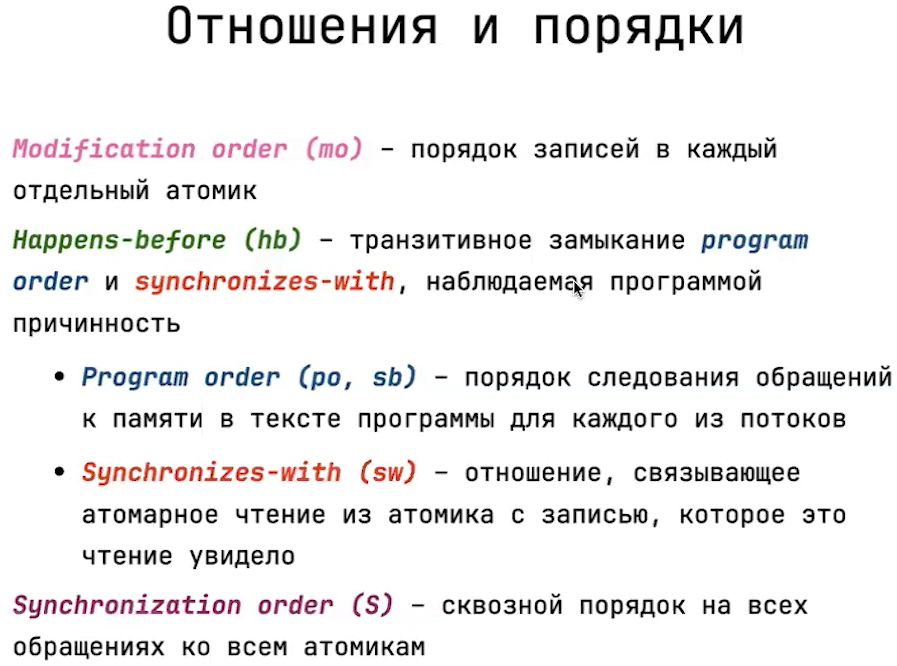
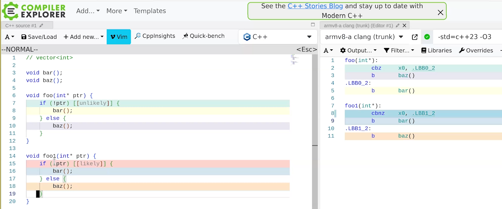

<!-- markdownlint-disable MD001 MD010 MD024 MD025 MD049 -->

# Notes

## Stack Overflow

Simpliest way to get Stack Overlow is:

```cpp
int foo(i) {
    return foo(i + 1)
}

foo(0)
```

## User-Defined Literals (UDLs)

Introduced in C++11 and enhanced in C++14.

C++ allows defining custom literals using `operator""`.

### 1 Example

```cpp
constexpr long double operator"" _kg(long double weight) {
    return weight * 1000.0;         // Convert kg to grams
}

int main() {
    double grams = 2.5_kg;          // 2.5 kg → 2500 grams
    std::cout << grams << " g\n";   // Output: 2500 g
}
```

### 2 Example

```cpp
namespace literals {
    template <char... C>
    consteval auto operator""_bin() {
        return ((C - '0') + ... * 2); // Compile-time binary conversion
    }
}

using namespace literals;

int main() {
    constexpr int binary_value = 1011_bin;  // Compile-time calculation: 1011 → 11
    std::cout << binary_value << '\n';  // Output: 11
}
```

## `std::expected` problems

Cам `#include <expected>` норм делается, но ничего из этого файла не подгружается, потому что

```cpp
#ifdef __cpp_lib_expected // C++ >= 23 && __cpp_concepts >= 202002L
```

не выполняется.

Если базово, у тебя стоит C++23, это именно сам язык, но библиотека std (`__cpp_concepts`) она как бы отдельно идет и у нее своя версия есть.  
Проверить дефолтную(!!) версию можно через:

```bash
echo | /usr/bin/clang++-18 -x c++ -std=c++23 -dM -E - | grep __cpp_concepts
```

и дефолт у тебя будет скорее всего меньше 202002L, поэтому тебе нужно отдельно указывать, какой std использовать.

1. Create a .clangd File in Your Project Root:

2. Within the .clangd file, add the following configuration:

   ```yaml
   CompileFlags:
   Add: [-D__cpp_concepts=202002L]
   ```

3. Save and Restart clangd:

   > Ctrl + Shift + P

   Then type: > clangd: Restart language server

## Port Knocking

**Port knocking** - security technique used to establish a communication channel through a firewall or router that is initially _closed to external connections_.

It works by sending a series of "knocks" (specific sequences of network packets) to predefined ports on a machine.  
When the _correct sequence of knocks_ is received, it triggers the firewall to temporarily open a port, allowing access to the system.

## Bytes

`0x` prefix - hexadecimal (base 16) number literal syntax.

Highest hex that fits into byte is `0xFF` hexadecimal.

### C++

```cpp
char           // 1 byte
unsigned char  // 1 byte, values from 0 to 255
signed char    // 1 byte, values from -128 to 127
std::byte      // C++17, a type-safe representation of a byte
```

### `std::byte`

The 0x prefix tells the compiler "this is hexadecimal."

```cpp
unsigned char bytes[] = {0x78, 0x56, 0x34, 0x12};

int number;
std::memcpy(&number, bytes, sizeof(number));

std::cout << std::hex << number << std::endl; // 12345678
std::cout << std::hex << number << std::endl; // 305419896
```

### Big/Little Endian

**Network Byte Order** = Big Endian

| Function | Direction          | Data Type |
| -------- | ------------------ | --------- |
| htons(x) | Host $\to$ Network | uint16_t  |
| htonl(x) | Host $\to$ Network | uint32_t  |
| ntohs(x) | Network $\to$ Host | uint16_t  |
| ntohl(x) | Network $\to$ Host | uint32_t  |

### `char`

Guaranteed by the standard:  
Everything in C++ can be safely cased to array of `char`s to read its raw byte representation, because `char` is basically byte.

```cpp
struct MyData {
    int a;
    float b;
};

MyData d{42, 3.14f};
char* raw = reinterpret_cast<char*>(&d);
```

But `char*` can't be safely casted to any structure, so it doesn't work in the other way.

### `sizeof`

`sizeof` - size (bytes) of object _in compile time_.

```cpp
std::vector<int32_t> v(10000);

sizeof(v);  // 24 = 8 * 3 -> array pointer, size, capacity
```

## `__...__`

`__...__` - reserved for implementation-specific or compiler-specific purposes by the C++ standard.

These names are used by:

- Compilers (like GCC, Clang, MSVC)
- Standard libraries
- System headers

### `__attribute__((packed))`

The `__attribute__((packed))` specifier tells the compiler to pack structure members together, without adding padding between them for alignment purposes.

```cpp
struct __attribute__((packed)) PackedStruct {
    char a;   // 1 byte
    int b;    // 4 bytes (no padding)
};
```

It's the same as telling `alignas(1)` to each field of struct.

## Clang

Core classes:

- `Decl`
- `Stmt`
- `Type`

Glue classes:

- `DeclContext`
- `TemplateArgument`
- `NestedNameSpecifier`
- `QualType`

> `QualType` - qualifier to the type, e.g. `const`, `&&`

All types of libclang are prefixed with `CX`.

---

`clang::ASTFrontendAction` - runs tools on AST - answers the question:

“What should Clang do with this source file?”

Examples:

- Parse and build the AST? (ASTFrontendAction)
- Generate LLVM IR? (EmitLLVMOnlyAction)
- Print preprocessed source? (PreprocessOnlyAction)

---

`clang::ASTContext` - info about AST:

- identifier table
- source manager

`clang::ASTContext.getTranslationUnitDecl()` - entry point in AST.

---

`clang::ASTConsumer` - receives and processes AST after it's been parsed.

---

`clang::RecursiveASTVisitor` walks AST recursively by overriding visit methods (like `VisitCXXRecordDecl`).

`clang::RecursiveASTVisitor` is a **template-based CRTP** (Curiously Recurring Template Pattern) class. It uses **name-based lookup** to find which `Visit*` methods you've implemented.

So internally, when you call:

```cpp
TraverseDecl(someDecl);
```

the visitor will look for and call:

```cpp
bool VisitCXXRecordDecl(CXXRecordDecl* decl);
```

if it encounters a `CXXRecordDecl` node.

# Lecture 1 - Metaprogramming

**Metaprogramming** - writing code that can generate/manipulate other code as data at _compile time_, rather than at runtime.

## Static Typing

In general, C++'s type system is primarily statically typed.

**Static Typing**: The majority of type checks, such as ensuring that variables are of the expected type, occur during compilation.

**Dynamic Typing (Runtime)**: In cases involving polymorphism (like using virtual functions), C++ can perform type checks at runtime. This is typically done using dynamic_cast, which is used to safely downcast from a base class pointer or reference to a derived class pointer or reference.

## Macroses (preprocessor stage)

**Macros** - preprocessor directives that provide a way to define reusable code snippets.  
They are not evaluated during runtime; instead, they are expanded by the **preprocessor** before the actual compilation process begins.

Macros don't have any concept of types, they simply replace the _text_.

### Examples

- `#include` basically includes all program code into the file.
- `#define PI 3.14` defining constants
- `#ifdef, #endif` conditional compilation
- `#define SQUARE(x) ((x)*(x))` function-like macros

### Macros as metaprogramming

Macros is metaprogramming if they involve:

- conditional logic
- code generation

that happens before the actual program is compiled.

```cpp
#ifdef __unix__
#include <unistd.h>
#elif defined _WIN32
#include <windows.h>
#else
#error "Unsupported platform"
#endif
```

## `template`s

### Turing Completeness

**Turing complete** programming language is one that can perform any computation that a **Turing machine**: conditionals (if-else), recursion, and the ability to store and manipulate data.

SQL is not turing complete, because it has no loops (recursion).

---

`template`s - Turing complete because they allow for metaprogramming — performing computations at _compile time_.

```cpp
template <int N>
struct Factorial {
    constexpr static int value = N * Factorial<N - 1>::value;
};

template <>
struct Factorial<0> {
    constexpr static int value = 1;
};

Factorial<5>::value;
```

```cpp
template <int N>
constexpr int Factorial() {
    return N * Factorial<N - 1>();
}

template <>
constexpr int Factorial<0>() {
    return 1;
}

Factorial<5>();
```

### Overload resolution

**Overload resolution**: full specialization $\rightarrow$ partial specialization $\rightarrow$ general template.  
Within classes there is no order.

```cpp
// 1st attempt: fail
// Full specialization (most specific match)
template <>
void foo<int>(int value) { ... }

// 2nd attempt: fail
// Partial specialization (less specific match)
template <typename T>
void foo(T* value) { ... }

// 3rd attempt: success
// General template (most general match)
template <typename T>
void foo(T value) { ... }

foo("a");
```

### SFINAE

**SFINAE** - Substitution Failure Is Not An Error: tries to substitute into appropriate template, if results in type compilation error, continues searching for other possible matches.

```cpp
template <class It, class Category>
struct IsIteratorCategory {
    constexpr static bool kValue =
        std::is_base_of<Category, typename std::iterator_traits<It>::iterator_category>::value;
};

template <class It>
using IsRandomAccessIterator = IsIteratorCategory<It, std::random_access_iterator_tag>;

template <class It>
using IsBidirectionalIterator = IsIteratorCategory<It, std::bidirectional_iterator_tag>;

template <class It>
using IsInputIterator = IsIteratorCategory<It, std::input_iterator_tag>;

template <class It>
constexpr typename std::enable_if_t<IsRandomAccessIterator<It>::kValue>
Advance(It& iterator, ptrdiff_t n) { ... }

template <class It>
constexpr typename std::enable_if_t<!IsRandomAccessIterator<It>::kValue &&
                                    IsBidirectionalIterator<It>::kValue>
Advance(It& iterator, ptrdiff_t n) { ... }

template <class It>
constexpr typename std::enable_if_t<!IsBidirectionalIterator<It>::kValue && IsInputIterator<It>::kValue>
Advance(It& iterator, ptrdiff_t n) { ... }
```

### `concept` & `requires` (C++20)

`concept` refers to a compile-time constraint that specifies the `require`ments for template arguments.

Before C++20 it was done through **SFINAE**.

```cpp
#include <concepts>

template <class P, class T>
concept Predicate = requires(P p, T t) {
    { p(t) } -> std::same_as<bool>;
    // std::convertible_to<bool> is not possible, since it should be explicit `bool`
};

// ---

template <class T>
concept Indexable = (requires(T t, std::size_t index) {
    { t[index] };   // regardless of its return type
} && !std::is_void_v<decltype(std::declval<T>()[std::declval<std::size_t>()])>) || (requires(T t) {
    { t.begin() } -> std::random_access_iterator;
} && requires(T t) {
    { t.end() } -> std::random_access_iterator;
});

// ---

template <class T>
struct IsSerializableToJson : std::false_type {};

template <>
struct IsSerializableToJson<bool> : std::true_type {};

template <class T>
    requires std::is_arithmetic<T>::value
struct IsSerializableToJson<T> : std::true_type {};

template <class T>
concept IsStringLike =
    std::convertible_to<T, std::string> || std::convertible_to<T, std::string_view>;

template <class T>
    requires IsStringLike<T>
struct IsSerializableToJson<T> : std::true_type {};

template <class T>
struct IsSerializableToJson<std::optional<T>> : IsSerializableToJson<T> {};

template <class... Args>
struct IsSerializableToJson<std::variant<Args...>>
    : std::conjunction<IsSerializableToJson<Args>...> {};

// int[N]
template <class T, std::size_t N>
struct IsSerializableToJson<T[N]> : IsSerializableToJson<T> {};

template <typename T>
concept IsPair = std::is_same_v<T, std::pair<typename T::first_type, typename T::second_type>> &&
                 IsStringLike<typename T::first_type>;

// std::vector<int>
template <class T>
    requires std::ranges::range<T> && (!IsStringLike<T>) && (!IsPair<typename T::value_type>)
struct IsSerializableToJson<T> : IsSerializableToJson<typename T::value_type> {};

// std::map<std::string, int>
template <class T>
    requires std::ranges::range<T> && IsPair<typename T::value_type>
struct IsSerializableToJson<T> : IsSerializableToJson<typename T::value_type::second_type> {};

template <class T>
concept SerializableToJson = IsSerializableToJson<T>::value;
```

## `using`

1. Namespace Aliases:

   ```cpp
   using namespace std;
   ```

   Or specific members:

   ```cpp
   using std::cout;
   using std::endl;
   ```

2. Type Aliases (better than `typedef`)

   ```cpp
   using IntVec = std::vector<int>
   ```

3. Template Aliases:

   ```cpp
   template<typename T>
   struct Some {
       using type = T
       using ptr = T*;
   }
   ```

4. **Name hiding** - by default, when a derived class declares a function with the same name as a function in the base class, all overloads of that function from the base class are hidden.

   `using Base::Func` unhides all `Base` functions `Func` from derived class.

   ```cpp
   class Base {
   public:
       void display();
       void display(int x);
   };

   class Derived : public Base {
   public:
       using Base::display;  // Brings Base::display() and Base::display(int) into Derived's scope

       void display(double d) { ... }
   };
   ```

5. Resolving ambiguity:

   ```cpp
   class C : public A, public B {
   public:
       using A::foo; // Resolves ambiguity if `foo` was in A and B
   };
   ```

## `constexpr` (C++11)

`constexpr` - keyword guarantees compile-time evaluation _if possible_.  
It will still work correctly at runtime if the computation can't be done during compilation.

```cpp
constexpr int square(int x) {
    return x * x;
}

square(5);      // compile time
std::cin >> y;
square(y);      // runtime
```

> Best practice: use when there’s a clear need for compile-time computation, rather than applying it everywhere for the sake of optimization.

- `constexpr` $\rightarrow$ `const`
- `constexpr` functions $\rightarrow$ `inline`

### `constexpr` with dynamic memory

C++20 allows dynamic memory allocation inside `constexpr` _functions_.

```cpp
constexpr int* create_array(int size) {
    int* arr = new int[size];
    arr[0] = 10;
    return arr;
}

// arr is statistically allocated and known at compile time; arr points to the dynamically allocated memory
constexpr int* arr = create_array(10);
```

But `constexpr` variable declaration _can't_ be used with non-`constexpr` dynamic allocation (like with pure `new`, `std::vector`, ...).

## `consteval`

`consteval` function (C++20) _must_ be evaluated at compile time.

```cpp
consteval int square(int x) {
    return x * x;
}

square(5);      // compile time
std::cin >> y;
square(y);      // ERROR
```

## `decltype`

`decltype` - deduce the type of a variable or expression at compile time.

```cpp
const int x = 20;
decltype(x) y = x;  // `const int`
```

```cpp
int foo() {...};
decltype(foo) bar = foo;  // `int()`
```

```cpp
template<typename T, typename U>
auto add(T a, U b) -> decltype(a + b) {
    return a + b;
}
```

## Return Type

### `auto` Return Type Deduction

C++14 introduced **return type deduction** for functions with `auto`.  
This allows you to omit the explicit return type and let the compiler deduce it based on the function body _if it can_.

```cpp
template<typename T, typename U>
auto add(T a, U b) {
    return a + b;  // Return type is deduced based on a + b
}
```

But when compiler cannot deduce a _single_ return type, we need **explicit return type** OR **trailing return type**.

### Trailing Return Type Deduction

Using `auto` with a trailing return type is useful when the return type is not easily known or depends on templates or complex expressions.

`std::declval` - type deduction without evaluating.

```cpp
template <typename T, typename U>
// std::optional<decltype(std::declval<T>() + std::declval<U>())> add(T a, U b) {
auto add(T a, U b) -> std::optional<decltype(std::declval<T>() + std::declval<U>())> {
    return a + b;
}
```

Basically, everything that you can do with `auto` + `->` can be done without it just specifying return type, so look for it.

#### lambda

```cpp
auto lambda = []() -> std::optional<int> {...};
```

can be done without trailing return type:

```cpp
std::function<std::optional<int>()> lambda = []() {...};
```

## Type Traits

```cpp
#include <type_traits>
```

**Type traits** - functionality to:

1. query
2. modify
3. enable conditional compilation (SFINAE)

of types at compile-time.

### Query

```cpp
std::is_integral<T>::value;
std::is_class<T>::value;
std::is_pointer<T>::value;
std::is_same<T, U>::value;
```

`value` member - `constexpr` boolean.  
`std::...::value` == `std::..._v`

### Modify

```cpp
using U = std::remove_const<T>::type;
using U = std::remove_reference<T>::type;
using U = std::add_pointer<T>::type;
using U = std::decay<T>::type;              // remove_const + remove_reference + remove_cv
```

### Conditional Compilation

Basically, SFINAE is used here.

```cpp
std::enable_if_t<std::is_integral<T>::value, void>;
std::is_convertible<int, double>::value;
using U = std::conditional_t<std::is_integral<T>::value, int, double>;  // T is `int` -> U is `int`, otherwise `double`
```

# Lecture 2 - Variadic `template`s (Metaprogramming)

```cpp
template <typename... Args>                 // **variadic template parameter**
void print(Args... args) {                  // **parameter pack**   (C++11 feature)
    (std::cout << ... << args) << '\n';     // **fold expression**  (C++17 feature)
}
```

The types of args are deduced automatically.

## Expanding Parameter Pack

```cpp
template <typename... Args>
void foo(Args&&... args) {
    bar(std::forward<Args>(args)...);
    bar(std::forward<decltype(args)>(args)...); // same
}
```

## Recursive Unpacking

Recursion is often used to process each element in the pack:

```cpp
// base case overload
template <typename T>
void print(T& t) {
    std::cout << t << '\n';
}

template <typename T, typename... Args>
void print(T& t, Args&... args) {
    std::cout << t << " ";
    print(args...);
}
```

## Fold Expressions

```cpp
(pack op ...) -> (p0 op (p1 op (p2 op p3)));
(... op pack) -> (((p0 op p1) op p2) op p3);
(pack op ... op init) -> (p0 op (p1 op (p2 op (p3 op init))))
(init op ... op pack) -> ((((init op p0) op p1) op p2) op p3);
```

Everything that can be done via fold expression, can be done using recursion.

## `initializer_list`

```cpp
#include <initializer_list>

template <typename T>
void print(std::initializer_list<T> args) {
    for (const auto& arg : args) {
        std::cout << arg << " ";
    }
}
```

# Lecture 3 - Concurrency

## `std::thread`

- accepts any callable object

- starts executing immediately upon creation; if thread can't be created $\rightarrow$ `system_error`

- args are copied || moved; for referencing use `std::ref`, `std::cref`

- always make sure to either `join` or `detach` threads, otherwise `std::terminate` because `std::thread` is not RAII

```cpp
#include <thread>

template <typename T, typename U>
void foo(T& t, U u);

int main() {
    std::thread t(foo, std::ref(some_obj), "2");
    t.join();   // ensure main waits for thread 't' to finish before proceeding
    return 0;
}
```

Unfinished thread of finished program $\rightarrow$ UB.

C++11 introduced the concept of **memory orderings**.

### `std::jthread` (C++20)

`std::jthread`:

- is superset of `std::thread`
- automatically `join`s the thread when it goes out of scope
- supports cooperative cancellation via `request_stop` and `stop_token`

### `std::this_thread` & `get_id`

```cpp
int main() {
    std::jthread t1( []{
        std::cout << std::this_thread::get_id() << '\n';    // "1234"
    })
    std::jthread t2;

    std::cout << t1.get_id() << '\n';                       // "1234"
    std::cout << t2.get_id() << '\n';                       // thread::id of a non-executing thread

    return 0;
}
```

### `thread_local`

Each thread sees and modifies its own `thread_local` variable.

```cpp
thread_local int counter = 0;

void Increment() {
  ++counter;
  std::cout << "Thread " << std::this_thread::get_id() << ": " << counter << "\n";
}
```

### Call Stack of Thread

Every thread (including the main thread) has _its own_ stack allocated _within_ address space of a process.

```text
High Address
+-----------------------------+
| Thread A's stack            | (grows downward)
+-----------------------------+
| Thread B's stack            |
+-----------------------------+
| Heap                        | <- malloc/new
+-----------------------------+
| BSS (uninitialized globals) |
+-----------------------------+
| Data (initialized globals)  |
+-----------------------------+
| Code (text segment)         |
+-----------------------------+
Low Address
```

## `std::shared_mutex`

Shared lock for reading.  
Exclusive (1) lock for writing.

```cpp
void read_data() {
    std::shared_lock<std::shared_mutex> lock(mtx);
}

void write_data(int value) {
    std::unique_lock<std::shared_mutex> lock(mtx);
}
```

## `std::conditional_variable`

`std::condition_variable` works with `std::mutex`:

- `wait`: A thread can wait on a condition variable to be notified.
- `notify_one`: Notify one waiting thread.
- `notify_all`: Notify all waiting threads.

## `std::future` & `std::promise`

They provide a _one-time_ communication channel between two threads.

- `std::promise` sets value/excpetion
- `std::future` retrieves it

```cpp
#include <future>

int main() {
    std::promise<int> prom;
    std::future<int> fut = prom.get_future();

    std::jthread t([&prom] {
        prom.set_value(1);
        // prom.set_exception(...)
    });

    std::cout << fut.get() << '\n'

    t.join()
    return 0;
}
```

### `std::async`

`std::async` is designed to launch a function:

- `std::launch::async`: **asynchronously** - in a separate thread;  
   starts immediately
- `std::launch::deferred`: **synchronously** - in the calling thread;  
   executed lazily: only runs when `get` or `wait` is called

```cpp
std::future<int> fut = std::async(
    std::launch policy,     // std::launch::async or `std::launch::deferred`
    func,
    args...
);
```

## False Sharing

(Read from semester01/akos/notes.md)

Be aware of this, since writing to the same container (e.g., `std::vector`) might cause this even though none of the indecies of different threads overlap.

# Lecture 4, 5 - Concurrency

there is no difference between:

```cpp
x.load(std::memory_order_relaxed);
```

and

```cpp
x.load();
```

since they both compile to simple `mov`.

## Memory Model



### sequenced-before

**Sequenced-before** relation - when a synchronization operation precedes another synchronization operation _within the same thread_.

```cpp
void thread1() {
    x.store(10, std::memory_order_release); // (1) sequenced-before (2)
    x.store(20, std::memory_order_release); // (2)
}
```

### synchronizes-with

**Synchronizes-with** relation exists between:

1. `std::memory_order_release` operation in one thread.
2. corresponding `std::memory_order_acquire` operation in another thread on the same atomic variable.

$\to$ all writes before the release operation are visible.

```cpp
void t_producer() {
    ...
    ready.store(true, std::memory_order_release); // (1)
}

void t_consumer() {
    while (!ready.load(std::memory_order_acquire)) { }; // (2) synchronizes-with (1)
    ...
}
```

### happens-before

An evaluation $A$ **happens before** an evaluation $B$ if either

— $A$ is sequenced before $B$, or  
— $A$ synchronizes with $B$, or  
— $A$ happens before $X$ and $X$ happens before $B$.

Happens-before is _transitive_:  
If $A$ happens-before $B$ and $B$ happens-before $C$, then $A$ happens-before $C$.

```cpp
void producer() {
    data.store(42, std::memory_order_relaxed); // (1)
    ready.store(true, std::memory_order_release);
}

void consumer() {
    while (!ready.load(std::memory_order_acquire)) { };
    std::cout << "Data: " << data.load(std::memory_order_relaxed) << std::endl; // (4) happens-before (1)
}
```

If $A$ and $B$ are not happens-before related $\to$ $A$ and $B$ are **concurrent**.

### Modification Order

Modification order - order of all _writes_ to a _single atomic variable_, which is agreed upon by all threads..

#### Example

```cpp
std::atomic<int> x(0);

void thread1() {
    x.store(1, std::memory_order_relaxed);
    x.store(2, std::memory_order_relaxed);
}

void thread2() {
    int a = x.load(std::memory_order_relaxed);
    int b = x.load(std::memory_order_relaxed);
}
```

The modification order of x could be {0 $\to$ 1 $\to$ 2} or {0 $\to$ 2}.

However, both _reads_ are not guaranteed to observe writes in modification order $\to$ might be out of order, e.g., {2, 1}.

## Memory Orderings

`std::memory_order_seq_cst` guarantees:

- modification order
- sequenced-before
- synchronizes-with
- happens-before
- total global ordering (sequential consistency)

`std::memory_order_acquire` & `memory_order_release` guarantees:

- modification order
- release synchronizes-with acquire
- happens-before (but only between acquire and release operations)

`memory_order_consume` guarantees:

- modification order
- synchronizes-with
- dependency ordering (ensures data dependencies are respected but not full happens-before)

`std::memory_order_relaxed` guarantees:

- modification order

# Lecture 6 - Coroutines

## Subroutine vs Coroutine

[Crazy good concurrency material](https://lewissbaker.github.io/).

- **Subroutine** (basically - function) follows a **stack-based** **call-return** model.

  Subroutines $\to$ call, return.

- **Coroutine** follows **heap-allocated** **context-switch** model.

  Unlike subroutines, coroutines allow for **cooperative multitasking** supporting **yielding control** at arbitrary points.

  Coroutines $\to$ call, suspend, resume, return (+ destroy of stackful/stackless coroutine stack/frame)

> Coroutines are useful abstraction to avoid building state machine on your own each time.

## Coroutine

Coroutine - computational entity with:

- code body

- state info (in format of coroutine stack/frame):
  -locals -**instruction pointer** (for stack)

- suspension/resumption interface

## Stackful Coroutines

Magic happens at runtime $\to$ **exectution context swithing**: function that manages state transitions (e.g., resume, suspend, destroy) by saving the local state of the coroutine function itself.

**Coroutine stack** - _heap-allocated_ call stack $\to$ can suspend execution _at any point_ (even deep within nested calls).

Each coroutine has _its own_ coroutine stack.

These stacks are separated from the **main program’s call stack**.

| Property            | **Thread**          | **Stackful Coroutine** |
| ------------------- | ------------------- | ---------------------- |
| Has its own stack?  | ✅                  | ✅                     |
| Allocated by        | OS/kernel           | User/library           |
| Location            | Virtual memory      | Heap                   |
| Size                | Large (up to 8 MBs) | Small (~ 4 KBs)        |
| Grows dynamically?  | Yes (guarded)       | No (usually fixed)     |
| Switchable context? | Yes (OS-controlled) | Yes (user-controlled)  |
| Preemption          | ✅                  | ❌ (cooperative only)  |
| Switching cost      | High (syscall)      | Low (function-level)   |
| Parallel execution  | ✅                  | ❌ (by default)        |
| Max count (typical) | Thousands           | Millions               |

### Trampoline

**Continuation** - rest of the program - what should happen after a certain function or operation finishes.

Coroutines use continuations to represent "paused state".

**Trampoline** encapsulates (stores) a continuation and is responsible for executing it via `Run()`, usually after a context switch, without growing the native call stack.

```cpp
struct Continuation {
    virtual Continuation* operator()() = 0;
};

struct Trampoline : public sure::ITrampoline {
    explicit Trampoline(Body continuation, SuspendContext context)
        : continuation_(std::move(continuation)), context_(context) {
    }

    void Run() noexcept {
        continuation_(context_);
        // then code to exit to parent context
    }

private:
    Body continuation_;
    SuspendContext context_;
};
```

### Execution Context

> More about it in concurrency `notes.md`

**Execution Context** consists of:

0. Trampoline

1. Machine context (pointer to the bottom of coroutine stack)

2. [Address | Thread] sanitizer context

3. Exceptions context

## Stackless Coroutines

Coroutine transformation at compile time $\to$ struct/class representing the coroutine **state machine**, that uses `switch-case` or `goto` based dispatcher.

**Coroutine frame** - heap|stack-allocated execution state (the only _last one_) $\to$ cannot suspend execution from deep inside nested function calls _unless_ those calls are also coroutines and explicitly `co_await`ed.

```cpp
void my_coro() {
  switch (state) {
    case 0:
      // code...
      state = 1;
      return;
    case 1:
      // resume here
      break;
  }
}
```

## Coroutines in C++

In C++ coroutine - is any function that contains at least one of:

- `co_await` — suspends coroutine execution until the **awaited** expression is ready.

- `co_yield` — suspends coroutine, producing a value to the caller.

- `co_return` — completes the coroutine, returning a final result.

Coroutines in C++ are _stackless_. But `boost` provides [stackful ones](https://www.boost.org/doc/libs/1_87_0/libs/coroutine2/doc/html/index.html).

### `promise_type`

`promise_type` - user-defined struct that manages the interface (_check methods in example_) between the coroutine and its caller.

```cpp
template<typename T>
struct Generator {
    struct promise_type;
    using Handle = std::coroutine_handle<promise_type>;

    struct promise_type {
        Generator get_return_object() {
            return Generator{Handle::from_promise(*this)};
        }

        std::suspend_never initial_suspend() {
            return {};
        }

        std::suspend_always final_suspend() noexcept {
            return {};
        }

        std::suspend_always yield_value(T value) {
            val_ = value;
            return {};
        }

        void return_void() {}   // or `return_value`

        void unhandled_exception() {
            std::terminate();
        }

    private:
        std::optional<T> val_;
    };


    Generator(Handle h) : coro_(h) {}

    ~Generator() {
        coro_.destroy();
    }

    bool next() {
        coro_.resume();

        return !coro_.done();
    }

    T value() {
        return coro_.promise().val_.value();
    }

private:
    Handle coro_;
};
```

Compiler inserts calls to `promise_type` methods at appropriate **coroutine transformation points**.

### `std::coroutine_handle`

`std::coroutine_handle<promise_type>` - represents control over a coroutine:

- `resume()`, `destroy()`, `done()` (check if done)
- `promise()` - access of promise_type object
- `address()` - raw address of the coroutine frame
- `from_address(void*)`, `from_promise(promise_type&)`

1. **Typed handle**: `std::coroutine_handle<promise_type>`

   - Can access promise() method.

2. **Untyped handle**: `std::coroutine_handle<>`

   - Can resume, destroy, done, etc.

   - Cannot access promise() — it doesn't know the type.

### `co_await` & Awaitable & Awaiter

`co_await` - used to await an awaitable object.

**Awaiter** - object returned by an awaitable's `co_await`.

**Awaitable** - object that can be `co_await`ed - defines all:

- `await_ready -> bool`
- `await_suspend(std::coroutine_handle<>)`
- `await_resume -> T`

| Awaitable             | Description                                                          |
| --------------------- | -------------------------------------------------------------------- |
| `std::suspend_always` | Always suspends at this point                                        |
| `std::suspend_never`  | Never suspends; continues immediately                                |
| Custom                | `struct` that defines `await_ready`, `await_suspend`, `await_resume` |

A type can be both an Awaitable type and an Awaiter type.

### `co_yield`

```cpp
co_yield value
```

get's expanded by the compiler to:

```cpp
co_await promise.yield_value(value);
```

> So `co_yield` is secretly just a `co_await`.

# Lecture 7 - Network Programming

## Ip Address + Port

### IP

**IP address** (Internet Protocol address) - numerical label assigned to each device connected to a network that uses the **Internet Protocol** for communication.

Two purposes:

1. Identification of a unique device on a network
2. Location of device within the network

Versions of IP addresses:

1. **IPv4**: 32-bit address space, formatted as `xxx.xxx.xxx.xxx` (e.g., `192.168.1.1`).
2. **IPv6**: 128-bit address space, formatted as 8 groups of four hexadecimal digits (e.g., `2001:0db8:85a3:0000:0000:8a2e:0370:7334`).

If your device has more than one network interface (e.g., Wi-Fi, Ethernet, VPN adapter), each one can have its own IP address.

### Port

**Port** - to differentiate services running on a single device.

A device can have a single IP address but run multiple services (e.g., web server, email server, etc.), and ports allow communication to be directed to the right service.

- Ports range from **0 to 65535**

- Some well-known ports:
  - **80**: HTTP (web traffic)
  - **443**: HTTPS (secure web traffic)
  - **22**: SSH (secure shell)

### How Do We Avoid Running Out of IP Addresses?

#### For IPv4

1. Private IP Addresses and **NAT** (Network Address Translation):

   - **Private IP** ranges (e.g., `192.168.x.x`, `10.x.x.x`) are not routable on the internet and are reused across private networks.

   - Single public IP address can serve multiple devices in a private network by using NAT, which maps private IPs to a single public IP for external communication.

2. Dynamic IP Allocation:

   - Internet Service Providers (ISPs) often use **Dynamic Host Configuration Protocol (DHCP)** to assign IPs temporarily from a pool of addresses, optimizing usage.

3. IPv4 Exhaustion Workarounds:

   - Use of **Carrier-Grade NAT (CGNAT)** by ISPs.

   - Encouraging the adoption of IPv6.

#### For IPv6

- The address space is so large (\(2^{128}\)) that running out is practically impossible.

- It eliminates the need for NAT, simplifying address allocation.

## DNS

**DNS** (Domain Name System) - Internet's "phonebook", translating domain names (e.g., google.com) into IPv4 | IPv6.

When you type a URL (e.g., [www.example.com]) into your browser:

- **TLD** (Top-Level Domain): .com
- **SLD** (Second-Level Domain): example
- **Subdomain**: www

1. DNS Query Initiated

2. Checking local DNS cache

3. **Recursive DNS Resolver**:

   If the local cache doesn't have the address, the request goes to a DNS resolver (often provided by your ISP or a public DNS service like Google or Cloudflare).

4. **Root Servers**:

   If the resolver doesn’t have the answer, it queries one of the root servers, which directs the query to the appropriate TLD server (e.g., .com).

5. **TLD Servers**: TLD server points the resolver to the authoritative server for the specific domain.

6. **Authoritative DNS Server**: Provides the IP address of the domain.

```bash
dig yandex.ru
```

## Network Interfaces

Component of "2. Data Link Layer".

**Network interface** - hardware|virtual component that connects a device to a network (there a different ones).

1. Physical Interfaces: **NIC (Network Interface Card)**

   - `wlan0`, `wlpXsY` — Wi-Fi (WLAN)

   - `eth0`, `enpXsY` — Ethernet (LAN): Connects via physical cables to a switch or router

   - `wwan0` — Cellular (3G/4G/LTE/5G): Used in mobile devices and some IoT systems

2. Virtual Interfaces

   - `lo` — Loopback interface: Used for **internal communication** (typically 127.0.0.1)

     It always has the IP addresses:

     - 127.0.0.1 (IPv4)

     - ::1 (IPv6)

   - `tun0`, `tap0` — VPN adapters

   - `docker0`, `br-xxxx` — Bridged/Tunneled interfaces: Common in virtual machines or **Docker**

   - `veth0`, `veth1` — Virtual Ethernet Pairs

Each interface is uniquely identified by a **Media Access Control (MAC) address**.

Each interface can have _multiple_ **IP addresses**, to which we bind **sockets**.

```bash
ip link show      # show interfaces
ip addr show      # show interfaces with IPs
ifconfig -a       # legacy, still common
```

# Lecture 8 - Network Programming 2

> Basically, **socket addresses** identify the **endpoints** of communication, and we use **multiplexing** mechanisms like `epoll` to monitor the **socket file descriptors** (that OS created using socket addresses) that are bound or connected to those socket addresses.

## Protocols

**Protocol** - set of rules that determines how two or more entities in a communication system exchange data.

Protocol specifies: Syntax & Semantics & Timing of messages

Protocol defines:

- Message types (e.g., request, response, ack)
- Message format (e.g., headers, length, payload)
- Message sequence (e.g., handshake before data exchange)
- Error handling, retransmission, etc.

In `#include <bits/socket.h>` there are **protocol families**:

```cpp
// PF = Protocol Family
#define PF_UNSPEC	0	        /* Unspecified.  */
#define PF_LOCAL	1	        /* Local to host (pipes and file-domain).  */
#define PF_UNIX		PF_LOCAL    /* POSIX name for PF_LOCAL.  */
#define PF_FILE		PF_LOCAL    /* Another non-standard name for PF_LOCAL.  */
#define PF_INET		2	        /* IP protocol family.  */
...
#define PF_INET6	10	        /* IP version 6.  */
...
#define PF_ATMSVC	20	        /* ATM SVCs.  */
...
#define PF_LLC		26	        /* Linux LLC.  */
...
#define PF_BLUETOOTH	31	    /* Bluetooth sockets.  */
...
#define PF_NFC		39	        /* NFC sockets.  */
```

### Protocols in OSI

Protocols are built in OSI layers.

| Layer | Name         | Purpose                                  | Example Protocols     |
| ----- | ------------ | ---------------------------------------- | --------------------- |
| 7     | Application  | Interface with user and application      | HTTP, FTP, DNS, SMTP  |
| 6     | Presentation | Data format, encryption, compression     | TLS, JPEG, ASCII      |
| 5     | Session      | Managing sessions (start, stop, sync)    | NetBIOS, RPC          |
| 4     | Transport    | Reliable delivery, flow control          | TCP, UDP, SCTP        |
| 3     | Network      | Logical addressing, routing              | IP, ICMP, IGMP        |
| 2     | Data Link    | Physical addressing, error detection     | Ethernet, PPP, ARP    |
| 1     | Physical     | Bits over a medium (voltage, light, etc) | USB, DSL, IEEE 802.11 |

Most protocols are defined to operate within _one_ specific OSI layer.

> But, protocols use other protocols — and that’s by design.

#### Example

HTTPS uses TCP that uses IP

## Socket Address

**Socket Address** = Socket + Address

- Address = (usually) IP Address + Port | or some other path

> Check out `#include "cactus/net/address.h"`.

In most practical code, **domain**, **address family**, and **protocol family** are used interchangeably, especially in POSIX/Linux.  
But formally, they are not exactly the same — they refer to different layers of abstraction.

Socket address structure differ among (address==protocol) families (domains):

- `sockaddr_in` - **in**ternet (IPv4).
- `sockaddr_in6` - **in**ternet (IPv6).
- `sockaddr_un` - **Un**ix domain sockets
- ...

### Socket

Calling `socket()` gives you a **file descriptor** (`fd`) — handle you use to operate on that resource via system calls: `read()`, `write()`, `close()`.

```cpp
int fd = int socket(int domain, int type, int protocol);
```

`socket()` $\to$ Creates socket object in kernel space created by the OS $\to$ returns `fd`  
The socket has no address yet!

- `domain` (aka **A**ddress **F**amily) = `AF_INET`, `AF_UNIX`, `AF_INET6`, etc.

- `type` = `SOCK_STREAM`, `SOCK_DGRAM`, `SOCK_RAW`, etc.

- `protocol` = usually 0, unless you need a specific one (e.g., `IPPROTO_TCP`)

### Socket Protocol Specification

> In most practical socket programming, especially on Linux/POSIX systems, we **do not explicitly specify the exact protocol** like `IPPROTO_TCP`.  
> Instead, we rely on the combination of address family (`AF_*`) and socket type (`SOCK_*`), from which the OS infers to the **default** protocol for them.

Examples:

| domain   | type        | protocol (when 0) | Meaning           |
| -------- | ----------- | ----------------- | ----------------- |
| AF_INET  | SOCK_STREAM | 0 → IPPROTO_TCP   | TCP over IPv4     |
| AF_INET  | SOCK_DGRAM  | 0 → IPPROTO_UDP   | UDP over IPv4     |
| AF_INET6 | SOCK_STREAM | 0 → IPPROTO_TCP   | TCP over IPv6     |
| AF_UNIX  | SOCK_STREAM | 0                 | Unix IPC stream   |
| AF_UNIX  | SOCK_DGRAM  | 0                 | Unix IPC datagram |

You usually only specify protocol explicitly if:

- you want to use a non-default protocol (e.g., raw IP, ICMP)

- you are using raw sockets (`SOCK_RAW`)

## Multiplexing

**Multiplexing** - non-blocking monitoring of multiple file descriptors to see if I/O is possible on any of them.

1. `select`, `poll`, `epoll`

2. `kqueue`, `io_uring`

| IP Address  | Meaning                           |
| ----------- | --------------------------------- |
| specific IP | Listen only on that one interface |
| `0.0.0.0`   | Listen on **all** IPv4 interfaces |
| `::`        | Listen on **all** IPv6 interfaces |
| `127.0.0.1` | Listen on **localhost** only      |

`epoll` - pool of events, where each event is basically described by `fd` (result of socket).

## Full TCP Socket Lifecycle

### Server Side

1. `socket()` $\to$ Create a socket (get fd)

2. `bind()` $\to$ Bind to **local** address:port on a specific **network interface** (from which `listen()` later)

3. `listen()` $\to$ Listen to socket's fd

4. `epoll_ctl(ADD)` $\to$ Register with epoll

5. `epoll_wait()` $\to$ Wait for connections

6. `accept()` $\to$ Accept incoming connection (_new fd!_ - gives you a new fd for each connection)

7. `epoll_ctl(ADD)` $\to$ Register client socket fd

8. `read()`/`write()` $\to$ Handle client data

Each connected client gets _its own fd_, which can be monitored via epoll.

### Client Side

1. `socket()` $\to$ Create a socket (get fd)

2. `connect()` $\to$ Connect to server by remote address:port (TCP 3-way handshake)

3. `epoll_ctl(ADD)` $\to$ Register with epoll (if non-blocking)

4. `epoll_wait()` $\to$ Wait for writable/readable

5. `read()`/`write()` $\to$ Communicate with server

## Data Exchange Process

System Calls by Protocol:

| Action  | TCP                              | UDP                       |
| ------- | -------------------------------- | ------------------------- |
| Send    | `write()`, `send()`, `sendmsg()` | `sendto()`, `sendmsg()`   |
| Receive | `read()`, `recv()`, `recvmsg()`  | `recvfrom()`, `recvmsg()` |

```text
[User Space] ←→ [Kernel Buffers] ←→ [NIC] ←→ [Internet] ←→ [NIC] ←→ [Kernel Buffers] ←→ [User Space]
       ↑                      ↑                                        ↑                      ↑
read()/write()            TCP stack                                TCP stack           write()/read()
```

**Payload** - actual data - message (excluding protocol headers and metadata).

**Ethernet MTU** (Maximum Transmission Unit) = 1500 bytes.

The OS splits payload into multiple **IP packets** based on Ethernet MTU, which are then each **encapsulated** into a separate **Ethernet frame** consisting of:

- Ethernet Header
- IP packet:
  - IP Header
  - UDP Header $\leftarrow$ only in the _first_ fragment
  - Payload Fragment

# Lecture 8.2 - Proxies

## Proxy

**Proxy** - server that acts as an intermediary for requests from _clients_ seeking resources from other servers.  
It can perform actions like **forwarding, filtering, caching, logging**, and **address translation**, depending on its type and configuration.

Proxies operate at L5–L7:

- Application-layer proxies (e.g., **HTTP proxy**) understand and process application data.

- Transport-layer proxies (e.g., **SOCKS proxy**) are protocol-agnostic and just forward packets.

```text
[Client] <---> [Proxy Server] <---> [Destination Server]
```

| Proxy Type              | Description                                              |
| ----------------------- | -------------------------------------------------------- |
| Forward Proxy           | Intermediary for client requests to external servers     |
| Reverse Proxy           | Forwards client requests to internal backend servers     |
| Transparent Proxy       | Intercepts traffic without client awareness              |
| Anonymous Proxy         | Hides user's IP from the destination server              |
| High Anonymity Proxy    | Doesn't identify as a proxy or reveal IP                 |
| Distorting Proxy        | Provides a false IP but identifies as a proxy            |
| Caching Proxy           | Stores and reuses previous responses                     |
| Content Filtering Proxy | Filters content based on rules (URL, keywords)           |
| Open Proxy              | Publicly accessible by any internet user                 |
| SOCKS Proxy             | Relays arbitrary TCP/UDP traffic without interpreting it |
| Web Proxy               | Accessed via a web interface (HTTP)                      |

> How SOCKS Proxies Work: check out [socks4](vbalab/socks4/socks4.cpp) task

# Lecure 8.3 - RPC

**Remote Procedure Call (RPC)** - protocol that allows a program to execute a procedure (subroutine) on a remote server or system, _as if it were a local function_.

The abstraction hides the complexity of the network communication.

**(Un)Marshalling** - (De)Serialization of parameters.

```txt
Client App
           ↓
Client Stub (Marshalling)
           ↓
Network Transport (TCP/IP)
           ↓
Server Stub (Unmarshalling)
           ↓
Server App (Executes the procedure) = **Skeleton**
           ↑
(Return data via the same path)
```

RPC types:

- Synchronous RPC: Client blocks until the server responds.

- Asynchronous RPC: Client continues execution without waiting.

- One-way RPC: No response is expected.

## gRPC

**gRPC** - high-performance, open-source RPC framework developed by Google.

It uses **Protobuf** for interface definition and data serialization.

Built on HTTP/2, gRPC enables bi-directional streaming, multiplexing, and efficient binary serialization.

# Lecture 9 - Clang, LLVM

**LLVM** originally stood for Low Level Virtual Machine, _but today_ it’s just "LLVM" — a collection of modular and reusable compiler and toolchain technologies.

It powers **Clang** (the C/C++/Objective-C compiler), Rust, parts of Swift, Julia, Zig, and more.

## Design

Traditionally, compilers like GCC were monolithic — parsing, optimizing, and code-generating in one gigantic blob.

LLVM does it in 3 steps:

1. Frontend: Lexer (Tokenizer) $\to$ AST $\to$ Semantic Analysis $\to$ IR

2. Optimizer: various passes on IR

3. Backend: platform machine code generation

**IR (Intermidiate Representation)** - an assembly-like, typed, SSA-based intermediate language.  
IR designed to support dynamic optimizations at runtime.

> Programming Language developer only needs to only implement LLVM's Frontend  
> Clang - frontend of LLVM


### Frontend

```bash
clang++ -Xclang -dump-tokens -fsyntax-only  task.cpp    # to see Lexer
clang++ -Xclang -ast-dump -fsyntax-only  task.cpp    # to see AST
```

# Lecture 10 - Sanitizers

## ASan (AddressSanitizer)

Detects memory errors, including:

- Heap-use-after-free

- Stack-use-after-return

- Stack-use-after-scope

- Global/Stack/Heap _buffer overflow_

- Use of uninitialized or freed memory

```bash
clang -fsanitize=address
```

- ~2-3x slower & increased memory usage.

### How it works

ASan inserts "**red zones**" around memory allocations.

Uses a "shadow memory" to track which bytes of memory are valid.

On each memory access, ASan checks the shadow memory to ensure safety.

## LSan (LeakSanitizer)

Detects memory leaks.

```bash
clang -fsanitize=leak
```

In linux LSan is included into ASan.

- Minimal additional overhead.

### How it works

Tracks memory allocations and checks if they are still reachable at program exit.

## MSan (MemorySanitizer)

Detects uses of uninitialized memory.

```bash
clang -fsanitize=memory
```

- 2x-4x slower & increased memory usage.

### How it works

Uses shadow memory to track the initialized state of each byte.

## TSan (ThreadSanitizer)

Detects data races and other threading bugs.

```bash
clang -fsanitize=thread
```

~5x-20x slower & increased memory consumption

### How it works

Uses a variant of the Happens-Before relationship to detect race conditions.

## UBSan (UndefinedBehaviorSanitizer)

Detects undefined behavior in C and C++.

Examples of errors detected:

- Integer overflow
- Null pointer dereference
- Misaligned pointer access
- Divide by zero
- Invalid shift operations
- Signed integer overflow
- Use of incorrect types in unions

```bash
clang -fsanitize=undefined
```

- Minimal additional overhead.

# Lecture 11 - Profilers

[Poor Man Profiler](https://poormansprofiler.org/): For a poor developer to understand what a program is doing, he needs to see stacks.

A lot of stack screenshots $\to$ approximation of usage $\to$ **flame graph**:


In linux use `perf` - performance counter:

```bash
sudo perf stat
sudo perf top
sudo perf top -F 100
sudo perf top -c 10000
```

## `-ffast-math`

```cpp
double foo(double a, double b, double c, double d) {
    return a * b * c * d;
}

double boo(double a, double b, double c, double d) {
    return (a * b) * (c * d);
}
```

compiles into

```asm
foo(double, double, double, double):
    mulsd   xmm0, xmm1
    mulsd   xmm0, xmm2
    mulsd   xmm0, xmm3
    ret

boo(double, double, double, double):
    mulsd   xmm0, xmm1
    mulsd   xmm2, xmm3
    mulsd   xmm0, xmm2
    ret
```

`-ffast-math` makes `foo` compile like `boo`.

---

branch prediction
branch misses

`[[unlikely]]`



# Lecture 12 - Functional Programming

**Pure function** - function's return is fully determined by the arguments.

**Purely functional PL** doesn't have dirty functions at all. (like `random` or `std::cin`)

Functional PL great at **composing** functions, because of predetermined sequence of outputs.

> C++ is functional PL mainly because it has lambdas and functions that return functions.

## Functor

This is different from from C++'s defition of functor.

Functor is object that has `fmap` function that satisfies:

1. ```cpp
    template <typename T, typename A, typename B>
    T<B> fmap(std::function<B(A)> op, T<A>);
    ```

2. ```hs
    fmap id = id
    ```

3. ```hs
    fmap (f . g) = fmap f  . fmap g
    ```

## Monad

// 0:40:00
