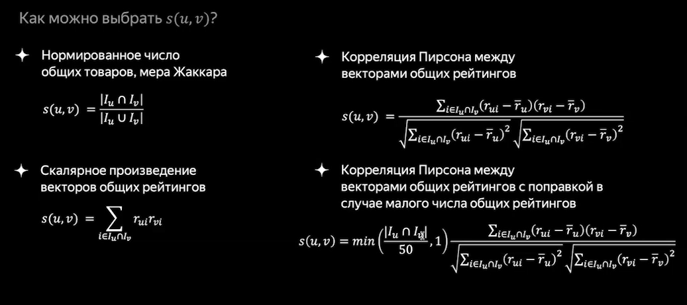
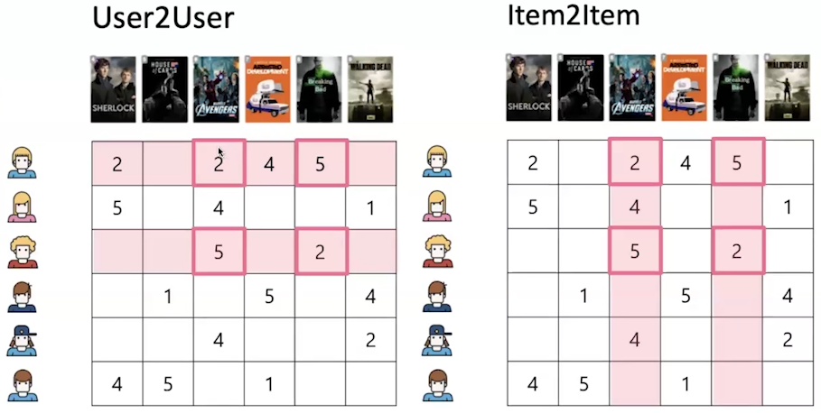
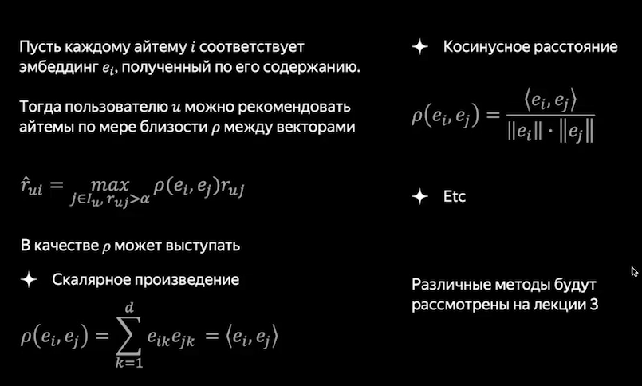
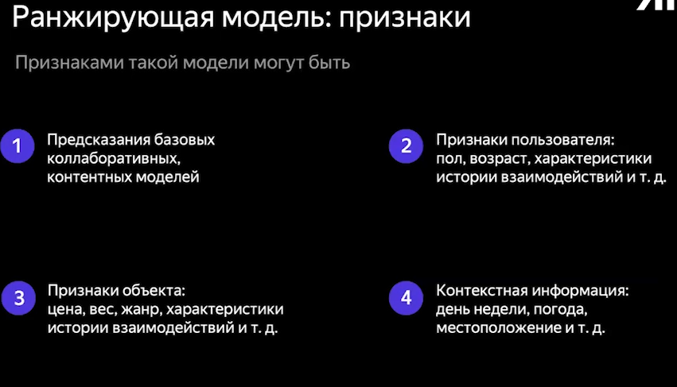
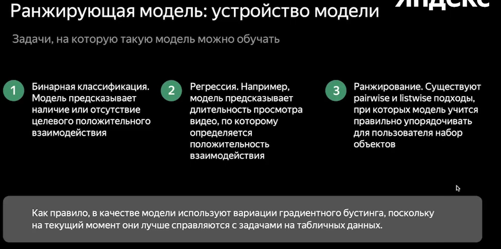

<!-- markdownlint-disable MD001, MD024, MD025, MD033, MD045 -->

# Lecture 1 - Intro

## Feedback Loop

**Feedback loop** - user interactions with recommendations (e.g. clicks, likes) influence future recommendations.

**Feedback loop problem** - model keeps reinforcing its own biases by learning only from user interactions on previous recommendations $\tp$ reduced diversity.

## 1. Collaboration-based Models

  

  

  

### User2User | Item2Item Recomendations

  

## 2. Content-based Models

  

## 3. Hybrid Models

Collaboration + Content + Context (user-based, ..., weather, ...) + Business logic

## Ranking

  

  

### Final Scheme

Base of Users & Content $\to$ Quick mechanism of candidate Users & Content selection $\to$ Ranking within candidates $\to$ Reranking $\to$ Recommendations

# Lecture 2 -

0:30:00