<!-- markdownlint-disable MD001 MD010 MD024 MD025 MD041 MD049 -->

> # **Notes**

Modern chatbot systems do mimic human specialization, either via:

- **Mixture of Experts (MoE)**: One big LLM with specialized internal modules

- **Router + Specialized LLMs**: A system that picks the right LLM for the task

> # **YSDA Lectures**

# **YSDA Lecture 1 - MDP, CEM**

$\pi_{\theta}(a | s)$ - policy.

## DAGGER

Human-in-the-loop.

Can't become better than expert.

## Markov Decision Process (MDP)

Let:

- $ s \in \mathcal{S} $
- $ a \in \mathcal{A} $
- $ \pi(a \mid s) $ – policy
- $ p(s\_{t+1} \mid s_t, a_t) $ – dynamics (transition probability)
- $ r(s*t, a_t, s*{t+1}) $ – reward function
- $ p(s_0) $ – initial state distribution

MDP satisfies **Markov Property**.

Define a trajectory:

- $ \tau = (s_0, a_0, r_0, s_1, a_1, r_1, \ldots) $

The probability of a trajectory under policy $ \pi $:

$$
p(\tau \mid \pi) = p(s_0) \prod_{t=0}^{\infty} \pi(a_t \mid s_t) \, p(s_{t+1} \mid s_t, a_t)
$$

> Agent that strives for the max total reward should do the task best.

### Operations on Reward

- Scale by positive

- **Reward shaping**: $ r'(s*t, a_t, s*{t+1}) = r(s*t, a_t, s*{t+1}) + \Phi(s\_{t+1}) - \Phi(s_t) $

## Cross-Entropy Method (CEM)

Set initial policy (mb _uniformal_ among actions).

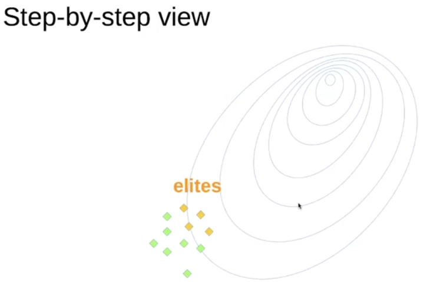

- Sample N games with that policy

- Get M best sessions (**elites**)

  $$
  \text{Elite} = [(s_0, a_0), (s_1, a_1), \ldots, (s_k, a_k)]
  $$

- Calculate new policy based on elites

- Policy = $(1 - \alpha)$ Policy + $\alpha$ NewPolicy

### Tabular Cross-Entropy Method

Policy is a matrix:

$$
\pi(a \mid s) = A_{s, a}
$$

### Approximate Cross-Entropy Method

Can’t set $\pi(a \mid s)$ explicitly.

Policy is approximated using:

- Neural network predicts $\pi_{w}(a \mid s)$ given $s$
- Linear model / Random Forest / …

New policy:

$$
\pi = \arg\max_{\pi} \sum_{s_i, a_i \in \mathrm{Elite}} \log \pi\bigl(a_i \mid s_i\bigr)
$$

> If **action space** is continuous $\to$ regression instead of classification.

## Learning Tricks

1. Remember sessions of 3-5 previous iterations

2. Regularize with entropy (for exploration)

3. Parallelize sampling

# **YSDA Lecture 2 - Dynamic Programming**

## Choices of Reward Function

All of them are MDP:

1. $r_t := r(a_t, s_t)$ $\leftarrow$ we'll be using it

2. $r_t := r(s_{t+1}, a_t, s_t)$

3. $r_t \sim p(r \mid s_t, a_t, s_{t+1})$ $\leftarrow$ most general form

## Definitions

### Basic

$$
G_t = \sum_{t'=t}^{\infty} \gamma^{t' - t} r_{t'}
$$

$$
Q^\pi(s, a) = \mathbb{E}_\pi \left[ G_t \mid s_t = s, a_t = a \right]
$$

$$
V^\pi(s) = \mathbb{E}_\pi \left[ G_t \mid s_t = s \right] = \mathbb{E}_{a_t \sim \pi} \left[ Q^\pi(s_t, a_t) \right]
$$

### Recurrent Relations

$$
Q^\pi(s, a) = \mathbb{E}_{s_{t+1}} \left[ r_t + \gamma V^\pi(s_{t+1}) \right]
$$

$$
Q^\pi(s, a) = \mathbb{E}_{s_{t+1}, a_{t+1} \sim \pi} \left[ r_t + \gamma Q^\pi(s_{t+1}, a_{t+1}) \right]
$$

### Optimal Policy

For all $ \pi, s, a$:

$$  Q^{\pi^*}(s, a) \ge Q^\pi(s, a) $$

$$
\pi^*(s) = \arg\max_a Q^{\pi^*}(s, a)
$$

### Bellman Optimality Equation

$$
Q^*(s_t, a) = \mathbb{E}_{s_{t+1}} \left[ r_t + \gamma \max_{a'} Q^*(s_{t+1}, a') \right]
$$

## Policy Iteration

**Policy Iteration** = **Policy Evaluation** & **Policy Improvement**

Policy Iteration is strictly a _value-based_ RL.

But the **idea** of alternating between evaluation and improvement shows up _indirectly in policy gradient_ methods too, though the mechanics are different.

### Policy Evaluation

**Goal:** Given a fixed policy $ \pi $, compute $ V^\pi(s) $ (or $ Q^\pi(s, a) $).

### Policy Improvement

**Goal:** Given a value function $ V^\pi $, find better $\pi'$.

#### Policy Improvement Theorem

If

$$
\mathbb{E}_{a \sim \pi(\cdot|s)} Q^{\hat{\pi}}(s,a) \;\geq\; V^{\hat{\pi}}(s),
$$

then the new policy $ \pi $ is guaranteed to be **as good as or better** than $ \hat{\pi} $.  

In form of optimization:

$$
\max_\pi \; \mathbb{E}_{s} \; \mathbb{E}_{a \sim \pi(a|s)} Q^{\hat{\pi}}(s,a)
$$

### 1. Policy Iteration (PI)

- **Idea:** Alternate *full* policy evaluation and *full* policy improvement.  

- **Steps:**
    1. Start with some policy $\pi_0$.
    2. **Policy Evaluation:** Solve for $V^{\pi_k}$ (exactly or iteratively until convergence).
    3. **Policy Improvement:** Make policy greedy w.r.t. $V^{\pi_k}$, i.e. $$ \pi_{k+1}(s) \in \arg\max_a Q^{\pi_k}(s,a). $$
    4. Repeat until policy stabilizes.

- **Pros:** Converges in a finite number of steps to the optimal policy $\pi^*$.  

- **Cons:** Full evaluation (step 2) is expensive if state space is large.  

### 2. Value Iteration (VI)

- **Idea:** Merge evaluation and improvement into a single step.

- Instead of fully evaluating a policy, perform a Bellman optimality update directly on the value function:
    $$
    V_{k+1}(s) \;\leftarrow\; \max_a \sum_{s',r} P(s',r \mid s,a)\,\big[ r + \gamma V_k(s') \big].
    $$

- After convergence, extract the greedy policy:
    $$
    \pi^*(s) = \arg\max_a \sum_{s',r} P(s',r \mid s,a)\,[\,r + \gamma V^*(s')\,].
    $$

- **Pros:** Usually converges faster than PI because it _avoids full evaluation_.

- **Cons:** Updates can be less stable; requires careful convergence checking.

### 3. Modified Policy Iteration (MPI)

- **Idea:** Trade-off between PI and VI.

- Instead of full evaluation (PI) or a single backup (VI), do **partial policy evaluation** (e.g., a few sweeps of iterative evaluation), then improve the policy.

  - Start with policy $\pi_k$.
  - Do *m* iterations of approximate evaluation of $V^{\pi_k}$.
  - Improve policy greedily w.r.t. that approximate value.

- **Special cases:**  
  - $m \to \infty$ $\to$ PI
  - $m = 1$ $\to$ VI

# **YSDA Lecture 3 - Tabular RL**

## Model-based/free RL

> We might not know actual **environment model** $P(s', r | s, a) \to$ **Model-free** RL.

In **Model-based** transition probabilities are known $\to$ just use Value Iteration.

## Value Learning

The **intuition**: we learn `Q`s at each state so that we get knowledge of what value ($G_t$) we'll get for each action.

> All value learning happens under Bellman Equation. But what if our objectrive different and we don't want fading by $\gamma$ rewards? $\to$ **Credit Assignment**.

Initialize $Q(s, a)$ with 0.

In loop:

- Sample $<...>$ from environment

- Compute: $ \hat{Q}(s, a) $

- (_Tabular_) Update: $ Q(s, a) \gets \alpha \cdot \hat{Q}(s, a) + (1 - \alpha) Q(s, a) $

### Q Learning

> No matter what _policy strategy_ and actual action is we consider only the best path $\to$ off-policy

$$ \hat{Q}(s, a) = r(s, a) + \gamma \max_{a_i}{Q(s', a_i)}$$

#### 1. Monte-Carlo

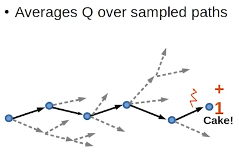

#### 2. Temporal Difference

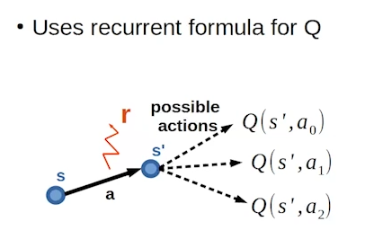

### SARSA

$$ \hat{Q}(s, a) = r(s, a) + \gamma Q(s', a') $$

- $a'$ is action chosen by policy

### Expected Value SARS(A)

$$ \hat{Q}(s, a) = r(s, a) + \gamma \cdot \mathbb{E}_{a' \sim \pi(a' \mid s')}{Q(s', a')} $$

## Value Learning Policy Strategies

Policy derived from values using one of the following strategies:

- **Greedy policy**:  
  Always select the best action: $ a = \arg\max_a Q(s, a) $

- **$\epsilon$-greedy policy**:  
  With probability $ \epsilon $, take a random action (exploration), with $ 1 - \epsilon $, take greedy action (exploitation)

- **Softmax / Boltzmann policy**:  
  Choose actions stochastically based on their relative Q-values:  
  $ \pi(a|s) = \frac{e^{Q(s,a)/\tau}}{\sum_b e^{Q(s,b)/\tau}} $,  
  where $ \tau $ is the temperature (controls exploration)

- **Greedy in the limit of infinite exploration (GLIE)**:  
  Exploration decays over time, but all actions are eventually tried infinitely often.

## On/Off-Policy

### On-Policy Learning

- Learns about: The same policy that is being used to make decisions.

- Updates on _actually_ taken by the policy actions.

Example: SARSA

### Off-Policy Learning

- Learns about: A different (target) policy than the one used to collect data.

- Updates as if it had acted _greedily_, even if it behaved differently.

> Even if the agent **explores**, it assumes it will behave _greedily in the future_.

Example: Q-learning, Expected Value SARSSA

## N-step Algorithms

They all are _on-policy_.

$\uparrow N$ $\to$ more noise and variance, but faster learning $\to$ great at beginning of learning

### N-step SARSA

$$
\hat{Q}(s_t, a_t) = \left[ \sum_{\tau = t}^{\tau < t + n} \gamma^{\tau - t} \, r(s_{\tau}, a_{\tau}) \right] + \gamma^n Q(s_{t+n}, a_{t+n})
$$

### N-step Q-learning

$$
\hat{Q}(s_t, a_t) = \left[ \sum_{\tau = t}^{\tau < t + n} \gamma^{\tau - t} \, r(s_{\tau}, a_{\tau}) \right] + \gamma^n \max_{a} Q(s_{t+n}, a)
$$

# **YSDA Lecture 4 - Deep RL**

## Approximation Value Learning

Update:

$$ Q(s_t, a_t) \gets \alpha \cdot \hat{Q}(s_t, a_t) + (1 - \alpha) \cdot Q(s_t, a_t) $$

$$ Q(s, a) \gets Q(s_t, a_t) + \alpha \cdot ( \hat{Q}(s_t, a_t) - Q(s_t, a_t) ) $$

- _Assume_ 1-step TD Q-Learning

$$ Q(s, a) \gets Q(s_t, a_t) + \alpha \cdot ( r_t + \max_{a'}{Q(s_{t + 1}, a')} - Q(s_t, a_t) ) $$

This is equivalent to minimizing (MSE) the TD error:

$$L_t = (r_t + \max_{a'}{Q(s_{t + 1}, a')} - Q(s_t, a_t)) ^ 2 $$

But $r_t + \max_{a'}{Q(s_{t + 1}, a')}$ is a **target** and we don't want to calculate gradient on it $\to$ we treat target as fixed $\to$ **stop gradinet**:

$$L_t = (r_t + \max_{a'}{Q(s_{t + 1}, a'; \theta^-)} - Q(s_t, a_t; \theta)) ^ 2 $$

$$L_t = (Q^-_{target} - Q(s_t, a_t; \theta)) ^ 2 $$

- $Q^-_{target} \equiv r_t + \max_{a'}{Q(s_{t + 1}, a'; \theta^-)}$
- $r_t$ - constant
- $Q(s_{t + 1}, a'; \theta^-)$ fixed by no grad $\theta^-$

> “I think I’ll get reward $r_t$ now and then the best future I can hope for is whatever my $Q$-function currently says about the next state.”

$$
\nabla_\theta \mathcal{L} = -\left( Q^-_{target} - Q(s_t, a_t; \theta) \right) \cdot \nabla_\theta Q(s_t, a_t; \theta)
$$

> Note: tabular approximation can be also used as approximation

## DRL Architectures

**DQN** - Deep Q-networks

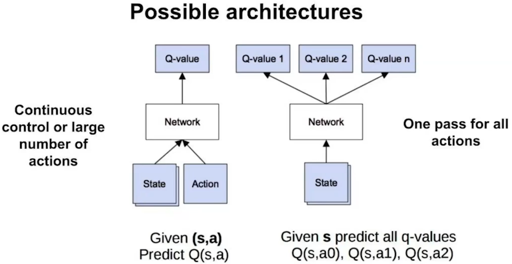

## Training Sample i.i.d Problem

### Multi-Agent

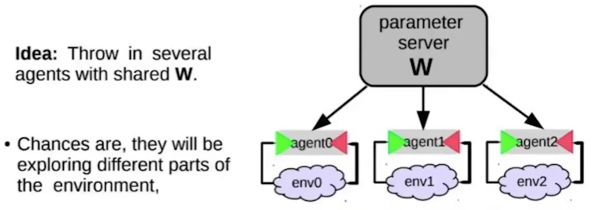

### Experience Replay Buffer

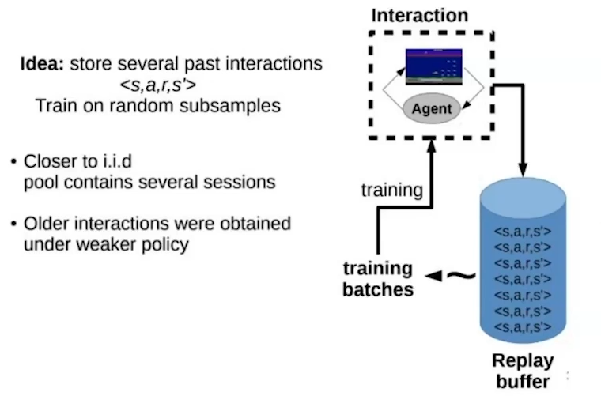

## N-gram

> 💡 DRL's input consists of N recent states (and actions).

## Target Network

> 💡 To keep $Q^-_{target}$ fixed we use network with **frozen** weights $\theta^-$ to compute the target.

### Hard target network

Update $ \theta^- $ every **n** steps and set its weights as $ \theta $

### Soft target network

Update $ \theta^- $ every step:  

$$
\theta^- = (1 - \alpha)\theta^- + \alpha \theta
$$

## Actor & Critic

- **Actor** $\mu$: chooses $a'$
  $$ L_{Actor} = (Q(s, a) - Q^-_{target}) ^ 2 $$

- **Critic** $Q$: given environment and chosen $a$ predicts $Q(s, a)$
  $$ L_{Critic} = -Q(s, \mu(s)) $$

Both of them have their target network $\to$ 4 DQN.

## Double Q-Learning

["Deep Reinforcement Learning with Double Q-learning", 2016](https://arxiv.org/abs/1509.06461)

### Overestimation Problem

If the Q-values are noisy, then $max$ tends to overestimate the true value $\to$ by **Jensen Inequality** we'll overestimate.

### Idea

$$
\max_{a'} Q(s', a')
$$

$$
Q(s', \arg\max_{a'} Q(s', a'))
$$

> 💡 evaluate $Q$ and select $Q$ are different

$$
Q^{(2)}(s_{t+1}, \arg\max_{a'} Q^{(1)}(s_{t+1}, a'))
$$

### Double Q-Learning

- Maintain two Q-functions: $ Q^{(1)} $, $ Q^{(2)} $

- On each update with 50% probability _select_ action using $ Q^{(j)} $, _evaluate_ with $ Q^{(i)} $:
  $$
  \text{target} = r_t + \gamma Q^{(i)}(s_{t+1}, \arg\max_{a'} Q^{(j)}(s_{t+1}, a'))
  $$

- Update only the chosen $ Q^{(j)} $ by minimizing:
   $$
   \mathcal{L} = \left( \text{target} - Q^{(j)}(s_t, a_t) \right)^2
   $$

### Double DQN (Deep Version)

- **online $ Q_\theta $ network** selects the best action
- **target $ Q_{\theta^-} $ network** evaluates that action

$$
\text{target} = r_t + \gamma Q_{\theta^-}(s_{t+1}, \arg\max_{a'} Q_\theta(s_{t+1}, a'))
$$

## Prioritized Experience Replay

["Prioritized Experience Replay", 2016](https://arxiv.org/abs/1511.05952)

Simple Experience Replay treats all transitions equally, but not all of them are _useful_.

> 💡 sample more frequently those transitions with higher “learning potential.”

- TD error: $ \delta_i = r + \gamma \max_{a'} Q(s', a') - Q(s, a) $

- Priority: $ p_i = |\delta_i| + \epsilon $

Transitions are sampled with probability:

$$
P(i) = \frac{p_i^\alpha}{\sum_k p_k^\alpha}
$$

### Roulette Problem

Based on loss we would only work with states when green has won $\to$ bias.

### Sampling Correction

$\to$ Use **importance sampling (IS) weights** to correct for the bias:

$$
w_i = \left( \frac{1}{N \cdot P(i)} \right)^\beta
$$

$$
\mathcal{L}_i = w_i \cdot \left( Q(s, a) - \text{target} \right)^2
$$

- Potential overfitting is mitigated by annealing $\beta$ over time

## Duelling DQN

["Dueling Network Architectures for Deep Reinforcement Learning", 2016](https://arxiv.org/abs/1511.06581)

We want to know:

- how important is current state itself $\to$ State-value function $V(s)$

- how important each action in current state $\to$ **Advantage function** $A(s, a) = Q(s, a) - V(s)$

To avoid the _identifiability issue_, we normalize the advantage function:

$$
Q(s, a) = V(s) + \left( A(s, a) - \frac{1}{|\mathcal{A}|} \sum_{a'} A(s, a') \right)
$$

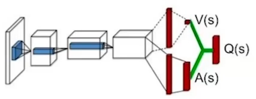

## ["Rainbow: Combining Improvements in Deep Reinforcement Learning", 2018](https://arxiv.org/abs/1710.02298)

"This paper examines six extensions to the DQN algorithm and empirically studies their combination."

- Double DQN

- Duelling DQN

- Prioritized Replay

- N-step Returns

- Distributional RL

- Noisy Networks

# **YSDA Lecture 5 - Distributional RL**

## Notation

["A Distributional Perspective on Reinforcement Learning", 2017](https://arxiv.org/abs/1707.06887)

$$
G_t = \sum_{t' = t}^{\infty} \gamma^{t' - t} r_{t'} \quad \text{\small\color{gray}Random variable}
$$

$$
V^{\pi}(s) = \mathbb{E}_{\pi} \left[ G_t \mid s_t = s \right] \quad \text{\small\color{gray}Number}
$$

$$
Q^{\pi}(s, a) = \mathbb{E}_{\pi} \left[ G_t \mid s_t = s, a_t = a \right] \quad \text{\small\color{gray}Number}
$$

$$
Z^{\pi}(s, a) = \left[ G_t \mid s_t = s, a_t = a \right] \quad \text{\small\color{gray}Random variable}
$$

Therefore:

$$
Q^{\pi}(s, a) = \mathbb{E}[Z^{\pi}(s, a)].
$$

> So instead of modeling only its expectation $Q^{\pi}$, we model the full distribution $Z^{\pi}$ of returns.

### Recurrent Relation

$$
Z^{\pi}(x, a) \overset{D}{=} R(x, a) + \gamma Z^{\pi}(X', A')
$$

### Bellman Operator

$$
\mathcal{T}Z(x, a) \overset{D}{=} R(x, a) + \gamma Z(X', \arg\max_{a' \in \mathcal{A}} \mathbb{E} Z(X', a'))
$$

> Instead of mapping distributions to expectations at every step, we propagate distributions themselves

## Probability Approximation: C51 vs QR-DQN

| Aspect                         | **C51 (Categorical DQN)**                                                                                                                                        | **QR-DQN (Quantile Regression DQN)**                                                                                                                                                                                                                          |
| ------------------------------ | ---------------------------------------------------------------------------------------------------------------------------------------------------------------- | ------------------------------------------------------------------------------------------------------------------------------------------------------------------------------------------------------------------------------------------------------------- |
| **Representation of $Z(s,a)$** | $ Z_\theta(s,a) = \sum_{i=1}^N p_i(s,a)\,\delta_{z_i} $ where $\{z_i\}$ are **fixed atoms**, $p_i$ are softmax probabilities.                  | $ Z_\theta(s,a) = \frac{1}{N} \sum_{i=1}^N \delta_{\theta_i(s,a)}$ where $\theta_i(s,a)$ are **learned quantile values**, all equally weighted.                                                                                             |
| **Atoms / Support**            | Fixed grid:$ z_i = V_{\min} + (i-1)\Delta z,\quad \Delta z = \frac{V_{\max}-V_{\min}}{N-1}$.                                                  | Learned per state-action: $\theta_i(s,a)$ directly parameterized by NN.                                                                                                                                                                                       |
| **Probabilities**              | Learned: $p_i(s,a) = \mathrm{softmax}(h_\theta(s,a))$.                                                                                                           | Fixed: $1/N$ for each quantile.                                                                                                                                                                                                                               |
| **Expectation recovery**       | $ Q(s,a) = \sum_{i=1}^N p_i(s,a)\,z_i.$                                                                                                             | $ Q(s,a) = \frac{1}{N} \sum_{i=1}^N \theta_i(s,a).$                                                                                                                                                                                              |
| **Target distribution**        | $ r + \gamma Z(x', a^*), \quad a^* = \arg\max_{a'} \sum_i p_i(x',a')\,z_i.$                                                                         | $ y_j = r + \gamma \theta_j(x',a^*), \quad a^* = \arg\max_{a'} \frac{1}{N} \sum_{j=1}^N \theta_j(x',a').$                                                                                                                                        |
| **Projection step**            | Required: project shifted atoms $r+\gamma z_i$ back to fixed support $\{z_i\}$.                                                                                  | Not required: quantiles move freely (no projection).                                                                                                                                                                                                          |
| **Loss function**              | Cross-entropy (KL divergence) between predicted categorical dist. and projected target dist.| Quantile regression loss (pinball loss) |
| **Hyperparameters**            | Need $V_{\min}, V_{\max}, N$.                                                                                                                                    | Only $N$ (number of quantiles).                                                                                                                                                                                                                               |
| **Distribution family**        | Categorical distribution over fixed bins.                                                                                                                        | Empirical quantile distribution (flexible, unbounded).                                                                                                                                                                                                        |

# **YSDA Lecture 6 - Policy Gradient Methods**

## Policy Gradient Theorem

### 1. Setup

#### I. Dynamics

$$
\pi_\theta(a|s) = \Pr[a_t = a \mid s_t = s; \theta]
$$

Trajectory $\tau = (s_0,a_0,s_1,a_1,\ldots)$ has **trajectory probability**:

$$
p_\theta(\tau) = \rho(s_0) \prod_{t=0}^\infty \pi_\theta(a_t|s_t)\, p(s_{t+1}|s_t,a_t)
$$

where $\rho(s_0)$ is initial state distribution.  

#### II. Notation

When people write $\mathbb{E}_{\pi_\theta}$, it’s a **shorthand** that hides the fact that the trajectory distribution is $p_\theta(\tau)$, which depends both on:

- policy $\pi_\theta$
- environment dynamics $p(s' \mid s, a)$.

So:

- $\mathbb{E}_{\pi_\theta}[\cdot] \to$ informal shorthand (widely used in RL papers).
- $\mathbb{E}_{\tau \sim p_\theta}[\cdot] \to$ explicit, fully correct.

#### III. Objective

$$
J(\theta)
= \mathbb{E}_{\tau \sim p_\theta}\!\left[ R(\tau) \right]
= \mathbb{E}_{\pi_\theta}\!\left[ G_0 \right]
= \mathbb{E}_{s_0 \sim p_\theta}\!\left[ V^{\pi_\theta}(s_0) \right]
$$

where:

- $$ R(\tau) = \sum_{t=0}^\infty \gamma^t \, r(s_t, a_t) $$
- $$ G_t = \sum_{i=t}^\infty \gamma^{\,i-t} \, r(s_i, a_i) $$
- $$ V^{\pi}(s) = \mathbb{E}_{\pi} \!\left[ G_t \mid s_t = s \right] $$

**Objective**:

$$
J(\theta) \to \max
$$

### 2. Problem

We want to calculalte

$$
\nabla_\theta J(\theta) = \nabla_\theta \int p_\theta(\tau) R(\tau) \, d\tau.
$$

But, naively differentiating is problematic because $ p_\theta(\tau) $ depends on both

- **policy** $\pi_\theta(a_t|s_t) $ which depends on $\theta$ and everything is fine
- **environment dynamics** $ p(s_{t+1}|s_t,a_t) $ which is _unknown_

### 3. Log-Derivative Trick

The trick:

- From
  $$
  \nabla_\theta \log p_\theta(\tau) = \frac{1}{p_\theta(\tau)} \nabla_\theta p_\theta(\tau)
  $$
- To
  $$
  \nabla_\theta p_\theta(\tau) = p_\theta(\tau) \, \nabla_\theta \log p_\theta(\tau)
  $$

Now, observe that

$$
\log p_\theta(\tau) = \log \rho_0(s_0) + \sum_{t=0}^\infty \log \pi_\theta(a_t \mid s_t) + \sum_{t=0}^\infty \log p(s_{t+1} \mid s_t, a_t).
$$

Taking derivative w.r.t. $\theta$:

$$
\nabla_\theta \log p_\theta(\tau) = \sum_{t=0}^\infty \nabla_\theta \log \pi_\theta(a_t \mid s_t).
$$

The transition dynamics $ p(s' \mid s,a) $ and initial distribution $ \rho_0(s_0) $ **vanish** because they do not depend on $\theta$.

### 4. Gradient of Objective

$$
\nabla_\theta J(\theta) =
$$
$$
= \int \nabla_\theta p_\theta(\tau) R(\tau) \, d\tau =
$$

$$
= \int p_\theta(\tau) \nabla_\theta \log p_\theta(\tau) R(\tau) \, d\tau =
$$

$$
= \mathbb{E}_{\tau \sim p_\theta}\! \left[ R(\tau)\, \nabla_\theta \log p_\theta(\tau) \right] =
$$

$$
= \mathbb{E}_{\pi_\theta} \left[ R(\tau) \sum_{t=0}^\infty \nabla_\theta \log \pi_\theta(a_t|s_t) \right]
$$

### 5. Step-Wise Return Decomposition

$$
R(\tau) = G_t + \text{(rewards before } t)
$$

Since rewards before $t$ are independent of $a_t$, we can replace $R(\tau)$ with **return from $t$:**

$$
\nabla_\theta J(\theta) = \mathbb{E}_{\pi_\theta} \left[ \sum_{t=0}^\infty G_t \, \nabla_\theta \log \pi_\theta(a_t|s_t) \right]
$$

Keep in mind that $G_t = \sum_{i = t}^{\infin} \gamma^{i - t} r(s_i, a_i) = r(s_t, a_t) + \gamma G_{t+1}$.

### 6. Policy Gradient Theorem

The theorem states:

$$
\nabla_\theta J(\theta)
= \mathbb{E}_{\pi_\theta} \left[ \sum_{t=0}^\infty \textcolor{blue}{\gamma^t} \, \nabla_\theta \log \pi_\theta(a_t \mid s_t)\, Q^{\pi_\theta}(s_t, a_t) \right]
$$

$$
\nabla_\theta J(\theta)
= \textcolor{gray}{\frac{1}{1-\gamma}} \, \mathbb{E}_{s \sim d^{\pi_\theta},\, a \sim \pi_\theta}
\left[ \nabla_\theta \log \pi_\theta(a \mid s)\, Q^{\pi_\theta}(s,a) \right]
$$

where:

- $d^{\pi_\theta}(s) = (1 - \gamma) \sum_{t=0}^{\infty} \gamma^t \, P(s_t = s \mid \pi_\theta) $ - discounted state distribution under policy. $\sum_{s} d_{\pi}(s) = 1. $

- $ Q^\pi(s_t, a_t) = \mathbb{E}_\pi \!\left[ G_t \mid s_t, a_t \right] = \mathbb{E}_\pi \!\left[ \sum_{i=t}^\infty \textcolor{blue}{\gamma^{\,i-t}} r(s_i, a_i) \;\middle|\; s_t, a_t \right] $ - expected return starting from state $s$, action $a$

## REINFORCE (Williams, 1992)

Since $ Q^{\pi}(s_t, a_t) = \mathbb{E}\!\left[ G_t \mid s_t, a_t \right] $, we can replace it with the sampled return $ \hat{Q}_t = G_t = \sum_{t'=t}^{T}{r(s_{t'}, a_{t'})}$ (Monte Carlo estimate):

$$
\nabla_{\theta} J(\theta)
\;\approx\;
\mathbb{E}_{\pi_{\theta}}
\!\left[
\sum_{t=0}^{\infty}
\nabla_{\theta} \log \pi_{\theta}(a_t \mid s_t)\; G_t
\right].
$$

**Update rule**:

$$
\theta \;\leftarrow\; \theta \;+\; \alpha \frac{1}{N} \sum_{i=0}^{N} \sum_{t=0}^{T}
\nabla_{\theta} \log \pi_{\theta}(a_t \mid s_t)\; G_t .
$$

## REINFORCE baseline

The **baseline trick** is to subtract a function $ b(s_t) $ from $ G_t $ inside the gradient:

$$
\nabla_\theta J(\theta)
= \mathbb{E}_{\pi_\theta}\!\Bigg[ \sum_{t=0}^\infty \nabla_\theta \log \pi_\theta(a_t \mid s_t)\, \big( G_t - b(s_t) \big) \Bigg].
$$

Because for $ \forall b(s_t) $ independent of $a_t$:

$$
\mathbb{E}_{a_t \sim \pi_\theta(\cdot|s_t)} \!\left[ \nabla_\theta \log \pi_\theta(a_t \mid s_t)\, b(s_t) \right] = 0.
$$

$\to$ still unbiased! But it can **reduce variance**.

#### Common choices of baseline

- State-independent baseline: a constant (e.g. average return).

- State-dependent baseline: $b(s_t)$

## Advantage Actor-Critic (A2C)

From REINFORCE baseline we choose:

$$
b(s_t) = V^\pi(s_t).
$$

Then

$$
A^\pi(s_t,a_t) \approx G_t - V^\pi(s_t)
$$
which is the **advantage** function.

- **Actor (policy network)**: parameterized by $\theta$, defines stochastic policy $\pi_\theta(a|s)$.
- **Critic (value network)**: parameterized by $\phi$, approximates $V^\pi(s)$.

> Since $b(s_t)$ doesn't affect $ \mathbb{E}_{\pi_\theta} \![\nabla_\theta J(\theta) ] $ Critic can be _random_ (there are papers) and it still can lower variance (but might not).

### Actor Update

Policy Gradient with Advantage:

$$
\nabla_\theta J(\theta)
= \mathbb{E}_{\pi_\theta}\!\Big[ \nabla_\theta \log \pi_\theta(a_t \mid s_t) \, A^\pi(s_t,a_t) \Big].
$$

The **advantage** can be estimated in several ways:

- **Monte Carlo**:  
  $$
  A_t = G_t - V_\phi(s_t).
  $$

- **Temporal-difference (TD)** (one-step bootstrap):  
  $$
  A_t = r_t + \gamma V_\phi(s_{t+1}) - V_\phi(s_t).
  $$

> **One-step TD advantage estimate** is usual A2C choice.

### Critic update

$$
L(\phi) = (A_t)^2 = \big( r_t + \gamma V_\phi(s_{t+1}) - V_\phi(s_t) \big)^2 \to \min_{\phi}
$$

It trains $V_\phi(s)$ to approximate the _true_ $V^\pi(s)$.

### Combined Algorithm (synchronous)

At each step:

1. Sample $(s_t,a_t,r_t,s_{t+1})$.
2. Compute advantage estimate  
   $$
   A_t = r_t + \gamma V_\phi(s_{t+1}) - V_\phi(s_t).
   $$
3. Update **actor** with gradient ascent:  
   $$
   \theta \leftarrow \theta + \alpha \, \nabla_\theta J(\theta) .
   $$
4. Update **critic** with gradient descent on TD loss:  
   $$
   \phi \leftarrow \phi - \beta \, \nabla_\phi L(\phi).
   $$

### Asynchronous Advantage Actor-Critic (A3C)

Since REINFORCE, A2C are _on-policy_ $\to$ can't use experience replay $\to$ utilize parallel game sessions $\to$ **A3C**.

# **YSDA Lecture 7 - TRPO, PPO**

## Intuition

REINFORCE, A2C, A3C — **on-policy** $\to$ **sample-inefficient** — you can’t reuse old rollouts much.

**TRPO** and **PPO** using importance sampling on restricted  for $\theta$ area solve for that.

## Importance Sampling

### I. The Problem

- **target distribution** $ p(x) $
- **behavior distribution** $ q(x) $

We often want to compute:

$$
\mathbb{E}_{x \sim p}[f(x)] = \int f(x)\, p(x)\, dx.
$$

But:

- Sometimes $ p(x) $ is hard to sample from.  
- Instead, we have samples from $ q(x) $.  

### II. The Trick

Rewrite the expectation:

$$
\mathbb{E}_{x \sim p}[f(x)]
= \int f(x) \, p(x)\, dx
= \int f(x) \, \frac{p(x)}{q(x)} \, q(x)\, dx
= \mathbb{E}_{x \sim q}\left[f(x) \, \frac{p(x)}{q(x)}\right]
$$

### III. Monte Carlo Estimate

With samples $ x_1, \dots, x_N \sim q(x) $:

$$
\mathbb{E}_{x \sim p}[f(x)]
= \mathbb{E}_{x \sim q}\left[f(x) \, \frac{p(x)}{q(x)}\right]
\approx \frac{1}{N} \sum_{i=0}^N f(x_i) \, \frac{p(x_i)}{q(x_i)}.
$$

Thus, we "reweight" samples from $q$ so that they mimic samples from $p$.

## Base for TRPO, PPO

### Idea

Our previous Policy Gradient objective

$$J(\theta) \to \max$$

is equivaent to

$$J(\theta') - J(\theta) \to \max$$

where we now optimizing $\theta'$ and $\theta$ is an _old policy fixed_.

### Derivation Step 1 - Performance Difference Lemma

$$
J(\theta') - J(\theta)
$$

$$
= J(\theta') - \mathbb{E}_{s_0 \sim p_{\theta}(s_0)} \big[ V^{\pi_\theta}(s_0) \big]
$$

$$
= J(\theta') - \mathbb{E}_{s_0 \sim p_{\theta\textcolor{red}{'}}(s_0)} \big[ V^{\pi_\theta}(s_0) \big]
\quad \text{($s_0$ doesn't depend on policy)}
$$

$$
= J(\theta') - \mathbb{E}_{\textcolor{red}{\tau} \sim p_{\theta'}} \big[ V^{\pi_\theta}(s_0) \big]
\quad \text{(need only $s_0$ from $\tau$ anyway)}
$$

$$
= J(\theta') - \mathbb{E}_{\tau \sim p_{\theta'}} \left[ \sum_{t=0}^\infty \gamma^t V^{\pi_\theta}(s_t) - \sum_{t=1}^\infty \gamma^t V^{\pi_\theta}(s_t) \right]
$$

$$
= J(\theta') + \mathbb{E}_{\tau \sim p_{\theta'}} \left[ \sum_{t=0}^\infty \gamma^t \big( \gamma V^{\pi_\theta}(s_{t+1}) - V^{\pi_\theta}(s_t) \big) \right]
$$

$$
= \mathbb{E}_{\tau \sim p_{\theta'}} \left[ \sum_{t=0}^\infty \gamma^t r(s_t, a_t) \right]
+ \mathbb{E}_{\tau \sim p_{\theta'}} \left[ \sum_{t=0}^\infty \gamma^t \big( \gamma V^{\pi_\theta}(s_{t+1}) - V^{\pi_\theta}(s_t) \big) \right]
$$

$$
= \mathbb{E}_{\tau \sim p_{\theta'}} \left[ \sum_{t=0}^\infty \gamma^t \big( r(s_t,a_t) + \gamma V^{\pi_\theta}(s_{t+1}) - V^{\pi_\theta}(s_t) \big) \right]
$$

$$
= \mathbb{E}_{\tau \sim p_{\theta'}} \left[ \sum_{t=0}^\infty \gamma^t A^{\pi_\theta}(s_t,a_t) \right]
$$

#### Result

$$
J(\theta') - J(\theta)
= \mathbb{E}_{\tau \sim p_{\textcolor{blue}{\theta'}}} \left[ \sum_{t=0}^\infty \gamma^t A^{\pi_{\textcolor{blue}{\theta}}}(s_t,a_t) \right]
$$

#### Interpretation

To know how much better a new policy $\pi_{\theta'}$ is than the old one, you only need:

- trajectories distribution from the _new policy_ $\leftarrow$ don't want to sample before the step (_kinda problem_)
- advantage estimates under the _old policy_

### Derivation Step 2 - Importance Sampling

#### Problem

When optimizing, we don’t usually have samples (and calculated advantages) under distribution $p_{\theta'}$ from the new policy $\pi_{\theta'}$ yet. We only have samples under $p_\theta$.  
But we don't want to sample before doing update step.

#### Solution

Do importance sampling:

$$
J(\theta') - J(\theta)
$$

$$
= \mathbb{E}_{\tau \sim p_{\theta'}} \!\left[ \sum_t \gamma^t A^{\pi_\theta}(s_t, a_t) \right]
$$

$$
= \sum_t \mathbb{E}_{s_t \sim p_{\theta'}} \!\left[ \mathbb{E}_{a_t \sim \pi_{\theta'}(\cdot|s_t)} \!\left[ \gamma^t A^{\pi_\theta}(s_t, a_t) \right] \right]
$$

$$
= \sum_t \mathbb{E}_{s_t \sim p_{\theta'}} \!\left[ \mathbb{E}_{a_t \sim \pi_{\textcolor{red}{\theta}(\cdot|s_t)}} \!\left[ \frac{\pi_{\theta'}(a_t|s_t)}{\pi_\theta(a_t|s_t)} \, \gamma^t A^{\pi_\theta}(s_t, a_t) \right] \right].
$$

Now for actions $a_t$ $\to$ we don't have to sample!  
But still states $s_t \sim p_{\theta'}$, which is a problem.

### Derivation Step 3 - Surrogate Objective

#### Problem

States $s_t \sim p_{\theta'}$, but we still don't want to sample :)

#### Intuition

Don’t try to fix it directly (too high variance), instead approximate it under small policy updates and add a trust region/clipping to ensure stability.

#### Solution

- **Trick:** Replace $s_t \sim p_{\theta'}$ with $s_t \sim p_\theta$ in the expectation

- **Claim:** If $\pi_{\theta'}$ is close to $\pi_{\theta}$, then the state distributions $p_{\theta'}(s)$ and $p_\theta(s)$ are also close

- **Correction:** To control the bias introduced, constrain the KL divergence between policies (**TRPO**) or clip the importance weights (**PPO**)

This yields the **surrogate objective** which approximates $J(\theta') - J(\theta)$ :

$$
L(\theta') = \sum_t \mathbb{E}_{s_t \sim p_\theta, \, a_t \sim \pi_\theta}
\left[ \frac{\pi_{\theta'}(a_t \mid s_t)}{\pi_\theta(a_t \mid s_t)} \, A^{\pi_\theta}(s_t, a_t) \right]
$$

_In practice_, we often simplify:

$$
L(\theta')
= \mathbb{E}_{t}\!\left[
\frac{\pi_{\theta'}(a_t \mid s_t)}{\pi_\theta(a_t \mid s_t)} \, A^{\pi_\theta}(s_t,a_t)
\right]
$$

### Final Task

$$
\max_{\theta'} L(\theta')
\quad \text{s.t.} \quad
\mathbb{E}_{s_t \sim p_\theta} \left[ \lvert \pi_{\theta'}(\cdot \mid s_t) - \pi_\theta(\cdot \mid s_t) \rvert \right] \le \epsilon
$$

for small enough $ \epsilon $, this is guaranteed to improve $ J(\theta') - J(\theta) $.

This task is hard to solve, so we have **TRPO** & **PPO**.

## TRPO (Trust Region Policy Optimization)

### KL Divergence

$D_{\text{KL}}(P \,\|\, Q)$ measures how different distribution $Q$  is from distribution $P$.

For two probability distributions $P$ and Q over the same space $ \mathcal{X} $:

$$
D_{\text{KL}}(P \,\|\, Q) = \sum_{x \in \mathcal{X}} P(x) \log \frac{P(x)}{Q(x)}
\quad \text{(discrete)}
$$

$$
D_{\text{KL}}(P \,\|\, Q) = \int_{\mathcal{X}} P(x) \log \frac{P(x)}{Q(x)} \, dx
\quad \text{(continuous)}
$$

- If $P = Q$, then $D_{\text{KL}}(P \,\|\, Q) = 0$.

Good **property** of KL divergence is that:

$$
\big| \pi_{\theta'}(a_t \mid s_t) - \pi_\theta(a_t \mid s_t) \big|
\;\le\;
\sqrt{ \tfrac{1}{2} \, D_{\mathrm{KL}}\!\left(\pi_{\theta'}(a_t \mid s_t)\,\|\,\pi_\theta(a_t \mid s_t)\right) }
$$

### TRPO Task

$$
\max_{\theta'} L(\theta') \quad \text{s.t.} \quad \mathbb{E}_{s_t \sim p_\theta} \left[ D_{\mathrm{KL}}\!\left(\pi_{\theta'}(\cdot \mid s_t)\,\|\,\pi_\theta(\cdot \mid s_t)\right) \right] \le \delta
$$

KL divergence is easier to approximate!

> **TRPO** is theoretically sound (**monotonic improvement guarantee**), but computationally expensive (requires Fisher-vector products, conjugate gradient, line search) $\to$ only used when $|\Theta|$ is small.

### Solving TRPO Task - 1. Quadratic Program

Around the old params $\theta$, approximate the expected KL by a quadratic form:

$$
\mathbb{E}_{s \sim p_\theta}\!\big[D_{\mathrm{KL}}(\pi_\theta \,\|\, \pi_{\theta+\Delta\theta})\big]
\;\approx\; \tfrac{1}{2}\,\Delta\theta^\top F \Delta\theta,
$$

where $F$ is the **Fisher information** (under $\pi_\theta$).

Linearize the surrogate objective:

$$
L_\theta(\theta + \Delta\theta) \;\approx\; L_\theta(\theta) + g^\top \Delta\theta,
\qquad g = \nabla_\theta L_\theta(\theta).
$$

So the step solves

$$
\max_{\Delta\theta} \; g^\top \Delta\theta
\quad \text{s.t.} \quad \tfrac{1}{2}\Delta\theta^\top F \Delta\theta \le \delta.
$$

### Solving TRPO Task - 2. Natural Gradient (Closed-Form Solution)

Lagrangian:

$$
\mathcal{L}(\Delta\theta, \lambda)
= g^\top \Delta\theta - \lambda\!\left(\tfrac{1}{2}\Delta\theta^\top F \Delta\theta - \delta\right).
$$

Stationarity:

$$
g - \lambda F \Delta\theta = 0 \;\;\;\Rightarrow\;\;\; \Delta\theta = \lambda^{-1}F^{-1}g.
$$

Active constraint gives $\tfrac{1}{2}\Delta\theta^\top F \Delta\theta = \delta$, yielding

$$
\Delta\theta^* \;=\; \sqrt{\tfrac{2\delta}{g^\top F^{-1} g}} \; F^{-1} g.
$$

Direction $F^{-1}g$ is the **natural gradient**; the scalar ensures the KL radius $\delta$.

## PPO (Proximal Policy Optimization)

> **PPO** simplifies the trust region idea, throwing out constaint (trust region) and changing objective function by **clipping**.

### PPO Objective

$$
\rho_t(\theta') = \frac{\pi_{\theta'}(a_t \mid s_t)}{\pi_\theta(a_t \mid s_t)}.
$$

**Clipped surrogate objective**:

$$
L^{\text{CLIP}}(\theta')
= \mathbb{E}_t \!\left[
\min \Big(
   (\rho_t(\theta') A_t,\;
   \operatorname{clip}(\rho_t(\theta'), 1-\epsilon, 1+\epsilon)\, A_t
\Big)
\right].
$$

Usually, $\epsilon = 0.2$.

It ensures the update is conservative, but much _cheaper_ than TRPO.

### Regularization

You can add regularization on policy change:

$$
L^{\text{CLIP}}(\theta') + Const \cdot D_{\mathrm{KL}}\!\left(\pi_{\theta'}(\cdot \mid s_t)\,\|\,\pi_\theta(\cdot \mid s_t)\right) \to \max_{\theta'}
$$

### Training

When training do multiple epochs of PPO before moving to sampling by new $\theta'$.

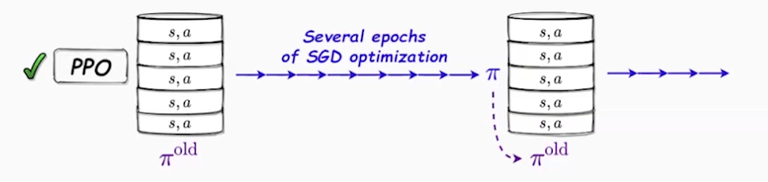

# **YSDA Lecture 8 - RL for seq2seq**

## Self-Critical Sequence Training

## Reward Model

## PPO-ptx

## DPO (Direct Preference Optimization)

# **YSDA Lecture 8 - Bias-Variance Tradeoff**

> TD(0), TD(1) (Monte-Carlo), TD($\lambda$) are on-policy, but PPO can be utilized!

## Notation

- For Actor

  $$
  \nabla := \rho(\theta)\nabla_\theta \log \pi_\theta(a_t \mid s_t)\,\Psi(s_t,a_t)
  $$

  - $\Psi(s_t,a_t)$ – advantage estimator  

- For Critic

  $$
  y_Q(s_t,a_t) := \Psi(s_t,a_t) + V(s_t)
  $$

  - $y_Q$ – target for regression  

## Monte-Carlo & N-step TD

|             | $\Psi(s_t,a_t)$                                                                 | Bias         | Variance     |
|-------------|-------------------------------------------------------------------------------|--------------|--------------|
| Monte-Carlo | $\Psi_{(\infty)}(s_t,a_t) := \sum_{\tau=t}^{\infty} \gamma^{\tau-t} r_\tau - V(s_t)$ | 0            | high         |
| N-step      | $\Psi_{(N)}(s_t,a_t) := \sum_{\tau=t}^{t+N-1} \gamma^{\tau-t} r_\tau + \gamma^N V(s_{t+N}) - V(s_t)$ | intermediate | intermediate |
| 1-step      | $\Psi_{(1)}(s_t,a_t) := r_t + \gamma V(s_{t+1}) - V(s_t)$                               | high         | low          |

- Equivalence:

$$
\Psi_{(N)}(s_t,a_t) = \sum_{\tau=t}^{t+N-1} \gamma^{\tau-t} \Psi_{(1)}(s_\tau, a_\tau)
$$

### N-step update

$$
\forall s_t:\quad V(s_t) \leftarrow (1 - \alpha) V(s_t) + \alpha y_Q = V(s_t) + \alpha \Psi_{(N)}(s_t,a_t)
$$

## Eligibility Traces

💡 Use 1-step TD-error to update $V(s)$ for _all states_.

Define **eligibility trace** $e(s_t)$ as a coefficient of update:

$$
\forall s_t:\quad V(s_t) \leftarrow V(s_t) + \alpha e(s_t)\Psi_{(1)}(s_t,a_t)
$$

Online "Monte-Carlo" updates:

- $\forall s_t: e(s_t) := 0$ at the start of each episode
- $e(s_t) \leftarrow e(s_t) + 1$ after visiting $s_t$
- $\forall s_t: e(s_t) \leftarrow \gamma e(s_t)$ after each step

> In deep RL, explicit eligibility traces are less common (replaced by replay buffers and bootstrapping).

## TD-$\lambda$

$$
\sum_{\tau=t}^\infty (\gamma \lambda)^{\tau-t} \Psi_{(1)}(s_\tau, a_\tau)
= (1-\lambda) \sum_{N=1}^\infty \lambda^{N-1}\Psi_{(N)}(s_t,a_t)
$$

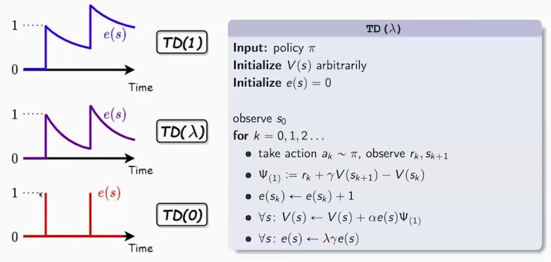

| Step | Update                                                                 | $\Psi_{(1)}(s_t,a_t)$ | $\Psi_{(2)}(s_t,a_t)$ | $\Psi_{(3)}(s_t,a_t)$ | … | $\Psi_{(N)}(s_t,a_t)$ |
|------|------------------------------------------------------------------------|---------------------|---------------------|---------------------|---|---------------------|
| 0    | $\Psi_{(1)}(s_t,a_t)$                                                    | $1$                   | 0                   | 0                   | … | 0                   |
| 1    | $\Psi_{(1)}(s_t,a_t) + \gamma \lambda \Psi_{(1)}(s_{t+1},a_{t+1})$                 | $1-\lambda$       | $\lambda$         | 0                   | … | 0                   |
| 2    | $\Psi_{(1)}(s_t,a_t) + \gamma\lambda \Psi_{(1)}(s_{t+1},a_{t+1}) + (\gamma\lambda)^2\Psi_{(1)}(s_{t+2},a_{t+2})$ | $1-\lambda$ | $(1-\lambda)\lambda$ | $\lambda^2$ | … | 0 |
| …    | …                                                                      | …                   | …                   | …                   | … | …                   |
| N    | $\sum_{\tau=t}^\infty (\gamma\lambda)^{\tau-t} \Psi_{(1)}(s_\tau, a_\tau)$      | $1-\lambda$       | $(1-\lambda)\lambda$ | $(1-\lambda)\lambda^2$ | … | $\lambda^N$ |

## GAE (Generalized Advantage Estimator)

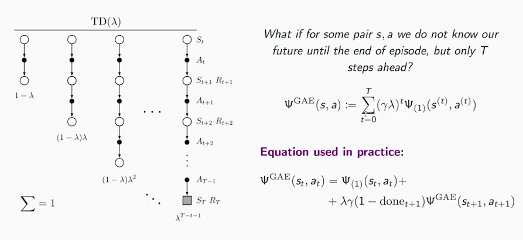

# **YSDA Lecture 9 - Continuous Control**

## Reparametarization Trick

### 1. The problem

Say we have:

$$
J(\theta) = \mathbb{E}_{x \sim p_\theta(x)}[g(x)].
$$

We want to calculate $\nabla_\theta J(\theta) = \nabla_\theta \int f(x) p_\theta(x) dx
$. But because $p_\theta(x)$ depends on $\theta$, the gradient is tricky to compute directly.  

Two main approaches exist:  

1. **REINFORCE:** uses $\nabla \log p_\theta(x)$. High variance.  

2. **Reparameterization trick:** _if possible_, rewrite randomness in a _differentiable_ way.

### 2. Idea

Rewrite as:

$$
x = f(\epsilon, \theta), \quad \epsilon \sim p(\epsilon).
$$

Like $x = \mu + \sigma \epsilon$.

Then the expectation becomes:  
$$
J(\theta) = \mathbb{E}_{\epsilon \sim p(\epsilon)} \big[ g(f(\epsilon, \theta)) \big].
$$

So we can move the gradient _inside_:

$$
\nabla_\theta J(\theta) = \mathbb{E}_{\epsilon \sim p(\epsilon)} \big[ \nabla_\theta g(f(\epsilon, \theta)) \big].
$$

### 3. in RL

$$
\nabla_\theta J(\theta) = \mathbb{E}_s \mathbb{E}_{\epsilon \sim p(\epsilon)} \nabla_\theta Q(s, f(s, \epsilon, \theta))
$$

## DDPG (Deep Deterministic Policy Gradient)

DDPG is designed for _continuous_ action spaces where it's okay to assume deterministic policy:

$$
a = \pi(s, \theta)
$$

The gradient becomes **Deterministic Policy Gradient**:

$$
\nabla_\theta J(\theta) = \mathbb{E}_{s \sim \rho^\mu} \Big[ \nabla_\theta \pi(s, \theta)\, \nabla_a Q^\pi(s,a) \big|_{a=\pi(s, \theta)} \Big].
$$

- **Key difference:** No log-derivative. We backpropagate through the critic ($Q$) w.r.t. action.

> Use DDPG with A2C, experience replay, target networks.

## TD3 (Twin Delayed DDPG)

### Problem

DDPG is really similar to **GAN**s and has the same problems:

- If the critic/discriminator is poor $\to$ actor/generator gets misleading gradients.

- Actor/Generator can exploit critic/discriminator learning “degenerate” policies that look good to the critic/discriminator but perform badly in the real environment.

### TD3

TD3 = DDPG + 3 stabilizers:

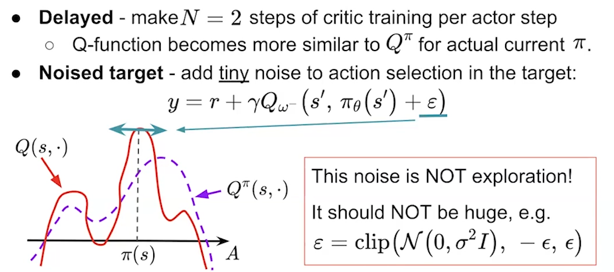

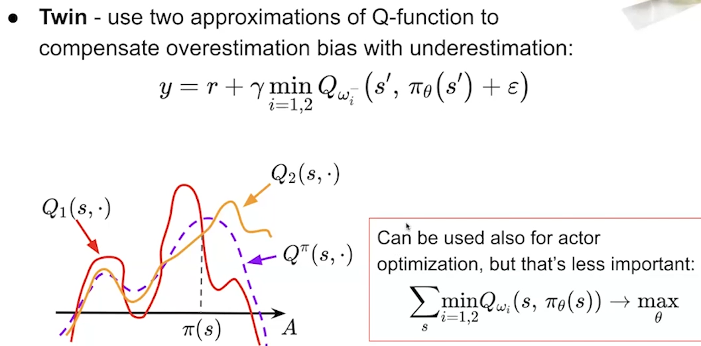

## Maximum Entropy RL

### Problem

Policies may **collapse** to deterministic behaviors too early, leading to poor exploration and brittle solutions.

### Objective

We augment the return with an **entropy bonus**:

$$
J(\pi) \;=\; \mathbb{E}_\pi\!\Big[ \sum_{t=0}^\infty \gamma^t \,\big( r(s_t,a_t) \;+\; \alpha \,\mathcal H(\pi(\cdot|s_t)) \big) \Big],
$$

$$
\mathcal H(\pi(\cdot|s)) \;=\; - \mathbb E_{a\sim\pi}[ \log \pi(a|s) ].
$$

- $\alpha>0$ - **temperature** controlling reward–entropy trade-off. Smaller $\alpha$ $\to$ greedier behavior.

### Soft Value Functions

Entropy modifies the Bellman equations:

- **Soft Q-function**

$$
Q^\pi(s,a) \;=\; r(s,a) + \gamma \,\mathbb E_{s'\sim P}\!\big[ V^\pi(s') \big].
$$

- **Soft Value Function**

$$
V^\pi(s) \;=\; \mathbb E_{a\sim\pi(\cdot|s)} \!\big[ Q^\pi(s,a) \;-\; \alpha \log \pi(a|s) \big].
$$

### Optimal Policy

For fixed $Q$, the entropy-regularized optimal policy is **Boltzmann** over actions:

$$
\pi^*(a|s) \;=\; \frac{\exp\!\Big(\tfrac{1}{\alpha} Q^*(s,a)\Big)}{Z(s)},
\quad
Z(s) \;=\; \int_{\mathcal A} \exp\!\Big(\tfrac{1}{\alpha} Q^*(s,\tilde a)\Big)\, d\tilde a.
$$

## SAC

SAC is based on Maximum Entropy RL.

### (a) Critics (twin) with entropy in the target

$$
y_Q(s,a,r,s') \;=\; r \;+\; \gamma \;\mathbb E_{a'\sim \pi_\theta(\cdot|s')}\!
\Big[ \min_{i\in\{1,2\}} Q_{\phi'_i}(s',a') \;-\; \alpha \log \pi_\theta(a'|s') \Big].
$$

$$
\mathcal L_{\text{critic}}(\phi_i) \;=\; \mathbb E_{(s,a,r,s')\sim \mathcal D}
\big[\, \big(Q_{\phi_i}(s,a) - y_Q\big)^2 \,\big], \quad i\in\{1,2\}.
$$

### (b) Actor (KL projection / reparameterization)

$$
\mathcal L_{\text{actor}}(\theta) \;=\; \mathbb E_{s\sim \mathcal D,\, a\sim \pi_\theta(\cdot|s)}
\big[ \alpha \log \pi_\theta(a|s) \;-\; Q_{\bar\phi}(s,a) \big],
$$

$$
Q_{\bar\phi} = \min(Q_{\phi_1},Q_{\phi_2}).
$$

Reparameterize actions $a = g_\theta(s,\epsilon)$, $\epsilon \sim \mathcal N(0,I)$, and differentiate:

$$
\nabla_\theta \mathcal L_{\text{actor}}
= \mathbb E_{s,\epsilon}\!\left[ \nabla_\theta \big( \alpha \log \pi_\theta(g_\theta(s,\epsilon)\mid s)
- Q_{\bar\phi}(s, g_\theta(s,\epsilon)) \big) \right].
$$

### (c) Temperature (automatic entropy tuning)

Target entropy $\bar{\mathcal H}$ (e.g., $-|\mathcal A|$ for $|\mathcal A|$-dim Gaussian):
$$
\mathcal L(\alpha)
= \mathbb E_{s\sim \mathcal D,\, a\sim \pi_\theta(\cdot|s)}
\big[ -\alpha \big( \log \pi_\theta(a|s) + \bar{\mathcal H} \big) \big],
$$
update $\alpha$ by gradient descent to match $\mathbb E[-\log \pi_\theta(a|s)] \approx \bar{\mathcal H}$.

## TD3 vs SAC

- Policy type: TD3 is _deterministic_, SAC is _stochastic_ (max-entropy).

- Exploration: TD3 injects external action noise during data collection; SAC learns exploration via entropy.

- Stability: both use twin critics; SAC’s entropy and KL-form generally yield more robust training across tasks/hyperparams.

> Prefer SAC - easier to implement & hyperparametrize.

# **YSDA Lecture 10 - a**

> # **Other Lectures**

# [MIT 6.S191 - Reinforcement Learning](https://www.youtube.com/watch?v=to-lHJfK4pw)

### 0. Model-Based Learning

- **Learns**: a model of the environment — transition probabilities $ P(s'|s, a) $ and reward function $ R(s, a) $
- **Examples**:
  - Dyna-Q
  - MuZero

### 1. Value Learning

- **Learns**: $ V(s) $ or $ Q(s, a) $
- **Examples**:
  - Q-learning
  - TD-learning
  - SARSA
- **Policy**: derived from values, policy strategies:
  - Greedy
  - $\epsilon$-greedy
  - Softmax / Boltzmann policy
  - Greedy in the limit of infinite exploration (GLIE)
  - Stochastic policies

### 2. Policy Learning

- **Learns**: policy $ \pi(a|s) $ directly
- **Examples**:
  - REINFORCE
  - PPO (Proximal Policy Optimization)
  - TRPO (Trust Region Policy Optimization)
- **Policy**: explicitly parameterized and optimized

### 3. Actor-Critic Learning

- **Learns**: both a policy (**actor**) and a value function (**critic**)
- **Examples**:
  - A2C, A3C (Advantage Actor-Critic)
  - PPO (also has actor-critic form)
  - DDPG, TD3, SAC (in continuous control)

### 4. Imitation Learning

- **Learns**: from expert demonstrations
- **Examples**:
  - Behavior Cloning
  - GAIL (Generative Adversarial Imitation Learning)

### 5. Inverse Reinforcement Learning (IRL)

- **Learns**: the reward function from expert behavior
- **Goal**: explain why expert acts that way by inferring $ R(s, a) $

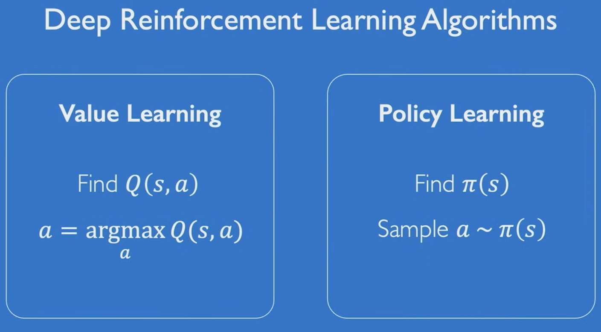

## 1. Deep Q Networks

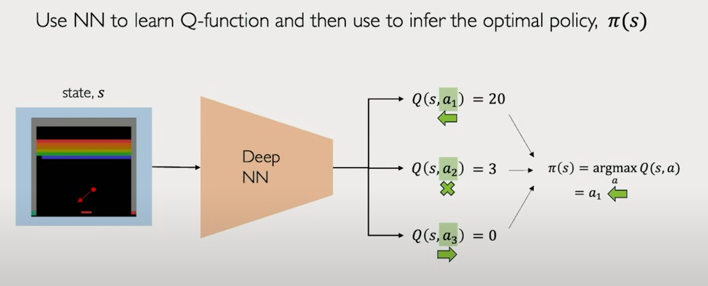

> Use when action space is small & _discrete_.

## 2. Deep Policy Networks / Policy Learning

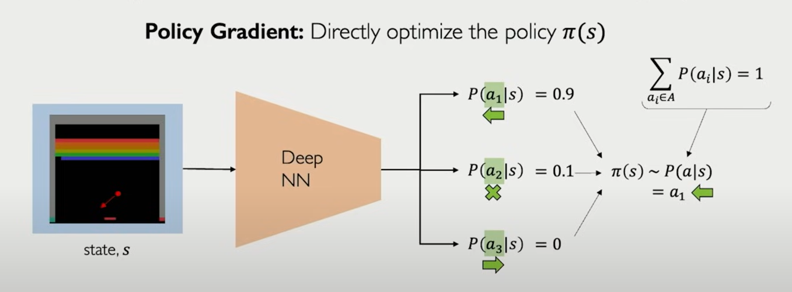

> Use when action space is _continuous_ and you need to model stochastic policies.

## 3. Actor-Critic

In sparse-reward games like Chess or Go, you only get a reward at the end (e.g., win = +1, lose = -1) $\to$ Pure policy gradient is high variance — reward signal is too delayed.

- **Actor**: policy network $\pi_\theta(a \mid s)$ — decides what to do.

- **Critic**: value function $V_w(s)$ (or $Q(s,a)$) — evaluates how good the actor’s decision was.

# [MIT 6.S191 - (Google) Large Language Models](https://www.youtube.com/watch?v=ZNodOsz94cc)

"""
Prompt: You're ...\n
User: ...\n
ChatBot:
"""

**Few/One/Zero-shot** example. No gradient updates are performed.

Standrad Prompting $\to$ **Chain-of-thought prompting**: "let's think step by step".

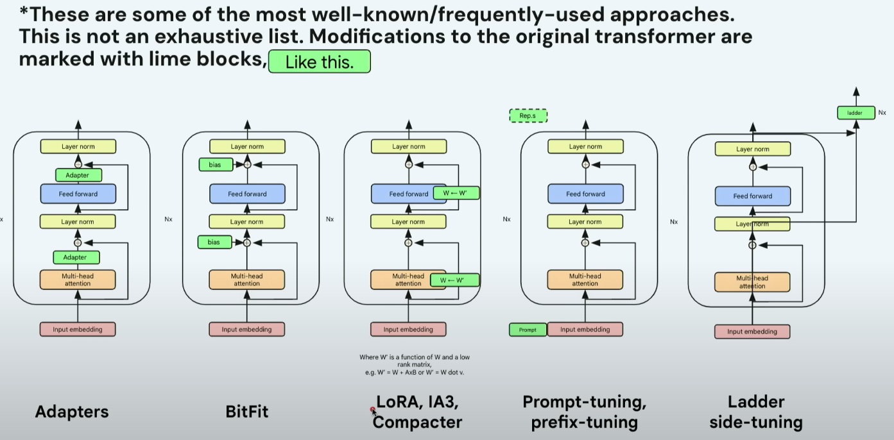

# [Daniel Han - Full Workshop](https://www.youtube.com/watch?v=OkEGJ5G3foU)

## PPO

**PPO** constrains the **policy ratio** to keep it within a **trust region** $[1 - \epsilon,\ 1 + \epsilon]$ on policy update while training.

$$
J(\theta) = \mathbb{E} \left[ \min \left( r_t A_t,\ \text{clip}(r_t,\ 1 - \epsilon,\ 1 + \epsilon) A_t \right) \right]
$$

- $ r*t = \frac{π*\theta(a*t \mid s_t)}{π*{\text{old}}(a_t \mid s_t)} $

## GRPO

**GRPO** = PPO + Group-based normalization

GRPO computes advantages within each group of all possible actions and normalizes them:

$$
\tilde{A}_{i,t} = \frac{A_{i,t} - \mu_i}{\sigma_i}
$$

Where:

- $i$ is the group index,
- $\mu_i = \mathbb{E}[A_{i,t}]$ is the mean advantage within group $i$,
- $\sigma_i = \sqrt{\mathbb{V}[A_{i,t}]}$ is the standard deviation within group $i$.

This normalization is done _independently per group_.

$$
J(\theta) = \frac{1}{G} \sum_{i=1}^{G} \min \left( r_i \tilde{A}_{i,t},\ \text{clip}(r_i,\ 1 - \varepsilon,\ 1 + \varepsilon) \tilde{A}_{i,t} \right)
$$

- $G$ is the number of groups

## Training path

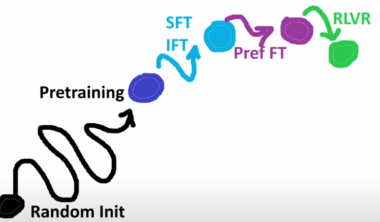

- SFT — **Supervised Fine-Tuning**

- IFT — **Instruction Fine-Tuning**

- Pref FT — **Preference Fine-Tuning**: model is trained to prefer the higher-ranked response — not by supervised labels, but by optimizing over _rankings_

  ❌ Output A: “Sure, here’s how to build a bomb...”

  ✅ Output B: “Sorry, I can’t help with that request.”

- RLVR — **Reinforcement Learning with Verifiable Rewards**: automated, rule-based, or formalized feedback signals

- RLHF (**Reinforcement Learning from Human Feedback**)

> Use `torch.compile`.
